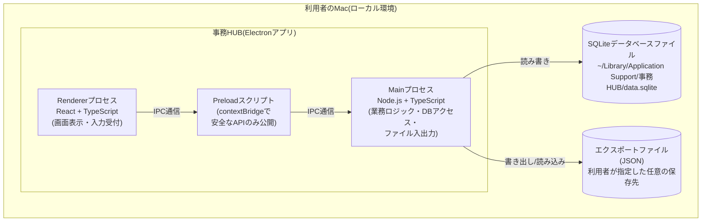
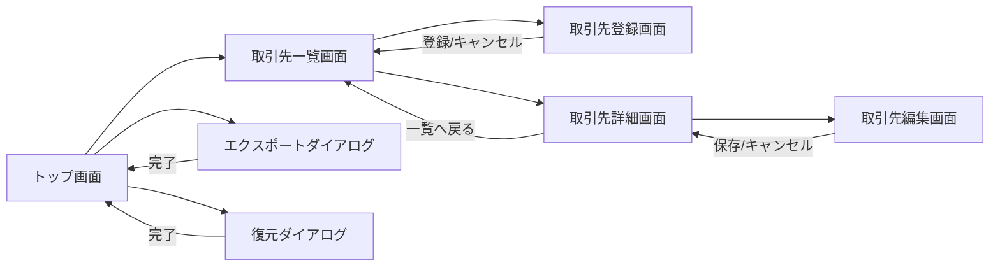
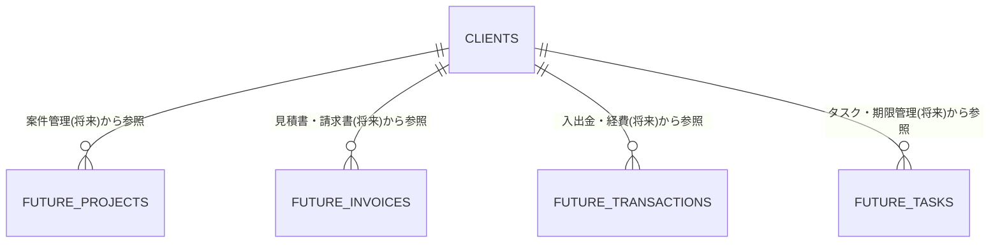

# 基本設計書

## 1. 文書情報

- 作成日: 2026-09-26
- 版数: v0.2
- 対象イテレーション: イテレーション0(プロジェクト方針・基盤構築)
- 参照元: 機能仕様書.md v0.1(docs/02_requirements)

## 2. システム概要

「事務HUB」は、個人事業主である依頼者ご本人が唯一の利用者となる、ローカル環境専用のデスクトップアプリケーションである。本イテレーションでは、以降の機能(案件管理・見積書請求書・入出金経費・タスク管理)を追加していく土台となる「アプリ基盤」と、各機能から共通の台帳として参照される「取引先管理」を実現する。

要件定義書10.2章★5にて、利用するPCのOSは「Macのみ」であることが確定した。この前提のもと、以下のとおり技術を選定する。実行環境・言語・UIライブラリの組み合わせ(Electron+TypeScript+React)は、設計フェーズ着手前にユーザーへ事前確認を行い、ご了承をいただいた上で確定した(8.1章★B1参照)。ローカルDB・ORM・入力バリデーション・データ交換形式・パッケージング等の周辺技術は、この技術方針を前提として選定した。

### 2.1 採用技術

| 区分 | 採用technology | 選定理由 |
|---|---|---|
| 実行環境 | Electron(Chromium + Node.js) | Web技術(HTML/CSS/JS)ベースで画面を作り込みやすく、Mac専用と判明したことでクロスプラットフォーム対応の負荷を考慮する必要がなくなった。将来の見積書・請求書のPDF出力、CSV入出力等、Node.jsの豊富なライブラリ資産をそのまま活用できる点を重視した |
| 言語 | TypeScript(Main/Renderer共通) | 型安全性により、取引先マスタを起点に今後テーブル・画面を追加していく際の実装ミスを防ぎやすい |
| UIライブラリ | React | コンポーネント単位で画面を組み立てられ、以降のイテレーションで画面数が増えても再利用・保守がしやすい。具体的な見た目・配色は後続のデザインフェーズ(designer)で確定する |
| ローカルDB | SQLite(better-sqlite3 + Drizzle ORM) | ファイル1つで完結する組み込みDBであり、認証・サーバー不要のローカル専用アプリに適している。取引先(〜50件目安)に加え、以降追加される案件・見積請求・入出金経費・タスク等を合わせても十分な性能を発揮できる規模感である。またリレーショナル構造のため、他エンティティから取引先を外部キーで参照する将来の拡張(要件定義書7章「拡張性」)と相性が良い。Drizzle ORMはTypeScriptとの親和性が高く、スキーマ定義・マイグレーションをコードで一元管理できる |
| 入力バリデーション | Zod | TypeScriptの型定義とバリデーションルールを一体化でき、Renderer(入力チェック)とMain(登録・更新処理)の双方で同じ定義を再利用できる |
| データ交換形式(エクスポート/インポート) | JSON(スキーマバージョン番号付き) | 人が読める形式であり、将来テーブル項目が増えてもスキーマバージョンによる変換(マイグレーション)処理を実装しやすい。電子帳簿保存法対応を見据えた場合も、生データがそのまま可読な形で残る点が望ましい |
| パッケージング・配布 | electron-builder | Electron向けの定番パッケージングツールであり、macOS向け.dmgインストーラの生成、Apple Silicon/Intel両対応のuniversalビルドを容易に構成できる |

## 3. システム構成図

事務HUBは、利用者のMac1台の中で完結するスタンドアロン構成である。外部サーバー・外部APIとの通信は行わない。

- Rendererプロセス(画面)は、Node.jsの機能やファイルシステムへ直接アクセスせず、Preloadスクリプトが公開する限定的なAPIのみを介してMainプロセスとやり取りする(contextIsolation有効)。これにより、万一画面側に不具合があってもデータ層への影響を抑える構成としている。
- データベースファイル・エクスポートファイルは、いずれも利用者のMac内(またはUSBメモリ等、利用者が保存先として指定した場所)に留まり、外部への送信は一切行わない。
- データベースファイルの保存場所は、Mac本体のローカルファイルシステム(前掲のパス)に限定し、iCloud Drive等のクラウド同期フォルダは使用しない方針とする。設計フェーズ着手前のユーザー事前確認において、この方針を確定した(8.1章★B7参照)。

## 4. 画面設計

以降のイテレーションで案件管理・見積請求・入出金経費・タスク管理が追加されることを見据え、画面はトップ画面のサイドメニューから各機能へ入る構成とし、取引先管理を最初のメニュー項目として実装する。起動時の画面構成(トップ画面方式)、取引先の登録・編集画面の形式(別画面遷移方式)、一覧の表示項目・初期並び順は、いずれも設計フェーズ着手前にユーザーへ事前確認を行い確定した内容である(8.1章★B2〜★B4参照)。

### 4.1 トップ画面(ダッシュボード)[F-01]

**画面レイアウト**

- 画面左側にサイドメニューを配置する。メニュー項目は「取引先管理」(利用可能)、および「案件管理」「見積書・請求書」「入出金・経費」「タスク・期限」(いずれも本イテレーションでは「準備中」として非活性表示し、以降のイテレーションで有効化する)
- 画面上部にアプリ名(事務HUB)と、データ管理メニュー(エクスポート・復元の入り口)を配置する
- 画面中央には、起動時点の簡易サマリー(取引先の登録件数など)を表示する

**操作と実現内容**

| 操作 | 実現内容 |
|---|---|
| 「取引先管理」メニュー押下 | 取引先一覧画面(4.2)へ遷移する |
| 「準備中」メニュー押下 | 以降のイテレーションで実装予定である旨を案内し、画面遷移は行わない |
| データ管理メニュー→「データをエクスポート」 | エクスポートダイアログ(4.6)を開く |
| データ管理メニュー→「データを復元」 | 復元ダイアログ(4.7)を開く |

### 4.2 取引先一覧画面[F-05]

**画面レイアウト**

- 画面上部に検索キーワード入力欄(名称の部分一致検索)、並べ替え条件選択欄(名称昇順・名称降順・登録日新しい順・登録日古い順)、状態フィルタ(既定は「利用中のみ表示」、切り替えで「利用停止」も含めて表示可能)を配置する
- 一覧はテーブル形式とし、取引先名称・敬称・担当者名・電話番号・状態を列として表示する。「利用停止」の取引先は行をグレー表示にし、状態バッジで区別する
- 画面右上に「新規登録」ボタンを配置する

**操作と実現内容**

| 操作 | 実現内容 |
|---|---|
| 検索キーワード入力 | 名称に入力文字列を含む取引先のみへ一覧を即時絞り込む |
| 並べ替え条件変更 | 指定条件で一覧を並べ替える |
| 状態フィルタ切り替え | 利用停止の取引先を表示/非表示する |
| 「新規登録」ボタン押下 | 取引先登録画面(4.3)へ遷移する |
| 一覧の行クリック | 取引先詳細画面(4.4)へ遷移する |
| 該当0件時 | 「該当する取引先がありません」等の案内文言を表示する |

### 4.3 取引先登録画面[F-04]

**画面レイアウト**

- 取引先名称(必須)・敬称(選択式)・担当者名・郵便番号・住所・電話番号・メールアドレス・インボイス登録番号・メモの各入力欄を縦に並べたフォーム形式とする
- 画面下部に「登録」ボタンと「キャンセル」ボタンを配置する

**操作と実現内容**

| 操作 | 実現内容 |
|---|---|
| 「登録」ボタン押下 | 入力内容を検証し、問題なければ取引先マスタへ新規登録して一覧画面(4.2)へ戻り、完了メッセージを表示する |
| 必須項目未入力で「登録」ボタン押下 | 登録を行わず、該当項目にエラーメッセージを表示する |
| 「キャンセル」ボタン押下 | 入力内容を破棄し一覧画面(4.2)へ戻る |

### 4.4 取引先詳細画面[F-06・F-08]

**画面レイアウト**

- 取引先の全項目(取引先ID・名称・敬称・担当者名・住所・電話番号・メールアドレス・インボイス登録番号・メモ・状態・登録日時・更新日時)を表示する
- 画面上部に「編集」ボタンと「利用停止にする」ボタンを配置する。既に利用停止の取引先には状態バッジを表示し、「利用停止にする」ボタンは非表示にする

**操作と実現内容**

| 操作 | 実現内容 |
|---|---|
| 「編集」ボタン押下 | 取引先編集画面(4.5)へ遷移する |
| 「利用停止にする」ボタン押下 | 確認ダイアログを表示し、「はい」で状態を「利用停止」に変更する(完全削除は行わない) |
| 「一覧へ戻る」押下 | 取引先一覧画面(4.2)へ戻る |

### 4.5 取引先編集画面[F-07]

**画面レイアウト**

- 取引先登録画面(4.3)と同一の項目構成で、既存の登録値を初期表示したフォームとする
- 画面下部に「保存」ボタンと「キャンセル」ボタンを配置する

**操作と実現内容**

| 操作 | 実現内容 |
|---|---|
| 「保存」ボタン押下 | 入力内容を検証し、問題なければ更新して詳細画面(4.4)へ戻り、完了メッセージを表示する。取引先IDは変更されない |
| 必須項目を空欄にして「保存」ボタン押下 | 更新を行わず、該当項目にエラーメッセージを表示する |
| 「キャンセル」ボタン押下 | 変更を破棄し詳細画面(4.4)へ戻る |

### 4.6 データエクスポート(ダイアログ)[F-02]

**画面レイアウト**

- モーダルダイアログとし、実行前に簡単な説明文(「現在のデータを1つのファイルに書き出します」)を表示する
- 「エクスポート実行」ボタンを配置する

**操作と実現内容**

| 操作 | 実現内容 |
|---|---|
| 「エクスポート実行」ボタン押下 | OS標準の保存先選択ダイアログを表示する。保存先確定後、実行時点の全データを1つのJSONファイルへ書き出す |
| 保存成功時 | 保存先パスを含む完了メッセージを表示する |
| 保存失敗時(書き込み権限なし・空き容量不足等) | エラーメッセージを表示し、再試行を促す |

### 4.7 データ復元(ダイアログ)[F-03]

**画面レイアウト**

- モーダルダイアログとし、実行前に「現在のデータがエクスポートファイルの内容で置き換わります」という警告文を表示する
- 「ファイルを選択して復元」ボタンを配置する

**操作と実現内容**

| 操作 | 実現内容 |
|---|---|
| 「ファイルを選択して復元」ボタン押下 | 警告文への同意後、OS標準のファイル選択ダイアログを表示する |
| ファイル選択後 | ファイル内容を検証し、問題なければ現在のデータを復元後の内容に置き換える。実行前に現在のデータを自動退避する(7章参照) |
| 復元成功時 | 復元件数を含む完了メッセージを表示し、一覧等の表示を最新化する |
| 復元失敗時(ファイル破損・形式不正・対応不可なバージョン等) | エラーメッセージを表示し、データは復元前の状態を維持する |

### 4.8 画面遷移図

トップ画面を起点に、取引先管理は「一覧→登録/詳細→編集」という一方向に近い構成とし、以降のイテレーションで追加される機能も同様にトップ画面のサイドメニューから並行して入る形で拡張する想定である。

## 5. データ設計

本イテレーションで管理するのは「取引先(CLIENTS)」のみであるが、以降のイテレーションで追加される案件・見積請求・入出金経費・タスクの各機能は、いずれも取引先を参照する想定である(要件定義書7章「拡張性」、プロジェクト計画書5.3章)。型や桁数等の物理設計は詳細設計書6章に譲り、本章ではデータの意味と関連のみを整理する。取引先の管理項目については、設計フェーズ着手前のユーザー事前確認において追加要望がないことを確認しており、本書に記載の項目のまま確定している(8.1章★B8参照)。

※ FUTURE_で始まるエンティティは本イテレーションの対象外であり、取引先マスタが将来どのように参照されるかを示すための参考表記である。

**CLIENTS(取引先)の項目の意味**

| 項目名 | 意味 |
|---|---|
| 取引先ID | 取引先マスタの各レコードを一意に識別する管理項目。以降の機能が取引先を参照する際のキーとなる(利用者は直接入力しない) |
| 取引先名称 | 取引先の正式名称。必須項目 |
| 敬称 | 書面等での宛名に付す敬称(御中・様・(なし)) |
| 担当者名 | 取引先側の窓口担当者名 |
| 郵便番号・住所 | 取引先の所在地情報 |
| 電話番号 | 取引先の連絡先電話番号 |
| メールアドレス | 取引先の連絡先メールアドレス |
| 取引先のインボイス登録番号 | 見積書・請求書への記載を見据えた項目。インボイス制度における適格請求書発行事業者の登録番号 |
| メモ | その他の補足事項の自由記述 |
| 状態(利用中/利用停止) | 一覧表示・検索対象とするかどうかを示す管理項目。「利用停止」でもデータは保持され続ける(要件定義書10.1章R-2) |
| 登録日時・更新日時 | レコードの作成・最終更新のタイムスタンプ |

## 6. 外部連携

- 外部システム・外部APIとの連携は行わない。インターネットに公開せず、ローカル環境のみで完結する(要件定義書7章)。
- 唯一の「外部」とのやり取りは、利用者自身が指定するファイルシステム上のエクスポートファイル(JSON)の書き出し・読み込みのみである。

## 7. 非機能設計方針

- **動作環境**: Mac専用(要件定義書10.2章★5)。Apple Silicon・Intel双方のMacで動作するuniversalビルドとする。
- **性能**: 取引先の登録件数目安は〜50件程度(要件定義書10.1章R-3)であり、以降の機能追加を合わせても数千件規模を想定した性能で十分と見込む。名称・状態には検索用のインデックスを設ける。
- **セキュリティ**: 認証機能は設けず、PC自体のログイン・画面ロックによる保護を前提とする(要件定義書7章)。Rendererプロセスからは、Node.js機能・ファイルシステムへ直接アクセスできない構成(contextIsolation、preload経由の限定APIのみ公開)とし、実装上の防御を厚くする。データベースファイル・エクスポートファイルはいずれも暗号化しない(認証なし方針と整合する設計とし、機微情報の取り扱いはセキュリティフェーズで改めて確認する)。
- **データ消失対策**: 手動エクスポート・復元のみを提供し、アプリ内での定期案内表示は設けない(要件定義書10.1章R-4)。復元操作時は、実行前に現在のデータベースファイルを自動的に退避コピーし(直近3世代を保持し、それより古いものは自動削除)、復元処理が失敗した場合は退避コピーから自動的に復旧する。これにより、復元操作自体による意図しないデータ消失を防ぐ。復元方式(全置換とし、復元前に自動退避する方式)、およびバックアップファイル形式(JSON)は、いずれも設計フェーズ着手前にユーザーへ事前確認を行い確定した(8.1章★B5・★B6参照)。
- **拡張性**: 取引先テーブルを独立したマスタとして設計し、以降のイテレーションで追加するテーブルから取引先IDを外部キーとして参照できる構造とする。画面もサイドメニュー方式とし、新機能を項目追加のみで拡張できるようにする。
- **法令配慮(インボイス制度・電子帳簿保存法)**: 取引先のインボイス登録番号を管理項目として保持し、将来の見積書・請求書機能での記載に備える。電子帳簿保存法への具体的な対応範囲(保存すべき書類・検索要件の水準等)は未確定(要件定義書10.2章★8)であるが、本イテレーションでは登録日時・更新日時を全レコードに保持し、データを物理削除しない設計(利用停止のみ)とすることで、将来の対応がしやすい状態にしておく。なお、取引先マスタに対する詳細な変更履歴(監査ログ)機能の要否については、設計フェーズ着手前にユーザーへ事前確認を行い、今回は登録日時・更新日時の記録に留め、詳細な変更履歴機能は見積書・請求書機能等の後続イテレーションで電子帳簿保存法対応とあわせて実装する方針として確定した(8.1章★B9参照)。
- **利用のしやすさ**: 専門知識がなくても迷わず操作できるよう、エラーメッセージ・完了メッセージは平易な文言とする。具体的な文言・レイアウトの調整は後続のデザインフェーズで行う。
- **配布・インストール**: Apple Developer Programへの登録は行わず、コード署名・公証を行わない未署名の状態で配布することで確定した(8.1章★A)。未署名であることに伴い、初回起動時にmacOSのGatekeeperによる警告が表示されるため、利用者が手動で開く操作(controlキーを押しながらアイコンをクリックして「開く」を選択する、または「システム設定→プライバシーとセキュリティ」から許可する)を行う必要がある。この手順は納品フェーズで作成する操作マニュアルに明記する。

## 8. 要確認事項・未解決事項

### 8.1 確定した事項

以下は依頼者ご本人よりご回答をいただき、確定した事項である。

| No | 内容 | 確定内容 | 反映箇所 |
|---|---|---|---|
| ★A | Apple Developer Programへの登録・コード署名/公証の要否 | 「未署名で運用」で確定。Apple Developer Programには登録せず、コード署名・公証は行わない。未署名に伴う初回起動手順(controlキーを押しながらアイコンをクリックして「開く」を選択する等)は操作マニュアルに記載する | 本書7章「配布・インストール」 |
| ★B1 | 実装技術(Electron/Tauri/Swift等の選択肢のうちどれとするか) | Electron(TypeScript+React)で確定。ローカルDB・ORM・入力バリデーション・データ交換形式・パッケージング等の周辺技術は、この方針を前提とした本書2.1章の構成を維持する | 本書2章 |
| ★B2 | 起動時の画面構成(トップ画面方式か、直接一覧画面方式か) | トップ画面(メニュー)方式で確定 | 本書4章 |
| ★B3 | 取引先の登録・編集画面の形式(別画面方式か、モーダル方式か) | 別画面に切り替える方式で確定 | 本書4.3章・4.5章 |
| ★B4 | 取引先一覧の表示項目・初期並び順 | 名称・敬称・担当者名・電話番号・状態を表示し、初期並び順は名前の五十音順(名称昇順)で確定 | 本書4.2章 |
| ★B5 | データ復元方式(全置換か、マージか) | 全部置き換える方式(全置換)で確定。復元前に現行データを自動退避する | 本書7章「データ消失対策」 |
| ★B6 | バックアップファイルの形式 | JSON形式で確定 | 本書2.1章、7章「データ消失対策」 |
| ★B7 | データの保存場所(Mac本体のみか、iCloud等の同期フォルダを使うか) | Mac本体のみに保存する方式で確定。iCloud Drive等のクラウド同期フォルダは使用しない | 本書3章 |
| ★B8 | 取引先の管理項目への追加要望の有無 | 追加要望なし。確定済み項目(本書5章)のまま | 本書5章 |
| ★B9 | 取引先マスタの変更履歴(監査ログ)機能を今回作り込むか、後続イテレーションで対応するか | 今回は登録日時・更新日時の記録のみとし、詳細な変更履歴機能は見積書・請求書機能等の後続イテレーションで電子帳簿保存法対応とあわせて対応する方針で確定 | 本書7章「法令配慮」 |

★Aはv0.1にて、★B1〜★B9は設計フェーズ着手前にユーザーへ実施した事前確認の回答を受けv0.2にて、それぞれ反映した。

### 8.2 残る要確認事項・未解決事項

本書固有の追加事項は無し。要件定義書10.2章の持ち越し事項(★7・★8・★9)は、いずれも設計フェーズ以降・該当機能着手時・総括時への持ち越しのまま変更なし。

## 9. 変更履歴

| 版数 | 日付 | イテレーション | 内容 |
|---|---|---|---|
| v0.0 | 2026-09-26 | イテレーション0 | 初版作成。機能仕様書 v0.1に基づき、採用技術(Mac専用のOS確定を踏まえたElectron+TypeScript+React+SQLite構成)、システム構成図、画面設計、データ設計、非機能設計方針、要確認事項を整理した。 |
| v0.1 | 2026-09-26 | イテレーション0 | 要確認事項★A(Apple Developer Programへの登録・コード署名/公証の要否)について依頼者ご本人の回答を反映し確定。「未署名で運用」とし、7章「配布・インストール」に確定内容を追記、8章を確定事項(8.1)と残る要確認事項(8.2)に整理した。 |
| v0.2 | 2026-09-26 | イテレーション0 | 設計フェーズ着手前にユーザーへ実施した事前確認(実装技術、起動時の画面構成、登録・編集画面の形式、一覧の表示項目・初期並び順、データ復元方式、バックアップファイル形式、データ保存場所、取引先の管理項目追加要否、変更履歴機能の対応時期)の回答を反映し、8.1章に★B1〜★B9として確定内容を追記した。あわせて2章・3章・4章・5章・7章の該当箇所に確定内容への参照を追記した。技術選定について、従来の記述を「設計フェーズ着手前にユーザーへ事前確認を行い、ご了承をいただいた上で確定した」旨の表現に更新した。 |
