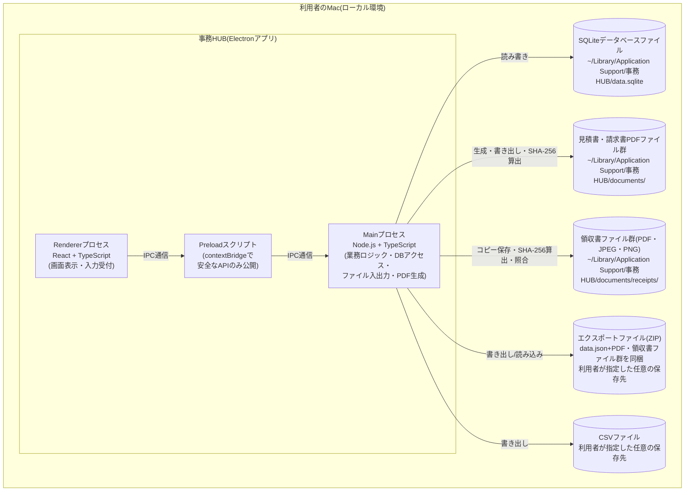
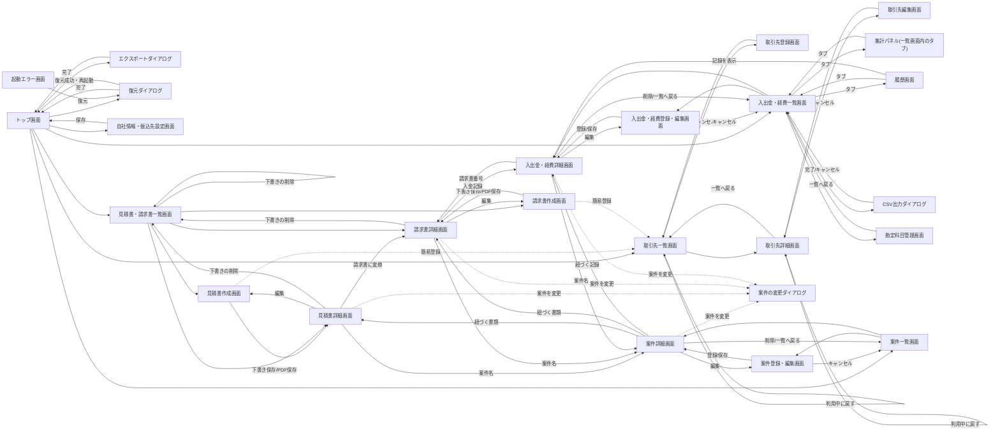
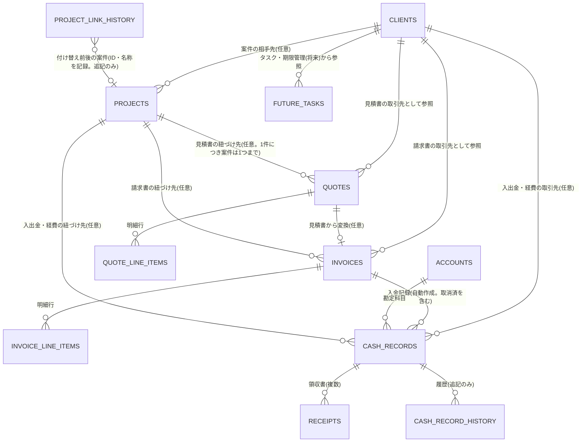

# 基本設計書

## 1. 文書情報

- 作成日: 2026-09-26(初版)/ 2026-09-28(v1.1〜v1.3改訂)/ 2026-10-02(v1.4改訂)/ 2026-10-03(v1.5・v1.6・v2.0)/ 2026-10-04(v2.1・v2.2・v2.3改訂)/ 2026-10-05(v2.4・v2.5改訂)/ 2026-10-06(v3.1〜v3.3改訂)/ 2026-10-10(v3.4・v3.5改訂)
- 版数: v3.5
- 対象イテレーション: イテレーション3(案件管理、バックアップ・復元のメモリ使用量の改善、旧形式ZIP復元時の警告)
- 参照元: 機能仕様書.md v3.3(docs/02_requirements)。v3.5は、★R6(`projectLinkService`の必須化)の確定を反映している。v3.4は、実装・レビュー(レビュー結果報告書.md v3.1。指摘0件)の結果を反映した改訂であり、実装を正として設計書を整合させている(詳細設計書.md 9章)。v3.3は、機能仕様書v3.3(F-31の金額名称を合計金額へ、F-33に案件の確認を追加、★27〜★30を要件定義書R-42〜R-45として反映)への追従であり、設計内容の変更はない(設計書は既に同じ内容)。v3.2は、設計案の確認事項(8.1章★27〜★31)の確定を反映している。v3.1はイテレーション3の設計であり、設計フェーズ着手前のユーザー事前確認(8.1章★F1〜★F9)の回答を反映している。v3.0以前の参照元は次のとおり。機能仕様書.md v3.0。v1.4〜v1.6は実装・レビュー・セキュリティチェックの結果を反映した改訂であり、実装を正として設計書を整合させている。v2.1はイテレーション2の設計であり、設計フェーズ着手前のユーザー事前確認(8.1章★E1〜★E10)の回答を反映している。v2.2は、設計案で確認していた事項(★E11〜★E14)の確定を反映している。v2.3は、デザインフェーズの確定事項(★E15・★E16)を反映している。v2.4は、レビューで確認した実装との差異(★E17・★E18)を反映している。v2.5は、テスト結果(テスト結果報告書.md ★T3。エクスポート容量の上限)、レビュー結果(レビュー結果報告書.md v2.2のR-14・R-16・R-17・R-19)を反映している(★E19〜★E21)

## 2. システム概要

「事務HUB」は、個人事業主である依頼者ご本人が唯一の利用者となる、ローカル環境専用のデスクトップアプリケーションである。イテレーション0では、以降の機能を追加していく土台となる「アプリ基盤」と、各機能から共通の台帳として参照される「取引先管理」を実現した。イテレーション1では、見積書・請求書の作成・PDF保存、見積書から請求書への変換、入金ステータス管理、自社情報・振込先の設定、源泉徴収税額の計算(F-09〜F-16)を追加し、あわせて取引先管理にフリガナ項目・五十音順表示(F-04・F-05更新)、起動エラー画面からの復元導線(F-09)を追加する。イテレーション2では、入金・経費の記録(勘定科目、一覧・検索、履歴、領収書の添付と改変検知、請求書「入金済み」からの入金記録の自動作成・取消、月別・年別の集計、CSV出力。F-17〜F-24)と、取引先の「利用中」への復帰(F-25。★N1)、下書きの見積書・請求書の削除(F-26。★N2)を追加し、F-02・F-03(エクスポート・復元)、F-05・F-08(取引先)、F-15(入金ステータス)を更新する。

要件定義書10.2章★5にて、利用するPCのOSは「Macのみ」であることが確定している。この前提のもと、以下のとおり技術を選定する。実行環境・言語・UIライブラリの組み合わせ(Electron+TypeScript+React)、ローカルDB・ORM・入力バリデーション・データ交換形式・パッケージング等の周辺技術(2.1章)は、イテレーション0の設計フェーズ着手前にユーザーへ事前確認を行い確定済みであり、本イテレーションでもそのまま踏襲する(8.1章★B1参照)。本イテレーションで新たに必要となった技術方針(PDF生成方式等)は2.2章のとおり、設計フェーズ着手前のユーザー事前確認によりあらためて確定した(8.1章★C1〜★C12参照)。イテレーション2は技術スタックを変更せず、2.1章・2.2章の構成をそのまま踏襲する。新たに必要となった方針(領収書の保存、改変検知、履歴、CSV、消費税額の算出、エクスポート・復元の対象範囲)は2.3章のとおり、設計フェーズ着手前のユーザー事前確認により確定した(8.1章★E1〜★E10参照)。

イテレーション3では、仕事のまとまり(案件)の管理(案件の登録・編集・削除、一覧・検索、完了・再開、見積書・請求書と入出金・経費の紐づけ・付け替えと履歴、案件別収支。F-27〜F-31)、バックアップ・復元のメモリ使用量の改善(F-32。★T3⑤/SEC-16)、領収書を含まない旧形式ZIPの復元時の警告(F-33。★T4)を追加し、F-02・F-03(エクスポート・復元)、F-13(見積書から請求書への変換)、F-26(下書きの削除)、F-18(入出金・経費の登録・削除)を更新する。実行環境・言語・UI・DB・ORM・パッケージングは、2.1章のとおり変更しない。新たに必要となった方針(ZIP処理のストリーミング化、バックアップ形式、上限の検証、案件の紐づけ方式・履歴、DBの移行、旧スキーマのバックアップの復元)は2.4章のとおり、設計フェーズ着手前のユーザー事前確認により確定した(8.1章★F1〜★F9参照)。

### 2.1 採用技術(イテレーション0で確定・継続)

| 区分 | 採用technology | 選定理由 |
|---|---|---|
| 実行環境 | Electron 44.5.1(Chromium + Node.js。セキュリティチェックSEC-12により、同じメジャー版の最新パッチ版へ更新) | Web技術(HTML/CSS/JS)ベースで画面を作り込みやすく、Mac専用と判明したことでクロスプラットフォーム対応の負荷を考慮する必要がなくなった。将来の見積書・請求書のPDF出力、CSV入出力等、Node.jsの豊富なライブラリ資産をそのまま活用できる点を重視した |
| 言語 | TypeScript(Main/Renderer共通) | 型安全性により、取引先マスタを起点に今後テーブル・画面を追加していく際の実装ミスを防ぎやすい |
| UIライブラリ | React | コンポーネント単位で画面を組み立てられ、以降のイテレーションで画面数が増えても再利用・保守がしやすい。具体的な見た目・配色は後続のデザインフェーズ(designer)で確定する |
| ローカルDB | SQLite(better-sqlite3 + Drizzle ORM) | ファイル1つで完結する組み込みDBであり、認証・サーバー不要のローカル専用アプリに適している。取引先に加え、見積書・請求書、以降追加される案件・入出金経費・タスク等を合わせても十分な性能を発揮できる規模感である。またリレーショナル構造のため、他エンティティから取引先を外部キーで参照する拡張(要件定義書7章「拡張性」)と相性が良い |
| 入力バリデーション | Zod | TypeScriptの型定義とバリデーションルールを一体化でき、Renderer(入力チェック)とMain(登録・更新処理)の双方で同じ定義を再利用できる |
| データ交換形式(エクスポート/インポート) | JSON(スキーマバージョン番号付き)。v1.2以降は、このJSON(`data.json`)とPDFファイル群を1つのZIP形式バックアップファイルに同梱する(2.2章参照) | JSONは人が読める形式であり、テーブル項目が増えてもスキーマバージョンによる変換(マイグレーション)処理を実装しやすい |
| パッケージング・配布 | electron-builder | Electron向けの定番パッケージングツールであり、macOS向け.dmgインストーラの生成、Apple Silicon/Intel両対応のuniversalビルドを容易に構成できる |

### 2.2 イテレーション1で新たに確定した技術方針

| 区分 | 採用technology/方針 | 選定理由 |
|---|---|---|
| PDF生成方式 | Electron標準機能`webContents.printToPDF()`により、見積書・請求書表示用のHTML/CSSをレンダリングしPDF化する。HTML/CSSはMain側の文字列テンプレート(PDF専用。Rendererの画面コンポーネントは用いない)で組み立てる(v1.4。実装を正とした) | 追加ライブラリが不要で、Chromiumが使用フォントを自動でPDFへ埋め込むため日本語表示も安定する。非表示ウィンドウへReact画面コードを持ち込まず、PDFの見た目を単独で検証・変更しやすく、テストも容易なため、テンプレートをMain側に独立して持つ構成とした。pdfmake(フォント同梱が別途必要)・pdf-lib(座標指定によるレイアウト実装コストが大きい)は不採用とした |
| PDF内の日本語フォント | OS標準搭載フォント(ヒラギノ角ゴ等)をそのまま利用し、フォントファイルは同梱しない | Mac専用アプリのため表示は安定し、アプリサイズも増えない |
| PDFファイルの保存先・管理方式 | アプリ管理フォルダ(`~/Library/Application Support/事務HUB/documents/quotes/<西暦年>/`・`.../invoices/<西暦年>/`)へ自動保存する。保存後は「Finderで表示」「既定アプリで開く」の導線を画面に用意する | 電子帳簿保存法の検索要件(発行日・金額・取引先。要件定義書10.3章★12)に対応するため、保存場所をアプリが把握しデータベースと連携できる方式とした |
| 見積書・請求書番号の採番書式 | 西暦4桁+ハイフン+連番3桁(例: `2026-001`)。見積書・請求書は別々の連番系列とし、暦年(1月)で連番をリセットする | シンプルで分かりやすく、書類の一意性を確保しやすい |
| 電子帳簿保存法対応(改変防止・★12) | PDF保存確定後は編集画面自体を無効化する(要件定義書R-14の延長)ことに加え、PDF保存時にファイルのSHA-256ハッシュ値をデータベースへ記録し、事後に改変有無を照合できるようにする | 電子帳簿保存法の真実性確保要件への対応をより明確に示せるため |
| 電子帳簿保存法対応(検索・★12) | 見積書・請求書一覧画面で発行日・金額・取引先による検索・絞り込みを提供する(データベース検索のみとし、PDFファイル自体への全文検索機能は持たない) | 要件定義書が求める「日付・金額・取引先の各条件で検索」を満たすには十分であるため |
| 消費税額の端数処理 | 1書類につき税率区分(10%/8%)ごとに小計を算出し、それぞれ円未満切り捨てで消費税額を1回だけ計算する | インボイス制度の原則的な取り扱い(1書類につき税率ごとに1回の端数処理)に合わせるため |
| 源泉徴収税額の計算単位・端数処理 | 源泉徴収対象の明細行の金額(税抜)の合計に対して、段階計算(100万円以下は10.21%、超過分は20.42%)を1回だけ適用し、円未満切り捨てとする(v1.4。当初の「明細行ごと」から、ご本人のご判断により変更) | 100万円の基準は1回の支払単位に対するものであり、行ごとに適用すると基準を誤るため(例: 80万円+80万円は合計160万円に対して224,620円)。端数処理は国税庁の源泉徴収税額表の一般的な運用に合わせる |
| DBマイグレーション方式 | イテレーション0から踏襲する簡易方式(起動時のテーブル存在チェック`CREATE TABLE IF NOT EXISTS`・既存テーブルへの`ALTER TABLE`・`schema_version`更新)を継続する | 小規模アプリのため軽量な方式で十分であり、Drizzle Kit等の正式なマイグレーション管理は過剰と判断したため |
| エクスポート/復元ファイルの形式(v1.2) | ZIP形式のバックアップファイル(`data.json`とPDFファイル群を同梱)とする。ZIP圧縮ライブラリは`adm-zip`(バージョン0.6.1にピン止め)を採用する(v3.1で`archiver`・`yauzl`へ置き換える。2.4章)(依頼者ご本人承認済み。0.5.xに報告された脆弱性〔細工されたZIPによる過大なメモリ確保等〕を解消するため、v1.4で0.6.1へ更新) | 電子帳簿保存法対応の観点から、PDFファイルの実体を含めたバックアップ・復元を実現するため(8.1章★D4にて確定、依頼者ご本人のご判断による)。`adm-zip`は作成・展開の両方を1つの依存関係でシンプルに実装できるため採用した |
| 復元時のハッシュ不一致時の運用方針(v1.3) | 復元処理自体は中断せず、SHA-256ハッシュが不一致だった書類にのみ個別に警告を表示する | 電子帳簿保存法の運用ポリシーとして、依頼者ご本人のご判断により確定した(8.1章★D5) |

上記はいずれも設計フェーズ着手前のユーザー事前確認において確定した内容である(8.1章★C1〜★C9参照)。PDFレイアウトの具体的な記載事項・複数ページ対応・備考欄等の要件は4.15章、8.1章★C10〜★C12参照。エクスポート/復元ファイルの形式変更(v1.2)は8.1章★D4参照。

### 2.3 イテレーション2で新たに確定した技術方針

新規ライブラリは追加しない(CSV書き出し・ファイル形式判定・SHA-256算出は、Node.js標準機能と自前実装で行う)。

| 区分 | 採用方針 | 選定理由・補足 |
|---|---|---|
| 領収書の保存方式(★E1) | アプリのデータフォルダ配下の専用フォルダ(`~/Library/Application Support/事務HUB/documents/receipts/<西暦年>/`)へコピーして保存する。データベースには、`documents/`からの相対パスとSHA-256ハッシュ値を記録する。元のファイルは移動・変更しない | 見積書・請求書のPDFと同じ管理方式であり、バックアップのZIPへ同梱できる。元ファイルを移動・削除しても影響を受けない。DBへのBLOB格納は、データベースの肥大化によって起動・バックアップが重くなるため採用しない。元ファイルのパスのみの記録は、電子帳簿保存法の趣旨に合わないため採用しない |
| 領収書の形式・容量・件数(★E2) | PDF・JPEG・PNGのみ(HEICは対象外)。1ファイル10MB(10×1024×1024バイト)以内、1つの記録につき5件まで。拡張子と、ファイルの先頭バイト(マジックナンバー)の両方で形式を判定し、一致しない場合は添付しない | 拡張子の偽装による想定外のファイルの保存を防ぐため。上限の数値は設定値として1か所で定義し、変更しやすくする |
| 改変検知の方式(★E3) | 領収書は、添付時にSHA-256を記録する。入出金・経費の記録そのものも、主要項目(日付・種別・金額・勘定科目・取引先・摘要・税区分・消費税額・請求書・状態・削除済みか否か・添付領収書のハッシュ)から求める「記録ハッシュ」(SHA-256)を、保存・変更のたびに更新して記録する。履歴にも、その時点の記録ハッシュを残す。照合は、記録の詳細画面の表示時と、データ復元時に行う。不一致(領収書ファイルの欠落を含む)は、警告として表示する。起動時の全件照合は行わない | PDFと同じ考え方(5.2章・7章)で、鍵を使わないSHA-256とする。起動時の全件照合は、件数・領収書が増えたときに起動が遅くなるため採用しない |
| 検索の方式(★E3) | 日付範囲・金額範囲・取引先・勘定科目・種別での絞り込みを、データベースの検索用インデックスで実現する。領収書ファイル自体への全文検索は行わない | 要件定義書10.2章R-20に合わせた最小の構成のため |
| 履歴の保持方式(★E4) | 追記専用の履歴テーブルに、操作の種別・日時・変更理由・変更前後のスナップショット(JSON)・操作後の記録ハッシュを残す。記録の削除は論理削除(削除済みフラグ)とし、削除した記録も履歴から参照できる。履歴は、画面からは編集・削除できず、データベース側でも更新・削除を拒否する設定を設ける | 変更の経緯を、特定時点の状態として検証できるようにするため。差分のみの保持は、時点の復元・検証がしにくいため採用しない |
| CSVの形式(★E5) | UTF-8(BOM付き)、カンマ区切り、ヘッダー行あり、改行はCRLF。特定の会計ソフト専用ではない汎用形式とする。Excel等で式として解釈される文字で始まる文字列には、先頭に`'`を付けて無害化する | ExcelやNumbersでそのまま開け、文字化けしないため。Shift_JISは、変換ライブラリの追加が必要で、文字化けのおそれもあるため採用しない |
| 消費税額の算出(★E6) | 金額は税込で入力する。消費税額は、記録1件ごとに税込額から逆算し、円未満を切り捨てる(10%: `floor(税込額×10÷110)`、8%: `floor(税込額×8÷108)`、非課税・対象外・税区分未選択: 0円)。集計に税額は用いず、CSVには記録ごとの税額を出力する。請求書の税計算(税率区分ごとに1回、円未満切り捨て。2.2章)とは対象(税抜の合計に対する計算か、税込額からの逆算か)が異なるが、端数処理は同じ円未満切り捨てである(実装の`tax-calculation.ts`で確認済み) | 利用者が税込のレシート金額で入力するため、税込額から逆算する方式とする。端数は、請求書と同じ切り捨てで揃える |
| エクスポート・復元の対象(★E7) | 入出金・経費・勘定科目・履歴・領収書ファイルの実体を、すべて既存のZIPに含める。スキーマバージョンを3から4へ上げ、v1.x(スキーマ1〜3)の旧形式のファイルも引き続き復元できる。復元時は、領収書と記録のハッシュを照合し、不一致・欠落は個別に警告する(復元は中断しない。★D5と同じ方針)。領収書が多いときのため、エクスポート・復元中は進捗(処理済みの件数)を表示する | 領収書を含むバックアップでなければ、復元後に領収書が失われるため |
| データベースの変更方式 | 2.2章の簡易方式を継続する。`schema_version`を3から4へ更新し、起動時に新規テーブルの作成と初期科目(14科目)の登録を行う | 既存の方式を踏襲 |

エクスポートの想定容量は、領収書が年間で数百件、1件あたり数百KB〜数MB程度の場合、年あたり数百MB規模となる。復元の読み込み上限(7章。ファイル1GiB・展開後2GiB)に近づく可能性があるため、上限は変更せず、エクスポート前に見込みサイズが上限の80%を超える場合に警告する(8.1章★E12)。さらに、見込みサイズが上限(1GiB)を超える場合は、復元できないファイルを作らないよう、書き出さずに中止して理由を表示する(8.1章★E19)。

### 2.4 イテレーション3で新たに確定した技術方針

実行環境(Electron)・言語(TypeScript)・UI・DB・ORM・パッケージング(2.1章)は変更しない。設計フェーズ着手前のユーザー事前確認(8.1章★F1〜★F9)で確定した、新たに必要となる技術要素は次のとおりである。

| 区分 | 採用方針 | 選定理由・補足(除外した候補を含む) |
|---|---|---|
| ZIP処理のストリーミング方式(★F1。F-32) | ZIPの書き出しに`archiver`、読み込みに`yauzl`を採用し、`adm-zip`は配布物の依存関係から外す(テストで検証用のZIPを作る・読むためだけに、開発時のみ使う部品として残す。配布物には含まれない)。いずれも、ファイルを1件ずつ(ストリームで)読み書きする。最終的な版数は実装着手時に確認し、`adm-zip`と同様に版数をピン止めする(`^`を付けない) | `adm-zip`はZIP全体をメモリ上に保持するため、バックアップが大きいほどメモリを使う(★T3⑤/SEC-16)。`archiver`は、ファイルのストリーム入力・進捗通知・書き込み側の速度への追従(バックプレッシャー)を標準で備える。`yauzl`は、ZIPの末尾の目録(中央ディレクトリ)だけを読んでからエントリを1件ずつ開けるため、1GiBのファイルでも全体をメモリへ読み込まない。除外した候補: `adm-zip`の維持(呼び出し方を変えても内部でZIP全体を保持するため改善が限定的)、ZIPをやめてフォルダ形式にする(従来のバックアップとの互換性が崩れる)。書き出し専用の軽量な`yazl`も候補となり得るが、`archiver`で足りるため採用しない(実装時に依存関係数・脆弱性の状況で差し替える場合は、あらためて承認を得る) |
| 新規ライブラリの配布物への含まれ方 | `archiver`・`yauzl`(および推移的な依存)は、実行時に使う依存関係(`dependencies`)としてMainプロセスから参照するため、配布物(アプリ本体の`app.asar`)に含まれる。Rendererには含まれない。`adm-zip`は配布物から外れる。いずれもJavaScriptのみで、他OS向けのネイティブバイナリを含まないため、universalビルドと、SEC-07(不要な同梱物の除外設定)に影響しない | 開発時のみ使う部品(`devDependencies`)は配布物に含まれない。追加するライブラリの脆弱性は、SEC-17(開発用部品の脆弱性対応)と同じ手順(`npm audit`)で確認する |
| バックアップファイルの構造(★F2) | ZIP内の構造を、`manifest.json`(スキーマバージョン・アプリ版・出力日時・テーブルごとの件数)と、テーブルごとの1行1レコードのJSON(`data/<テーブル名>.jsonl`。JSON Lines形式)に改める。スキーマバージョンを4から5へ上げる。PDF・領収書ファイルの格納(`documents/`配下)は従来どおり。書き出し・読み込みとも、レコードを1件ずつ処理する。従来形式(スキーマバージョン1〜4。`data.json`1本)のファイルも、引き続き復元できる | `data.json`を1つのJSONとして生成・解析すると、DBのレコードが増えたときにメモリを使う(★F1と同じ課題)。JSON Linesは1行ずつ処理でき、人が読める形式であるという2.1章の方針も維持できる |
| 一時領域(ステージング。★F2・★F3) | エクスポート・復元は、アプリのデータフォルダ配下の一時フォルダ(`tmp/export-<日時>/`・`tmp/restore-<日時>/`。利用者本人のみアクセス可)を使う。エクスポートは、DBのレコードを同期処理の中で一時ファイルへ書き出してから(途中でほかの操作が割り込まないため、一貫した時点の内容になる)、ZIPへ追加する。復元は、ZIPの内容を一時フォルダへ展開・検証してから、現在のデータと入れ替える。終了時に必ず削除し、異常終了で残った分は次回起動時に削除する(SEC-11と同じ考え方) | DBの操作(better-sqlite3)は同期処理であり、非同期のストリーム処理の途中にDBのトランザクションを挟めないため。また、検証に失敗した場合に、現在のデータへ一切触れずに中止できる |
| 上限1GiBの検証方法(★F3) | 復元ファイルの上限(ファイル1GiB・エントリ10万件・展開後サイズの合計2GiB)は変更しない。検証を次の多重で行う。(1)読み込み前にファイルサイズを確認する。(2)ZIPの目録から、エントリ数と、全エントリの展開後サイズ(宣言値)の合計を、1件も展開せずに確認する。(3)展開中は、実際に書き出したバイト数を数え、エントリごとの宣言値と、全体の合計の上限(2GiB)の両方を超えた時点で中止する(宣言値の偽装への対策)。(4)展開前に、空き容量が展開後の合計サイズ以上あるか確認する。超過・不足の場合は、一時フォルダを削除して中止し、現在のデータは変更しない。上限を超えるファイルの扱い(専用の文言、現在のデータを維持)は従来のまま | 目録の宣言値だけの検査は偽装に弱く、ファイルサイズだけの検査は展開後の過大化を防げないため、両方を組み合わせる |
| 案件の紐づけ方式(★F4。F-30) | 見積書・請求書・入出金・経費の各テーブルに、案件ID(任意。外部キー)を1列ずつ追加する。1件につき案件は1つまでという仕様と一致し、案件別収支の集計(F-31)も単純な結合で行える。案件ID列は、見積書・請求書のPDFの改変検知(SHA-256)・入出金・経費の記録ハッシュ(2.3章★E3)の対象に含めない | 中間テーブル(多対多向け)は、1件につき案件1つの仕様に対して過剰なため採用しない。案件IDを改変検知の対象に含めると、PDF保存後の付け替えが改変の疑いとして扱われてしまう(機能仕様書F-30。電子帳簿保存法対応への影響なし) |
| 付け替え履歴の持ち方(★F5。F-30) | 専用の履歴テーブル(追記専用。更新・削除をデータベース側でも拒否する)を新設する。紐づけ・付け替え・解除のたびに、日時・対象の種別・対象の番号(または内容の要約)・付け替え前後の案件(IDと、その時点の名称)を1行ずつ残す。入出金・経費の既存の履歴(2.3章★E4)とは分け、同じ追記専用の考え方を用いる | 既存の入出金・経費の履歴に混在させると、見積書・請求書の履歴も入出金・経費の履歴テーブルに入ってしまい、構造が複雑になるため。案件名を変更しても、履歴にはその時点の名称が残る |
| DBの移行方式(★F6) | 2.2章の簡易方式を継続する。`schema_version`を4から5へ更新し、起動時に案件テーブル・付け替え履歴テーブルの作成と、見積書・請求書・入出金・経費への案件ID列の追加(既存データは「案件なし」)を、1つのトランザクションで行う。移行の前に、現在のデータベースファイルを自動で退避する(`backups/`。移行前の退避として直近3世代を保持する) | Drizzle Kit等の正式なマイグレーション管理は過剰なため採用しない(★C9を継続)。失敗した場合は、元のデータへ戻せるようにする |
| 旧スキーマ(版1〜4)のバックアップの復元(★F7。F-03・F-33) | 引き続き復元できる。案件・紐づけ・付け替え履歴は空として復元する(従来の旧形式の扱いと同じ)。全置換方式のため、復元前の案件は、復元前の自動退避(7章)にのみ残る。復元の確認画面に、領収書が消える旨(F-33)と、案件が消える旨を、一体で表示する(4.7章) | 案件が追加された後に、旧形式のバックアップを復元して案件が消えることを、利用者が事前に把握できるようにするため |
| 復元時の整合の補正(★F8) | 復元するデータの中に、存在しない案件を指す紐づけがある場合は、「案件なし」に補正し、完了メッセージに件数を示す。復元は中断しない(★D5と同じ方針) | 利用者の負担が大きい中断より、データを復元して警告する方針を、既存と揃えるため |

エクスポート・復元のメモリ使用量は、ファイル・レコードを1件ずつ処理することで、バックアップの大きさに依存しない範囲に抑える(目標値と確認方法は7章。8.1章★31)。案件別収支の売上は、見積書・請求書のうちPDF保存済みの請求書の合計金額(税込・源泉徴収前。`invoices.total_amount`)の合計とする(機能仕様書F-31。要件定義書10.2.1章R-37・R-41)。

## 3. システム構成図

事務HUBは、利用者のMac1台の中で完結するスタンドアロン構成である。外部サーバー・外部APIとの通信は行わない。

- Rendererプロセス(画面)は、Node.jsの機能やファイルシステムへ直接アクセスせず、Preloadスクリプトが公開する限定的なAPIのみを介してMainプロセスとやり取りする(contextIsolation有効)。
- 見積書・請求書のPDFファイルはMainプロセスが`webContents.printToPDF()`で生成し、アプリ管理フォルダへ書き込む。書き込み時に算出したSHA-256ハッシュ値はデータベースへ記録し、事後の改変有無の照合に用いる(2.2章)。
- 領収書ファイルは、利用者が選んだファイルをMainプロセスがアプリ管理フォルダへコピーして保存する(Rendererはファイルのパスを直接指定せず、Mainが開く選択ダイアログの結果を経由する)。保存時にSHA-256ハッシュ値を算出してデータベースへ記録し、詳細画面の表示時・データ復元時に照合する(2.3章)。
- データベースファイル・PDFファイル・領収書ファイル・エクスポートファイル・CSVファイルは、いずれも利用者のMac内(またはUSBメモリ等、利用者が保存先として指定した場所)に留まり、外部への送信は一切行わない。
- データベースファイルの保存場所は、Mac本体のローカルファイルシステム(前掲のパス)に限定し、iCloud Drive等のクラウド同期フォルダは使用しない方針とする(8.1章★B7参照)。
- v3.1(イテレーション3)から、エクスポート・復元は、アプリのデータフォルダ配下の一時フォルダ(`~/Library/Application Support/事務HUB/tmp/`)を経由し、ZIPファイルを1件ずつ(ストリームで)書き出し・読み込みする(2.4章)。一時フォルダは処理の終了時に削除し、利用者の保存先・他のアプリのフォルダには触れない。外部への送信は行わない点は変わらない。

## 4. 画面設計

以降のイテレーションで案件管理・タスク管理が追加されることを見据え、画面はトップ画面のサイドメニューから各機能へ入る構成とする。イテレーション1で「見積書・請求書」メニューを活性化し、イテレーション2で「入出金・経費」メニューを活性化する(メニューは1項目のままとし、記録一覧を入口に、集計・履歴・勘定科目管理・CSV出力へタブ・ボタンで入る。8.1章★E8・★E9)。イテレーション3で「案件管理」メニューを活性化する(案件一覧を入口に、登録・詳細・付け替えへ入る。4.24章)。

### 4.1 トップ画面(ダッシュボード)[F-01]

**画面レイアウト**

- 画面左側にサイドメニューを配置する。メニュー項目は「取引先管理」「見積書・請求書」「入出金・経費」「案件管理」(いずれも利用可能。「案件管理」はイテレーション3で有効化)、および「タスク・期限」(準備中として非活性表示。以降のイテレーションで有効化する)
- 画面上部にアプリ名(事務HUB)と、データ管理メニュー(エクスポート・復元・自社情報の設定の入り口)を配置する
- 画面中央には、起動時点の簡易サマリー(取引先の登録件数、見積書・請求書の件数、未収の請求書件数)を表示する。「未収の請求書件数」は、PDF保存済みかつ未入金の請求書の件数とする(下書きは含めない)

**操作と実現内容**

| 操作 | 実現内容 |
|---|---|
| 「取引先管理」メニュー押下 | 取引先一覧画面(4.2)へ遷移する |
| 「見積書・請求書」メニュー押下 | 見積書・請求書一覧画面(4.10)へ遷移する |
| 「入出金・経費」メニュー押下 | 入出金・経費一覧画面(4.17)へ遷移する |
| 「案件管理」メニュー押下 | 案件一覧画面(4.25)へ遷移する |
| 「準備中」メニュー押下 | 以降のイテレーションで実装予定である旨を案内し、画面遷移は行わない(トップ画面に限らず、サイドバーを表示する全画面で同様) |
| データ管理メニュー→「データをエクスポート」 | エクスポートダイアログ(4.6)を開く |
| データ管理メニュー→「データを復元」 | 復元ダイアログ(4.7)を開く |
| データ管理メニュー→「自社情報・振込先の設定」 | 自社情報・振込先設定画面(4.9)へ遷移する |

### 4.2 取引先一覧画面[F-05]

**画面レイアウト**

- 画面上部に検索キーワード入力欄(名称の部分一致検索)、並べ替え条件選択欄(フリガナ昇順[既定]・名称昇順・名称降順・登録日新しい順・登録日古い順)、状態フィルタ(既定は「利用中のみ表示」、切り替えで「利用停止」も含めて表示可能)を配置する
- 一覧はテーブル形式とし、取引先名称・フリガナ・敬称・担当者名・電話番号・状態を列として表示する。「利用停止」の取引先は行をグレー表示にし、状態バッジで区別する
- 並べ替え条件が「フリガナ昇順」の場合、フリガナが未入力の取引先は五十音順対象から外し、一覧の末尾にまとめて表示する(要件定義書10.2章R-16)
- 「利用停止」の取引先の行には、「利用中に戻す」ボタンを配置する(F-25。利用中の取引先の行には表示しない)
- 画面右上に「新規登録」ボタンを配置する

**操作と実現内容**

| 操作 | 実現内容 |
|---|---|
| 検索キーワード入力 | 名称に入力文字列を含む取引先のみへ一覧を即時絞り込む |
| 「利用中に戻す」ボタン押下(利用停止の行) | 確認ダイアログ(「この取引先を利用中に戻します。よろしいですか」)を表示し、「はい」で状態を「利用中」へ戻して一覧を最新化する。「いいえ」の場合は何も変更しない。戻した時点で、見積書・請求書の取引先選択欄(および入出金・経費の取引先選択欄)にただちに表示される |
| 並べ替え条件変更 | 指定条件で一覧を並べ替える(フリガナ未入力分の末尾表示ルールを含む) |
| 状態フィルタ切り替え | 利用停止の取引先を表示/非表示する |
| 「新規登録」ボタン押下 | 取引先登録画面(4.3)へ遷移する |
| 一覧の行クリック | 取引先詳細画面(4.4)へ遷移する |
| 該当0件時 | 「該当する取引先がありません」等の案内文言を表示する |

見積書・請求書の作成画面(4.11・4.13)で簡易登録(F-11)された取引先も、本画面上では通常登録の取引先と区別せず表示する(登録後は同等に扱うため。要件定義書10.2章R-5)。

### 4.3 取引先登録画面[F-04]

**画面レイアウト**

- 取引先名称(必須)・フリガナ(任意)・敬称(選択式)・担当者名・郵便番号・住所・電話番号・メールアドレス・インボイス登録番号・メモの各入力欄を縦に並べたフォーム形式とする(フリガナは取引先名称の直下に配置する)。フリガナは全角カタカナのみ入力できる(ひらがなは入力時に自動で全角カタカナへ変換し、それ以外の文字はエラーとする。五十音順表示の安定のため。取引先登録・編集画面[4.5]共通)
- 画面下部に「登録」ボタンと「キャンセル」ボタンを配置する

**操作と実現内容**

| 操作 | 実現内容 |
|---|---|
| 「登録」ボタン押下 | 入力内容を検証し、問題なければ取引先マスタへ新規登録して一覧画面(4.2)へ戻り、完了メッセージを表示する |
| 必須項目未入力で「登録」ボタン押下 | 登録を行わず、該当項目にエラーメッセージを表示する |
| 「キャンセル」ボタン押下 | 入力内容を破棄し一覧画面(4.2)へ戻る |

### 4.4 取引先詳細画面[F-06・F-08]

**画面レイアウト**

- 取引先の全項目(取引先ID・名称・フリガナ・敬称・担当者名・住所・電話番号・メールアドレス・インボイス登録番号・メモ・状態・登録日時・更新日時)を表示する
- 画面上部に「編集」ボタンと「利用停止にする」ボタンを配置する。既に利用停止の取引先には状態バッジを表示し、「利用停止にする」ボタンの代わりに「利用中に戻す」ボタンを配置する(F-25)

**操作と実現内容**

| 操作 | 実現内容 |
|---|---|
| 「編集」ボタン押下 | 取引先編集画面(4.5)へ遷移する |
| 「利用停止にする」ボタン押下 | 確認ダイアログを表示し、「はい」で状態を「利用停止」に変更する(完全削除は行わない) |
| 「利用中に戻す」ボタン押下(利用停止の場合のみ) | 一覧(4.2)と同じ確認ダイアログを表示し、「はい」で状態を「利用中」へ戻す。取引先ID・登録内容は変更しない。戻した後は状態バッジが消え、「編集」「利用停止にする」が使える |
| 「一覧へ戻る」押下 | 取引先一覧画面(4.2)へ戻る |

取引先を利用停止にしても、既存の見積書・請求書データ・保存済みPDFの内容には影響しない。新規に見積書・請求書を作成する際の取引先選択欄には、利用停止の取引先は表示されない(一覧の既定フィルタと同様。機能仕様書F-08参照)。入出金・経費の記録でも、新規登録時の取引先選択欄には利用停止の取引先を表示しない(既に記録へ紐づけた取引先は、利用停止後も記録の表示に残る)。「利用中に戻す」(F-25)を行うと、これらの選択欄へただちに戻る。

### 4.5 取引先編集画面[F-07]

**画面レイアウト**

- 取引先登録画面(4.3)と同一の項目構成(フリガナ含む)で、既存の登録値を初期表示したフォームとする
- 画面下部に「保存」ボタンと「キャンセル」ボタンを配置する

**操作と実現内容**

| 操作 | 実現内容 |
|---|---|
| 「保存」ボタン押下 | 入力内容を検証し、問題なければ更新して詳細画面(4.4)へ戻り、完了メッセージを表示する。取引先IDは変更されない |
| 必須項目を空欄にして「保存」ボタン押下 | 更新を行わず、該当項目にエラーメッセージを表示する |
| 「キャンセル」ボタン押下 | 変更を破棄し詳細画面(4.4)へ戻る |

### 4.6 データエクスポート(ダイアログ)[F-02]

**画面レイアウト**

- モーダルダイアログとし、実行前に簡単な説明文(「現在のデータ(取引先・自社情報・見積書・請求書・入出金・経費・領収書等)を1つのファイルに書き出します」)を表示する
- 「エクスポート実行」ボタンを配置する
- 実行中は、処理済みの件数を示す進捗表示(例: 「領収書を書き出しています(12/80)」)を表示し、ボタンを操作できない状態にする。ファイルの書き出しを終えた後、ZIPファイルを生成している間も、「ファイルを整理しています…」と表示する(8.1章★E19)

**操作と実現内容**

| 操作 | 実現内容 |
|---|---|
| 「エクスポート実行」ボタン押下 | OS標準の保存先選択ダイアログを表示する。保存先確定後、実行時点の全データ(取引先・自社情報・見積書・請求書・明細行・勘定科目・入出金・経費の記録・記録の履歴・領収書の情報・案件・案件への付け替え履歴)と、保存済みの見積書・請求書PDFファイル一式、および領収書ファイル一式を1つのZIPファイルへ書き出す。ファイルは1件ずつ書き出し、全体をメモリへ読み込まない(2.4章。F-32)。利用者から見た操作・書き出される内容は従来と変わらない。書き出し中は、保存先に一時的な作業用のファイルを作り、成功した時点で正式なファイル名にする(失敗・中止した場合に、壊れたファイルを残さないため)。領収書の合計容量が大きく、復元時の読み込み上限(7章)を超えるおそれがある場合(見込みサイズが復元上限〔ファイル1GiB〕の80%を超える場合)は、実行前に警告を表示し、続行を選んだ場合のみ書き出す(8.1章★E12)。見込みサイズが復元上限(ファイル1GiB)を超える場合は、ファイルを書き出さずに中止し、復元できない大きさであるため中止した旨を表示する(8.1章★E19) |
| 保存成功時 | 保存先パスを含む完了メッセージを表示する |
| 保存失敗時(書き込み権限なし・空き容量不足等) | エラーメッセージを表示し、再試行を促す |

エクスポートファイルには見積書・請求書のデータベースレコード(明細行・金額・書類番号等)に加え、PDFファイルの実体も含める(v1.2にて確定。8.1章★D4参照)。v2.1からは、入出金・経費の記録、勘定科目、記録の履歴(削除した記録を含む)、領収書の情報と領収書ファイルの実体も含める(8.1章★E7参照)。初期ファイル名の拡張子は`.zip`とする。

v3.1(スキーマバージョン5)から、案件・案件への付け替え履歴と、見積書・請求書・入出金・経費がどの案件に紐づいているかも、エクスポートの対象に含める(2.4章★F2。要件定義書5.1章)。ZIP内の構造は、`manifest.json`と、テーブルごとの1行1レコードの`data/<テーブル名>.jsonl`に変わる(2.4章)。

### 4.7 データ復元(ダイアログ)[F-03・F-32・F-33]

**画面レイアウト**

- モーダルダイアログとし、実行前に「現在のデータ(取引先・自社情報・見積書・請求書・入出金・経費・領収書等)がエクスポートファイルの内容で置き換わります」という警告文を表示する
- 実行中は、処理済みの件数を示す進捗表示を表示する(4.6と同様)
- 「ファイルを選択して復元」ボタンを配置する

**操作と実現内容**

| 操作 | 実現内容 |
|---|---|
| 「ファイルを選択して復元」ボタン押下 | 警告文への同意後、OS標準のファイル選択ダイアログを表示する |
| ファイル選択後 | まず、現在のデータを変更せずに、ファイルの種類・大きさ・内容の概要(領収書・案件の有無)を確認する。確認の結果、次の「復元前の追加の確認」に当てはまる場合は、確認画面を表示する(後述)。当てはまらない場合は、そのまま、ファイル内容を検証し、問題なければ現在のデータを復元後の内容に置き換える。実行前に現在のデータを自動退避する(7章参照) |
| 確認画面(後述)の「復元する」押下 | 復元を実行する(上の「ファイル選択後」の復元の流れと同じ) |
| 確認画面の「キャンセル」押下 | 復元を中止する。データは変更しない |
| 復元成功時 | 復元件数を含む完了メッセージを表示し、一覧等の表示を最新化する。成功後はダイアログ内の警告文と「キャンセル」「続行」ボタンを非表示にし、完了メッセージのみを表示する |
| 復元失敗時(ファイル破損・形式不正・対応不可なバージョン等) | エラーメッセージを表示し、データは復元前の状態を維持する |
| 復元失敗時(ファイルの容量が読み込み上限を超える場合) | 「容量が大きいため読み込めない」旨の専用のメッセージを表示し、データは復元前の状態を維持する(形式不正の文言とは区別する。8.1章★E19) |

v1.2以降のエクスポートファイル(ZIP形式)を復元した場合、データベース上の見積書・請求書レコードに加え、PDFファイルの実体も復元される。復元したPDFファイルはSHA-256ハッシュ値を照合し、データベースに記録された値と一致しない場合(ZIP内に該当のPDFが存在しない場合を含む)は、復元処理自体は中断せず、当該の見積書・請求書の詳細画面に改変の可能性がある旨の警告を表示する(8.1章★D5にて確定。8章エラーハンドリング参照)。v1.1以前のエクスポートファイル(JSON単体、PDFファイルの実体を含まない旧形式)も引き続き復元できるが、その場合PDFファイルの実体は復元されず、復元後にPDFファイルが見つからない場合の画面表示となる(8章エラーハンドリング参照)。

v2.1以降のエクスポートファイル(スキーマバージョン4)は、入出金・経費の記録、勘定科目、履歴、領収書の情報とファイルの実体も復元する。復元時は、領収書ファイルのSHA-256ハッシュ値と中身(ファイルの先頭の形式識別子〔マジックナンバー〕が、PDF・JPEG・PNGのいずれかで拡張子と一致するか)、および入出金・経費の記録ハッシュを照合し、不一致(中身が領収書として読み取れない場合を含む)・領収書ファイルの欠落があった記録は、復元を中断せず、完了メッセージに件数を示す。該当する記録の詳細画面(4.19)には、改変が疑われる旨の警告を表示する(8.1章★E3・★E7)。スキーマバージョン1〜3の旧形式のファイルを復元した場合は、勘定科目は初期科目(14科目)に戻り、入出金・経費の記録・履歴・領収書は空になる(旧形式には含まれないため。全置換方式のため、復元前に登録されていた記録・領収書は、復元前の自動退避〔7章〕にのみ残る)。

**v3.1(スキーマバージョン5)での変更**(2.4章★F1〜★F3・★F7・★F8)

- ファイルは1件ずつ読み込み、全体をメモリへ読み込まない。復元ファイルの上限(ファイル1GiB・エントリ10万件・展開後サイズの合計2GiB)は変更せず、展開前の確認と展開中の実測の両方で検証する。上限を超えた場合の専用の文言・現在のデータを維持する動作も従来どおり(8章)。空き容量が足りない場合も、現在のデータを変更せずに中止する。
- スキーマバージョン1〜4の旧形式のファイルも、引き続き復元できる。案件・案件への付け替え履歴は空になり、見積書・請求書・入出金・経費はすべて「案件なし」になる(旧形式には含まれないため。復元前の案件は復元前の自動退避〔7章〕にのみ残る)。
- スキーマバージョン5のファイルで、存在しない案件を指す紐づけがあった場合は、「案件なし」に補正し、完了メッセージに件数を示す。
- 復元の進捗は、ファイルの展開中・検証中・データの入れ替え中の順に、処理済みの件数で表示する。

**復元前の追加の確認(F-33と、案件が消える旨の案内。★F7)**

ファイルを選択した後、次のいずれかに当てはまる場合に、復元を実行する前に確認画面を表示する。複数に当てはまる場合は、1つの確認画面にまとめて表示する。どちらにも当てはまらない場合は、確認画面を表示せず、従来どおり復元する。

| 確認の種類 | 表示する条件 | 表示する内容(叩き台。最終的な文言はデザインフェーズで調整する) |
|---|---|---|
| 領収書が消える旨(F-33。要件定義書R-38) | 選択したファイルに領収書が含まれず、かつ現在の領収書が1件以上ある | 「このバックアップには領収書が含まれていないため、復元すると現在の領収書(N件)はすべて消えます。」(Nは現在の領収書の件数) |
| 案件が消える旨(★F7) | 選択したファイルに案件が含まれず、かつ現在の案件が1件以上ある | 「このバックアップには案件のデータが含まれていないため、復元すると現在の案件(M件)と、案件への紐づけ・付け替え履歴はすべて消えます。」(Mは現在の案件の件数) |
| 共通の案内 | 上のいずれかを表示する場合 | 「復元前の状態は自動で退避され、直近3回分が保存されます。」 |

ボタンは「復元する」「キャンセル」とする(初期の選択は「キャンセル」)。条件の詳細(領収書の件数の数え方、旧形式のJSONの扱い、起動エラー画面からの復元)は、詳細設計書3.7章・4.33章に定める。

### 4.8 起動エラー画面[F-09]

**画面レイアウト**

- アプリ起動に失敗した際に表示する専用画面。エラー内容の簡易説明(「データを読み込めませんでした」)と、「エクスポートファイルから復元する」ボタンを中央に配置する
- 復元操作の下に、操作マニュアルへの案内文言(サポート導線)を表示する

**操作と実現内容**

| 操作 | 実現内容 |
|---|---|
| 「エクスポートファイルから復元する」ボタン押下 | データ復元ダイアログ(4.7)と同じ復元処理(F-03)を、起動エラー画面上で実行する(要件定義書10.2章R-15)。データベースを開けない状態でも動作する専用の復元経路を用い、破損したデータベースファイルは削除せず、世代管理なしで退避ファイル(`backups/`フォルダの`corrupt_data_*`)として保存した上で、新しいデータベースへ復元する |
| 復元成功時 | 「復元が完了しました。アプリを再起動してください」というメッセージとともに「アプリを再起動」ボタンを表示する |
| 「アプリを再起動」ボタン押下 | アプリケーションを自動的に再起動する |
| 復元失敗時 | エラーメッセージを表示し、退避した元のデータベースファイルを元の場所へ戻した上で、起動エラー画面に留まる(再度ファイルを選び直せる) |

### 4.9 自社情報・振込先設定画面[F-10]

**画面レイアウト**

- 氏名・屋号(必須)、住所(必須)、インボイス登録番号(任意)、振込先(銀行名・支店名・口座種別[普通・当座]・口座番号・口座名義。いずれも任意)の入力欄を縦に並べたフォーム形式とする
- 画面下部に「保存」ボタンを配置する(新規設定・変更いずれも同じ画面・操作を用いる)

**操作と実現内容**

| 操作 | 実現内容 |
|---|---|
| 「保存」ボタン押下 | 入力内容を検証し、問題なければ自社情報を保存し、同じ画面に完了メッセージを表示する(繰り返し確認・修正する用途のため、他の画面へは遷移しない) |
| 氏名・屋号または住所が未入力で「保存」ボタン押下 | 保存を行わず、該当項目にエラーメッセージを表示する |
| 見積書・請求書作成画面から誘導された場合 | 保存完了後、遷移元の作成画面(新規作成・編集の別を保持)へ戻る(遷移元がある場合のみ) |

自社のインボイス登録番号の入力有無により、見積書・請求書の記載形式(適格請求書等保存方式/区分記載請求書等)を自動切替する(4.15章参照)。

### 4.10 見積書・請求書一覧画面[F-12・F-14]

**画面レイアウト**

- 画面上部に「見積書」「請求書」タブを配置する
- 検索条件欄: 発行日範囲(開始日・終了日)、取引先(選択式)、金額範囲(下限・上限)を配置する。請求書タブでは入金ステータスフィルタ(すべて/未収/入金済み)を追加で配置する(電子帳簿保存法の検索要件。要件定義書10.3章★12)
- 一覧はテーブル形式とし、見積書タブは書類番号・取引先・発行日・合計金額・状態(下書き/PDF保存済み)を列表示する。請求書タブはこれに加え入金ステータスを列表示する
- 状態が「下書き」の行には「削除」ボタンを配置する(F-26。PDF保存済みの行には表示しない)
- 画面右上に「見積書を新規作成」または「請求書を新規作成」ボタン(タブに応じて切替)を配置する

**操作と実現内容**

| 操作 | 実現内容 |
|---|---|
| タブ切替 | 見積書一覧/請求書一覧の表示を切り替える |
| 「削除」ボタン押下(下書きの行) | 確認ダイアログ(「この下書きを削除します。削除すると元に戻せません。よろしいですか」)を表示し、「削除する」で下書きをデータベースから完全に削除して一覧を最新化する。「キャンセル」の場合は何も削除しない。下書きには書類番号が付かないため、番号には影響しない |
| 検索条件入力・変更 | 条件に応じて一覧を絞り込む。発行日の終了日が開始日より前、または金額の上限が下限より小さい場合は、「発行日の終了日は、開始日以降の日付を入力してください」「金額の上限は、下限以上の金額を入力してください」と表示し、エラーが解消されるまで絞り込みを実行しない |
| 「見積書を新規作成」ボタン押下 | 見積書作成画面(4.11)へ遷移する |
| 「請求書を新規作成」ボタン押下 | 請求書作成画面(4.13)へ遷移する |
| 一覧の行クリック | 見積書詳細画面(4.12)または請求書詳細画面(4.14)へ遷移する |
| 該当0件時 | 「該当する見積書(請求書)がありません」等の案内文言を表示する |

### 4.11 見積書作成画面[F-11・F-12]

**画面レイアウト**

- 取引先選択欄(利用中の取引先からの選択式。隣に「取引先を新規登録」リンクを配置し、押下でF-11の簡易登録モーダルを開く)
- 見積書番号表示欄(下書き中は「PDF保存時に採番されます」と表示し、PDF保存済み以降は確定した番号を表示する。編集不可)
- 発行日(必須、既定値は本日)、有効期限(任意)の入力欄
- 明細行入力欄(表形式・行追加可能): 品名(必須)・数量・単位・単価・税率(10%/8%の選択式)・金額(自動計算・表示のみ)。各行に削除ボタンを配置する
- 明細行の下に、税率区分ごとの小計・消費税額の内訳、および合計金額(自動計算・表示のみ)を表示する
- 備考欄(任意、自由記述)
- 自社情報・振込先の表示欄(F-10で設定済みの内容を編集不可で表示する。未設定の場合は「自社情報が未設定です」という案内と設定画面(4.9)への導線を表示する)
- 画面下部に「下書き保存」ボタン、「PDFとして保存」ボタン、「キャンセル」ボタンを配置する

**操作と実現内容**

| 操作 | 実現内容 |
|---|---|
| 「取引先を新規登録」リンク押下 | 簡易登録モーダル(取引先名称のみ必須)を表示する。登録後、当該取引先が選択済みの状態になる(F-11) |
| 明細行「行を追加」押下 | 明細行を1行追加する |
| 明細行「削除」押下 | 対象の明細行を削除する(最低1行は残す) |
| 明細行の入力変更 | 行の金額、税率区分ごとの内訳、合計金額を即時再計算する |
| 「下書き保存」ボタン押下 | 入力内容を検証し、問題なければ下書き状態で保存し、見積書詳細画面(4.12)へ遷移する。保存に失敗した場合は「下書きの保存に失敗しました」と表示する |
| 「PDFとして保存」ボタン押下 | 入力内容を検証し、自社情報が未設定の場合はエラー表示して中断する(4.9への導線を表示)。問題なければ、新規作成の場合は先に下書きとして保存して書類のidを確保した上で、見積書番号を確定採番し、PDFを生成・保存し、見積書詳細画面(4.12)へ遷移する。PDFの保存に失敗した場合も下書きは残り、同じ画面で再度「PDFとして保存」を押すと、同じ下書きを確定する(下書きが重複して作成されない) |
| 必須項目(取引先、発行日、明細行1行以上、各行の品名)未入力で保存操作 | 保存を行わず、該当項目にエラーメッセージを表示する。日付項目(発行日・有効期限)は実在する`YYYY-MM-DD`の日付でない場合もエラーとする |
| 「キャンセル」ボタン押下 | 保存していない変更を破棄し、見積書・請求書一覧画面(4.10)または遷移元へ戻る |

作成画面・詳細画面の税率区分ごとの内訳は、該当する明細行がない税率区分も0円として表示する(PDFでは該当しない税率区分の行は表示しない。4.15章参照)。PDF生成に失敗した場合は、番号確定前の下書きの状態へ戻し、「PDFの保存に失敗しました」と表示する(発番済みの書類番号は欠番となる)。

入力途中の内容が失われないよう、サイドバーのメニューを押して他の画面へ移動する際には、確認ダイアログ「入力中の内容は保存されません。この画面を離れてよろしいですか」を表示する(請求書作成画面[4.13]・取引先登録・編集画面[4.3・4.5]も同様。変更の有無は判定せず常に確認する)。

### 4.12 見積書詳細画面[F-12・F-13]

**画面レイアウト**

- 見積書の全項目(番号・取引先・発行日・有効期限・明細行・税内訳・合計金額・備考・状態)を表示する
- 状態が「下書き」の場合は「編集」ボタンと「削除」ボタン(F-26)を、「PDF保存済み」の場合は「PDFを開く」ボタン・「Finderで表示」ボタン・「請求書に変換」ボタンを配置する(PDF保存済みには「削除」ボタンを表示しない)
- 復元時のハッシュ照合(4.7章参照)で不一致が検出されている場合、「PDFファイルの改変が疑われます」という警告バッジを表示する

**操作と実現内容**

| 操作 | 実現内容 |
|---|---|
| 「編集」ボタン押下(下書きのみ) | 見積書作成画面(4.11)を編集モードで開く |
| 「削除」ボタン押下(下書きのみ) | 4.10と同じ確認ダイアログを表示し、「削除する」で下書きを完全に削除して、見積書・請求書一覧画面(4.10)へ戻る(F-26) |
| 「PDFを開く」ボタン押下 | OS標準の既定アプリケーションでPDFファイルを開く。開く前にファイルの存在と保存先(アプリ管理フォルダ)配下であることを確認し、確認できない場合や開けなかった場合は「PDFファイルが見つかりません。…」と画面に表示する |
| 「Finderで表示」ボタン押下 | PDFファイルの保存先をFinderで表示する(「PDFを開く」と同じ確認を行い、失敗時は同じ文言を表示する) |
| 「請求書に変換」ボタン押下(PDF保存済みのみ活性) | 見積書の内容を引き継いだ請求書を新規作成し、請求書詳細画面(4.14、下書き状態)へ遷移する(F-13) |
| 「一覧へ戻る」押下 | 見積書・請求書一覧画面(4.10)へ戻る |

### 4.13 請求書作成画面[F-11・F-13・F-14・F-16]

基本構成は見積書作成画面(4.11)に準ずる。差分のみ記載する。

- 有効期限の代わりに支払期限(任意)を入力する
- 明細行に「源泉徴収対象」チェックボックスを追加する。対象とした行の金額(税抜)の合計に対して、源泉徴収税額を自動計算して表示する(F-16。行ごとの源泉徴収額は表示しない)
- 明細行の下に、税率区分ごとの内訳・合計金額(税込)に加え、源泉徴収税額、および請求金額(合計金額から源泉徴収税額を差し引いた額)を表示する
- 支払期限は、実在する`YYYY-MM-DD`の日付のみ入力できる(空欄は可)
- 見積書からの変換(F-13)により遷移してきた場合、取引先・明細行・備考が変換元の内容で初期表示される。元の見積書への参照リンクを画面上に表示する
- 「下書き保存」「PDFとして保存」「キャンセル」ボタンの挙動、およびサイドバー遷移時の離脱確認ダイアログは、見積書作成画面(4.11)に準ずる

### 4.14 請求書詳細画面[F-14・F-15]

**画面レイアウト**

- 請求書の全項目(番号・取引先・発行日・支払期限・明細行・税内訳・源泉徴収税額・請求金額・入金ステータス・入金日・状態)を表示する。元見積書がある場合はそのリンクを表示する
- 状態が「下書き」の場合は「編集」ボタンと「削除」ボタン(F-26)、「PDF保存済み」の場合は「PDFを開く」「Finderで表示」ボタンを配置する(PDF保存済みには「削除」ボタンを表示しない)
- 復元時のハッシュ照合(4.7章参照)で不一致が検出されている場合、「PDFファイルの改変が疑われます」という警告バッジを表示する
- 入金ステータス欄に、現在の状態(未収/入金済み)と、切り替えボタンを配置する
- 入金ステータス欄の下に、この請求書に紐づく入金記録の欄を配置する(F-21)。入金記録ごとに入金日・金額(源泉徴収後の入金額)・状態(有効/取消済)を表示し、入金記録の詳細画面(4.19)へのリンクとする。取消後に再度入金済みにした場合は、取消済の記録と新しい記録が並んで表示される(要件定義書10.2章R-29)。入金記録が無い場合は欄を表示しない

**操作と実現内容**

| 操作 | 実現内容 |
|---|---|
| 「編集」ボタン押下(下書きのみ) | 請求書作成画面(4.13)を編集モードで開く |
| 「削除」ボタン押下(下書きのみ) | 4.10と同じ確認ダイアログを表示し、「削除する」で下書きを完全に削除して、見積書・請求書一覧画面(4.10、請求書タブ)へ戻る(F-26) |
| 「PDFを開く」「Finderで表示」ボタン押下 | 4.12に準ずる |
| 「入金済みにする」ボタン押下(未収の場合) | 入金日入力欄を表示し、確定後に入金ステータスを「入金済み」に変更する(入金日は必須で、実在する日付のみ。PDF保存済みの請求書のみ変更できる)。同時に、入金記録を自動作成する(F-21。入金日・取引先を引き継ぎ、入金額は源泉徴収後の請求金額、源泉徴収税額を併記、勘定科目は「売上高」。4.19・8.1章★E10)。入金記録の作成に失敗した場合は、入金ステータスも変更しない。すでに入金済みの請求書に対して再度「入金済み」が指定された場合(通常の画面操作では到達しない)は、何も変更せず、「この請求書はすでに入金済みです」と表示する(8.1章★E20) |
| 「未収に戻す」ボタン押下(入金済みの場合) | 確認ダイアログ(「入金済みを取り消します。連動する入金記録は『取消済』として残ります」)を表示し、「はい」で入金ステータスを「未収」に戻す(入金日はクリアする)。連動する入金記録は削除せず「取消済」にし、取消を履歴に残す。再度「入金済みにする」と、新しい入金記録を作成する(取消済の記録は残る) |
| 入金記録のリンク押下 | 入金記録の詳細画面(4.19)へ遷移する |
| 「一覧へ戻る」押下 | 見積書・請求書一覧画面(4.10、請求書タブ)へ戻る |
| 「元の見積書を見る」リンク押下 | 見積書詳細画面(4.12)へ遷移する |

### 4.15 見積書・請求書PDFレイアウト[F-12・F-14](要件定義書10.3章★11解消)

見積書・請求書のPDFは、次の記載事項・構成で出力する。見た目(文字サイズ・配色・余白等)の具体的な体裁は、後続のデザインフェーズ(designer)でモックアップ化する際に確定する。本章はレイアウトに含めるべき記載事項・配置ブロックの構成を定めるものである。

- 用紙サイズはA4縦とする
- 共通記載事項: 書類種別(見積書/請求書)、書類番号、発行日、宛先(取引先名称+敬称)、自社情報(氏名・屋号、住所)、自社のインボイス登録番号(設定している場合のみ表示)、明細行(品名・数量・単位・単価・税率・金額)、税率区分(10%/8%)ごとの小計・消費税額の内訳、合計金額、備考(入力がある場合のみ表示)
- 見積書固有の記載事項: 有効期限(入力がある場合のみ表示)
- 請求書固有の記載事項: 支払期限(入力がある場合のみ表示)、振込先情報(F-10で設定済みの銀行名・支店名・口座種別・口座番号・口座名義)、源泉徴収税額(対象行がある場合のみ表示。対象行の金額の合計に対して1回計算した額)、請求金額(源泉徴収税額差引後)
- 自社のインボイス登録番号の設定有無により、記載形式を「適格請求書等保存方式」相当(登録番号を明記)と「区分記載請求書等」相当(登録番号欄を表示しない)で自動切替する(機能仕様書F-10・F-12参照)
- 税率区分(10%/8%)ごとの内訳は、該当する明細行が1件もない税率区分の集計行(対象額・消費税額)を表示しない(実際に取引のあった税率区分のみ記載する)
- 明細行数が多く1ページに収まらない場合は、自動的に複数ページへ分割して出力する。全ページの下部(フッター)に書類番号・取引先名・ページ番号(n / 全ページ数)を繰り返し表示する(Chromiumが`@page`のマージンボックスによるヘッダー/フッター表示に対応していないため、`printToPDF`のフッター機能で実現する)
- 押印欄(角印等)は設けない(自社情報の印影画像は今回スコープ外。機能仕様書5.2章参照)

### 4.16 入出金・経費関連画面の構成[F-17〜F-24]

サイドメニューの「入出金・経費」を押下すると、入出金・経費一覧画面(4.17)が開く。この画面を入口とし、次のとおり他の画面へ入る(メニューは1項目のまま。8.1章★E8・★E9)。

- 画面上部のタブ: 「記録一覧」(4.17)・「集計」(4.21)・「履歴」(4.20)を切り替える。これらのタブは、入出金・経費の各画面(4.17・4.20・4.21)に共通して表示する
- 記録一覧(4.17)のボタン: 「入金を登録」「経費を登録」(登録画面4.18へ)、「勘定科目の管理」(4.23へ)、「CSV出力」(CSV出力ダイアログ4.22を開く)
- 記録の行を選ぶと、記録の詳細画面(4.19。領収書・履歴の確認、編集・削除)へ進む。履歴(4.20)から、削除した記録も詳細画面で読み取り専用で確認できる

共通の表示ルール:

- 金額は、税込の円で、3桁区切り(例: `1,234,567円`)で表示する。入金は「入金」、経費は「経費」と表示で区別する
- 取消済の入金記録は、一覧・詳細で「取消済」のバッジを付けて表示する(集計からは除外される)
- 削除した記録は、一覧・集計・CSVには出ない。履歴(4.20)でのみ確認できる(要件定義書10.2章R-30)
- 入力途中の内容が失われないよう、登録・編集画面(4.18)・勘定科目の追加フォームでも、サイドバー遷移時の離脱確認ダイアログを表示する(4.11と同様)

### 4.17 入出金・経費一覧画面[F-19]

**画面レイアウト**

- 画面上部に「記録一覧」「集計」「履歴」のタブ、画面右上に「入金を登録」「経費を登録」「勘定科目の管理」「CSV出力」ボタンを配置する
- 検索条件欄: 日付範囲(開始日・終了日)、金額範囲(下限・上限)、取引先(選択式。利用停止の取引先も含む)、勘定科目(選択式。利用停止の科目も含む)、種別(すべて/入金/経費)を配置する。条件は複数を指定でき、指定したすべてを満たす記録を表示する(キーワード検索・領収書の有無での検索は設けない。要件定義書10.2章R-20)
- 一覧はテーブル形式とし、日付・種別・取引先・金額・勘定科目・摘要/メモ・領収書の添付(有無と件数)・請求書番号(請求書から自動作成された入金記録のみ)を列表示する。取消済の入金記録には「取消済」のバッジを付ける(要件定義書10.2章R-21・R-30)
- 並び順は日付の新しい順(同じ日付は登録の新しい順)とする。1ページ50件ずつ表示し、「前へ」「次へ」でページを移動する。検索条件に該当する件数を一覧の上部に表示する
- 該当0件の場合は「該当する記録がありません」を表示する

**操作と実現内容**

| 操作 | 実現内容 |
|---|---|
| 検索条件入力・変更 | 条件に応じて一覧を即時に絞り込み、1ページ目から表示する。日付の終了日が開始日より前、または金額の上限が下限より小さい場合は、「日付の終了日は、開始日以降の日付を入力してください」「金額の上限は、下限以上の金額を入力してください」と表示し、エラーが解消されるまで絞り込みを実行しない |
| 「入金を登録」「経費を登録」ボタン押下 | 種別を指定した登録画面(4.18)へ遷移する |
| 一覧の行クリック | 記録の詳細画面(4.19)へ遷移する |
| 請求書番号のリンク押下 | 該当の請求書詳細画面(4.14)へ遷移する |
| 「勘定科目の管理」ボタン押下 | 勘定科目管理画面(4.23)へ遷移する |
| 「CSV出力」ボタン押下 | CSV出力ダイアログ(4.22)を開く |
| 「集計」タブ押下 | 画面遷移は行わず、同じ画面内のタブの内容を集計パネル(4.21。8.1章★E17)に切り替える |
| 「履歴」タブ押下 | 履歴画面(4.20)へ切り替える |
| 「前へ」「次へ」押下 | 前後のページを表示する |

### 4.18 入出金・経費の登録・編集画面[F-18・F-22]

**画面レイアウト**

- 種別(入金/経費)、日付(必須。初期値は本日)、金額(必須。税込の円)、勘定科目(必須。種別に合う区分の、利用中の科目から選択)、摘要・メモ(必須)、取引先(任意。利用中の取引先から選択)、支払方法(任意。現金・振込・クレジットカード・その他から選択)、税区分(任意。10%・8%[軽減]・非課税・対象外から選択)を縦に並べたフォーム形式とする。インボイス登録の有無の項目は設けない(要件定義書10.2章R-24)
- 消費税額を表示欄に表示する(入力不可。金額と税区分から自動計算する。2.3章★E6)
- 領収書の欄に、「ファイルを追加」ボタンと、添付済み・追加予定のファイルの一覧(ファイル名・サイズ・「削除」ボタン)を配置する。1つの記録に5件まで、1ファイル10MB以内、形式はPDF・JPEG・PNGである旨を欄の近くに表示する(2.3章★E2)
- 編集の場合のみ、変更理由(任意)の入力欄を配置する
- 画面下部に「登録」(編集では「保存」)と「キャンセル」ボタンを配置する
- 請求書から自動作成された入金記録を編集する場合は、種別・金額・取引先・請求書への紐づけは変更できない(請求書の入金内容との整合のため。8.1章★E11)。日付(入金日)・勘定科目・摘要・支払方法・税区分・領収書は変更できる。入金日を変更しても、請求書側の入金日には反映しない(要件定義書10.2章R-28)
- 取消済の記録は編集できない(詳細画面に編集ボタンを表示しない)

**操作と実現内容**

| 操作 | 実現内容 |
|---|---|
| 種別の切り替え(登録時のみ) | 勘定科目の選択肢を、種別に合う区分(入金=収入、経費=経費)の科目へ切り替え、選択済みの科目をクリアする。編集時は種別を変更できない(誤りは削除して登録し直す) |
| 金額・税区分の変更 | 消費税額の表示を即時に再計算する |
| 「ファイルを追加」ボタン押下 | OS標準のファイル選択ダイアログ(複数選択可)を開く。選んだファイルの形式・容量・件数を検証し、問題なければ追加予定の一覧に加える。対応外の形式、10MBを超えるファイル、5件を超える追加は、エラーメッセージを表示して追加しない |
| 領収書の重複指定 | 同じ領収書(同じ選択結果)が重複して指定された場合は、保存せず、「同じ領収書が重複して指定されています」と表示する(8.1章★E21。R-19) |
| 領収書の「削除」ボタン押下 | 追加予定のファイルは一覧から外す。保存済みの領収書は、削除予定として表示し、保存時に履歴へ残した上で添付から外す(ファイル自体はアプリ管理フォルダに残る。8.1章★E13) |
| 「登録」「保存」ボタン押下 | 入力内容を検証し、問題なければ記録を保存する。領収書はアプリ管理フォルダへコピーし、ハッシュ値を記録する。保存と履歴の記録を1つの処理として行い、履歴の記録に失敗した場合は記録も保存しない。完了後は記録の詳細画面(4.19)へ遷移する |
| 必須項目未入力で「登録」「保存」ボタン押下 | 保存を行わず、該当項目にエラーメッセージを表示する |
| 「キャンセル」ボタン押下 | 入力内容を破棄し、遷移元(一覧または詳細)へ戻る |

### 4.19 入出金・経費の詳細画面[F-18・F-20・F-22]

**画面レイアウト**

- 記録の全項目(日付・種別・金額・勘定科目・摘要・取引先・支払方法・税区分・消費税額・状態・請求書番号・源泉徴収税額[自動作成の入金記録のみ併記]・登録日時・更新日時)を表示する。請求書番号は、請求書詳細画面(4.14)へのリンクとする
- 領収書の欄に、添付済みの領収書(ファイル名・形式・サイズ・添付日時)を一覧し、各行にサムネイルと「開く」「Finderで表示」ボタンを配置する。サムネイルを押すと、アプリ内で拡大表示する(8.1章★E15)。JPEG・PNGは画像を表示し、PDFは内容を描画せず書類アイコンで示す(拡大表示ではOS標準アプリでの表示を案内する)。改変の疑い・ファイル欠落の領収書は、画像を表示せず警告アイコンに置き換える。添付後に外した領収書は、「外した領収書」として別に表示する(履歴の確認のため)
- 履歴の欄に、この記録の登録・変更・削除・取消の履歴を新しい順に表示する。各履歴には、日時・操作の種別・変更理由(入力があれば)・変更した項目ごとの変更前後の値を表示する
- 改変の検知結果を表示する。記録のハッシュ値が一致しない場合は「この記録の改変が疑われます」、領収書のハッシュ値が一致しない場合・ファイルが見つからない場合は、該当の領収書の行に「ファイルの改変が疑われます」「ファイルが見つかりません」の警告を表示する
- 画面上部に「編集」「削除」ボタンを配置する。取消済の記録、削除済みの記録(履歴から開いた場合)は、「編集」「削除」ボタンを表示しない(削除済みの場合は「削除済み」のバッジを表示し、読み取り専用とする)

**操作と実現内容**

| 操作 | 実現内容 |
|---|---|
| 画面表示 | 記録・領収書・履歴を取得し、記録ハッシュと領収書ファイルのハッシュ値を照合して、結果を表示する(8.1章★E3) |
| 「編集」ボタン押下 | 登録・編集画面(4.18)を編集モードで開く |
| 「削除」ボタン押下(利用者が登録した記録) | 確認ダイアログ(削除する旨、変更理由[任意]の入力欄)を表示し、「削除する」で論理削除を行う(履歴に「削除」を残す。一覧・集計・CSVには出なくなる)。完了後は入出金・経費一覧画面(4.17)へ戻る |
| 「削除」ボタン押下(請求書から自動作成された入金記録) | 削除は行わず、「請求書側で入金済みを取り消すと、この入金記録は取消済になります」と案内する(要件定義書10.2章R-30) |
| 領収書のサムネイル押下 | 拡大表示ダイアログを開く。表示前に、保存先・拡張子・存在の確認と、ファイルのハッシュ値の照合を行い、一致した画像のみ表示する。PDFは「アプリ内では表示できません。「開く(OS標準アプリ)」でご確認ください」と案内する。ハッシュ不一致の場合は「ファイルの改変が疑われます」、ファイルが無い場合は「ファイルが見つかりません」の警告のみを表示する。ダイアログには「開く(OS標準アプリ)」「閉じる」を配置する |
| 領収書の「開く」ボタン押下 | OS標準の既定アプリケーションでファイルを開く。開く前に、ファイルの保存先が領収書のフォルダ配下であること・拡張子がPDF・JPEG・PNGのいずれかであること・ファイルが存在することを確認し、確認できない場合は「領収書ファイルが見つかりません」と画面に表示する(7章)。あわせて、ファイルのSHA-256と中身(マジックナンバー)を照合し、不一致の場合は「保存時から変更されているか、領収書として読み取れない可能性があります(改変が疑われます)。それでも開きますか?」という警告ダイアログ(「続行」「中止」。既定は「中止」)を表示する。「続行」で開き、「中止」では何もしない(エラーとはしない)(8.1章★E21。R-16) |
| 領収書の「Finderで表示」ボタン押下 | 保存先をFinderで表示する(「開く」と同じ確認を行い、失敗時は同じ文言を表示する) |
| 「一覧へ戻る」押下 | 遷移元の入出金・経費一覧画面(4.17)または履歴画面(4.20)へ戻る |

### 4.20 履歴画面[F-20]

**画面レイアウト**

- 入出金・経費の全記録の履歴を、新しい順に一覧する。削除した記録の履歴もここで確認できる(要件定義書10.2章R-30)
- 絞り込み: 操作の種別(すべて/登録/変更/削除/取消)、操作日(開始日・終了日)
- 一覧は、日時・操作の種別・対象の記録(日付・摘要・金額)・変更理由を列表示する。1ページ50件ずつ表示する
- 行を開くと、変更した項目ごとの変更前後の値を表示する(例: 金額 `1,000円` → `1,200円`)
- 履歴は、画面上で編集・削除できない(要件定義書10.2章R-19)

**操作と実現内容**

| 操作 | 実現内容 |
|---|---|
| 絞り込み条件の変更 | 条件に応じて一覧を絞り込む。終了日が開始日より前の場合はエラーメッセージを表示し、絞り込みを実行しない |
| 行の展開 | 変更項目ごとの変更前後の値を表示する |
| 「記録を表示」押下 | 対象の記録の詳細画面(4.19)へ遷移する(削除済みの記録は読み取り専用) |

### 4.21 集計画面[F-23]

集計は独立した画面ではなく、入出金・経費一覧画面(4.17)の「集計」タブの中に表示するパネルとする(実装上の部品名は`SummaryPanel`。依頼者ご本人のご判断により、タブのままで確定。8.1章★E17)。タブの切り替えで画面遷移は発生せず、表示項目は以下のとおりである。

**画面レイアウト**

- 画面上部に「記録一覧」「集計」「履歴」のタブを配置する(入出金・経費一覧画面と共通)
- 期間の指定欄に、年(記録のある年と当年から選択。初期値は当年)と月(「年全体」または1〜12月。初期値は「年全体」)を配置する
- 指定した期間の入金合計・経費合計・差額(入金合計−経費合計)を表示する
- 月別の表(指定した年の1〜12月ごとの入金合計・経費合計・差額と、年の合計)と、年別の表(記録のある年ごとの入金合計・経費合計・差額)を表示する
- 勘定科目別の経費合計の表(指定した期間。経費の科目ごとの合計。記録のない科目は表示しない)を表示する
- 年は暦年(1月〜12月)で、集計の基準日は記録の日付(入金日・支払日)である(要件定義書10.2章R-31)。取消済の入金記録と削除した記録は集計に含めない(R-18・R-30)。取引先別の集計は設けない
- 対象期間に記録が無い場合は、0円と表示する

**操作と実現内容**

| 操作 | 実現内容 |
|---|---|
| 年・月の変更 | 指定した期間で、合計・月別・科目別の表示を更新する |
| 月別の表の行押下 | その月を指定した状態に切り替える(科目別の表を更新する) |

### 4.22 CSV出力ダイアログ[F-24]

**画面レイアウト**

- モーダルダイアログとし、出力する期間の開始年月・終了年月(いずれも必須。初期値は当年1月〜当年12月)を入力する欄と、「出力」「キャンセル」ボタンを配置する
- 出力する内容(日付・種別・取引先・金額・勘定科目・摘要・税区分・消費税額・領収書ファイル名・請求書番号・状態[有効/取消済])を、説明として表示する(要件定義書10.2章R-23)。種別・科目・取引先での絞り込みは行わない

**操作と実現内容**

| 操作 | 実現内容 |
|---|---|
| 「出力」ボタン押下 | 開始年月が終了年月より後の場合は、「終了年月は、開始年月以降を指定してください」と表示して中断する。問題なければ、OS標準の保存先選択ダイアログ(初期ファイル名は`事務HUB_入出金経費_<開始年月>_<終了年月>.csv`)を表示し、保存先確定後、指定期間(期間の指定は記録の日付で判定。要件定義書10.2章R-31)の入金・経費を1つのCSVファイルへ書き出す。取消済の入金記録は、状態を「取消済」として含める。削除した記録は含めない(R-30) |
| 保存成功時 | 保存先パスと出力件数を含む完了メッセージを表示する |
| 対象期間に記録が無い場合 | ファイルは作成せず、「対象期間に出力する記録がありません」と表示する |
| 保存失敗時(書き込み権限なし・空き容量不足等) | エラーメッセージを表示し、再試行を促す |

CSVの形式は、UTF-8(BOM付き)・カンマ区切り・ヘッダー行あり・改行はCRLFとする(2.3章★E5)。詳細な列定義は詳細設計書4.24章に定める。

### 4.23 勘定科目管理画面[F-17]

**画面レイアウト**

- 勘定科目を、区分(経費/収入)・名称・状態(利用中/利用停止)の列で一覧する。初期科目(経費12科目・収入2科目。要件定義書10.2章R-17)には「初期」のバッジを付ける
- 画面上部に、科目の追加フォーム(名称、区分)と「追加」ボタンを配置する
- 各行に、「名称を変更」「利用停止」(利用停止中の行は「利用を再開」)、「削除」ボタンを配置する。「削除」ボタンは、利用者が追加した科目のうち、記録で一度も使われていないものにだけ表示する

**操作と実現内容**

| 操作 | 実現内容 |
|---|---|
| 「追加」ボタン押下 | 名称・区分を検証し、問題なければ科目を追加する。名称が空欄の場合、または同じ区分に同名の科目(利用停止中を含む)が既にある場合は、追加せずエラーメッセージを表示する |
| 「名称を変更」押下 | 名称を編集する入力欄を表示し、確定すると名称を変更する(検証は追加と同じ)。過去の記録・集計・CSVの表示にも、変更後の名称が反映される(記録の履歴には、変更時点の名称が残る) |
| 「利用停止」ボタン押下 | 確認ダイアログを表示し、「はい」で利用停止にする。利用停止の科目は、新しい記録の選択肢に表示しない。過去の記録・集計・CSVの表示は維持する。「売上高」(請求書の入金記録の自動作成で使う科目)は、利用停止にできない旨を案内する |
| 「利用を再開」ボタン押下 | 利用停止の科目を、利用中に戻す(新しい記録の選択肢に再び表示される) |
| 「削除」ボタン押下 | 確認ダイアログを表示し、「はい」で科目を完全に削除する。記録で一度でも使われた科目、初期科目は削除できず、「利用済みの科目は削除できません。利用停止にしてください」と案内する |

### 4.24 案件関連画面の構成[F-27〜F-31]

サイドメニューの「案件管理」を押下すると、案件一覧画面(4.25)が開く。この画面を入口とし、次のとおり他の画面へ入る(メニューは1項目のまま)。

- 案件一覧(4.25)から、「案件を登録」(登録画面4.26へ)、案件の行(詳細画面4.27へ)へ進む。一覧と詳細の両方に、状態を切り替える「完了」「再開」ボタンを置く
- 案件詳細(4.27)には、案件の基本情報、案件別収支(F-31)、紐づく見積書・請求書・入出金・経費の一覧、付け替え履歴を表示する。「編集」(4.26へ)、「完了」「再開」、「削除」(紐づけが0件の場合のみ表示)を置く。紐づく各行から、対象の詳細画面へ進める
- 「案件の変更」ダイアログ(4.28)は、案件詳細の各行、および見積書・請求書・入出金・経費の各詳細画面から開く

**既存画面への追加**(紐づけの入口。F-30。要件定義書10.2.1章R-39・R-40)

| 画面 | 追加内容 |
|---|---|
| 見積書作成(4.11)・請求書作成(4.13)・入出金・経費の登録(4.18) | 「案件」の選択欄(任意)を追加する。選択肢は「案件なし」と進行中の案件のみとする(完了の案件は候補に出さない。F-29)。初期値は「案件なし」。見積書から請求書へ変換した場合は、変換元の見積書の案件を初期値とする(進行中の場合のみ。8.1章★27) |
| 見積書詳細(4.12)・請求書詳細(4.14)・入出金・経費の詳細(4.19) | 「案件」の表示欄(案件名のリンク。案件がなければ「案件なし」)と、「案件を変更」ボタン(4.28のダイアログを開く)、この対象の付け替え履歴を追加する。「案件を変更」は、PDF保存済みの見積書・請求書、取消済の入金記録でも操作できる(紐づけは書類・記録の本体とは別に管理するため。2.4章★F4) |
| 入出金・経費の登録・編集(4.18)の編集 | 編集画面には案件の選択欄を置かない(編集中の履歴・記録ハッシュと分けて扱うため)。登録済みの記録の案件は、詳細画面の「案件を変更」で変更する |
| 取引先の画面(4.2〜4.5) | 変更しない。取引先の側から案件へ紐づける機能は設けない(R-39)。案件の「取引先」項目で指定するのみとする |
| 一覧画面(4.10・4.17) | 変更しない(案件ごとの確認は、案件詳細で行う) |

共通の表示ルール:

- 完了の案件に紐づいているデータは、紐づけを維持したまま表示する。完了の案件には、新しい紐づけはできないが、すでに紐づいているデータは、履歴を残したうえで別の案件へ付け替えられる(R-40)
- 削除した入出金・経費の記録と、削除した下書きの見積書・請求書は、案件との紐づけが自動で外れ、付け替え履歴に残る(8.1章★28)
- 金額は、税込の円で、3桁区切りで表示する(4.16と同様)

### 4.25 案件一覧画面[F-28]

**画面レイアウト**

- 画面右上に「案件を登録」ボタンを配置する
- 検索条件欄: 案件名(キーワード。部分一致)、取引先(選択式。利用停止の取引先も含む)、状態(すべて/進行中/完了)、期間(開始日・終了日)を配置する。条件は複数を指定でき、指定したすべてを満たす案件を表示する。状態の初期値は「進行中」とする(完了の案件は、絞り込みで表示する。要件定義書10.2.1章R-34)。期間は、指定した期間と、案件の期間(開始日〜終了日)が重なる案件を表示する(8.1章★29)
- 一覧はテーブル形式とし、案件名・取引先・状態・期間・売上・経費・差引(案件別収支の概要。F-31)を列表示する。完了の案件には「完了」のバッジを付ける
- 並び順は、登録の新しい順とする。想定する件数が少ないため、ページ送りは設けない
- 検索条件に該当する件数を一覧の上部に表示する。該当0件の場合は「該当する案件がありません」を表示する

**操作と実現内容**

| 操作 | 実現内容 |
|---|---|
| 検索条件入力・変更 | 条件に応じて一覧を即時に絞り込む。期間の終了日が開始日より前の場合は、「期間の終了日は、開始日以降の日付を入力してください」と表示し、エラーが解消されるまで絞り込みを実行しない |
| 「案件を登録」ボタン押下 | 案件登録画面(4.26)へ遷移する |
| 一覧の行クリック | 案件詳細画面(4.27)へ遷移する |
| 「完了」ボタン押下(進行中の行) | 確認ダイアログを表示し、確定したら状態を「完了」にする。キャンセルの場合は何も変更しない(F-29) |
| 「再開」ボタン押下(完了の行) | 確認ダイアログを表示し、確定したら状態を「進行中」にする |

### 4.26 案件登録・編集画面[F-27]

**画面レイアウト**

- 案件名(必須)、取引先(任意。利用中の取引先から選択)、期間(開始日・終了日。ともに任意)、メモ(任意。複数行)を縦に並べたフォーム形式とする。新規作成時の状態は「進行中」とし、画面には表示しない
- 画面下部に「登録」(編集では「保存」)と「キャンセル」ボタンを配置する
- 入力途中の内容が失われないよう、サイドバー遷移時の離脱確認ダイアログを表示する(4.11と同様)

**操作と実現内容**

| 操作 | 実現内容 |
|---|---|
| 「登録」「保存」ボタン押下 | 入力を確認し、案件を登録・更新する。案件名が未入力の場合は、「案件名を入力してください」と表示して登録しない。開始日が終了日より後の場合は、「終了日は、開始日以降の日付を入力してください」と表示して登録しない(機能仕様書F-27で設計フェーズに委ねられていた扱いを、入力エラーとして確定した)。登録・更新後は案件詳細画面(4.27)へ遷移する |
| 「キャンセル」ボタン押下 | 入力を破棄し、遷移元(案件一覧または案件詳細)へ戻る |

### 4.27 案件詳細画面[F-27・F-29・F-30・F-31]

**画面レイアウト**

- 上部に、案件名・取引先・状態(「完了」のバッジ)・期間・メモを表示する。ボタンは「編集」「完了」または「再開」「削除」「一覧へ戻る」とする。「削除」は、紐づけが1件もない場合のみ表示する(紐づけが1件でもある案件には表示しない。F-27。取引先は案件の項目であり、紐づけの件数に含めない)
- 案件別収支(F-31): 案件の全期間について、売上・経費・差引(売上-経費)を表示する(期間指定は設けない)。売上は、この案件に紐づくPDF保存済みの請求書の合計金額(税込・源泉徴収前)の合計とする(下書きは含めず、入金済みかどうかは問わない。見積書は含めない)。経費は、この案件に紐づく入出金・経費の記録のうち「経費」の合計とする(取消済・削除した記録は含めない)。源泉徴収のある請求書がある場合は、源泉徴収額の合計を注記として表示する。画面には、「売上は、発行済みの請求書の金額(源泉徴収前)です。入金額は含みません」という旨の注記を表示する(R-41。入金額は表示せず、案件に紐づく入金記録は売上に含めない)
- 件数の内訳: 紐づく見積書・請求書(請求書は発行済み・下書きの別)・入出金・経費(入金・経費の別)の件数を表示する(R-33)
- 紐づくデータの一覧: 見積書・請求書(書類番号〔下書きは「下書き」〕・種別・発行日・取引先・金額・状態)と、入出金・経費(日付・種別・金額・摘要・状態〔取消済のバッジ〕)を表示する。各行から対象の詳細画面へ進め、行ごとに「案件を変更」ボタンを置く
- 付け替え履歴: この案件が付け替え前または付け替え後になっている履歴(日時・対象の種別と番号・付け替え前後の案件)を、新しい順に表示する。履歴は編集・削除できない
- 紐づくデータが無い場合は、収支を0円・0件として表示する(F-31)

**操作と実現内容**

| 操作 | 実現内容 |
|---|---|
| 「編集」ボタン押下 | 案件編集画面(4.26)へ遷移する |
| 「完了」「再開」ボタン押下 | 確認ダイアログを表示し、確定したら状態を切り替える(F-29)。すでに完了の案件には「完了」を、進行中の案件には「再開」を表示しない |
| 「削除」ボタン押下 | 確認ダイアログを表示し、確定したら案件を削除して案件一覧(4.25)へ遷移する。キャンセルの場合は何も削除しない(F-27) |
| 紐づくデータの行クリック | 対象の詳細画面(4.12・4.14・4.19)へ遷移する |
| 「案件を変更」ボタン押下 | 案件の変更ダイアログ(4.28)を開く |

### 4.28 案件の変更ダイアログ[F-30]

**画面レイアウト**

- モーダルダイアログとし、対象(種別と番号。入出金・経費は日付と摘要)、現在の案件を表示する
- 変更先の案件の選択欄を配置する。選択肢は、「案件なし」(紐づけを外す)と、進行中の案件とする。現在の案件が完了の場合も、現在の案件は「(完了)」と付記して選択肢に含める(変更しない場合の表示のため)
- 「変更する」「キャンセル」ボタンを配置する(現在と同じ案件が選ばれている間は、「変更する」を押せない状態にする)

**操作と実現内容**

| 操作 | 実現内容 |
|---|---|
| 「変更する」ボタン押下 | 対象の案件を変更し、付け替え履歴に1行残す(日時・対象の種別と番号・付け替え前後の案件)。完了の案件に紐づくデータからの付け替えも、履歴を残したうえで行える(R-40)。変更後、呼び出し元の画面の表示(案件・収支・履歴)を最新化する |
| 「キャンセル」ボタン押下 | 何も変更せずにダイアログを閉じる |

### 4.29 画面遷移図

上図の遷移に加え、サイドバーを表示する全画面(作成・編集・詳細・設定画面を含む)から、サイドバーのメニューによってトップ画面・取引先一覧画面・見積書請求書一覧画面・入出金経費一覧画面・案件一覧画面へ移動できる(図では省略)。入力途中の画面(取引先登録・編集、見積書・請求書作成、入出金・経費の登録・編集、勘定科目の追加・名称変更、案件の登録・編集)から移動する場合は、離脱確認ダイアログを表示する(4.11章・4.16章)。

トップ画面を起点に、取引先管理・見積書請求書関連ともに「一覧→登録(作成)/詳細→編集」という構成で統一し、以降のイテレーションで追加される機能も同様の構成で拡張する想定である。

## 5. データ設計

型や桁数等の物理設計は詳細設計書6章に譲り、本章ではデータの意味と関連のみを整理する。

※ FUTURE_で始まるエンティティは本イテレーションの対象外であり、取引先マスタが将来どのように参照されるかを示すための参考表記である。付け替え履歴(PROJECT_LINK_HISTORY)は、見積書・請求書・入出金・経費のいずれかを対象とし(対象の種別と番号を記録する)、対象や案件が後から削除されても履歴が残るよう、これらを外部キーでは参照しない(詳細設計書6.15章)。請求書と入金記録は、将来の分割入金に備え、1対1に固定しない関連(1つの請求書に複数の入金記録を紐づけられる形)とする(要件定義書10.2章R-22。現在は請求書1件につき有効な入金記録は1件のみ)。COMPANY_PROFILE(自社情報・振込先)は自社自身の設定情報であり、他エンティティとの参照関係を持たない独立データのため上図には含めていない(5.2参照)。

### 5.1 CLIENTS(取引先)の項目の意味

| 項目名 | 意味 |
|---|---|
| 取引先ID | 取引先マスタの各レコードを一意に識別する管理項目。以降の機能が取引先を参照する際のキーとなる(利用者は直接入力しない) |
| 取引先名称 | 取引先の正式名称。必須項目 |
| フリガナ | 取引先名称の読み。一覧の五十音順表示に使用する任意項目(要件定義書10.2章R-16)。全角カタカナのみとし、入力されたひらがなは自動で全角カタカナへ変換して保存する |
| 敬称 | 書面等での宛名に付す敬称(御中・様・(なし)) |
| 担当者名 | 取引先側の窓口担当者名 |
| 郵便番号・住所 | 取引先の所在地情報 |
| 電話番号 | 取引先の連絡先電話番号 |
| メールアドレス | 取引先の連絡先メールアドレス |
| 取引先のインボイス登録番号 | 見積書・請求書への記載を見据えた項目。インボイス制度における適格請求書発行事業者の登録番号 |
| メモ | その他の補足事項の自由記述 |
| 状態(利用中/利用停止) | 一覧表示・検索対象とするかどうかを示す管理項目。「利用停止」でもデータは保持され続ける |
| 登録日時・更新日時 | レコードの作成・最終更新のタイムスタンプ |

### 5.2 COMPANY_PROFILE(自社情報・振込先)の項目の意味

依頼者ご自身の事業者情報であり、アプリ内に1件のみ保持する(要件定義書F-10)。

| 項目名 | 意味 |
|---|---|
| 氏名・屋号 | 見積書・請求書に発行者として表示する氏名または屋号。必須項目 |
| 住所 | 見積書・請求書に表示する発行者住所。必須項目 |
| インボイス登録番号 | 自身が適格請求書発行事業者として登録している場合の登録番号。入力有無により見積書・請求書の記載形式を自動切替する |
| 振込先(銀行名・支店名・口座種別・口座番号・口座名義) | 請求書に記載する振込先情報。いずれも任意項目 |
| 更新日時 | 最終更新のタイムスタンプ |

### 5.3 QUOTES(見積書)・INVOICES(請求書)の項目の意味

見積書・請求書は共通の構造を持つため、意味が共通する項目はまとめて記載する。

| 項目名 | 意味 |
|---|---|
| 書類番号(見積書番号/請求書番号) | 書類を一意に識別する採番済み番号(西暦4桁+連番3桁)。PDF保存確定時に発番され、それまでは未確定(要件定義書10.2章R-6) |
| 取引先 | 発行先の取引先。取引先マスタを参照する |
| 発行日 | 書類上に表示する発行日 |
| 有効期限(見積書のみ) | 見積の有効期限。任意項目 |
| 支払期限(請求書のみ) | 代金の支払期限。任意項目 |
| 元見積書(請求書のみ) | 見積書からの変換によって作成された場合の、変換元の見積書への参照。任意項目(要件定義書10.2章R-13) |
| 明細行 | 品名・数量・単価等から成る行データ(5.4参照) |
| 税率区分ごとの小計・消費税額 | 10%・8%それぞれの対象金額と消費税額(端数処理は2.2章参照) |
| 合計金額 | 明細行の合計に消費税額を加えた税込金額 |
| 源泉徴収税額(請求書のみ) | 源泉徴収対象の明細行の金額(税抜)の合計に対して、段階計算を1回適用して求めた税額(F-16) |
| 請求金額(請求書のみ) | 合計金額から源泉徴収税額を差し引いた、実際に振り込んでもらう金額 |
| 記載形式 | 発行者(自社)のインボイス登録番号の設定有無により決まる、適格請求書等保存方式/区分記載請求書等の別。PDF保存確定時点の設定で決まる |
| 状態(下書き/PDF保存済み) | PDF保存済みの書類は編集不可となる(要件定義書10.2章R-14。電子帳簿保存法対応) |
| 入金ステータス・入金日(請求書のみ) | 未収/入金済みの別と、入金済みへ変更した際の入金日(要件定義書10.2章R-10) |
| 紐づけ先の案件(v3.1。任意) | 見積書・請求書が紐づく案件(5.9参照)。「案件なし」も可。PDF保存後も付け替えられ、PDFの改変検知(SHA-256)・検索には影響しない(2.4章★F4) |
| PDFファイルの保存先・ハッシュ値 | 生成したPDFファイルの保存パスと、改変有無の照合に用いるSHA-256ハッシュ値(要件定義書10.3章★12) |
| 登録日時・更新日時 | レコードの作成・最終更新のタイムスタンプ |

### 5.4 明細行(見積書・請求書共通)の項目の意味

| 項目名 | 意味 |
|---|---|
| 品名 | 提供する商品・サービスの名称。必須項目 |
| 数量・単位 | 提供数量とその単位 |
| 単価 | 品目1つあたりの金額 |
| 税率 | 10%(標準税率)または8%(軽減税率)の選択式 |
| 金額 | 数量×単価で自動計算される、当該行の税抜金額 |
| 源泉徴収対象(請求書のみ) | この行の金額を源泉徴収税額の計算対象とするかどうかの指定(F-16) |

### 5.5 ACCOUNTS(勘定科目)の項目の意味

| 項目名 | 意味 |
|---|---|
| 名称 | 科目の名称(例: 通信費、売上高)。同じ区分の中では重複しない。名称は変更できる |
| 区分(経費/収入) | 経費の記録には経費の科目、入金の記録には収入の科目を選ぶ |
| 状態(利用中/利用停止) | 「利用停止」の科目は、新しい記録の選択肢に表示しない(過去の記録・集計・CSVの表示は維持する) |
| 初期科目か否か | 初期登録の14科目(経費12・収入2)かどうか。初期科目は削除できない |
| 表示順 | 選択肢・一覧での並び順 |

### 5.6 CASH_RECORDS(入出金・経費の記録)の項目の意味

| 項目名 | 意味 |
|---|---|
| 日付 | 入金日または支払日。集計・CSVの期間指定の基準日(要件定義書10.2章R-31) |
| 種別(入金/経費) | 記録の種別 |
| 金額 | 税込の円。請求書から自動作成した入金記録は、源泉徴収後の実入金額(R-28) |
| 源泉徴収税額 | 請求書から自動作成した入金記録のみに併記する税額(R-28) |
| 勘定科目 | 記録の区分け(ACCOUNTSを参照) |
| 摘要・メモ | 記録の内容を示す文字列(必須) |
| 取引先 | 任意。取引先マスタを参照する |
| 支払方法 | 任意。現金・振込・クレジットカード・その他(固定の選択肢。R-32) |
| 税区分 | 任意。10%・8%(軽減)・非課税・対象外(固定の選択肢。R-32) |
| 消費税額 | 金額と税区分から算出して保存する値(2.3章★E6)。CSV出力に使う |
| 請求書 | 請求書の入金済みから自動作成した入金記録のみ、元の請求書を参照する |
| 紐づけ先の案件(v3.1。任意) | 記録が紐づく案件(5.9参照)。「案件なし」も可。記録ハッシュ・記録の履歴の対象に含めない(2.4章★F4)。削除した記録は、案件との紐づけが自動で外れる |
| 状態(有効/取消済) | 取消済は入金記録のみ。集計から除外し、CSVには区分付きで出力する(R-18) |
| 削除済みか否か | 論理削除の印。削除した記録は、一覧・集計・CSVに出ず、履歴でのみ確認できる(R-30) |
| 記録ハッシュ | 主要項目と添付領収書のハッシュから求めた、改変検知用のSHA-256値(2.3章★E3) |
| 登録日時・更新日時 | レコードの作成・最終更新のタイムスタンプ(CSVには出力しない) |

### 5.7 CASH_RECORD_HISTORY(記録の履歴)の項目の意味

| 項目名 | 意味 |
|---|---|
| 対象の記録 | 履歴の対象となる記録 |
| 操作の種別 | 登録・変更・削除・取消 |
| 操作日時 | 操作を行った日時 |
| 変更理由 | 利用者が任意で入力した理由 |
| 変更前・変更後のスナップショット | 操作の前後の記録の内容(勘定科目名・取引先名・請求書番号・添付領収書の一覧を含む)。画面では、変更した項目ごとの変更前後の値として表示する |
| 操作後の記録ハッシュ | 操作後の時点の記録ハッシュ。記録ハッシュとの整合を確認する際に用いる |

履歴は追記のみで、編集・削除できない(2.3章★E4)。

### 5.8 RECEIPTS(領収書ファイル)の項目の意味

| 項目名 | 意味 |
|---|---|
| 対象の記録 | 領収書を添付した記録。1つの記録に複数(5件まで)添付できる |
| ファイル名 | 添付した時点の元のファイル名。CSVに出力する |
| 形式・サイズ | PDF・JPEG・PNGのいずれか、およびバイト数 |
| 保存先(相対パス)・ハッシュ値 | アプリ管理フォルダ内の保存先(`documents/`からの相対パス)と、改変検知用のSHA-256値 |
| 添付日時・外した日時 | 添付した日時。記録から外した場合はその日時(外してもファイルは削除せず、履歴の確認のために残す。8.1章★E13) |

### 5.9 PROJECTS(案件)の項目の意味(v3.1)

| 項目名 | 意味 |
|---|---|
| 案件名 | 案件の名称。必須項目 |
| 取引先 | 案件の相手先。任意。取引先マスタを参照する(利用者は、案件の項目として指定するのみで、取引先の側から案件へ紐づける機能はない。要件定義書10.2.1章R-39) |
| 期間(開始日・終了日) | 案件の期間。ともに任意。開始日が終了日より後の組み合わせは入力できない |
| メモ | 補足事項の自由記述 |
| 状態(進行中/完了) | 新規作成時は進行中。完了の案件は、新しい紐づけの候補から除外する。完了後も、データは保持され、閲覧と、すでに紐づいているデータの維持・付け替えができる |
| 登録日時・更新日時 | レコードの作成・最終更新のタイムスタンプ |

案件は、紐づけが1件もない場合のみ削除できる(要件定義書10.2章R-36)。紐づけの対象は、見積書・請求書、入出金・経費の2種で、1件につき案件は1つまでとする。

### 5.10 PROJECT_LINK_HISTORY(案件への付け替え履歴)の項目の意味(v3.1)

| 項目名 | 意味 |
|---|---|
| 操作日時 | 紐づけ・付け替え・解除を行った日時 |
| 対象の種別 | 見積書・請求書・入出金・経費のいずれか |
| 対象 | 対象のID、およびその時点の書類番号(下書きは「下書き」)、または入出金・経費の日付と摘要の要約 |
| 付け替え前後の案件 | 付け替え前・付け替え後の案件(IDと、その時点の案件名)。「案件なし」も可 |
| 操作の種類 | 紐づけ(案件なし→案件)・付け替え(案件→別の案件)・解除(案件→案件なし)・対象の削除に伴う解除 |

履歴は追記のみで、利用者が編集・削除できない(要件定義書10.2章R-35。2.4章★F5)。案件や対象があとから削除されても、履歴は残る。

## 6. 外部連携

- 外部システム・外部APIとの連携は行わない。インターネットに公開せず、ローカル環境のみで完結する(要件定義書7章)。
- 「外部」とのやり取りは、利用者自身が指定するファイルシステム上のエクスポートファイル(ZIP形式、データ+PDF・領収書同梱)の書き出し・読み込み、領収書として添付するファイルの読み込み、CSVファイルの書き出し、および見積書・請求書PDFファイル・領収書ファイルをOS標準アプリケーション(プレビュー等)・Finderと連携して開く操作のみである。これらもいずれもMac本体内で完結し、ネットワーク通信は発生しない。

## 7. 非機能設計方針

- **動作環境**: Mac専用(要件定義書10.2章★5)。Apple Silicon・Intel双方のMacで動作するuniversalビルドとする。
- **性能**: 取引先の登録件数目安は〜50件程度、見積書・請求書は年間で数十〜数百件規模を想定する。入出金・経費の記録は年間で数百件程度、領収書は年間で数百件・数百MB規模までを想定する。検索・並べ替えに用いる列(取引先名・フリガナ・状態、見積書・請求書の発行日・金額・取引先・状態、入出金・経費の日付・金額・取引先・勘定科目・種別・請求書)には検索用のインデックスを設ける。入出金・経費の一覧は50件ずつのページ表示とし、記録・領収書の改変検知の照合は、詳細画面の表示時(1件分)と復元時にのみ行う(一覧表示や起動時には行わない)。
- **セキュリティ**: 認証機能は設けず、PC自体のログイン・画面ロックによる保護を前提とする。Rendererプロセスからは、Node.js機能・ファイルシステムへ直接アクセスできない構成(contextIsolation、preload経由の限定APIのみ公開)とする。データベースファイル・PDFファイル・エクスポートファイルはいずれも暗号化しない(イテレーション0からの方針を継続)。PDFファイルについては、改変検知のためSHA-256ハッシュ値をデータベースに記録する(2.2章、要件定義書10.3章★12)。入力値の検証は画面側だけでなくIPC境界(Main側)でも行い、日付項目は実在する`YYYY-MM-DD`のみ受け付ける。業務ルール(PDF保存済み書類は編集不可、PDF保存済みの請求書のみ入金ステータス変更可 等)も画面制御に加えてService層でガードする。復元ファイル(エクスポートファイル)は信頼せず、ZIP内のパス(親ディレクトリ参照・絶対パス)を無視し、復元するPDFの保存先パスはアプリ管理フォルダ(`documents/`)配下の相対パスのみ採用する。PDFを開く・Finderで表示する操作でも、保存先配下であること・拡張子が`.pdf`であること・ファイルが存在することを確認してからOSへ渡す。書類のPDFとして扱うのは拡張子`.pdf`のファイルのみとし、復元時もZIP内の`.pdf`以外のエントリは書き出さず、`.pdf`以外を指す保存先パスは採用しない(細工した復元ファイルによって、PDF以外のファイルをOSの既定アプリで開かせないため。SEC-10)。復元ファイルには読み込み上限(ファイル1GiB、ZIPのエントリ10万件、展開後サイズの合計2GiB)を設け、超過した場合は展開せず、ファイルを読み込めない場合と同じ解析エラーとして復元を中断する(解凍爆弾・巨大ファイルによるメモリ枯渇の防止。SEC-09。個人事業主の利用規模では上限に達しない)。PDF生成のために一時的に書き出すHTML(書類の内容を含む)は、OSの一時フォルダ内の専用フォルダ(利用者本人のみアクセス可)に置き、生成後に必ず削除する。異常終了で残った分は次回起動時に削除する(SEC-11)。領収書については、次の方針を加える(v2.1)。(1)Rendererはファイルのパスを直接指定せず、Mainが開く選択ダイアログの結果(一時的な識別子)だけを用いる。Mainは、保存の直前にもう一度、拡張子とマジックナンバー・容量・件数を検証する。(2)領収書として扱うのは、拡張子`.pdf`・`.jpg`・`.jpeg`・`.png`で、先頭バイトが形式と一致するファイルのみとする。保存先のファイル名は、利用者が入力した名前を使わず、システムが生成した名前(UUIDと拡張子)とし、保存先は`documents/receipts/<西暦年>/`に限る。(3)領収書を開く・Finderで表示する操作では、保存先が領収書のフォルダ配下であること・拡張子が許可したものであること・ファイルが存在することを確認してからOSへ渡す(SEC-10と同じ考え方)。(4)復元時は、ZIP内の領収書のエントリのうち、`documents/receipts/<西暦年>/<UUID>.<許可した拡張子>`の形に一致するものだけを書き出し、それ以外は無視する(SEC-10と同様)。また、復元するデータベースの領収書の保存先も、同じ形に一致するもの以外は採用しない。(5)CSVでは、Excel等で式として解釈される文字(`=`・`+`・`-`・`@`、タブ、CR)で始まる文字列の先頭に`'`を付けて無害化する(2.3章★E5)。(6)履歴テーブルは、データベース側でも更新・削除を拒否する設定とする(2.3章★E4)。記録ハッシュは鍵を使わないSHA-256であるため、データベースを直接書き換えて同時にハッシュ値も計算し直された場合は検知できない(PDFのハッシュ値と同じ制約。依頼者ご本人のPC内で完結する前提のため許容する)。
- **データ消失対策**: 手動エクスポート・復元のみを提供する(イテレーション0からの方針を継続)。エクスポートファイルにはデータベースレコード(取引先・自社情報・見積書・請求書・明細行)に加え、見積書・請求書のPDFファイルの実体も含める(v1.2にて確定。8.1章★D4参照)。v2.1からは、勘定科目・入出金・経費の記録・履歴・領収書の情報と、領収書ファイルの実体も含める(8.1章★E7)。復元時は領収書・記録のハッシュを照合し、不一致・欠落は個別に警告する(復元は中断しない)。領収書が増えるとエクスポート・復元に時間がかかるため、処理済みの件数を示す進捗を表示する。復元の読み込み上限(ファイル1GiB・ZIPのエントリ10万件・展開後サイズの合計2GiB。SEC-09)は、v2.1では変更せず、エクスポート前にZIPの見込みサイズが上限に近い場合は警告を表示する(8.2章★24)。想定容量は、PDFファイル1件あたり数十〜数百KB程度、年間数十〜数百件程度(7章「性能」参照)と合わせても、エクスポートファイル全体でおおむね数十MB程度に収まる見込みである。v1.1以前に作成された旧形式(PDFファイルの実体を含まないJSON単体)のエクスポートファイルも、後方互換のため引き続き復元できる。復元したPDFファイルはSHA-256ハッシュ値を照合し、データベース上の記録値と一致しない場合は、復元処理自体は中断せず当該書類に個別に警告を表示する方針で確定している(8.1章★D5参照)。ZIP内に該当のPDFが存在しない(欠落している)書類も、ハッシュ不一致と同様に警告の対象とする(改ざん・欠落の双方を検知するため。ただし、PDFのハッシュ値が記録されていない書類は照合の対象外)。
- **拡張性**: 見積書・請求書テーブルも取引先テーブルと同様に、取引先IDを外部キーとして参照する構造とする。入出金・経費の記録も、取引先ID(任意)と請求書IDを外部キーとして参照する。案件管理等、以降のイテレーションで追加するテーブルからも同様に参照できる設計を維持する。請求書と入金記録は1対1に固定せず、将来の分割入金に備える(5章)。
- **法令配慮(インボイス制度・電子帳簿保存法)**: 自社・取引先双方のインボイス登録番号を管理項目として保持し、見積書・請求書の記載形式(適格請求書等保存方式/区分記載請求書等)を自動切替する(4.15章)。電子帳簿保存法対応として、PDF保存確定後の編集不可化・SHA-256ハッシュ記録による改変防止、および一覧画面での発行日・金額・取引先による検索を実装する(2.2章、要件定義書10.3章★12解消)。あわせてv1.2にて、エクスポートにPDFファイルの実体を含め、復元時にはハッシュ値を再照合することで、バックアップ・復元を経ても改変防止の実効性が失われないようにした(8.1章★D4参照)。v2.1では、同じ水準(改変検知、日付・金額・取引先での検索)を、入出金・経費の記録と領収書ファイルにも適用する。記録の編集・削除は可能とし、変更・削除・取消の履歴を追記専用で残す(2.3章、要件定義書7章・10.2章R-19)。
- **メモリ使用量(F-32。★T3⑤/SEC-16。v3.1)**: エクスポート・復元は、ZIPのファイルとDBのレコードを1件ずつ処理し、バックアップの大きさ(復元の上限1GiB)に比例してメモリを使わない方式とする(2.4章)。目標値は、上限1GiBに近い大きさのバックアップで、Mainプロセスのメモリ(ヒープ使用量)の増加を約100MB以内に収めることとする(実測と、目標値の最終確認はテストフェーズ。8.1章★31)。処理中は、進捗(処理済みの件数)を引き続き表示する。
- **データ消失対策・セキュリティ(v3.1追記)**: (1)エクスポートは、保存先に一時的な作業用のファイルを作り、成功した時点で正式なファイル名にする。失敗・中止の場合は作業用のファイルを削除し、壊れたバックアップを残さない。(2)復元は、検証・展開が終わるまで現在のデータに触れず、現在のデータの入れ替え(DBのトランザクション)に失敗した場合は、復元前の自動退避から元の状態へ戻す(4.7章。従来と同じ)。(3)DBの移行(schema_version 4→5)の前に、現在のデータベースファイルを自動で退避し、移行は1つのトランザクションで行う(2.4章★F6)。(4)復元ファイルの上限の検証は、展開前の確認と、展開中の実測の多重で行う(2.4章★F3)。ZIP内のパスの検証・エントリ名の許可リスト(SEC-10)は従来どおり行い、`yauzl`が不正なパス(親ディレクトリ参照・絶対パス)を検出した場合は、復元ファイルの解析エラーとして中断する。(5)案件への紐づけの変更は、見積書・請求書のPDFのSHA-256、入出金・経費の記録ハッシュに影響しない。付け替え履歴は追記専用とし、データベース側でも更新・削除を拒否する。
- **利用のしやすさ**: 専門知識がなくても迷わず操作できるよう、エラーメッセージ・完了メッセージは平易な文言とする。内部の例外メッセージに含まれる技術的な接頭辞(通信経路の名称・例外クラス名等)は、画面表示の前に取り除き、文言のみを表示する。具体的な文言・レイアウトの調整は後続のデザインフェーズで行う。
- **配布・インストール**: Apple Developer Programへの登録は行わず、未署名で配布する方針を継続する(8.1章★A参照)。あわせて、残課題SEC-07(配布物に他OS向けのネイティブバイナリ等、不要な同梱物が含まれている点)に対応するため、electron-builderの`files`・`extraResources`設定を見直し、macOS向け配布に不要なファイルをビルド成果物から除外する設定を追加した(実装済み。配布物の起動・データベース作成を確認済み)。

## 8. 要確認事項・未解決事項

### 8.1 確定した事項

以下は依頼者ご本人よりご回答をいただき、確定した事項である。★Aおよび★B1〜★B9はイテレーション0にて確定済み(前版参照)。★C1〜★C12はイテレーション1の設計フェーズ着手前に確定した。★D4はv1.1公開後の残課題として計上した後、依頼者ご本人のご判断によりv1.2にて確定した。★D5はv1.2公開後の残課題として計上した後、依頼者ご本人のご判断によりv1.3にて確定した。★E1〜★E10はイテレーション2の設計フェーズ着手前に確定した(要件定義書10.4章★16を解消)。★E11〜★E14は、設計案として確認していた事項を、依頼者ご本人が設計案のとおり確定したものである(v2.2)。★E19・★E20は、テスト結果(★T3・★T2)を受けて依頼者ご本人が承認した対応である(v2.5)。★E21は、レビュー結果(R-16・R-17・R-19)の実装済みの内容を設計書へ反映したものである(v2.5)。★F1〜★F9は、イテレーション3の設計フェーズ着手前に、依頼者ご本人が推奨案のとおり確定した(要件定義書10.5章★21・★22を解消。v3.1)。★27〜★31は、設計の過程で生じた確認事項を、依頼者ご本人が設計案のとおり確定したものである(v3.2)。

| No | 内容 | 確定内容 | 反映箇所 |
|---|---|---|---|
| ★C1 | 見積書・請求書PDFの生成方式 | Electron標準機能`webContents.printToPDF()`でHTML/CSSをPDF化する方式で確定 | 本書2.2章 |
| ★C2 | PDFの日本語フォントの扱い | OS標準搭載フォントをそのまま利用し、フォントファイルは同梱しない方式で確定 | 本書2.2章 |
| ★C3 | PDFファイルの保存先・管理方式 | アプリ管理フォルダへの自動保存(年別)+「Finderで表示」導線を用意する方式で確定 | 本書2.2章、3章、4.12・4.14章 |
| ★C4 | 見積書番号・請求書番号の採番書式 | 西暦4桁+連番3桁(例:2026-001)。見積書・請求書は別系列、暦年(1月)でリセットする方式で確定 | 本書2.2章、5.3章 |
| ★C5 | 消費税額の端数処理 | 税率区分ごとに1回、円未満切り捨てで計算する方式で確定 | 本書2.2章 |
| ★C6 | 源泉徴収税額の端数処理 | 円未満切り捨てで確定。v1.4で、計算単位を「明細行ごと」から「対象行合計に対して1回」へ変更(依頼者ご本人のご判断。実装を正とした) | 本書2.2章、4.13・4.15章 |
| ★C7 | 電子帳簿保存法対応(改変防止方式) | 編集画面無効化に加え、PDF保存時にSHA-256ハッシュ値をDBへ記録し照合可能にする方式で確定 | 本書2.2章、7章 |
| ★C8 | 電子帳簿保存法対応(検索要件の実現方式) | 一覧画面で発行日・金額・取引先により検索・絞り込みできるようにする方式で確定(PDF自体への全文検索は行わない) | 本書2.2章、4.10章、7章 |
| ★C9 | DBマイグレーション方式 | イテレーション0からの簡易方式(テーブル存在チェック+schema_version)を継続する方式で確定 | 本書2.2章 |
| ★C10 | PDFレイアウトの記載事項(複数ページ対応・備考欄・税率内訳表示) | 複数ページ自動分割、備考欄を見積書・請求書共通で設置、税率ごとの小計・消費税額を内訳表示する方式で確定 | 本書4.15章 |
| ★C11 | 自社情報・振込先が未設定のまま見積書・請求書を作成しようとした場合の扱い | 作成・PDF保存を不可とし、先に自社情報の設定を促す方式で確定 | 本書4.11・4.13章 |
| ★C12 | 請求書の入金ステータスを「入金済み→未収」へ戻す操作の要否 | 戻す操作を用意する方式で確定 | 本書4.14章 |
| ★D4 | エクスポートファイルにPDFファイルの実体を含めるかどうか(v1.1にて残課題として計上) | 「今回、エクスポートにPDFファイル本体を含める」で確定。実装方式(ZIP形式での同梱)は本方針を踏まえ設計フェーズで決定した | 本書2.2章、3章、4.6・4.7章、7章 |
| ★D5 | 復元時にPDFファイルのSHA-256ハッシュ照合が不一致だった場合の運用方針(v1.2にて残課題として計上) | 「復元は中断せず、不一致の書類に個別警告を表示する」で確定 | 本書4.7章、4.12・4.14章、7章 |
| (参考) | ZIP圧縮ライブラリの選定(`adm-zip`) | 依頼者ご本人の承認済み。作成・展開の両方を1つの依存関係でシンプルに実装できるため採用 | 本書2.2章 |
| ★E1 | 領収書ファイルの保存方式(要件定義書★16) | アプリのデータフォルダの専用フォルダへコピー保存し、DBには相対パスとSHA-256を記録する方式で確定 | 本書2.3章、3章、5.8章、7章 |
| ★E2 | 領収書の対応形式・容量・件数の上限(★16) | PDF・JPEG・PNG(拡張子とマジックナンバーで判定)、1ファイル10MB以内、1つの記録につき5件までで確定 | 本書2.3章、4.18章、7章 |
| ★E3 | 改変検知・検索の方式(★16) | 領収書・記録の両方をSHA-256で改変検知し、照合は詳細画面の表示時と復元時、不一致は警告。検索はDBのインデックスで実現する方式で確定 | 本書2.3章、4.7章、4.17章、4.19章、7章 |
| ★E4 | 履歴の保持方式(★16) | 追記専用の履歴テーブル(変更前後のスナップショット)、記録の削除は論理削除、履歴は編集・削除不可で確定 | 本書2.3章、4.19章、4.20章、5.7章 |
| ★E5 | CSVの形式・文字コード(★16) | UTF-8(BOM付き)・カンマ区切り・ヘッダー行あり・CRLFの汎用形式で確定 | 本書2.3章、4.22章 |
| ★E6 | 消費税額の算出と端数処理(★16) | 記録1件ごとに税込額から逆算し、円未満切り捨て。集計は用いず、CSVは記録ごとの税額を出力する方式で確定。請求書の税計算ルールとの整合は、実装(`tax-calculation.ts`)を確認して2.3章に明記した | 本書2.3章、5.6章 |
| ★E7 | エクスポート・復元の対象範囲(★16) | 入出金・経費・勘定科目・履歴・領収書の実体をすべて既存のZIPに含める。スキーマバージョンを4へ上げ、旧形式も復元可。復元時にハッシュを照合し、個別に警告する。進捗を表示する方式で確定 | 本書2.3章、4.6章、4.7章、7章 |
| ★E8 | 「入出金・経費」メニューの構成 | サイドメニューの「入出金・経費」1項目を活性化し、一覧を入口にタブ・ボタンで集計・履歴・勘定科目管理・CSV出力へ入る構成で確定 | 本書4.1章、4.16章〜4.23章、4.29章 |
| ★E9 | 勘定科目管理画面の置き場所 | 「入出金・経費」内(一覧画面のボタンから)で確定 | 本書4.17章、4.23章 |
| ★E10 | 請求書の「入金済み」と入金記録の紐づけ表示 | 請求書詳細に、紐づく入金記録へのリンク(入金日・金額)を表示し、入出金一覧から元の請求書へ遷移できる形で確定。入金記録の取消は、要件定義書R-30のとおり、請求書側で「入金済み」を取り消した場合のみ(請求書は未収に戻り、入金記録は「取消済」になる。再度入金済みにすると新しい入金記録を作成する。R-29) | 本書4.14章、4.17章、4.19章 |
| ★E11 | 請求書から自動作成した入金記録の編集範囲と税区分(旧★23) | 種別・金額・取引先・請求書への紐づけは変更不可。日付・勘定科目・摘要・支払方法・税区分・領収書は変更可。税区分の初期値は未選択(1つの請求書に税率10%と8%が混在し得るため)で確定 | 本書4.18章 |
| ★E12 | 領収書が増えた場合の復元の読み込み上限との関係(旧★24) | 復元の読み込み上限(ファイル1GiB・展開後2GiB。SEC-09)は変更せず、エクスポート前に見込みサイズが上限の80%を超える場合に警告する方式で確定 | 本書2.3章、4.6章、7章 |
| ★E13 | 領収書を外したとき・記録を削除したときのファイルの扱い(旧★25) | ファイルは削除せず、履歴の確認用に残す方式で確定(容量は増える) | 本書4.18章、5.8章 |
| ★E14 | イテレーション1までに入金済みにした請求書の入金記録(旧★26) | 入金記録は自動作成しない(必要な分は利用者が直接入力する)。「未収に戻す」で取消対象の入金記録が無い場合は、そのまま処理を続ける方式で確定 | 本書4.14章 |
| ★E15 | 領収書のアプリ内拡大表示(デザインフェーズで新規に確定) | 詳細画面で領収書のサムネイルを押すと、アプリ内で拡大表示する。既存の「開く」「Finderで表示」(OS標準アプリ)は残す。JPEG・PNGは、保存先・ハッシュの確認に通った場合のみ画像を表示する。PDFはアプリ内では描画せず、書類アイコンとOS標準アプリでの表示の案内とする。ハッシュ不一致・ファイル欠落の場合は画像を表示せず警告のみを表示する | 本書4.19章、詳細設計書3.17章・4.22章 |
| ★E16 | デザインフェーズで確定した表示内容(デザイン方向性★17の解消) | 種別は「入金」「経費」の表示とし、バッジと金額の+/−記号で区別する(色は増やさない)。請求書詳細の「紐づく入金記録」欄は、入金日・金額・状態・詳細リンクの表で表示する。勘定科目管理では、既定の科目(「売上高」)に「システム既定」バッジを表示する。登録・編集画面の入力エラー文言(日付・勘定科目・摘要・メモ)を確定した | 本書4.14章、4.18章、4.22章、詳細設計書3.14章・3.16章・3.21章・8章 |
| ★E17 | 集計の置き場所(レビューフェーズで実装との差異として確認。README差異No.21) | 集計は独立画面とせず、入出金・経費一覧画面の「集計」タブ内のパネル(`SummaryPanel`)として表示する形で、依頼者ご本人のご判断により確定。画面遷移が不要なためである。表示項目は従来どおり | 本書4.17章、4.21章、詳細設計書3.19章 |
| ★E18 | 実装を正として改訂した、内部実装に関する差異(README差異No.18・19・22〜25) | 同一トランザクションの受け渡し方式、IPCの引数の形、履歴の操作日の判定、スキーマ移行の範囲、進捗通知の方式、E2E用環境変数を、実装に合わせて詳細設計書へ反映した。利用者に見える仕様の変更はない | 詳細設計書4.1章・4.2章・4.15章・4.20章・4.21章・5章・7章 |
| ★E19 | エクスポートの容量上限(テスト結果報告書★T3。★E12の補足) | 見込みサイズが復元上限(1GiB)を超える場合は、書き出さずに中止し、理由を表示する(復元できないファイルを作らないため)。上限の80%超〜上限以下は従来どおり警告の上で続行を選べる。復元時に容量超過で読み込めない場合は、形式不正とは別の「容量超過」と分かる専用の文言を表示する。エクスポートのZIP生成中も進捗(「ファイルを整理しています…」)を表示する。依頼者ご本人が承認済み | 本書2.3章、4.6章、4.7章、詳細設計書4.2章・4.3章・7章・8章 |
| ★E20 | すでに入金済みの請求書への再度の「入金済み」指定(R-14。テスト結果報告書★T2) | データを変更せず、専用の文言(「この請求書はすでに入金済みです」)を表示する。従来の汎用文言では原因が伝わらないため。画面は未収のときだけ操作を出すため、通常の操作では到達しない。依頼者ご本人が承認済み | 本書4.14章、詳細設計書4.15章・8章 |
| ★E21 | 領収書の改変検知・指定の堅牢化(レビュー結果報告書v2.2のR-16・R-17・R-19の設計書への反映。R-21) | 領収書を「開く」前にSHA-256と中身(マジックナンバー)を照合し、不一致の場合は警告ダイアログで続行/中止を確認する(既定は中止。R-16)。復元後の照合でも領収書のマジックナンバーを再検証し、不一致の件数に含める(R-17)。領収書の識別子(token)の重複指定は拒否する(R-19)。いずれも実装済みの内容を、設計書へ追記した | 本書4.18章、4.19章、4.7章、詳細設計書4.3章・4.18章・4.22章・8章 |
| ★F1 | ZIP処理のストリーミング方式(要件定義書★21。F-32) | 書き出しに`archiver`、読み込みに`yauzl`を採用し、`adm-zip`は廃止する方式で確定(依頼者ご本人が推奨案で承認) | 本書2.4章、4.6章、4.7章、7章、詳細設計書4.2章・4.3章 |
| ★F2 | data.jsonの書き出し・読み込み(★21) | `manifest.json`+テーブルごとのJSON Lines(`data/<テーブル名>.jsonl`)に改め、スキーマバージョンを5へ上げる方式で確定。従来形式(版1〜4)も復元可 | 本書2.4章、4.6章、4.7章、詳細設計書4.2章・4.3章 |
| ★F3 | 復元ファイルの上限1GiBの検証方法(★21) | ファイルサイズ・目録の宣言値・展開中の実測値・空き容量の多重で検証し、超過時は一時領域を破棄して中止する方式で確定。上限の数値(1GiB・10万件・2GiB)は変更しない | 本書2.4章、4.7章、7章、詳細設計書4.3章・8章 |
| ★F4 | 案件の紐づけ方式(★21。F-30) | 見積書・請求書・入出金・経費の各テーブルに案件ID(任意の外部キー)を追加する方式で確定。案件IDは改変検知の対象に含めない | 本書2.4章、4.24章、5.3章、5.6章、詳細設計書6.16章 |
| ★F5 | 付け替え履歴の持ち方(★21。F-30) | 専用の追記専用の履歴テーブルを新設する方式で確定 | 本書2.4章、5.10章、詳細設計書6.15章 |
| ★F6 | DBの移行方式(★21) | 既存の簡易方式を継続し、移行前に自動退避をとる方式で確定。Drizzle Kit等への切り替えは行わない | 本書2.4章、7章、詳細設計書4.1章・6.17章 |
| ★F7 | 旧スキーマ(版1〜4)のバックアップの復元(★21。F-03・F-33) | 引き続き復元できる(案件・紐づけは空)方式で確定。確認画面に、領収書が消える旨(F-33)と案件が消える旨を一体で表示する(最終的な文言はデザインフェーズで調整) | 本書2.4章、4.7章、詳細設計書3.7章・4.33章 |
| ★F8 | 復元時の案件の整合チェック(★21) | 存在しない案件を指す紐づけは「案件なし」に補正し、件数を完了メッセージに示す方式(中断しない)で確定 | 本書2.4章、4.7章、詳細設計書4.3章 |
| ★F9 | 案件別収支(F-31)を次回に回すか(要件定義書★22) | 「今回に含める」で確定(F-31は次回に回さない)。規模が小〜中で、案件一覧(F-28)の概要表示と集計を共有するため | 本書4.25章、4.27章、詳細設計書4.31章 |
| ★27 | 案件の引き継ぎ(設計の過程で生じた確認事項。v3.2で確定) | 設計案のとおり確定。見積書から請求書へ変換した場合は、変換元の見積書の案件(進行中の場合のみ)を請求書の初期値として引き継ぐ。請求書の「入金済み」から自動作成する入金記録は、案件を引き継がず「案件なし」で作成する | 本書4.24章、詳細設計書4.21章・4.30章 |
| ★28 | 紐づけの扱い(機能仕様書F-30「取消済・削除済の紐づけの扱い」の具体化。v3.2で確定) | 設計案のとおり確定。取消済の入金記録は紐づけを維持し、「案件を変更」で付け替え・解除できる。削除した入出金・経費の記録と、削除した下書きの見積書・請求書は、紐づけを自動で外し、履歴に残す | 本書4.24章、詳細設計書4.18章・4.26章・4.30章 |
| ★29 | 案件の検索・入力の仕様(v3.2で確定) | 設計案のとおり確定。状態の初期値は「進行中」。期間検索は、案件の期間と重なる案件を表示し、開始日・終了日の片方が未入力の案件は未入力側を期限なしとして扱い、両方が未入力の案件は期間検索の対象外とする。同じ名称の案件は登録できる。開始日が終了日より後は入力エラー | 本書4.25章、4.26章、詳細設計書4.26章・4.28章 |
| ★30 | 復元前の確認の条件(v3.2で確定) | 設計案のとおり確定。現在の領収書の件数は、記録に添付中のもの(外したものを除く)を数える。旧形式のJSON単体のファイルも、領収書が含まれないため対象とする。起動エラー画面からの復元は、現在のデータを読めないため、確認画面を表示しない | 本書4.7章、詳細設計書3.7章・4.33章 |
| ★31 | 数値の確認(v3.2で確定) | 設計案のとおり確定。メモリ使用量の目標値は、1GiB近いバックアップでヒープ使用量の増加を約100MB以内とする(実測はテストフェーズ)。従来形式の`data.json`は、読み込み上限として256MiBを設ける。DB移行前の退避に失敗した場合は、移行せずに起動エラー画面で理由を表示する | 本書7章、詳細設計書4.1章・4.3章・4.32章・8章 |
| ★R6 | 案件の紐づけの依存(`projectLinkService`)を必須の依存にするか(レビュー結果報告書.md v3.1。差異No.37。v3.5で確定) | **必須化する**で確定(依頼者ご本人のご判断。必須化してからテストへ進む)。組み立ての変更・漏れで、付け替え履歴の記録・削除に伴う紐づけの解除が黙って行われなくなることを防ぐため。入金記録連携(差異No.26)と同じ考え方である。本番はすでに必ず渡しており、動作は変わらない | 詳細設計書5章(`ProjectLinkService`) |

上記に加え、用紙サイズはA4を前提とすることも確認済みである(本書4.15章)。

### 8.2 残る要確認事項・未解決事項

| No | 内容 | 影響 | 確認方法 | 確認先 | 期限目安 |
|---|---|---|---|---|---|
| ★13 | ★D1アプリアイコンの具体的なデザイン(モチーフ・配色等) | デザインフェーズの作業に影響 | デザインフェーズ着手時のヒアリング | 依頼者ご本人 | デザインフェーズ着手時 |
| ★14 | SEC-04〜SEC-06(Electron Fuses・署名、暗号化、未署名配布)等、次回以降に持ち越した残課題の対応要否・着手時期 | 次回以降の計画に影響 | 次回iteration-startでのヒアリング | 依頼者ご本人 | 次回イテレーション開始時 |

★27〜★31は、設計の過程で生じた確認事項であり、依頼者ご本人が設計案のとおり確定したため、8.1章へ移した(v3.2)。機能仕様書・要件定義書の記載との差異(F-31の売上に用いる金額の名称、F-33・R-38の確認画面の対象の拡張)は、詳細設計書9章に記載した。

★D4(エクスポートファイルへのPDFファイル実体の同梱)は、依頼者ご本人のご判断により「含める」で確定し、v1.2にて解消済みである(8.1章参照)。★D5(復元時のハッシュ不一致時の運用方針)は、依頼者ご本人のご判断により「復元は中断せず、不一致の書類に個別警告を表示する」で確定し、v1.3にて解消済みである(8.1章参照)。要件定義書10.3章★11・★12は、本書2.2章・4.15章・7章の確定内容により解消済みである。★13・★14は要件定義書10.3章からの持ち越しで変更なし(★14はイテレーション2では持ち越し=対象外で確定済み)。★16は、8.1章★E1〜★E7により解消済みである。★17(デザイン方向性)は、デザインフェーズで確定済みのため解消した(確定内容: 既存デザインガイドを踏襲、入金/経費はバッジと+/−記号で区別し色は増やさない、集計は表のみ、支給素材なし。詳細はデザインガイド.md v2.1。8.1章★E16)。設計の過程で生じた確認事項(旧★23〜★26)は、依頼者ご本人により設計案のとおり確定し、8.1章★E11〜★E14へ移した。

## 9. 変更履歴

| 版数 | 日付 | イテレーション | 内容 |
|---|---|---|---|
| v0.0 | 2026-09-26 | イテレーション0 | 初版作成。機能仕様書 v0.1に基づき、採用技術(Mac専用のOS確定を踏まえたElectron+TypeScript+React+SQLite構成)、システム構成図、画面設計、データ設計、非機能設計方針、要確認事項を整理した。 |
| v0.1 | 2026-09-26 | イテレーション0 | 要確認事項★A(Apple Developer Programへの登録・コード署名/公証の要否)について依頼者ご本人の回答を反映し確定。「未署名で運用」とし、7章「配布・インストール」に確定内容を追記、8章を確定事項(8.1)と残る要確認事項(8.2)に整理した。 |
| v0.2 | 2026-09-26 | イテレーション0 | 設計フェーズ着手前にユーザーへ実施した事前確認(実装技術、起動時の画面構成、登録・編集画面の形式、一覧の表示項目・初期並び順、データ復元方式、バックアップファイル形式、データ保存場所、取引先の管理項目追加要否、変更履歴機能の対応時期)の回答を反映し、8.1章に★B1〜★B9として確定内容を追記した。あわせて2章・3章・4章・5章・7章の該当箇所に確定内容への参照を追記した。技術選定について、従来の記述を「設計フェーズ着手前にユーザーへ事前確認を行い、ご了承をいただいた上で確定した」旨の表現に更新した。 |
| v1.0 | 2026-09-27 | イテレーション0 | イテレーション0の総括(イテレーション総括.md v1.0)で完了と判定されたため、v1.0とし次イテレーションの起点とした。本文の変更はない。 |
| v1.1 | 2026-09-28 | イテレーション1 | 機能仕様書.md v1.1に基づき改訂。イテレーション1の新規技術方針(PDF生成方式・日本語フォント・PDF保存先・採番書式・消費税/源泉徴収税額の端数処理・電子帳簿保存法対応・DBマイグレーション方式)を設計フェーズ着手前のユーザー事前確認により確定し、2.2章・8.1章★C1〜★C12として追加した。3章システム構成図にPDFファイル群を追加した。4章画面設計に起動エラー画面(4.8)・自社情報振込先設定画面(4.9)・見積書請求書一覧画面(4.10)・見積書作成画面(4.11)・見積書詳細画面(4.12)・請求書作成画面(4.13)・請求書詳細画面(4.14)・見積書請求書PDFレイアウト(4.15)を新規追加し、4.1トップ画面(見積書・請求書メニュー活性化)・4.2〜4.5取引先関連画面(フリガナ項目・五十音順表示)・4.6〜4.7データ管理画面(見積書・請求書を含む説明文への更新)を更新した。画面遷移図(4.16)を全体構成に合わせて更新した。5章データ設計に自社情報(COMPANY_PROFILE)・見積書(QUOTES)・請求書(INVOICES)・明細行のデータ項目の意味を追加した。7章非機能設計方針にPDFのハッシュ記録・電子帳簿保存法対応・SEC-07対応方針を追記した。8章要確認事項に★C1〜★C12の確定内容を追加し、要件定義書10.3章★11・★12の解消を反映するとともに、残課題として★D4(PDFファイル実体のエクスポート対象化)を新規追加した。 |
| v1.2 | 2026-09-28 | イテレーション1 | 残課題★D4(エクスポートファイルへのPDFファイル実体の同梱)について、依頼者ご本人より「今回、エクスポートにPDFファイル本体を含める」とのご判断をいただいたことを受けて改訂。2.2章にエクスポート/復元ファイルの形式変更(ZIP形式、`data.json`+PDFファイル群を同梱、`adm-zip`採用)を追加した。3章システム構成図のエクスポートファイルのラベルをZIP形式に更新した。4.6章(エクスポート)・4.7章(復元)を、PDFファイル実体を含める処理内容、v1.1以前の旧形式(JSON単体)ファイルとの後方互換、復元時のSHA-256ハッシュ再照合に更新した。4.12章・4.14章(見積書・請求書詳細画面)に、ハッシュ不一致時の警告バッジ表示を追記した。7章非機能設計方針に、エクスポートファイルの想定容量、旧形式との後方互換、ハッシュ不一致時の扱いを追記した。8.1章に★D4の確定内容を追加し、8.2章から★D4を解消済みとして整理するとともに、新たな残課題★D5(ハッシュ不一致時に復元を中止するか警告表示に留めるかの運用方針)を追加した。 |
| v1.3 | 2026-09-28 | イテレーション1 | 残課題★D5(復元時のPDFハッシュ不一致時の運用方針)について、依頼者ご本人より「復元は中断せず、不一致の書類に個別警告を表示する」とのご判断をいただいたことを受けて改訂。8.1章★D5として確定事項に追加し、8.2章から削除した。あわせてZIP圧縮ライブラリ`adm-zip`の採用について依頼者ご本人の承認済みであることを8.1章・2.2章に明記した。7章非機能設計方針・4.7章(データ復元)の「暫定運用」の表現を、確定方針である旨の表現に更新した。 |
| v1.4 | 2026-10-02 | イテレーション1 | 実装・レビュー(レビュー結果報告書.md v1.2、README.md v1.2の6.2節差異No.5〜15)の結果を受け、実装を正として改訂した。2.2章: PDFテンプレートをMain側の文字列テンプレートとした旨、源泉徴収を「対象行合計に1回の段階計算(円未満切り捨て)」へ変更した旨(8.1章★C6)、`adm-zip`を0.6.1へ更新(ピン止め)した旨を反映した。4章: フリガナを全角カタカナ限定+ひらがな自動変換(4.3章・5.1章)、未収件数の定義(4.1章)、起動エラー画面の専用復元経路と破損DBの退避(4.8章)、自社情報の保存後の動作(同一画面に完了メッセージ、遷移元がある場合のみ戻る。4.9章)、下書き保存失敗の文言・日付の実在日検証・税率別内訳の画面0円表示/PDF非表示・PDF生成失敗時の下書きへの復帰と欠番(4.11章)、PDFを開く前の存在・保存先配下の確認(4.12章)、源泉徴収の表示(4.13章・4.15章)、入金ステータス変更の条件(4.14章)、PDFのフッターによる書類番号・ページ番号の繰り返し表示(4.15章)を更新した。5章データ設計の源泉徴収税額・フリガナの意味を更新した。7章: IPC境界・Service層の検証、復元ファイルの安全性、ZIP内PDF欠落の扱い、エラー文言の表示方針、SEC-07の実装済み状況を追記した。8章: ★C6の確定内容を更新した。要確認事項に変更はない。 |
| v1.5 | 2026-10-03 | イテレーション1 | 実装・テスト結果(レビュー結果報告書.md v1.3の4.1章G〜J)を受け、実装を正として改訂した。4.1章: 「準備中」メニューの案内を全画面共通とした。4.7章: 復元成功後にダイアログの警告文とボタンを非表示にする動作を追記した。4.10章: 一覧の発行日・金額の範囲エラー文言と、エラー中は絞り込みを実行しない動作を追記した。4.11章: 新規作成での「PDFとして保存」を先に下書き保存してから確定する動作(失敗時も同じ下書きを再試行で確定)、サイドバー遷移時の離脱確認ダイアログ(取引先登録・編集画面、見積書・請求書作成画面。変更有無を判定せず常に確認)を追記し、4.13章を準用とした。4.16章: 全画面からのサイドバー遷移を追記した。要確認事項に変更はない。 |
| v1.6 | 2026-10-03 | イテレーション1 | セキュリティチェック(セキュリティチェック結果報告書.md v1.3)の是正を反映した。2.1章: Electronを44.5.1へ更新した旨(SEC-12)を追記した。7章セキュリティ: 復元ファイルの読み込み上限(ファイル1GiB・ZIPのエントリ10万件・展開後サイズ合計2GiB。超過時は解析エラー。SEC-09)、書類のPDFとして扱うのは拡張子`.pdf`のみ(復元時のZIPエントリ・保存先パス、PDFを開く・Finderで表示。SEC-10)、PDF生成用の一時HTMLを専用フォルダに置いて必ず削除し起動時に掃除する方針(SEC-11)を追記した。要確認事項に変更はない。 |
| v2.0 | 2026-10-03 | イテレーション1 | イテレーション1完了(総括で完了判定)に伴いv2.0へ引き上げ。本文の変更なし。 |
| v2.1 | 2026-10-04 | イテレーション2 | 機能仕様書.md v2.2(F-17〜F-26、F-02・F-05・F-08・F-15の更新)に基づき改訂。設計フェーズ着手前のユーザー事前確認(★E1〜★E10)の回答を反映した。2章: 技術スタックは踏襲とし、2.3章を新設して領収書の保存方式・形式・容量、改変検知・検索、履歴、CSV、消費税額の算出、エクスポート・復元の対象範囲を確定した。3章: システム構成図に領収書ファイル群・CSVファイルを追加した。4章: 4.1(「入出金・経費」メニューの活性化)、4.2・4.4(利用中に戻す。F-25)、4.6・4.7(エクスポート・復元の対象追加、進捗表示、旧形式の復元)、4.10・4.12・4.14(下書きの削除。F-26。請求書詳細の入金記録リンクと入金済み・取消の連動。F-15・F-21)を更新し、4.16〜4.23(入出金・経費関連画面の構成、一覧、登録・編集、詳細、履歴、集計、CSV出力ダイアログ、勘定科目管理)を新規追加した。旧4.16(画面遷移図)は4.24へ移し、新規画面を反映した。5章: ER図を更新し、5.5〜5.8(勘定科目、入出金・経費の記録、履歴、領収書)を追加した。6章・7章: 外部連携、性能、セキュリティ(領収書の取り扱い、CSVの無害化、履歴の更新・削除の拒否)、データ消失対策、法令配慮を更新した。8章: ★E1〜★E10を確定事項に追加し、要件定義書★16の解消を反映した。要確認事項に★17(デザインフェーズへ持ち越し)と、設計案の確認事項★23〜★26を追加した。 |
| v2.2 | 2026-10-04 | イテレーション2 | 設計案として確認していた★23〜★26について、依頼者ご本人が設計案のとおり確定したため、8.2章から8.1章の★E11〜★E14へ移した(★E11: 自動作成の入金記録の編集範囲と税区分、★E12: 復元上限は変更せず80%超で警告、★E13: 領収書を外す・記録を削除してもファイルを残す、★E14: 既存の入金済み請求書の入金記録は自動作成しない)。本文の設計内容は変更なく、2.3章・4.6章・4.18章・5.8章・7章の参照先を8.1章に更新した。★17はデザインフェーズへ持ち越し。 |
| v2.3 | 2026-10-04 | イテレーション2 | デザインフェーズの確定事項(デザインガイド.md v2.1)を反映した。領収書のアプリ内拡大表示(★E15。4.19章)、種別表示・請求書詳細の紐づく入金記録欄・「システム既定」バッジ・入力エラー文言(★E16)を8.1章に追加し、8.2章の★17を解消済みとして整理した。 |
| v2.4 | 2026-10-05 | イテレーション2 | レビュー結果(README差異No.18〜26の振り分け)を反映した。集計を独立画面ではなく入出金・経費一覧の「集計」タブ内パネルとする点を、依頼者ご本人のご判断により確定した(4.17章・4.21章・画面遷移図、8.1章★E17)。内部実装の差異の反映を★E18に記録した。 |
| v2.5 | 2026-10-05 | イテレーション2 | テスト結果(★T3)・レビュー結果(R-14・R-16・R-17・R-19・R-21)を反映した。(1)エクスポートの見込みサイズが復元上限(1GiB)を超える場合は中止して理由を表示、復元時の容量超過の専用文言、ZIP生成中の進捗表示を追加した(2.3章、4.6章、4.7章、★E19)。(2)すでに入金済みの請求書への再度の「入金済み」指定の専用文言を追加した(4.14章、★E20)。(3)領収書を開く前の照合と警告ダイアログ、復元後の照合でのマジックナンバー再検証、領収書の重複指定の拒否を追記した(4.7章、4.18章、4.19章、★E21)。 |
| v3.0 | 2026-10-05 | イテレーション2 | イテレーション2完了(総括で完了判定)に伴いv3.0へ引き上げ。参照元の版数を最新版に合わせた。本文のその他の変更なし。 |
| v3.1 | 2026-10-06 | イテレーション3 | 機能仕様書.md v3.2(F-27〜F-33)に基づき改訂。設計フェーズ着手前のユーザー事前確認(★21の5論点と★22)を8.1章★F1〜★F9として確定した。(1)2.4章を新設し、ZIP処理のストリーミング化(`archiver`・`yauzl`の採用、`adm-zip`の廃止。配布物への含まれ方を明記)、バックアップ形式(`manifest.json`+JSON Lines。スキーマバージョン5)、上限1GiBの多重検証、案件の紐づけ方式(案件IDの任意の外部キー)、付け替え履歴(追記専用の専用テーブル)、DBの移行方式(移行前の自動退避)、旧スキーマの復元の扱いを記載した。(2)画面設計に案件関連画面(4.24〜4.28)を追加し、4.1(案件管理メニューの活性化)・4.6・4.7(案件のエクスポート・復元、旧形式ZIP復元時の確認画面)を更新した。旧4.24(画面遷移図)は4.29へ移動し、案件関連の遷移を追加した。(3)データ設計に案件(5.9)・付け替え履歴(5.10)を追加し、5.3・5.6に紐づけ先の案件を追加した。(4)7章にメモリ使用量・データ消失対策の方針を追記した。(5)8.2章に設計案の確認事項★27〜★31を追加した。 |
| v3.2 | 2026-10-06 | イテレーション3 | 設計案の確認事項★27〜★31(案件の引き継ぎ、取消済・削除済・下書き削除時の紐づけの扱い、案件の検索・入力の仕様、復元前の確認の条件、数値の確認)を、依頼者ご本人が設計案のとおり確定したため、8.2章から8.1章へ移した。「設計案」「確認中」の表記を確定の表記に改め、章をまたぐ参照(8.2章★27〜★31)を8.1章へ更新した。設計内容の変更はない。 |
| v3.3 | 2026-10-06 | イテレーション3 | 機能仕様書.md v3.3(F-31の金額名称、F-33の案件の確認、★27〜★30のR-42〜R-45への反映)に追従し、参照元の版数を更新した。設計書の内容は仕様書v3.3と一致しており、設計内容の変更はない(期間検索で、開始日・終了日の片方のみ未入力の案件は未入力側を期限なしとして扱う点は、仕様書の「期間が未入力の案件は対象外」と矛盾しない範囲の具体化である)。 |
| v3.4 | 2026-10-10 | イテレーション3 | 実装・レビュー(レビュー結果報告書.md v3.1)の結果を受け、実装を正として改訂した。(1)2.4章の`adm-zip`の扱いを、配布物の依存から外し、テスト専用に残す旨に改めた。(2)8.2章に★R6(案件の紐づけの依存を必須にするか。architectureは必須化を推奨)を追加した。利用者に見える仕様の変更はない。 |
| v3.5 | 2026-10-10 | イテレーション3 | ★R6(案件の紐づけの依存`projectLinkService`を必須にするか)を、依頼者ご本人が「必須化する」で確定したため、8.2章から8.1章へ移した。利用者に見える仕様の変更はない。 |
