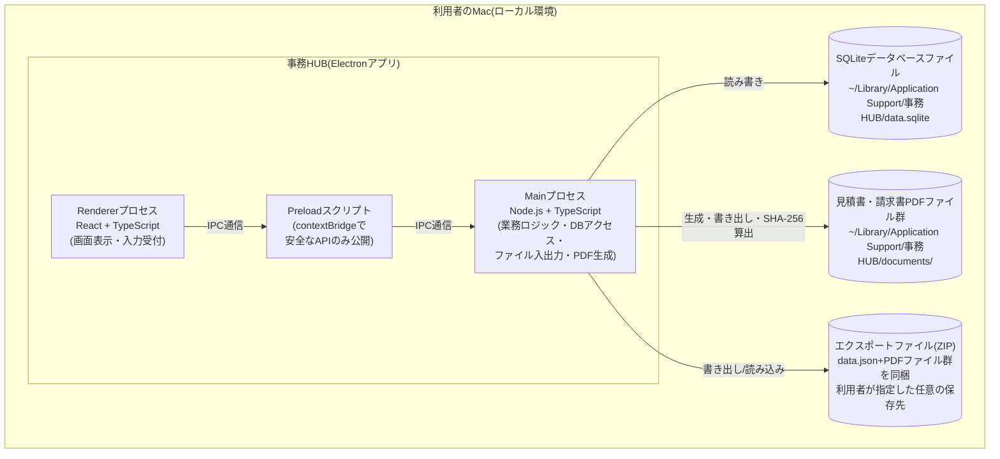
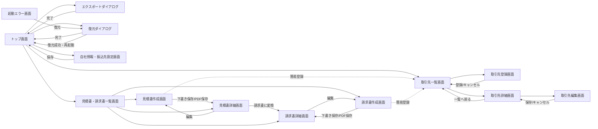
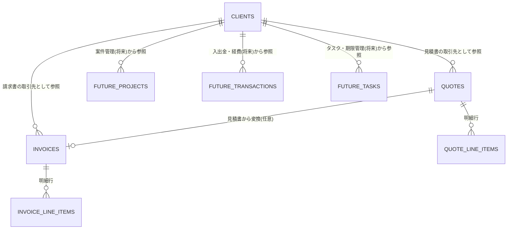

# 基本設計書

## 1. 文書情報

- 作成日: 2026-09-26(初版)/ 2026-09-28(v1.1〜v1.3改訂)/ 2026-10-02(v1.4改訂)/ 2026-10-03(v1.5・v1.6改訂)
- 版数: v1.6
- 対象イテレーション: イテレーション1(見積書・請求書作成)
- 参照元: 機能仕様書.md v1.1(docs/02_requirements)。v1.4〜v1.6は実装・レビュー・セキュリティチェックの結果(レビュー結果報告書.md v1.3、セキュリティチェック結果報告書.md v1.3、app/README.mdの「詳細設計書との差異」6.2節)を反映した改訂であり、実装を正として設計書を整合させている

## 2. システム概要

「事務HUB」は、個人事業主である依頼者ご本人が唯一の利用者となる、ローカル環境専用のデスクトップアプリケーションである。イテレーション0では、以降の機能を追加していく土台となる「アプリ基盤」と、各機能から共通の台帳として参照される「取引先管理」を実現した。イテレーション1では、見積書・請求書の作成・PDF保存、見積書から請求書への変換、入金ステータス管理、自社情報・振込先の設定、源泉徴収税額の計算(F-09〜F-16)を追加し、あわせて取引先管理にフリガナ項目・五十音順表示(F-04・F-05更新)、起動エラー画面からの復元導線(F-09)を追加する。

要件定義書10.2章★5にて、利用するPCのOSは「Macのみ」であることが確定している。この前提のもと、以下のとおり技術を選定する。実行環境・言語・UIライブラリの組み合わせ(Electron+TypeScript+React)、ローカルDB・ORM・入力バリデーション・データ交換形式・パッケージング等の周辺技術(2.1章)は、イテレーション0の設計フェーズ着手前にユーザーへ事前確認を行い確定済みであり、本イテレーションでもそのまま踏襲する(8.1章★B1参照)。本イテレーションで新たに必要となった技術方針(PDF生成方式等)は2.2章のとおり、設計フェーズ着手前のユーザー事前確認によりあらためて確定した(8.1章★C1〜★C12参照)。

### 2.1 採用技術(イテレーション0で確定・継続)

| 区分 | 採用technology | 選定理由 |
|---|---|---|
| 実行環境 | Electron 44.5.1(Chromium + Node.js。セキュリティチェックSEC-12により、同じメジャー版の最新パッチ版へ更新) | Web技術(HTML/CSS/JS)ベースで画面を作り込みやすく、Mac専用と判明したことでクロスプラットフォーム対応の負荷を考慮する必要がなくなった。将来の見積書・請求書のPDF出力、CSV入出力等、Node.jsの豊富なライブラリ資産をそのまま活用できる点を重視した |
| 言語 | TypeScript(Main/Renderer共通) | 型安全性により、取引先マスタを起点に今後テーブル・画面を追加していく際の実装ミスを防ぎやすい |
| UIライブラリ | React | コンポーネント単位で画面を組み立てられ、以降のイテレーションで画面数が増えても再利用・保守がしやすい。具体的な見た目・配色は後続のデザインフェーズ(designer)で確定する |
| ローカルDB | SQLite(better-sqlite3 + Drizzle ORM) | ファイル1つで完結する組み込みDBであり、認証・サーバー不要のローカル専用アプリに適している。取引先に加え、見積書・請求書、以降追加される案件・入出金経費・タスク等を合わせても十分な性能を発揮できる規模感である。またリレーショナル構造のため、他エンティティから取引先を外部キーで参照する拡張(要件定義書7章「拡張性」)と相性が良い |
| 入力バリデーション | Zod | TypeScriptの型定義とバリデーションルールを一体化でき、Renderer(入力チェック)とMain(登録・更新処理)の双方で同じ定義を再利用できる |
| データ交換形式(エクスポート/インポート) | JSON(スキーマバージョン番号付き)。v1.2以降は、このJSON(`data.json`)とPDFファイル群を1つのZIP形式バックアップファイルに同梱する(2.2章参照) | JSONは人が読める形式であり、テーブル項目が増えてもスキーマバージョンによる変換(マイグレーション)処理を実装しやすい |
| パッケージング・配布 | electron-builder | Electron向けの定番パッケージングツールであり、macOS向け.dmgインストーラの生成、Apple Silicon/Intel両対応のuniversalビルドを容易に構成できる |

### 2.2 イテレーション1で新たに確定した技術方針

| 区分 | 採用technology/方針 | 選定理由 |
|---|---|---|
| PDF生成方式 | Electron標準機能`webContents.printToPDF()`により、見積書・請求書表示用のHTML/CSSをレンダリングしPDF化する。HTML/CSSはMain側の文字列テンプレート(PDF専用。Rendererの画面コンポーネントは用いない)で組み立てる(v1.4。実装を正とした) | 追加ライブラリが不要で、Chromiumが使用フォントを自動でPDFへ埋め込むため日本語表示も安定する。非表示ウィンドウへReact画面コードを持ち込まず、PDFの見た目を単独で検証・変更しやすく、テストも容易なため、テンプレートをMain側に独立して持つ構成とした。pdfmake(フォント同梱が別途必要)・pdf-lib(座標指定によるレイアウト実装コストが大きい)は不採用とした |
| PDF内の日本語フォント | OS標準搭載フォント(ヒラギノ角ゴ等)をそのまま利用し、フォントファイルは同梱しない | Mac専用アプリのため表示は安定し、アプリサイズも増えない |
| PDFファイルの保存先・管理方式 | アプリ管理フォルダ(`~/Library/Application Support/事務HUB/documents/quotes/<西暦年>/`・`.../invoices/<西暦年>/`)へ自動保存する。保存後は「Finderで表示」「既定アプリで開く」の導線を画面に用意する | 電子帳簿保存法の検索要件(発行日・金額・取引先。要件定義書10.3章★12)に対応するため、保存場所をアプリが把握しデータベースと連携できる方式とした |
| 見積書・請求書番号の採番書式 | 西暦4桁+ハイフン+連番3桁(例: `2026-001`)。見積書・請求書は別々の連番系列とし、暦年(1月)で連番をリセットする | シンプルで分かりやすく、書類の一意性を確保しやすい |
| 電子帳簿保存法対応(改変防止・★12) | PDF保存確定後は編集画面自体を無効化する(要件定義書R-14の延長)ことに加え、PDF保存時にファイルのSHA-256ハッシュ値をデータベースへ記録し、事後に改変有無を照合できるようにする | 電子帳簿保存法の真実性確保要件への対応をより明確に示せるため |
| 電子帳簿保存法対応(検索・★12) | 見積書・請求書一覧画面で発行日・金額・取引先による検索・絞り込みを提供する(データベース検索のみとし、PDFファイル自体への全文検索機能は持たない) | 要件定義書が求める「日付・金額・取引先の各条件で検索」を満たすには十分であるため |
| 消費税額の端数処理 | 1書類につき税率区分(10%/8%)ごとに小計を算出し、それぞれ円未満切り捨てで消費税額を1回だけ計算する | インボイス制度の原則的な取り扱い(1書類につき税率ごとに1回の端数処理)に合わせるため |
| 源泉徴収税額の計算単位・端数処理 | 源泉徴収対象の明細行の金額(税抜)の合計に対して、段階計算(100万円以下は10.21%、超過分は20.42%)を1回だけ適用し、円未満切り捨てとする(v1.4。当初の「明細行ごと」から、ご本人のご判断により変更) | 100万円の基準は1回の支払単位に対するものであり、行ごとに適用すると基準を誤るため(例: 80万円+80万円は合計160万円に対して224,620円)。端数処理は国税庁の源泉徴収税額表の一般的な運用に合わせる |
| DBマイグレーション方式 | イテレーション0から踏襲する簡易方式(起動時のテーブル存在チェック`CREATE TABLE IF NOT EXISTS`・既存テーブルへの`ALTER TABLE`・`schema_version`更新)を継続する | 小規模アプリのため軽量な方式で十分であり、Drizzle Kit等の正式なマイグレーション管理は過剰と判断したため |
| エクスポート/復元ファイルの形式(v1.2) | ZIP形式のバックアップファイル(`data.json`とPDFファイル群を同梱)とする。ZIP圧縮ライブラリは`adm-zip`(バージョン0.6.1にピン止め)を採用する(依頼者ご本人承認済み。0.5.xに報告された脆弱性〔細工されたZIPによる過大なメモリ確保等〕を解消するため、v1.4で0.6.1へ更新) | 電子帳簿保存法対応の観点から、PDFファイルの実体を含めたバックアップ・復元を実現するため(8.1章★D4にて確定、依頼者ご本人のご判断による)。`adm-zip`は作成・展開の両方を1つの依存関係でシンプルに実装できるため採用した |
| 復元時のハッシュ不一致時の運用方針(v1.3) | 復元処理自体は中断せず、SHA-256ハッシュが不一致だった書類にのみ個別に警告を表示する | 電子帳簿保存法の運用ポリシーとして、依頼者ご本人のご判断により確定した(8.1章★D5) |

上記はいずれも設計フェーズ着手前のユーザー事前確認において確定した内容である(8.1章★C1〜★C9参照)。PDFレイアウトの具体的な記載事項・複数ページ対応・備考欄等の要件は4.15章、8.1章★C10〜★C12参照。エクスポート/復元ファイルの形式変更(v1.2)は8.1章★D4参照。

## 3. システム構成図

事務HUBは、利用者のMac1台の中で完結するスタンドアロン構成である。外部サーバー・外部APIとの通信は行わない。

- Rendererプロセス(画面)は、Node.jsの機能やファイルシステムへ直接アクセスせず、Preloadスクリプトが公開する限定的なAPIのみを介してMainプロセスとやり取りする(contextIsolation有効)。
- 見積書・請求書のPDFファイルはMainプロセスが`webContents.printToPDF()`で生成し、アプリ管理フォルダへ書き込む。書き込み時に算出したSHA-256ハッシュ値はデータベースへ記録し、事後の改変有無の照合に用いる(2.2章)。
- データベースファイル・PDFファイル・エクスポートファイルは、いずれも利用者のMac内(またはUSBメモリ等、利用者が保存先として指定した場所)に留まり、外部への送信は一切行わない。
- データベースファイルの保存場所は、Mac本体のローカルファイルシステム(前掲のパス)に限定し、iCloud Drive等のクラウド同期フォルダは使用しない方針とする(8.1章★B7参照)。

## 4. 画面設計

以降のイテレーションで案件管理・入出金経費・タスク管理が追加されることを見据え、画面はトップ画面のサイドメニューから各機能へ入る構成とする。本イテレーションで「見積書・請求書」メニューを活性化する。

### 4.1 トップ画面(ダッシュボード)[F-01]

**画面レイアウト**

- 画面左側にサイドメニューを配置する。メニュー項目は「取引先管理」「見積書・請求書」(いずれも利用可能)、および「案件管理」「入出金・経費」「タスク・期限」(準備中として非活性表示。以降のイテレーションで有効化する)
- 画面上部にアプリ名(事務HUB)と、データ管理メニュー(エクスポート・復元・自社情報の設定の入り口)を配置する
- 画面中央には、起動時点の簡易サマリー(取引先の登録件数、見積書・請求書の件数、未収の請求書件数)を表示する。「未収の請求書件数」は、PDF保存済みかつ未入金の請求書の件数とする(下書きは含めない)

**操作と実現内容**

| 操作 | 実現内容 |
|---|---|
| 「取引先管理」メニュー押下 | 取引先一覧画面(4.2)へ遷移する |
| 「見積書・請求書」メニュー押下 | 見積書・請求書一覧画面(4.10)へ遷移する |
| 「準備中」メニュー押下 | 以降のイテレーションで実装予定である旨を案内し、画面遷移は行わない(トップ画面に限らず、サイドバーを表示する全画面で同様) |
| データ管理メニュー→「データをエクスポート」 | エクスポートダイアログ(4.6)を開く |
| データ管理メニュー→「データを復元」 | 復元ダイアログ(4.7)を開く |
| データ管理メニュー→「自社情報・振込先の設定」 | 自社情報・振込先設定画面(4.9)へ遷移する |

### 4.2 取引先一覧画面[F-05]

**画面レイアウト**

- 画面上部に検索キーワード入力欄(名称の部分一致検索)、並べ替え条件選択欄(フリガナ昇順[既定]・名称昇順・名称降順・登録日新しい順・登録日古い順)、状態フィルタ(既定は「利用中のみ表示」、切り替えで「利用停止」も含めて表示可能)を配置する
- 一覧はテーブル形式とし、取引先名称・フリガナ・敬称・担当者名・電話番号・状態を列として表示する。「利用停止」の取引先は行をグレー表示にし、状態バッジで区別する
- 並べ替え条件が「フリガナ昇順」の場合、フリガナが未入力の取引先は五十音順対象から外し、一覧の末尾にまとめて表示する(要件定義書10.2章R-16)
- 画面右上に「新規登録」ボタンを配置する

**操作と実現内容**

| 操作 | 実現内容 |
|---|---|
| 検索キーワード入力 | 名称に入力文字列を含む取引先のみへ一覧を即時絞り込む |
| 並べ替え条件変更 | 指定条件で一覧を並べ替える(フリガナ未入力分の末尾表示ルールを含む) |
| 状態フィルタ切り替え | 利用停止の取引先を表示/非表示する |
| 「新規登録」ボタン押下 | 取引先登録画面(4.3)へ遷移する |
| 一覧の行クリック | 取引先詳細画面(4.4)へ遷移する |
| 該当0件時 | 「該当する取引先がありません」等の案内文言を表示する |

見積書・請求書の作成画面(4.11・4.13)で簡易登録(F-11)された取引先も、本画面上では通常登録の取引先と区別せず表示する(登録後は同等に扱うため。要件定義書10.2章R-5)。

### 4.3 取引先登録画面[F-04]

**画面レイアウト**

- 取引先名称(必須)・フリガナ(任意)・敬称(選択式)・担当者名・郵便番号・住所・電話番号・メールアドレス・インボイス登録番号・メモの各入力欄を縦に並べたフォーム形式とする(フリガナは取引先名称の直下に配置する)。フリガナは全角カタカナのみ入力できる(ひらがなは入力時に自動で全角カタカナへ変換し、それ以外の文字はエラーとする。五十音順表示の安定のため。取引先登録・編集画面[4.5]共通)
- 画面下部に「登録」ボタンと「キャンセル」ボタンを配置する

**操作と実現内容**

| 操作 | 実現内容 |
|---|---|
| 「登録」ボタン押下 | 入力内容を検証し、問題なければ取引先マスタへ新規登録して一覧画面(4.2)へ戻り、完了メッセージを表示する |
| 必須項目未入力で「登録」ボタン押下 | 登録を行わず、該当項目にエラーメッセージを表示する |
| 「キャンセル」ボタン押下 | 入力内容を破棄し一覧画面(4.2)へ戻る |

### 4.4 取引先詳細画面[F-06・F-08]

**画面レイアウト**

- 取引先の全項目(取引先ID・名称・フリガナ・敬称・担当者名・住所・電話番号・メールアドレス・インボイス登録番号・メモ・状態・登録日時・更新日時)を表示する
- 画面上部に「編集」ボタンと「利用停止にする」ボタンを配置する。既に利用停止の取引先には状態バッジを表示し、「利用停止にする」ボタンは非表示にする

**操作と実現内容**

| 操作 | 実現内容 |
|---|---|
| 「編集」ボタン押下 | 取引先編集画面(4.5)へ遷移する |
| 「利用停止にする」ボタン押下 | 確認ダイアログを表示し、「はい」で状態を「利用停止」に変更する(完全削除は行わない) |
| 「一覧へ戻る」押下 | 取引先一覧画面(4.2)へ戻る |

取引先を利用停止にしても、既存の見積書・請求書データ・保存済みPDFの内容には影響しない。新規に見積書・請求書を作成する際の取引先選択欄には、利用停止の取引先は表示されない(一覧の既定フィルタと同様。機能仕様書F-08参照)。

### 4.5 取引先編集画面[F-07]

**画面レイアウト**

- 取引先登録画面(4.3)と同一の項目構成(フリガナ含む)で、既存の登録値を初期表示したフォームとする
- 画面下部に「保存」ボタンと「キャンセル」ボタンを配置する

**操作と実現内容**

| 操作 | 実現内容 |
|---|---|
| 「保存」ボタン押下 | 入力内容を検証し、問題なければ更新して詳細画面(4.4)へ戻り、完了メッセージを表示する。取引先IDは変更されない |
| 必須項目を空欄にして「保存」ボタン押下 | 更新を行わず、該当項目にエラーメッセージを表示する |
| 「キャンセル」ボタン押下 | 変更を破棄し詳細画面(4.4)へ戻る |

### 4.6 データエクスポート(ダイアログ)[F-02]

**画面レイアウト**

- モーダルダイアログとし、実行前に簡単な説明文(「現在のデータ(取引先・自社情報・見積書・請求書等)を1つのファイルに書き出します」)を表示する
- 「エクスポート実行」ボタンを配置する

**操作と実現内容**

| 操作 | 実現内容 |
|---|---|
| 「エクスポート実行」ボタン押下 | OS標準の保存先選択ダイアログを表示する。保存先確定後、実行時点の全データ(取引先・自社情報・見積書・請求書・明細行)と、保存済みの見積書・請求書PDFファイル一式を1つのZIPファイルへ書き出す |
| 保存成功時 | 保存先パスを含む完了メッセージを表示する |
| 保存失敗時(書き込み権限なし・空き容量不足等) | エラーメッセージを表示し、再試行を促す |

エクスポートファイルには見積書・請求書のデータベースレコード(明細行・金額・書類番号等)に加え、PDFファイルの実体も含める(v1.2にて確定。8.1章★D4参照)。初期ファイル名の拡張子は`.zip`とする。

### 4.7 データ復元(ダイアログ)[F-03]

**画面レイアウト**

- モーダルダイアログとし、実行前に「現在のデータ(取引先・自社情報・見積書・請求書等)がエクスポートファイルの内容で置き換わります」という警告文を表示する
- 「ファイルを選択して復元」ボタンを配置する

**操作と実現内容**

| 操作 | 実現内容 |
|---|---|
| 「ファイルを選択して復元」ボタン押下 | 警告文への同意後、OS標準のファイル選択ダイアログを表示する |
| ファイル選択後 | ファイル内容を検証し、問題なければ現在のデータを復元後の内容に置き換える。実行前に現在のデータを自動退避する(7章参照) |
| 復元成功時 | 復元件数を含む完了メッセージを表示し、一覧等の表示を最新化する。成功後はダイアログ内の警告文と「キャンセル」「続行」ボタンを非表示にし、完了メッセージのみを表示する |
| 復元失敗時(ファイル破損・形式不正・対応不可なバージョン等) | エラーメッセージを表示し、データは復元前の状態を維持する |

v1.2以降のエクスポートファイル(ZIP形式)を復元した場合、データベース上の見積書・請求書レコードに加え、PDFファイルの実体も復元される。復元したPDFファイルはSHA-256ハッシュ値を照合し、データベースに記録された値と一致しない場合(ZIP内に該当のPDFが存在しない場合を含む)は、復元処理自体は中断せず、当該の見積書・請求書の詳細画面に改変の可能性がある旨の警告を表示する(8.1章★D5にて確定。8章エラーハンドリング参照)。v1.1以前のエクスポートファイル(JSON単体、PDFファイルの実体を含まない旧形式)も引き続き復元できるが、その場合PDFファイルの実体は復元されず、復元後にPDFファイルが見つからない場合の画面表示となる(8章エラーハンドリング参照)。

### 4.8 起動エラー画面[F-09]

**画面レイアウト**

- アプリ起動に失敗した際に表示する専用画面。エラー内容の簡易説明(「データを読み込めませんでした」)と、「エクスポートファイルから復元する」ボタンを中央に配置する
- 復元操作の下に、操作マニュアルへの案内文言(サポート導線)を表示する

**操作と実現内容**

| 操作 | 実現内容 |
|---|---|
| 「エクスポートファイルから復元する」ボタン押下 | データ復元ダイアログ(4.7)と同じ復元処理(F-03)を、起動エラー画面上で実行する(要件定義書10.2章R-15)。データベースを開けない状態でも動作する専用の復元経路を用い、破損したデータベースファイルは削除せず、世代管理なしで退避ファイル(`backups/`フォルダの`corrupt_data_*`)として保存した上で、新しいデータベースへ復元する |
| 復元成功時 | 「復元が完了しました。アプリを再起動してください」というメッセージとともに「アプリを再起動」ボタンを表示する |
| 「アプリを再起動」ボタン押下 | アプリケーションを自動的に再起動する |
| 復元失敗時 | エラーメッセージを表示し、退避した元のデータベースファイルを元の場所へ戻した上で、起動エラー画面に留まる(再度ファイルを選び直せる) |

### 4.9 自社情報・振込先設定画面[F-10]

**画面レイアウト**

- 氏名・屋号(必須)、住所(必須)、インボイス登録番号(任意)、振込先(銀行名・支店名・口座種別[普通・当座]・口座番号・口座名義。いずれも任意)の入力欄を縦に並べたフォーム形式とする
- 画面下部に「保存」ボタンを配置する(新規設定・変更いずれも同じ画面・操作を用いる)

**操作と実現内容**

| 操作 | 実現内容 |
|---|---|
| 「保存」ボタン押下 | 入力内容を検証し、問題なければ自社情報を保存し、同じ画面に完了メッセージを表示する(繰り返し確認・修正する用途のため、他の画面へは遷移しない) |
| 氏名・屋号または住所が未入力で「保存」ボタン押下 | 保存を行わず、該当項目にエラーメッセージを表示する |
| 見積書・請求書作成画面から誘導された場合 | 保存完了後、遷移元の作成画面(新規作成・編集の別を保持)へ戻る(遷移元がある場合のみ) |

自社のインボイス登録番号の入力有無により、見積書・請求書の記載形式(適格請求書等保存方式/区分記載請求書等)を自動切替する(4.15章参照)。

### 4.10 見積書・請求書一覧画面[F-12・F-14]

**画面レイアウト**

- 画面上部に「見積書」「請求書」タブを配置する
- 検索条件欄: 発行日範囲(開始日・終了日)、取引先(選択式)、金額範囲(下限・上限)を配置する。請求書タブでは入金ステータスフィルタ(すべて/未収/入金済み)を追加で配置する(電子帳簿保存法の検索要件。要件定義書10.3章★12)
- 一覧はテーブル形式とし、見積書タブは書類番号・取引先・発行日・合計金額・状態(下書き/PDF保存済み)を列表示する。請求書タブはこれに加え入金ステータスを列表示する
- 画面右上に「見積書を新規作成」または「請求書を新規作成」ボタン(タブに応じて切替)を配置する

**操作と実現内容**

| 操作 | 実現内容 |
|---|---|
| タブ切替 | 見積書一覧/請求書一覧の表示を切り替える |
| 検索条件入力・変更 | 条件に応じて一覧を絞り込む。発行日の終了日が開始日より前、または金額の上限が下限より小さい場合は、「発行日の終了日は、開始日以降の日付を入力してください」「金額の上限は、下限以上の金額を入力してください」と表示し、エラーが解消されるまで絞り込みを実行しない |
| 「見積書を新規作成」ボタン押下 | 見積書作成画面(4.11)へ遷移する |
| 「請求書を新規作成」ボタン押下 | 請求書作成画面(4.13)へ遷移する |
| 一覧の行クリック | 見積書詳細画面(4.12)または請求書詳細画面(4.14)へ遷移する |
| 該当0件時 | 「該当する見積書(請求書)がありません」等の案内文言を表示する |

### 4.11 見積書作成画面[F-11・F-12]

**画面レイアウト**

- 取引先選択欄(利用中の取引先からの選択式。隣に「取引先を新規登録」リンクを配置し、押下でF-11の簡易登録モーダルを開く)
- 見積書番号表示欄(下書き中は「PDF保存時に採番されます」と表示し、PDF保存済み以降は確定した番号を表示する。編集不可)
- 発行日(必須、既定値は本日)、有効期限(任意)の入力欄
- 明細行入力欄(表形式・行追加可能): 品名(必須)・数量・単位・単価・税率(10%/8%の選択式)・金額(自動計算・表示のみ)。各行に削除ボタンを配置する
- 明細行の下に、税率区分ごとの小計・消費税額の内訳、および合計金額(自動計算・表示のみ)を表示する
- 備考欄(任意、自由記述)
- 自社情報・振込先の表示欄(F-10で設定済みの内容を編集不可で表示する。未設定の場合は「自社情報が未設定です」という案内と設定画面(4.9)への導線を表示する)
- 画面下部に「下書き保存」ボタン、「PDFとして保存」ボタン、「キャンセル」ボタンを配置する

**操作と実現内容**

| 操作 | 実現内容 |
|---|---|
| 「取引先を新規登録」リンク押下 | 簡易登録モーダル(取引先名称のみ必須)を表示する。登録後、当該取引先が選択済みの状態になる(F-11) |
| 明細行「行を追加」押下 | 明細行を1行追加する |
| 明細行「削除」押下 | 対象の明細行を削除する(最低1行は残す) |
| 明細行の入力変更 | 行の金額、税率区分ごとの内訳、合計金額を即時再計算する |
| 「下書き保存」ボタン押下 | 入力内容を検証し、問題なければ下書き状態で保存し、見積書詳細画面(4.12)へ遷移する。保存に失敗した場合は「下書きの保存に失敗しました」と表示する |
| 「PDFとして保存」ボタン押下 | 入力内容を検証し、自社情報が未設定の場合はエラー表示して中断する(4.9への導線を表示)。問題なければ、新規作成の場合は先に下書きとして保存して書類のidを確保した上で、見積書番号を確定採番し、PDFを生成・保存し、見積書詳細画面(4.12)へ遷移する。PDFの保存に失敗した場合も下書きは残り、同じ画面で再度「PDFとして保存」を押すと、同じ下書きを確定する(下書きが重複して作成されない) |
| 必須項目(取引先、発行日、明細行1行以上、各行の品名)未入力で保存操作 | 保存を行わず、該当項目にエラーメッセージを表示する。日付項目(発行日・有効期限)は実在する`YYYY-MM-DD`の日付でない場合もエラーとする |
| 「キャンセル」ボタン押下 | 保存していない変更を破棄し、見積書・請求書一覧画面(4.10)または遷移元へ戻る |

作成画面・詳細画面の税率区分ごとの内訳は、該当する明細行がない税率区分も0円として表示する(PDFでは該当しない税率区分の行は表示しない。4.15章参照)。PDF生成に失敗した場合は、番号確定前の下書きの状態へ戻し、「PDFの保存に失敗しました」と表示する(発番済みの書類番号は欠番となる)。

入力途中の内容が失われないよう、サイドバーのメニューを押して他の画面へ移動する際には、確認ダイアログ「入力中の内容は保存されません。この画面を離れてよろしいですか」を表示する(請求書作成画面[4.13]・取引先登録・編集画面[4.3・4.5]も同様。変更の有無は判定せず常に確認する)。

### 4.12 見積書詳細画面[F-12・F-13]

**画面レイアウト**

- 見積書の全項目(番号・取引先・発行日・有効期限・明細行・税内訳・合計金額・備考・状態)を表示する
- 状態が「下書き」の場合は「編集」ボタンを、「PDF保存済み」の場合は「PDFを開く」ボタン・「Finderで表示」ボタン・「請求書に変換」ボタンを配置する
- 復元時のハッシュ照合(4.7章参照)で不一致が検出されている場合、「PDFファイルの改変が疑われます」という警告バッジを表示する

**操作と実現内容**

| 操作 | 実現内容 |
|---|---|
| 「編集」ボタン押下(下書きのみ) | 見積書作成画面(4.11)を編集モードで開く |
| 「PDFを開く」ボタン押下 | OS標準の既定アプリケーションでPDFファイルを開く。開く前にファイルの存在と保存先(アプリ管理フォルダ)配下であることを確認し、確認できない場合や開けなかった場合は「PDFファイルが見つかりません。…」と画面に表示する |
| 「Finderで表示」ボタン押下 | PDFファイルの保存先をFinderで表示する(「PDFを開く」と同じ確認を行い、失敗時は同じ文言を表示する) |
| 「請求書に変換」ボタン押下(PDF保存済みのみ活性) | 見積書の内容を引き継いだ請求書を新規作成し、請求書詳細画面(4.14、下書き状態)へ遷移する(F-13) |
| 「一覧へ戻る」押下 | 見積書・請求書一覧画面(4.10)へ戻る |

### 4.13 請求書作成画面[F-11・F-13・F-14・F-16]

基本構成は見積書作成画面(4.11)に準ずる。差分のみ記載する。

- 有効期限の代わりに支払期限(任意)を入力する
- 明細行に「源泉徴収対象」チェックボックスを追加する。対象とした行の金額(税抜)の合計に対して、源泉徴収税額を自動計算して表示する(F-16。行ごとの源泉徴収額は表示しない)
- 明細行の下に、税率区分ごとの内訳・合計金額(税込)に加え、源泉徴収税額、および請求金額(合計金額から源泉徴収税額を差し引いた額)を表示する
- 支払期限は、実在する`YYYY-MM-DD`の日付のみ入力できる(空欄は可)
- 見積書からの変換(F-13)により遷移してきた場合、取引先・明細行・備考が変換元の内容で初期表示される。元の見積書への参照リンクを画面上に表示する
- 「下書き保存」「PDFとして保存」「キャンセル」ボタンの挙動、およびサイドバー遷移時の離脱確認ダイアログは、見積書作成画面(4.11)に準ずる

### 4.14 請求書詳細画面[F-14・F-15]

**画面レイアウト**

- 請求書の全項目(番号・取引先・発行日・支払期限・明細行・税内訳・源泉徴収税額・請求金額・入金ステータス・入金日・状態)を表示する。元見積書がある場合はそのリンクを表示する
- 状態が「下書き」の場合は「編集」ボタン、「PDF保存済み」の場合は「PDFを開く」「Finderで表示」ボタンを配置する
- 復元時のハッシュ照合(4.7章参照)で不一致が検出されている場合、「PDFファイルの改変が疑われます」という警告バッジを表示する
- 入金ステータス欄に、現在の状態(未収/入金済み)と、切り替えボタンを配置する

**操作と実現内容**

| 操作 | 実現内容 |
|---|---|
| 「編集」ボタン押下(下書きのみ) | 請求書作成画面(4.13)を編集モードで開く |
| 「PDFを開く」「Finderで表示」ボタン押下 | 4.12に準ずる |
| 「入金済みにする」ボタン押下(未収の場合) | 入金日入力欄を表示し、確定後に入金ステータスを「入金済み」に変更する(入金日は必須で、実在する日付のみ。PDF保存済みの請求書のみ変更できる) |
| 「未収に戻す」ボタン押下(入金済みの場合) | 確認ダイアログを表示し、「はい」で入金ステータスを「未収」に戻す(入金日はクリアする) |
| 「一覧へ戻る」押下 | 見積書・請求書一覧画面(4.10、請求書タブ)へ戻る |
| 「元の見積書を見る」リンク押下 | 見積書詳細画面(4.12)へ遷移する |

### 4.15 見積書・請求書PDFレイアウト[F-12・F-14](要件定義書10.3章★11解消)

見積書・請求書のPDFは、次の記載事項・構成で出力する。見た目(文字サイズ・配色・余白等)の具体的な体裁は、後続のデザインフェーズ(designer)でモックアップ化する際に確定する。本章はレイアウトに含めるべき記載事項・配置ブロックの構成を定めるものである。

- 用紙サイズはA4縦とする
- 共通記載事項: 書類種別(見積書/請求書)、書類番号、発行日、宛先(取引先名称+敬称)、自社情報(氏名・屋号、住所)、自社のインボイス登録番号(設定している場合のみ表示)、明細行(品名・数量・単位・単価・税率・金額)、税率区分(10%/8%)ごとの小計・消費税額の内訳、合計金額、備考(入力がある場合のみ表示)
- 見積書固有の記載事項: 有効期限(入力がある場合のみ表示)
- 請求書固有の記載事項: 支払期限(入力がある場合のみ表示)、振込先情報(F-10で設定済みの銀行名・支店名・口座種別・口座番号・口座名義)、源泉徴収税額(対象行がある場合のみ表示。対象行の金額の合計に対して1回計算した額)、請求金額(源泉徴収税額差引後)
- 自社のインボイス登録番号の設定有無により、記載形式を「適格請求書等保存方式」相当(登録番号を明記)と「区分記載請求書等」相当(登録番号欄を表示しない)で自動切替する(機能仕様書F-10・F-12参照)
- 税率区分(10%/8%)ごとの内訳は、該当する明細行が1件もない税率区分の集計行(対象額・消費税額)を表示しない(実際に取引のあった税率区分のみ記載する)
- 明細行数が多く1ページに収まらない場合は、自動的に複数ページへ分割して出力する。全ページの下部(フッター)に書類番号・取引先名・ページ番号(n / 全ページ数)を繰り返し表示する(Chromiumが`@page`のマージンボックスによるヘッダー/フッター表示に対応していないため、`printToPDF`のフッター機能で実現する)
- 押印欄(角印等)は設けない(自社情報の印影画像は今回スコープ外。機能仕様書5.2章参照)

### 4.16 画面遷移図

上図の遷移に加え、サイドバーを表示する全画面(作成・編集・詳細・設定画面を含む)から、サイドバーのメニューによってトップ画面・取引先一覧画面・見積書請求書一覧画面へ移動できる(図では省略)。入力途中の画面(取引先登録・編集、見積書・請求書作成)から移動する場合は、離脱確認ダイアログを表示する(4.11章)。

トップ画面を起点に、取引先管理・見積書請求書関連ともに「一覧→登録(作成)/詳細→編集」という構成で統一し、以降のイテレーションで追加される機能も同様の構成で拡張する想定である。

## 5. データ設計

型や桁数等の物理設計は詳細設計書6章に譲り、本章ではデータの意味と関連のみを整理する。

※ FUTURE_で始まるエンティティは本イテレーションの対象外であり、取引先マスタが将来どのように参照されるかを示すための参考表記である。COMPANY_PROFILE(自社情報・振込先)は自社自身の設定情報であり、他エンティティとの参照関係を持たない独立データのため上図には含めていない(5.2参照)。

### 5.1 CLIENTS(取引先)の項目の意味

| 項目名 | 意味 |
|---|---|
| 取引先ID | 取引先マスタの各レコードを一意に識別する管理項目。以降の機能が取引先を参照する際のキーとなる(利用者は直接入力しない) |
| 取引先名称 | 取引先の正式名称。必須項目 |
| フリガナ | 取引先名称の読み。一覧の五十音順表示に使用する任意項目(要件定義書10.2章R-16)。全角カタカナのみとし、入力されたひらがなは自動で全角カタカナへ変換して保存する |
| 敬称 | 書面等での宛名に付す敬称(御中・様・(なし)) |
| 担当者名 | 取引先側の窓口担当者名 |
| 郵便番号・住所 | 取引先の所在地情報 |
| 電話番号 | 取引先の連絡先電話番号 |
| メールアドレス | 取引先の連絡先メールアドレス |
| 取引先のインボイス登録番号 | 見積書・請求書への記載を見据えた項目。インボイス制度における適格請求書発行事業者の登録番号 |
| メモ | その他の補足事項の自由記述 |
| 状態(利用中/利用停止) | 一覧表示・検索対象とするかどうかを示す管理項目。「利用停止」でもデータは保持され続ける |
| 登録日時・更新日時 | レコードの作成・最終更新のタイムスタンプ |

### 5.2 COMPANY_PROFILE(自社情報・振込先)の項目の意味

依頼者ご自身の事業者情報であり、アプリ内に1件のみ保持する(要件定義書F-10)。

| 項目名 | 意味 |
|---|---|
| 氏名・屋号 | 見積書・請求書に発行者として表示する氏名または屋号。必須項目 |
| 住所 | 見積書・請求書に表示する発行者住所。必須項目 |
| インボイス登録番号 | 自身が適格請求書発行事業者として登録している場合の登録番号。入力有無により見積書・請求書の記載形式を自動切替する |
| 振込先(銀行名・支店名・口座種別・口座番号・口座名義) | 請求書に記載する振込先情報。いずれも任意項目 |
| 更新日時 | 最終更新のタイムスタンプ |

### 5.3 QUOTES(見積書)・INVOICES(請求書)の項目の意味

見積書・請求書は共通の構造を持つため、意味が共通する項目はまとめて記載する。

| 項目名 | 意味 |
|---|---|
| 書類番号(見積書番号/請求書番号) | 書類を一意に識別する採番済み番号(西暦4桁+連番3桁)。PDF保存確定時に発番され、それまでは未確定(要件定義書10.2章R-6) |
| 取引先 | 発行先の取引先。取引先マスタを参照する |
| 発行日 | 書類上に表示する発行日 |
| 有効期限(見積書のみ) | 見積の有効期限。任意項目 |
| 支払期限(請求書のみ) | 代金の支払期限。任意項目 |
| 元見積書(請求書のみ) | 見積書からの変換によって作成された場合の、変換元の見積書への参照。任意項目(要件定義書10.2章R-13) |
| 明細行 | 品名・数量・単価等から成る行データ(5.4参照) |
| 税率区分ごとの小計・消費税額 | 10%・8%それぞれの対象金額と消費税額(端数処理は2.2章参照) |
| 合計金額 | 明細行の合計に消費税額を加えた税込金額 |
| 源泉徴収税額(請求書のみ) | 源泉徴収対象の明細行の金額(税抜)の合計に対して、段階計算を1回適用して求めた税額(F-16) |
| 請求金額(請求書のみ) | 合計金額から源泉徴収税額を差し引いた、実際に振り込んでもらう金額 |
| 記載形式 | 発行者(自社)のインボイス登録番号の設定有無により決まる、適格請求書等保存方式/区分記載請求書等の別。PDF保存確定時点の設定で決まる |
| 状態(下書き/PDF保存済み) | PDF保存済みの書類は編集不可となる(要件定義書10.2章R-14。電子帳簿保存法対応) |
| 入金ステータス・入金日(請求書のみ) | 未収/入金済みの別と、入金済みへ変更した際の入金日(要件定義書10.2章R-10) |
| PDFファイルの保存先・ハッシュ値 | 生成したPDFファイルの保存パスと、改変有無の照合に用いるSHA-256ハッシュ値(要件定義書10.3章★12) |
| 登録日時・更新日時 | レコードの作成・最終更新のタイムスタンプ |

### 5.4 明細行(見積書・請求書共通)の項目の意味

| 項目名 | 意味 |
|---|---|
| 品名 | 提供する商品・サービスの名称。必須項目 |
| 数量・単位 | 提供数量とその単位 |
| 単価 | 品目1つあたりの金額 |
| 税率 | 10%(標準税率)または8%(軽減税率)の選択式 |
| 金額 | 数量×単価で自動計算される、当該行の税抜金額 |
| 源泉徴収対象(請求書のみ) | この行の金額を源泉徴収税額の計算対象とするかどうかの指定(F-16) |

## 6. 外部連携

- 外部システム・外部APIとの連携は行わない。インターネットに公開せず、ローカル環境のみで完結する(要件定義書7章)。
- 「外部」とのやり取りは、利用者自身が指定するファイルシステム上のエクスポートファイル(ZIP形式、データ+PDF同梱)の書き出し・読み込み、および見積書・請求書PDFファイルをOS標準アプリケーション(プレビュー等)・Finderと連携して開く操作のみである。これらもいずれもMac本体内で完結し、ネットワーク通信は発生しない。

## 7. 非機能設計方針

- **動作環境**: Mac専用(要件定義書10.2章★5)。Apple Silicon・Intel双方のMacで動作するuniversalビルドとする。
- **性能**: 取引先の登録件数目安は〜50件程度、見積書・請求書は年間で数十〜数百件規模を想定する。検索・並べ替えに用いる列(取引先名・フリガナ・状態、見積書・請求書の発行日・金額・取引先・状態)には検索用のインデックスを設ける。
- **セキュリティ**: 認証機能は設けず、PC自体のログイン・画面ロックによる保護を前提とする。Rendererプロセスからは、Node.js機能・ファイルシステムへ直接アクセスできない構成(contextIsolation、preload経由の限定APIのみ公開)とする。データベースファイル・PDFファイル・エクスポートファイルはいずれも暗号化しない(イテレーション0からの方針を継続)。PDFファイルについては、改変検知のためSHA-256ハッシュ値をデータベースに記録する(2.2章、要件定義書10.3章★12)。入力値の検証は画面側だけでなくIPC境界(Main側)でも行い、日付項目は実在する`YYYY-MM-DD`のみ受け付ける。業務ルール(PDF保存済み書類は編集不可、PDF保存済みの請求書のみ入金ステータス変更可 等)も画面制御に加えてService層でガードする。復元ファイル(エクスポートファイル)は信頼せず、ZIP内のパス(親ディレクトリ参照・絶対パス)を無視し、復元するPDFの保存先パスはアプリ管理フォルダ(`documents/`)配下の相対パスのみ採用する。PDFを開く・Finderで表示する操作でも、保存先配下であること・拡張子が`.pdf`であること・ファイルが存在することを確認してからOSへ渡す。書類のPDFとして扱うのは拡張子`.pdf`のファイルのみとし、復元時もZIP内の`.pdf`以外のエントリは書き出さず、`.pdf`以外を指す保存先パスは採用しない(細工した復元ファイルによって、PDF以外のファイルをOSの既定アプリで開かせないため。SEC-10)。復元ファイルには読み込み上限(ファイル1GiB、ZIPのエントリ10万件、展開後サイズの合計2GiB)を設け、超過した場合は展開せず、ファイルを読み込めない場合と同じ解析エラーとして復元を中断する(解凍爆弾・巨大ファイルによるメモリ枯渇の防止。SEC-09。個人事業主の利用規模では上限に達しない)。PDF生成のために一時的に書き出すHTML(書類の内容を含む)は、OSの一時フォルダ内の専用フォルダ(利用者本人のみアクセス可)に置き、生成後に必ず削除する。異常終了で残った分は次回起動時に削除する(SEC-11)。
- **データ消失対策**: 手動エクスポート・復元のみを提供する(イテレーション0からの方針を継続)。エクスポートファイルにはデータベースレコード(取引先・自社情報・見積書・請求書・明細行)に加え、見積書・請求書のPDFファイルの実体も含める(v1.2にて確定。8.1章★D4参照)。想定容量は、PDFファイル1件あたり数十〜数百KB程度、年間数十〜数百件程度(7章「性能」参照)と合わせても、エクスポートファイル全体でおおむね数十MB程度に収まる見込みである。v1.1以前に作成された旧形式(PDFファイルの実体を含まないJSON単体)のエクスポートファイルも、後方互換のため引き続き復元できる。復元したPDFファイルはSHA-256ハッシュ値を照合し、データベース上の記録値と一致しない場合は、復元処理自体は中断せず当該書類に個別に警告を表示する方針で確定している(8.1章★D5参照)。ZIP内に該当のPDFが存在しない(欠落している)書類も、ハッシュ不一致と同様に警告の対象とする(改ざん・欠落の双方を検知するため。ただし、PDFのハッシュ値が記録されていない書類は照合の対象外)。
- **拡張性**: 見積書・請求書テーブルも取引先テーブルと同様に、取引先IDを外部キーとして参照する構造とする。案件管理等、以降のイテレーションで追加するテーブルからも同様に参照できる設計を維持する。
- **法令配慮(インボイス制度・電子帳簿保存法)**: 自社・取引先双方のインボイス登録番号を管理項目として保持し、見積書・請求書の記載形式(適格請求書等保存方式/区分記載請求書等)を自動切替する(4.15章)。電子帳簿保存法対応として、PDF保存確定後の編集不可化・SHA-256ハッシュ記録による改変防止、および一覧画面での発行日・金額・取引先による検索を実装する(2.2章、要件定義書10.3章★12解消)。あわせてv1.2にて、エクスポートにPDFファイルの実体を含め、復元時にはハッシュ値を再照合することで、バックアップ・復元を経ても改変防止の実効性が失われないようにした(8.1章★D4参照)。
- **利用のしやすさ**: 専門知識がなくても迷わず操作できるよう、エラーメッセージ・完了メッセージは平易な文言とする。内部の例外メッセージに含まれる技術的な接頭辞(通信経路の名称・例外クラス名等)は、画面表示の前に取り除き、文言のみを表示する。具体的な文言・レイアウトの調整は後続のデザインフェーズで行う。
- **配布・インストール**: Apple Developer Programへの登録は行わず、未署名で配布する方針を継続する(8.1章★A参照)。あわせて、残課題SEC-07(配布物に他OS向けのネイティブバイナリ等、不要な同梱物が含まれている点)に対応するため、electron-builderの`files`・`extraResources`設定を見直し、macOS向け配布に不要なファイルをビルド成果物から除外する設定を追加した(実装済み。配布物の起動・データベース作成を確認済み)。

## 8. 要確認事項・未解決事項

### 8.1 確定した事項

以下は依頼者ご本人よりご回答をいただき、確定した事項である。★Aおよび★B1〜★B9はイテレーション0にて確定済み(前版参照)。★C1〜★C12はイテレーション1の設計フェーズ着手前に確定した。★D4はv1.1公開後の残課題として計上した後、依頼者ご本人のご判断によりv1.2にて確定した。★D5はv1.2公開後の残課題として計上した後、依頼者ご本人のご判断によりv1.3にて確定した。

| No | 内容 | 確定内容 | 反映箇所 |
|---|---|---|---|
| ★C1 | 見積書・請求書PDFの生成方式 | Electron標準機能`webContents.printToPDF()`でHTML/CSSをPDF化する方式で確定 | 本書2.2章 |
| ★C2 | PDFの日本語フォントの扱い | OS標準搭載フォントをそのまま利用し、フォントファイルは同梱しない方式で確定 | 本書2.2章 |
| ★C3 | PDFファイルの保存先・管理方式 | アプリ管理フォルダへの自動保存(年別)+「Finderで表示」導線を用意する方式で確定 | 本書2.2章、3章、4.12・4.14章 |
| ★C4 | 見積書番号・請求書番号の採番書式 | 西暦4桁+連番3桁(例:2026-001)。見積書・請求書は別系列、暦年(1月)でリセットする方式で確定 | 本書2.2章、5.3章 |
| ★C5 | 消費税額の端数処理 | 税率区分ごとに1回、円未満切り捨てで計算する方式で確定 | 本書2.2章 |
| ★C6 | 源泉徴収税額の端数処理 | 円未満切り捨てで確定。v1.4で、計算単位を「明細行ごと」から「対象行合計に対して1回」へ変更(依頼者ご本人のご判断。実装を正とした) | 本書2.2章、4.13・4.15章 |
| ★C7 | 電子帳簿保存法対応(改変防止方式) | 編集画面無効化に加え、PDF保存時にSHA-256ハッシュ値をDBへ記録し照合可能にする方式で確定 | 本書2.2章、7章 |
| ★C8 | 電子帳簿保存法対応(検索要件の実現方式) | 一覧画面で発行日・金額・取引先により検索・絞り込みできるようにする方式で確定(PDF自体への全文検索は行わない) | 本書2.2章、4.10章、7章 |
| ★C9 | DBマイグレーション方式 | イテレーション0からの簡易方式(テーブル存在チェック+schema_version)を継続する方式で確定 | 本書2.2章 |
| ★C10 | PDFレイアウトの記載事項(複数ページ対応・備考欄・税率内訳表示) | 複数ページ自動分割、備考欄を見積書・請求書共通で設置、税率ごとの小計・消費税額を内訳表示する方式で確定 | 本書4.15章 |
| ★C11 | 自社情報・振込先が未設定のまま見積書・請求書を作成しようとした場合の扱い | 作成・PDF保存を不可とし、先に自社情報の設定を促す方式で確定 | 本書4.11・4.13章 |
| ★C12 | 請求書の入金ステータスを「入金済み→未収」へ戻す操作の要否 | 戻す操作を用意する方式で確定 | 本書4.14章 |
| ★D4 | エクスポートファイルにPDFファイルの実体を含めるかどうか(v1.1にて残課題として計上) | 「今回、エクスポートにPDFファイル本体を含める」で確定。実装方式(ZIP形式での同梱)は本方針を踏まえ設計フェーズで決定した | 本書2.2章、3章、4.6・4.7章、7章 |
| ★D5 | 復元時にPDFファイルのSHA-256ハッシュ照合が不一致だった場合の運用方針(v1.2にて残課題として計上) | 「復元は中断せず、不一致の書類に個別警告を表示する」で確定 | 本書4.7章、4.12・4.14章、7章 |
| (参考) | ZIP圧縮ライブラリの選定(`adm-zip`) | 依頼者ご本人の承認済み。作成・展開の両方を1つの依存関係でシンプルに実装できるため採用 | 本書2.2章 |

上記に加え、用紙サイズはA4を前提とすることも確認済みである(本書4.15章)。

### 8.2 残る要確認事項・未解決事項

| No | 内容 | 影響 | 確認方法 | 確認先 | 期限目安 |
|---|---|---|---|---|---|
| ★13 | ★D1アプリアイコンの具体的なデザイン(モチーフ・配色等) | デザインフェーズの作業に影響 | デザインフェーズ着手時のヒアリング | 依頼者ご本人 | デザインフェーズ着手時 |
| ★14 | SEC-04〜SEC-06(Electron Fuses・署名、暗号化、未署名配布)等、次回以降に持ち越した残課題の対応要否・着手時期 | 次回以降の計画に影響 | 次回iteration-startでのヒアリング | 依頼者ご本人 | 次回イテレーション開始時 |

★D4(エクスポートファイルへのPDFファイル実体の同梱)は、依頼者ご本人のご判断により「含める」で確定し、v1.2にて解消済みである(8.1章参照)。★D5(復元時のハッシュ不一致時の運用方針)は、依頼者ご本人のご判断により「復元は中断せず、不一致の書類に個別警告を表示する」で確定し、v1.3にて解消済みである(8.1章参照)。要件定義書10.3章★11・★12は、本書2.2章・4.15章・7章の確定内容により解消済みである。★13・★14は要件定義書10.3章からの持ち越しで変更なし。

## 9. 変更履歴

| 版数 | 日付 | イテレーション | 内容 |
|---|---|---|---|
| v0.0 | 2026-09-26 | イテレーション0 | 初版作成。機能仕様書 v0.1に基づき、採用技術(Mac専用のOS確定を踏まえたElectron+TypeScript+React+SQLite構成)、システム構成図、画面設計、データ設計、非機能設計方針、要確認事項を整理した。 |
| v0.1 | 2026-09-26 | イテレーション0 | 要確認事項★A(Apple Developer Programへの登録・コード署名/公証の要否)について依頼者ご本人の回答を反映し確定。「未署名で運用」とし、7章「配布・インストール」に確定内容を追記、8章を確定事項(8.1)と残る要確認事項(8.2)に整理した。 |
| v0.2 | 2026-09-26 | イテレーション0 | 設計フェーズ着手前にユーザーへ実施した事前確認(実装技術、起動時の画面構成、登録・編集画面の形式、一覧の表示項目・初期並び順、データ復元方式、バックアップファイル形式、データ保存場所、取引先の管理項目追加要否、変更履歴機能の対応時期)の回答を反映し、8.1章に★B1〜★B9として確定内容を追記した。あわせて2章・3章・4章・5章・7章の該当箇所に確定内容への参照を追記した。技術選定について、従来の記述を「設計フェーズ着手前にユーザーへ事前確認を行い、ご了承をいただいた上で確定した」旨の表現に更新した。 |
| v1.0 | 2026-09-27 | イテレーション0 | イテレーション0の総括(イテレーション総括.md v1.0)で完了と判定されたため、v1.0とし次イテレーションの起点とした。本文の変更はない。 |
| v1.1 | 2026-09-28 | イテレーション1 | 機能仕様書.md v1.1に基づき改訂。イテレーション1の新規技術方針(PDF生成方式・日本語フォント・PDF保存先・採番書式・消費税/源泉徴収税額の端数処理・電子帳簿保存法対応・DBマイグレーション方式)を設計フェーズ着手前のユーザー事前確認により確定し、2.2章・8.1章★C1〜★C12として追加した。3章システム構成図にPDFファイル群を追加した。4章画面設計に起動エラー画面(4.8)・自社情報振込先設定画面(4.9)・見積書請求書一覧画面(4.10)・見積書作成画面(4.11)・見積書詳細画面(4.12)・請求書作成画面(4.13)・請求書詳細画面(4.14)・見積書請求書PDFレイアウト(4.15)を新規追加し、4.1トップ画面(見積書・請求書メニュー活性化)・4.2〜4.5取引先関連画面(フリガナ項目・五十音順表示)・4.6〜4.7データ管理画面(見積書・請求書を含む説明文への更新)を更新した。画面遷移図(4.16)を全体構成に合わせて更新した。5章データ設計に自社情報(COMPANY_PROFILE)・見積書(QUOTES)・請求書(INVOICES)・明細行のデータ項目の意味を追加した。7章非機能設計方針にPDFのハッシュ記録・電子帳簿保存法対応・SEC-07対応方針を追記した。8章要確認事項に★C1〜★C12の確定内容を追加し、要件定義書10.3章★11・★12の解消を反映するとともに、残課題として★D4(PDFファイル実体のエクスポート対象化)を新規追加した。 |
| v1.2 | 2026-09-28 | イテレーション1 | 残課題★D4(エクスポートファイルへのPDFファイル実体の同梱)について、依頼者ご本人より「今回、エクスポートにPDFファイル本体を含める」とのご判断をいただいたことを受けて改訂。2.2章にエクスポート/復元ファイルの形式変更(ZIP形式、`data.json`+PDFファイル群を同梱、`adm-zip`採用)を追加した。3章システム構成図のエクスポートファイルのラベルをZIP形式に更新した。4.6章(エクスポート)・4.7章(復元)を、PDFファイル実体を含める処理内容、v1.1以前の旧形式(JSON単体)ファイルとの後方互換、復元時のSHA-256ハッシュ再照合に更新した。4.12章・4.14章(見積書・請求書詳細画面)に、ハッシュ不一致時の警告バッジ表示を追記した。7章非機能設計方針に、エクスポートファイルの想定容量、旧形式との後方互換、ハッシュ不一致時の扱いを追記した。8.1章に★D4の確定内容を追加し、8.2章から★D4を解消済みとして整理するとともに、新たな残課題★D5(ハッシュ不一致時に復元を中止するか警告表示に留めるかの運用方針)を追加した。 |
| v1.3 | 2026-09-28 | イテレーション1 | 残課題★D5(復元時のPDFハッシュ不一致時の運用方針)について、依頼者ご本人より「復元は中断せず、不一致の書類に個別警告を表示する」とのご判断をいただいたことを受けて改訂。8.1章★D5として確定事項に追加し、8.2章から削除した。あわせてZIP圧縮ライブラリ`adm-zip`の採用について依頼者ご本人の承認済みであることを8.1章・2.2章に明記した。7章非機能設計方針・4.7章(データ復元)の「暫定運用」の表現を、確定方針である旨の表現に更新した。 |
| v1.4 | 2026-10-02 | イテレーション1 | 実装・レビュー(レビュー結果報告書.md v1.2、README.md v1.2の6.2節差異No.5〜15)の結果を受け、実装を正として改訂した。2.2章: PDFテンプレートをMain側の文字列テンプレートとした旨、源泉徴収を「対象行合計に1回の段階計算(円未満切り捨て)」へ変更した旨(8.1章★C6)、`adm-zip`を0.6.1へ更新(ピン止め)した旨を反映した。4章: フリガナを全角カタカナ限定+ひらがな自動変換(4.3章・5.1章)、未収件数の定義(4.1章)、起動エラー画面の専用復元経路と破損DBの退避(4.8章)、自社情報の保存後の動作(同一画面に完了メッセージ、遷移元がある場合のみ戻る。4.9章)、下書き保存失敗の文言・日付の実在日検証・税率別内訳の画面0円表示/PDF非表示・PDF生成失敗時の下書きへの復帰と欠番(4.11章)、PDFを開く前の存在・保存先配下の確認(4.12章)、源泉徴収の表示(4.13章・4.15章)、入金ステータス変更の条件(4.14章)、PDFのフッターによる書類番号・ページ番号の繰り返し表示(4.15章)を更新した。5章データ設計の源泉徴収税額・フリガナの意味を更新した。7章: IPC境界・Service層の検証、復元ファイルの安全性、ZIP内PDF欠落の扱い、エラー文言の表示方針、SEC-07の実装済み状況を追記した。8章: ★C6の確定内容を更新した。要確認事項に変更はない。 |
| v1.5 | 2026-10-03 | イテレーション1 | 実装・テスト結果(レビュー結果報告書.md v1.3の4.1章G〜J)を受け、実装を正として改訂した。4.1章: 「準備中」メニューの案内を全画面共通とした。4.7章: 復元成功後にダイアログの警告文とボタンを非表示にする動作を追記した。4.10章: 一覧の発行日・金額の範囲エラー文言と、エラー中は絞り込みを実行しない動作を追記した。4.11章: 新規作成での「PDFとして保存」を先に下書き保存してから確定する動作(失敗時も同じ下書きを再試行で確定)、サイドバー遷移時の離脱確認ダイアログ(取引先登録・編集画面、見積書・請求書作成画面。変更有無を判定せず常に確認)を追記し、4.13章を準用とした。4.16章: 全画面からのサイドバー遷移を追記した。要確認事項に変更はない。 |
| v1.6 | 2026-10-03 | イテレーション1 | セキュリティチェック(セキュリティチェック結果報告書.md v1.3)の是正を反映した。2.1章: Electronを44.5.1へ更新した旨(SEC-12)を追記した。7章セキュリティ: 復元ファイルの読み込み上限(ファイル1GiB・ZIPのエントリ10万件・展開後サイズ合計2GiB。超過時は解析エラー。SEC-09)、書類のPDFとして扱うのは拡張子`.pdf`のみ(復元時のZIPエントリ・保存先パス、PDFを開く・Finderで表示。SEC-10)、PDF生成用の一時HTMLを専用フォルダに置いて必ず削除し起動時に掃除する方針(SEC-11)を追記した。要確認事項に変更はない。 |
