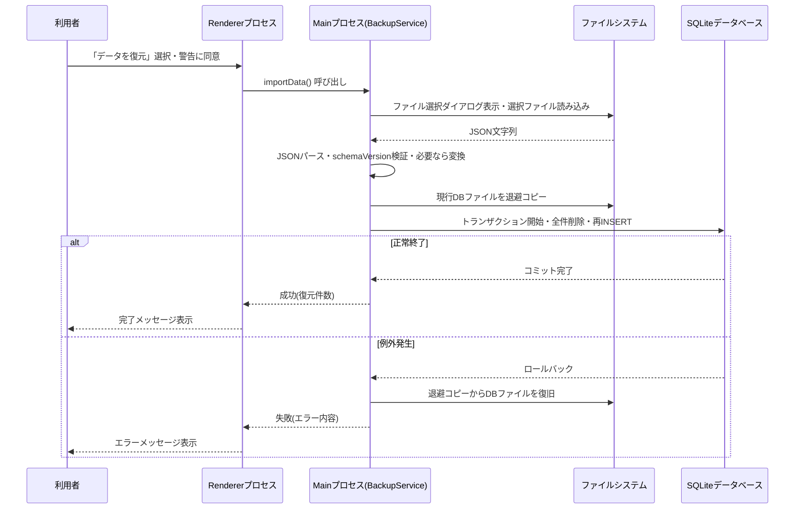
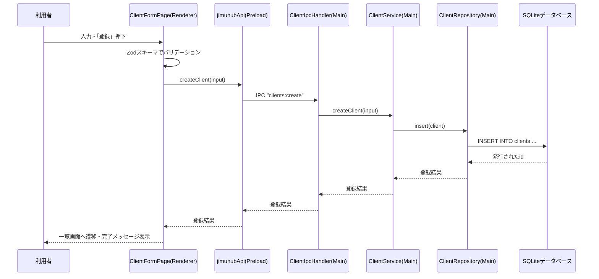
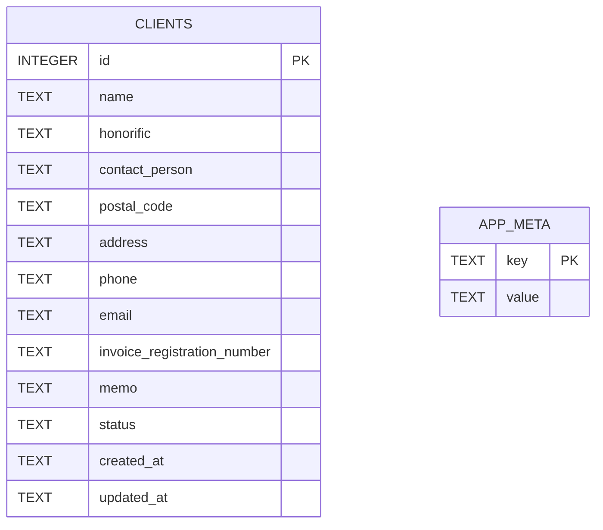

# 詳細設計書

## 1. 文書情報

- 作成日: 2026-09-26
- 版数: v1.0
- 対象イテレーション: イテレーション0(プロジェクト方針・基盤構築)
- 参照元: 基本設計書.md v1.0(docs/03_architect)

## 2. 対象範囲

基本設計書2章〜4章で確定した内容(Electron + TypeScript + React + SQLiteの構成、アプリ基盤の各画面、取引先管理の各画面)について、実装に落とし込める粒度まで具体化する。対象機能はF-01〜F-08(機能仕様書3章)である。フェーズ2以降の案件管理・見積請求・入出金経費・タスク管理は対象外とする。

基本設計書2章の技術方針(Electron+TypeScript+Reactおよび周辺技術)、4章の画面構成・遷移方式(トップ画面方式、登録・編集の別画面遷移方式、一覧の表示項目・初期並び順)、7章の復元方式(全置換)・バックアップファイル形式(JSON)・データ保存場所(Mac本体のみ)は、いずれも設計フェーズ着手前にユーザーへ事前確認を行い確定した内容である(基本設計書8.1章★B1〜★B9参照)。本書は、これらの確定内容を前提として実装粒度まで具体化する。

## 3. 画面詳細設計

### 3.1 トップ画面(ダッシュボード)[F-01]

本画面に利用者が入力する項目はない。表示専用の情報(取引先の登録件数等)とメニュー導線のみで構成する。

**操作定義表**

| 操作 | 種別 | トリガー条件 | 対応する処理の節番号 |
|---|---|---|---|
| アプリ起動 | 画面初期表示 | アプリケーション起動時 | 4.1 |
| 「取引先管理」メニュー押下 | 画面遷移 | 常時活性 | 3.2 |
| 「準備中」メニュー押下 | 案内表示 | 常時活性(以降のイテレーションで有効化予定) | - |
| 「データをエクスポート」押下 | ダイアログ表示 | 常時活性 | 3.6・4.2 |
| 「データを復元」押下 | ダイアログ表示 | 常時活性 | 3.7・4.3 |

### 3.2 取引先一覧画面[F-05]

**入力項目定義表**

| 項目名 | UI要素 | 型・桁数 | 必須 | 初期値 | バリデーション |
|---|---|---|---|---|---|
| 検索キーワード | テキスト入力 | 文字列(上限100文字) | 任意 | 空欄 | 特になし(取引先名称に対する部分一致検索に使用) |
| 並べ替え条件 | セレクトボックス | 列挙値(名称昇順/名称降順/登録日新しい順/登録日古い順) | 任意 | 名称昇順 | 列挙値以外は許容しない |
| 状態フィルタ | トグルスイッチ | 真偽値 | 任意 | OFF(利用中のみ表示) | - |

**操作定義表**

| 操作 | 種別 | トリガー条件 | 対応する処理の節番号 |
|---|---|---|---|
| 検索キーワード入力 | 一覧再取得 | 入力内容の変化時(即時反映) | 4.5 |
| 並べ替え条件変更 | 一覧再取得 | 選択変更時 | 4.5 |
| 状態フィルタ切り替え | 一覧再取得 | 切り替え時 | 4.5 |
| 「新規登録」ボタン押下 | 画面遷移 | 常時活性 | 3.3・4.4 |
| 一覧行クリック | 画面遷移 | 一覧に1件以上表示されている場合 | 3.4・4.6 |

### 3.3 取引先登録画面[F-04]

**入力項目定義表**

| 項目名 | UI要素 | 型・桁数 | 必須 | 初期値 | バリデーション |
|---|---|---|---|---|---|
| 取引先名称 | テキスト入力 | 文字列(1〜100文字) | 必須 | 空欄 | 前後の空白を除去した上で1文字以上100文字以内。空の場合はエラー |
| 敬称 | セレクトボックス | 列挙値(御中/様/(なし)) | 任意 | (なし) | 列挙値以外は許容しない |
| 担当者名 | テキスト入力 | 文字列(0〜50文字) | 任意 | 空欄 | 50文字以内 |
| 郵便番号 | テキスト入力 | 文字列(0〜8文字) | 任意 | 空欄 | 入力がある場合、半角数字とハイフンのみ許容(例: 123-4567) |
| 住所 | テキスト入力(複数行可) | 文字列(0〜200文字) | 任意 | 空欄 | 200文字以内 |
| 電話番号 | テキスト入力 | 文字列(0〜20文字) | 任意 | 空欄 | 入力がある場合、数字・ハイフン・括弧のみ許容 |
| メールアドレス | テキスト入力 | 文字列(0〜254文字) | 任意 | 空欄 | 入力がある場合のみ「◯◯@◯◯」形式の簡易チェックを行う |
| インボイス登録番号 | テキスト入力 | 文字列(0〜14文字) | 任意 | 空欄 | 入力がある場合、「T」+数字13桁の形式を推奨表示するが、登録状況未確定(要件定義書10.2章★7)のため入力自体は妨げない |
| メモ | テキストエリア(複数行) | 文字列(0〜2000文字) | 任意 | 空欄 | 2000文字以内 |

**操作定義表**

| 操作 | 種別 | トリガー条件 | 対応する処理の節番号 |
|---|---|---|---|
| 「登録」ボタン押下 | 登録処理実行 | 常時活性(押下時にバリデーション実施) | 4.4 |
| バリデーションエラー時 | エラー表示 | 必須項目未入力・形式不正時 | 4.4・8章 |
| 「キャンセル」ボタン押下 | 画面遷移(破棄) | 常時活性 | 3.2 |

### 3.4 取引先詳細画面[F-06・F-08]

本画面に利用者が入力する項目はない。表示専用の全項目と、編集・利用停止への導線で構成する。

**操作定義表**

| 操作 | 種別 | トリガー条件 | 対応する処理の節番号 |
|---|---|---|---|
| 画面表示 | 詳細取得 | 一覧または他画面からの遷移時 | 4.6 |
| 「編集」ボタン押下 | 画面遷移 | 対象が利用停止でない場合のみ活性 | 3.5・4.7 |
| 「利用停止にする」ボタン押下 | 確認ダイアログ表示 | 対象が利用中の場合のみ活性 | 4.8 |
| 確認ダイアログ「はい」押下 | 利用停止処理実行 | 確認ダイアログ表示中 | 4.8 |
| 確認ダイアログ「いいえ」押下 | ダイアログ閉じる(処理中断) | 確認ダイアログ表示中 | - |
| 「一覧へ戻る」押下 | 画面遷移 | 常時活性 | 3.2 |

### 3.5 取引先編集画面[F-07]

入力項目定義表は3.3(取引先登録画面)と同一の項目・型・バリデーションを用いる(共通フォームコンポーネントとして実装する)。既存値を初期値として画面表示する点のみ異なる。

**操作定義表**

| 操作 | 種別 | トリガー条件 | 対応する処理の節番号 |
|---|---|---|---|
| 「保存」ボタン押下 | 更新処理実行 | 常時活性(押下時にバリデーション実施) | 4.7 |
| バリデーションエラー時 | エラー表示 | 必須項目未入力・形式不正時 | 4.7・8章 |
| 「キャンセル」ボタン押下 | 画面遷移(破棄) | 常時活性 | 3.4 |

### 3.6 データエクスポート(ダイアログ)[F-02]

本画面に利用者が入力する項目はない(保存先パスはOS標準ダイアログで指定する)。

**操作定義表**

| 操作 | 種別 | トリガー条件 | 対応する処理の節番号 |
|---|---|---|---|
| 「エクスポート実行」ボタン押下 | OS標準保存ダイアログ表示 | 常時活性 | 4.2 |
| 保存先確定 | エクスポート処理実行 | 保存ダイアログでファイル名・保存先を確定した時 | 4.2 |
| 保存成功 | 完了メッセージ表示 | エクスポート処理成功時 | 4.2 |
| 保存失敗 | エラーメッセージ表示 | エクスポート処理失敗時 | 4.2・8章 |

### 3.7 データ復元(ダイアログ)[F-03]

本画面に利用者が入力する項目はない(復元対象ファイルはOS標準ダイアログで指定する)。

**操作定義表**

| 操作 | 種別 | トリガー条件 | 対応する処理の節番号 |
|---|---|---|---|
| 「ファイルを選択して復元」ボタン押下 | 警告ダイアログ表示 | 常時活性 | 4.3 |
| 警告ダイアログ「続行」押下 | OS標準ファイル選択ダイアログ表示 | 警告ダイアログ表示中 | 4.3 |
| ファイル選択確定 | 復元処理実行 | ファイル選択ダイアログで拡張子.jsonのファイルを選択した時 | 4.3 |
| 復元成功 | 完了メッセージ表示・画面再読込 | 復元処理成功時 | 4.3 |
| 復元失敗 | エラーメッセージ表示 | 復元処理失敗時(ファイル不正・バージョン不整合・処理例外等) | 4.3・8章 |

## 4. 処理フロー設計

### 4.1 F-01 アプリ起動・基本画面

1. Electronのアプリ起動イベントを受け、Mainプロセスが`Database.initialize()`を実行する。データベースファイルが存在しない場合は新規作成し、3.1のテーブル定義(6章)に基づきテーブルを作成する
2. `app_meta`テーブルから`schema_version`を取得する。未設定の場合は現在のアプリが対応する最新バージョン(初版は`1`)を書き込む
3. Rendererプロセスを起動し、preload経由で`clients:list`(状態フィルタ=利用中のみ)をMainへ要求する
4. トップ画面を表示し、サイドメニュー(取引先管理は活性、その他は準備中表示)と、取得した取引先件数を表示する
5. 手順1または3でエラーが発生した場合(データベースファイル破損・読み込み権限なし等)は、起動エラー画面を表示し、8章のエラーハンドリングに従い案内する

### 4.2 F-02 データエクスポート(手動バックアップ)

1. 利用者がトップ画面またはメニューから「データをエクスポート」を選択する
2. Rendererが`window.jimuhubApi.exportData()`を呼び出し、Mainプロセスが`dialog.showSaveDialog`を表示する。初期表示フォルダは「書類」、初期ファイル名は`事務HUB_backup_YYYYMMDD_HHmm.json`とする
3. 利用者が保存先・ファイル名を確定する
4. `BackupService.exportData(filePath)`が、現在のデータベース全体(clientsテーブルの全レコード)を読み出し、次の構造のJSONを生成する

   ```json
   {
     "schemaVersion": 1,
     "appVersion": "0.1.0",
     "exportedAt": "2026-09-26T12:00:00+09:00",
     "data": {
       "clients": [
         { "id": 1, "name": "…", "honorific": "…", "status": "active", "createdAt": "…", "updatedAt": "…" }
       ]
     }
   }
   ```

5. 生成したJSONを指定パスへ書き込む
6. 書き込み成功時は保存先パスを含む完了メッセージを表示する。失敗時(権限不足・空き容量不足等)は8章のエラー内容に従いエラーメッセージを表示する

### 4.3 F-03 データ復元

1. 利用者が「データを復元」を選択し、警告ダイアログ(現在のデータが置き換わる旨)に同意する
2. Mainプロセスが`dialog.showOpenDialog`(拡張子`.json`でフィルタ)を表示し、利用者がファイルを選択する
3. 選択ファイルを読み込み、JSONとしてパースする。パース失敗時は処理を中断し、エラー表示する(8章)
4. パース結果の`schemaVersion`を検証する
   - 現在のアプリが対応する最新バージョンより大きい場合: 「アプリのバージョンが古いため復元できません」と表示し中断する
   - 現在より小さい場合: `MigrationService.migrate(data, fromVersion)`で現行バージョンの構造まで順次変換する
   - 一致する場合: そのまま次へ進む
5. 復元の実行前に、現在のデータベースファイルをタイムスタンプ付きで`backups/`フォルダへ退避コピーする(直近3世代のみ保持し、それより古い世代は自動削除する)
6. トランザクションを開始し、`clients`テーブルの全件を削除した上で、JSON内の各レコードを取引先IDを保持したままINSERTする(以降のイテレーションで案件等が取引先IDを参照するため、IDの振り直しは行わない)
7. 手順6が正常終了した場合はトランザクションをコミットし、復元件数を含む完了メッセージを表示し、一覧等の表示を最新化する
8. 手順6で例外が発生した場合はトランザクションをロールバックし、さらに手順5で作成した退避コピーからデータベースファイルを復旧する。「復元に失敗しました。データは復元前の状態に戻しました」と表示する(8章)

**シーケンス図(F-03の全体像)**



### 4.4 F-04 取引先の登録

1. 一覧画面で「新規登録」ボタンを押下し、取引先登録画面を表示する(敬称の初期値は「(なし)」、その他は空欄)
2. 利用者が各項目を入力する
3. 「登録」ボタン押下時、Renderer側でZodスキーマによるバリデーションを実施する
4. バリデーションNGの場合、該当項目にエラーメッセージを表示し処理を中断する(8章)
5. バリデーションOKの場合、`window.jimuhubApi.createClient(input)`を呼び出す
6. Mainプロセスの`ClientService.createClient(input)`が、`ClientRepository.insert()`を通じて`clients`テーブルへINSERTする(`status`は`active`、`created_at`・`updated_at`は現在日時)
7. 発行された取引先IDを含む登録結果をRendererへ返却する
8. 一覧画面へ遷移し、登録した取引先を反映した一覧を表示するとともに、完了メッセージを表示する

### 4.5 F-05 取引先の一覧表示

1. 一覧画面の表示時、または検索キーワード・並べ替え条件・状態フィルタの変更時に、`window.jimuhubApi.listClients(filter)`を呼び出す(`filter`は`keyword`・`sort`・`statusFilter`を含む)
2. `ClientRepository.findAll(filter)`が、次の条件でSQLを実行する
   - `name`に`keyword`を含むレコードのみ抽出(部分一致)
   - `statusFilter`が「利用中のみ」の場合は`status = 'active'`を追加
   - `sort`に応じて`ORDER BY name ASC/DESC`または`ORDER BY created_at DESC/ASC`を指定
3. 取得結果を一覧テーブルへ反映する。0件の場合は「該当する取引先がありません」と案内文言を表示する
4. 「利用停止」の取引先は、状態フィルタが「すべて表示」の場合のみ行を表示し、状態バッジ・グレー表示で区別する

### 4.6 F-06 取引先の参照(詳細表示)

1. 一覧の行クリックまたは他画面からの遷移時、`window.jimuhubApi.getClient(id)`を呼び出す
2. `ClientRepository.findById(id)`でレコードを取得する。該当レコードが存在しない場合はエラー表示する(8章)
3. 取得した全項目を詳細画面へ表示する。状態が「利用停止」の場合はその旨のバッジを表示する

### 4.7 F-07 取引先の更新

1. 詳細画面の「編集」ボタン押下で編集画面を表示する(現在値を初期表示)
2. 利用者が項目を修正し、「保存」ボタンを押下する。Renderer側で3.3と同一のZodスキーマによるバリデーションを実施する
3. バリデーションNGの場合は該当項目にエラーメッセージを表示し中断する(8章)
4. バリデーションOKの場合、`window.jimuhubApi.updateClient(id, input)`を呼び出す
5. `ClientService.updateClient(id, input)`が`ClientRepository.update()`を通じてUPDATEを実行する。`updated_at`を現在日時に更新し、`id`は変更しない
6. 詳細画面へ戻り、更新内容を反映して表示するとともに、完了メッセージを表示する

### 4.8 F-08 取引先の削除(利用停止)

1. 詳細画面の「利用停止にする」ボタン押下で、確認ダイアログ(「本当に利用停止にしますか」)を表示する
2. 「はい」選択時、`window.jimuhubApi.deactivateClient(id)`を呼び出す
3. `ClientService.deactivateClient(id)`が`ClientRepository.updateStatus(id, 'inactive')`を実行し、`status`を`inactive`、`updated_at`を現在日時に更新する
4. 一覧・詳細画面の表示を最新化し、状態バッジを反映する(既定の状態フィルタでは一覧から非表示になる)
5. 「いいえ」選択時は何も処理を行わず、ダイアログを閉じる
6. 他機能(案件管理等)から本取引先が参照されている場合の挙動は、当該機能を扱うイテレーションで確定する(機能仕様書F-08、基本設計書には影響なし)

## 5. クラス設計

ローカル専用の小規模アプリではあるが、以降のイテレーションでの機能追加(テーブル・画面の追加)を見据え、Presentation・IPC・Application Service・Repository・Infrastructureの5層に分離する。単純な機能だからといって層を省略すると、後続機能の追加時に画面とDBアクセスが密結合し手戻りが生じやすいため、本イテレーションから層分離を採用する。

| 責務レイヤ | クラス/モジュール名 | 責務 | 主なメソッド | 関連処理フロー |
|---|---|---|---|---|
| Presentation(Renderer) | `TopPage` | トップ画面の表示・各機能への導線 | `render()` | 4.1 |
| Presentation(Renderer) | `ClientListPage` | 取引先一覧の表示、検索・並べ替え・フィルタのUI制御 | `render()`, `handleSearch()`, `handleSortChange()`, `handleStatusFilterChange()` | 4.5 |
| Presentation(Renderer) | `ClientFormPage` | 取引先の新規登録・編集共通フォーム | `render()`, `validate()`, `handleSubmit()` | 4.4, 4.7 |
| Presentation(Renderer) | `ClientDetailPage` | 取引先詳細の表示、編集・利用停止への導線 | `render()`, `handleDeactivate()` | 4.6, 4.8 |
| Presentation(Renderer) | `ExportDialog` | エクスポート操作のUIと結果表示 | `handleExport()` | 4.2 |
| Presentation(Renderer) | `ImportDialog` | 復元操作の確認・ファイル選択・結果表示 | `handleImport()` | 4.3 |
| IPC(Preload) | `jimuhubApi`(`preload.ts`) | contextBridgeでRendererに安全なAPIのみを公開する | `listClients()`, `getClient()`, `createClient()`, `updateClient()`, `deactivateClient()`, `exportData()`, `importData()` | 全機能共通 |
| IPC(Main) | `ClientIpcHandler` | `clients:*`チャンネルを受信し`ClientService`を呼び出す | `registerHandlers()` | 4.4〜4.8 |
| IPC(Main) | `DataIpcHandler` | `data:export`・`data:import`チャンネルを受信し`BackupService`を呼び出す | `registerHandlers()` | 4.2, 4.3 |
| Application Service(Main) | `ClientService` | 取引先に関する業務ロジック(サーバー側バリデーション含む) | `listClients(filter)`, `getClient(id)`, `createClient(input)`, `updateClient(id, input)`, `deactivateClient(id)` | 4.4〜4.8 |
| Application Service(Main) | `BackupService` | エクスポート・復元の一連の処理を統括する | `exportData(filePath)`, `importData(filePath)` | 4.2, 4.3 |
| Application Service(Main) | `MigrationService` | エクスポートデータのスキーマバージョン差異を吸収する | `migrate(data, fromVersion)` | 4.3 |
| Repository(Main) | `ClientRepository` | `clients`テーブルへのCRUDアクセス | `findAll(filter)`, `findById(id)`, `insert(client)`, `update(client)`, `updateStatus(id, status)` | 4.4〜4.8 |
| Repository(Main) | `AppMetaRepository` | `app_meta`テーブル(`schema_version`等)へのアクセス | `get(key)`, `set(key, value)` | 4.1, 4.3 |
| Infrastructure(Main) | `Database`(`db.ts`) | SQLite接続初期化、テーブル作成、トランザクション管理 | `initialize()`, `transaction(fn)` | 4.1, 4.3 |
| Domain Model | `Client`(型定義) | 取引先データの型 | (メソッドなし、型のみ) | 全機能共通 |

**シーケンス図(登録処理を例とした基本パターン、F-04〜F-08共通)**



## 6. データベース詳細設計

採用DB製品はSQLite(6.1章)。テーブル定義は次のとおりとし、`better-sqlite3`経由でMainプロセスからのみアクセスする(Rendererから直接アクセスしない)。

### 6.1 clients(取引先マスタ)

```sql
CREATE TABLE IF NOT EXISTS clients (
  id INTEGER PRIMARY KEY AUTOINCREMENT,
  name TEXT NOT NULL,
  honorific TEXT NOT NULL DEFAULT '(なし)' CHECK (honorific IN ('御中', '様', '(なし)')),
  contact_person TEXT,
  postal_code TEXT,
  address TEXT,
  phone TEXT,
  email TEXT,
  invoice_registration_number TEXT,
  memo TEXT,
  status TEXT NOT NULL DEFAULT 'active' CHECK (status IN ('active', 'inactive')),
  created_at TEXT NOT NULL DEFAULT (strftime('%Y-%m-%dT%H:%M:%fZ', 'now')),
  updated_at TEXT NOT NULL DEFAULT (strftime('%Y-%m-%dT%H:%M:%fZ', 'now'))
);

CREATE INDEX IF NOT EXISTS idx_clients_name ON clients (name);
CREATE INDEX IF NOT EXISTS idx_clients_status ON clients (status);
```

| カラム名 | 対応する項目(機能仕様書5章) | 型 | 備考 |
|---|---|---|---|
| id | 取引先ID | INTEGER(自動採番) | 主キー。以降のイテレーションで追加されるテーブルからの外部キー参照先 |
| name | 取引先名称 | TEXT | NOT NULL。アプリ層で1〜100文字の制約を課す |
| honorific | 敬称 | TEXT | CHECK制約で列挙値を強制 |
| contact_person | 担当者名 | TEXT | アプリ層で0〜50文字の制約を課す |
| postal_code | 郵便番号 | TEXT | アプリ層で形式チェック |
| address | 住所 | TEXT | アプリ層で0〜200文字の制約を課す |
| phone | 電話番号 | TEXT | アプリ層で形式チェック |
| email | メールアドレス | TEXT | アプリ層で簡易形式チェック |
| invoice_registration_number | 取引先のインボイス登録番号 | TEXT | アプリ層で形式チェック(強制はしない) |
| memo | メモ | TEXT | アプリ層で0〜2000文字の制約を課す |
| status | 状態(利用中/利用停止) | TEXT | `active`/`inactive`。CHECK制約あり |
| created_at | 登録日時 | TEXT(ISO8601形式) | |
| updated_at | 更新日時 | TEXT(ISO8601形式) | |

※ SQLiteは動的型付けのため、桁数上限はアプリケーション層(Zodスキーマ)で強制する。

### 6.2 app_meta(アプリ内部管理情報)

```sql
CREATE TABLE IF NOT EXISTS app_meta (
  key TEXT PRIMARY KEY,
  value TEXT NOT NULL
);
```

| キー(key)例 | 用途 |
|---|---|
| `schema_version` | データベース・エクスポートファイルのスキーマバージョン管理(4.3章の復元処理で使用) |

### 6.3 物理ER図



`app_meta`は`clients`と直接の関連は持たず、アプリ全体の管理情報を保持する独立テーブルである。以降のイテレーションで追加されるテーブル(案件・見積請求・入出金経費・タスク)は、いずれも`clients.id`を外部キーとして参照する想定である。

## 7. API/インターフェース設計

事務HUBは外部公開APIを持たない(基本設計書6章)。Renderer-Main間のIPC(Electronの`ipcRenderer.invoke` / `ipcMain.handle`)が唯一のインターフェースであり、Preloadスクリプトが`window.jimuhubApi`として公開する。

| チャンネル名 | 方向 | リクエスト | レスポンス | 概要 | 関連機能 |
|---|---|---|---|---|---|
| `clients:list` | invoke | `{ keyword?: string; sort?: SortKey; statusFilter?: 'active' \| 'all' }` | `Client[]` | 取引先一覧の取得 | F-05 |
| `clients:get` | invoke | `{ id: number }` | `Client` | 取引先詳細の取得 | F-06 |
| `clients:create` | invoke | `ClientInput` | `{ id: number }` | 取引先の新規登録 | F-04 |
| `clients:update` | invoke | `{ id: number } & ClientInput` | `{ success: true }` | 取引先の更新 | F-07 |
| `clients:deactivate` | invoke | `{ id: number }` | `{ success: true }` | 取引先の利用停止 | F-08 |
| `data:export` | invoke | `{ filePath: string }` | `{ success: boolean; error?: string }` | データエクスポートの実行 | F-02 |
| `data:import` | invoke | `{ filePath: string }` | `{ success: boolean; importedCount?: number; error?: string }` | データ復元の実行 | F-03 |

`ClientInput`型は、3.3章の入力項目定義表の各項目(`name`必須、その他任意)に対応するZodスキーマから導出する。

## 8. エラーハンドリング設計

| 発生条件 | 判定タイミング | 表示内容 |
|---|---|---|
| データベース接続失敗(ファイル破損・読み込み権限なし等) | アプリ起動時(4.1章手順1・3) | 起動エラー画面に「データを読み込めませんでした。ファイルが破損している可能性があります。エクスポートファイルからの復元をお試しください」と表示する |
| 必須項目未入力(取引先名称) | 登録・更新画面でのバリデーション時(4.4章手順3、4.7章手順2) | 該当項目の下に「取引先名称を入力してください」と表示し、登録・更新処理を行わない |
| メールアドレス形式不正 | 登録・更新画面でのバリデーション時(入力がある場合のみ) | 「メールアドレスの形式が正しくありません」と表示する |
| 郵便番号・電話番号の形式不正 | 登録・更新画面でのバリデーション時(入力がある場合のみ) | 該当項目の下に形式の案内文言(例:「半角数字とハイフンで入力してください」)を表示する |
| エクスポートファイルの書き込み失敗(権限不足・空き容量不足等) | エクスポート実行時(4.2章手順5) | 「保存に失敗しました。保存先の空き容量・書き込み権限をご確認ください」と表示する |
| 復元ファイルのJSON解析失敗 | 復元ファイル読み込み時(4.3章手順3) | 「選択されたファイルを読み込めませんでした。正しいエクスポートファイルかご確認ください」と表示する |
| 復元ファイルのschemaVersionが対応範囲より新しい | 復元前の検証時(4.3章手順4) | 「このファイルは新しいバージョンの事務HUBで作成されたため復元できません。アプリを更新してください」と表示する |
| 復元処理中の例外(トランザクション失敗) | 復元実行中(4.3章手順6〜8) | 「復元に失敗しました。データは復元前の状態に戻しました」と表示し、退避コピーからの自動復旧を行う |
| 詳細画面表示時に対象取引先が存在しない | 詳細取得時(4.6章手順2) | 「指定された取引先が見つかりません」と表示し、一覧画面へ戻る導線を表示する |
| 利用停止済みの取引先に対する編集操作 | 詳細画面表示時 | 「編集」ボタンを非活性にし、利用停止バッジを表示することで操作自体を抑止する(エラーメッセージは表示しない) |

## 9. 要確認事項・未解決事項

本イテレーションで新たに発生した詳細設計固有の要確認事項はない。持ち越し事項は基本設計書8章を参照のこと。

## 10. 変更履歴

| 版数 | 日付 | イテレーション | 内容 |
|---|---|---|---|
| v0.0 | 2026-09-26 | イテレーション0 | 初版作成。基本設計書 v0.0に基づき、画面詳細設計(入力項目定義表・操作定義表)、処理フロー設計、クラス設計、データベース詳細設計、API/インターフェース設計、エラーハンドリング設計を整理した。 |
| v0.1 | 2026-09-26 | イテレーション0 | 基本設計書 v0.1(要確認事項★A確定)を反映し、参照元欄をv0.1に更新した。★Aは配布・パッケージング方針(電子署名を行わない未署名配布)に関する事項であり、本書の画面・処理フロー・クラス・DB・API・エラーハンドリングの各設計内容に影響はないため、本文の記述変更は無し。 |
| v0.2 | 2026-09-26 | イテレーション0 | 基本設計書 v0.2(設計フェーズ着手前のユーザー事前確認★B1〜★B9確定)を反映し、参照元欄をv0.2に更新した。2章に、確定済みの技術方針・画面構成・遷移方式・復元方式・バックアップ形式・データ保存場所が、いずれも事前確認済みである旨を追記した。本書3章〜8章の画面詳細設計・処理フロー設計・クラス設計・データベース詳細設計・API設計・エラーハンドリング設計は、確認前の内容と一致していたため、本文の記述変更は無し。 |
| v1.0 | 2026-09-27 | イテレーション0 | イテレーション0の総括(イテレーション総括.md v1.0)で完了と判定されたため、v1.0とし次イテレーションの起点とした。本文の変更はない。 |
