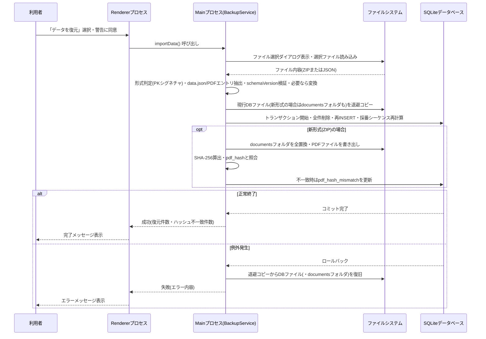
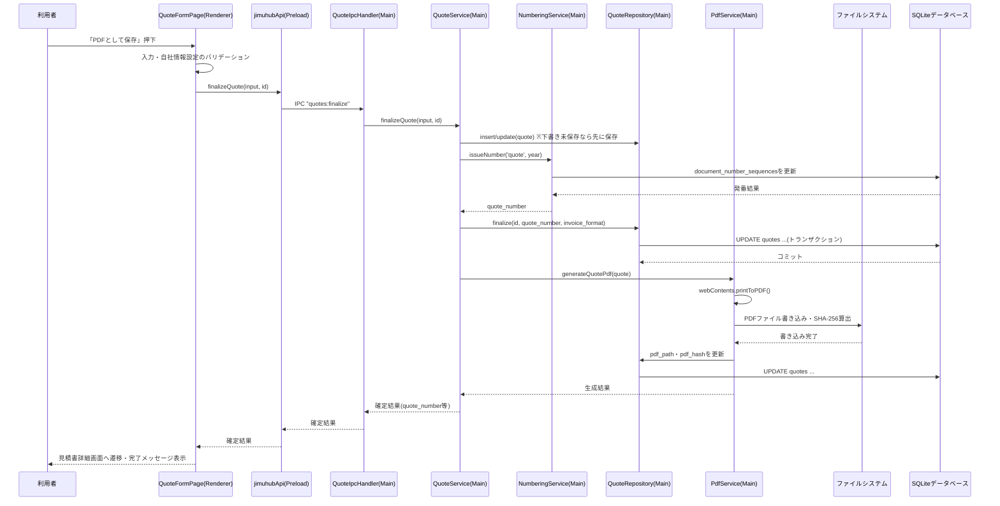
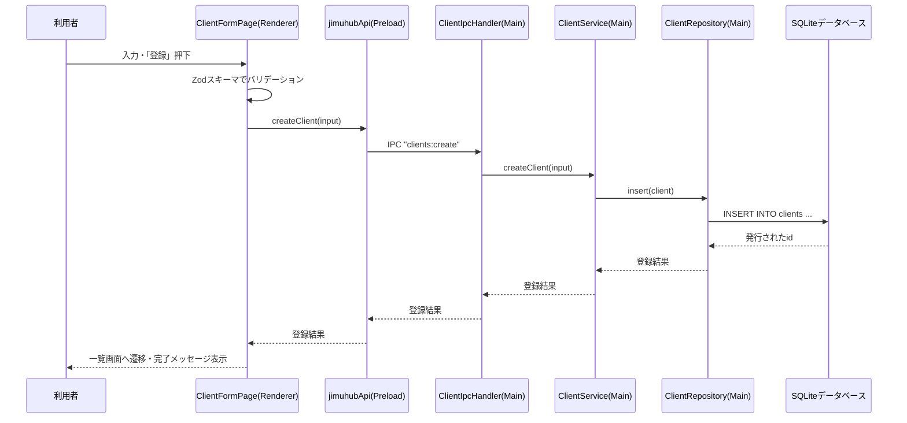
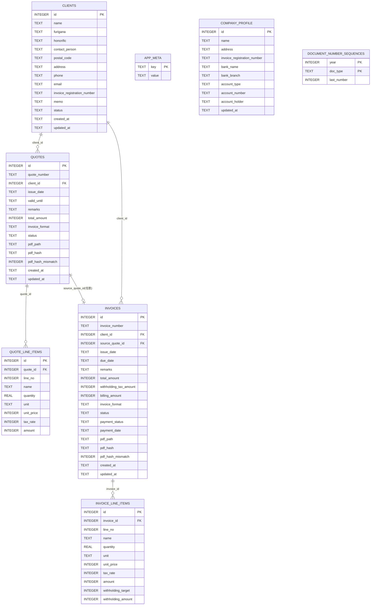

# 詳細設計書

## 1. 文書情報

- 作成日: 2026-09-26(初版)/ 2026-09-28(v1.1〜v1.3改訂)
- 版数: v1.3
- 対象イテレーション: イテレーション1(見積書・請求書作成)
- 参照元: 基本設計書.md v1.3(docs/03_architect)

## 2. 対象範囲

基本設計書2章〜4章で確定した内容(Electron + TypeScript + React + SQLiteの構成、アプリ基盤・取引先管理・見積書請求書関連の各画面)について、実装に落とし込める粒度まで具体化する。対象機能はF-01〜F-16(機能仕様書3章)である。案件管理・入出金経費・タスク管理は対象外とする。

基本設計書2章の技術方針(イテレーション0で確定したElectron+TypeScript+Reactおよび周辺技術、イテレーション1で確定したPDF生成方式・保存先・採番書式・端数処理・電子帳簿保存法対応・DBマイグレーション方式、v1.2で確定したエクスポート/復元ファイルの形式)、4章の画面構成は、いずれも各設計フェーズ着手前にユーザーへ事前確認・ご判断を経て確定した内容である(基本設計書8.1章★A・★B1〜★B9・★C1〜★C12・★D4参照)。本書は、これらの確定内容を前提として実装粒度まで具体化する。

## 3. 画面詳細設計

### 3.1 トップ画面(ダッシュボード)[F-01]

本画面に利用者が入力する項目はない。表示専用の情報(取引先の登録件数、見積書・請求書の件数、未収の請求書件数等)とメニュー導線のみで構成する。

**操作定義表**

| 操作 | 種別 | トリガー条件 | 対応する処理の節番号 |
|---|---|---|---|
| アプリ起動 | 画面初期表示 | アプリケーション起動時 | 4.1 |
| 「取引先管理」メニュー押下 | 画面遷移 | 常時活性 | 3.2 |
| 「見積書・請求書」メニュー押下 | 画面遷移 | 常時活性 | 3.10 |
| 「準備中」メニュー押下 | 案内表示 | 常時活性(以降のイテレーションで有効化予定) | - |
| 「データをエクスポート」押下 | ダイアログ表示 | 常時活性 | 3.6・4.2 |
| 「データを復元」押下 | ダイアログ表示 | 常時活性 | 3.7・4.3 |
| 「自社情報・振込先の設定」押下 | 画面遷移 | 常時活性 | 3.9・4.10 |

### 3.2 取引先一覧画面[F-05]

**入力項目定義表**

| 項目名 | UI要素 | 型・桁数 | 必須 | 初期値 | バリデーション |
|---|---|---|---|---|---|
| 検索キーワード | テキスト入力 | 文字列(上限100文字) | 任意 | 空欄 | 特になし(取引先名称に対する部分一致検索に使用) |
| 並べ替え条件 | セレクトボックス | 列挙値(フリガナ昇順/名称昇順/名称降順/登録日新しい順/登録日古い順) | 任意 | フリガナ昇順 | 列挙値以外は許容しない |
| 状態フィルタ | トグルスイッチ | 真偽値 | 任意 | OFF(利用中のみ表示) | - |

**操作定義表**

| 操作 | 種別 | トリガー条件 | 対応する処理の節番号 |
|---|---|---|---|
| 検索キーワード入力 | 一覧再取得 | 入力内容の変化時(即時反映) | 4.5 |
| 並べ替え条件変更 | 一覧再取得 | 選択変更時 | 4.5 |
| 状態フィルタ切り替え | 一覧再取得 | 切り替え時 | 4.5 |
| 「新規登録」ボタン押下 | 画面遷移 | 常時活性 | 3.3・4.4 |
| 一覧行クリック | 画面遷移 | 一覧に1件以上表示されている場合 | 3.4・4.6 |

### 3.3 取引先登録画面[F-04]

**入力項目定義表**

| 項目名 | UI要素 | 型・桁数 | 必須 | 初期値 | バリデーション |
|---|---|---|---|---|---|
| 取引先名称 | テキスト入力 | 文字列(1〜100文字) | 必須 | 空欄 | 前後の空白を除去した上で1文字以上100文字以内。空の場合はエラー |
| フリガナ | テキスト入力 | 文字列(0〜100文字) | 任意 | 空欄 | 100文字以内。全角カタカナを推奨表示するが、入力自体は妨げない(一覧の五十音順表示に使用) |
| 敬称 | セレクトボックス | 列挙値(御中/様/(なし)) | 任意 | (なし) | 列挙値以外は許容しない |
| 担当者名 | テキスト入力 | 文字列(0〜50文字) | 任意 | 空欄 | 50文字以内 |
| 郵便番号 | テキスト入力 | 文字列(0〜8文字) | 任意 | 空欄 | 入力がある場合、半角数字とハイフンのみ許容(例: 123-4567) |
| 住所 | テキスト入力(複数行可) | 文字列(0〜200文字) | 任意 | 空欄 | 200文字以内 |
| 電話番号 | テキスト入力 | 文字列(0〜20文字) | 任意 | 空欄 | 入力がある場合、数字・ハイフン・括弧のみ許容 |
| メールアドレス | テキスト入力 | 文字列(0〜254文字) | 任意 | 空欄 | 入力がある場合のみ「◯◯@◯◯」形式の簡易チェックを行う |
| インボイス登録番号 | テキスト入力 | 文字列(0〜14文字) | 任意 | 空欄 | 入力がある場合、「T」+数字13桁の形式を推奨表示するが、入力自体は妨げない |
| メモ | テキストエリア(複数行) | 文字列(0〜2000文字) | 任意 | 空欄 | 2000文字以内 |

**操作定義表**

| 操作 | 種別 | トリガー条件 | 対応する処理の節番号 |
|---|---|---|---|
| 「登録」ボタン押下 | 登録処理実行 | 常時活性(押下時にバリデーション実施) | 4.4 |
| バリデーションエラー時 | エラー表示 | 必須項目未入力・形式不正時 | 4.4・8章 |
| 「キャンセル」ボタン押下 | 画面遷移(破棄) | 常時活性 | 3.2 |

### 3.4 取引先詳細画面[F-06・F-08]

本画面に利用者が入力する項目はない。表示専用の全項目(フリガナ含む)と、編集・利用停止への導線で構成する。

**操作定義表**

| 操作 | 種別 | トリガー条件 | 対応する処理の節番号 |
|---|---|---|---|
| 画面表示 | 詳細取得 | 一覧または他画面からの遷移時 | 4.6 |
| 「編集」ボタン押下 | 画面遷移 | 対象が利用停止でない場合のみ活性 | 3.5・4.7 |
| 「利用停止にする」ボタン押下 | 確認ダイアログ表示 | 対象が利用中の場合のみ活性 | 4.8 |
| 確認ダイアログ「はい」押下 | 利用停止処理実行 | 確認ダイアログ表示中 | 4.8 |
| 確認ダイアログ「いいえ」押下 | ダイアログ閉じる(処理中断) | 確認ダイアログ表示中 | - |
| 「一覧へ戻る」押下 | 画面遷移 | 常時活性 | 3.2 |

### 3.5 取引先編集画面[F-07]

入力項目定義表は3.3(取引先登録画面、フリガナ含む)と同一の項目・型・バリデーションを用いる(共通フォームコンポーネントとして実装する)。既存値を初期値として画面表示する点のみ異なる。

**操作定義表**

| 操作 | 種別 | トリガー条件 | 対応する処理の節番号 |
|---|---|---|---|
| 「保存」ボタン押下 | 更新処理実行 | 常時活性(押下時にバリデーション実施) | 4.7 |
| バリデーションエラー時 | エラー表示 | 必須項目未入力・形式不正時 | 4.7・8章 |
| 「キャンセル」ボタン押下 | 画面遷移(破棄) | 常時活性 | 3.4 |

### 3.6 データエクスポート(ダイアログ)[F-02]

本画面に利用者が入力する項目はない(保存先パスはOS標準ダイアログで指定する)。

**操作定義表**

| 操作 | 種別 | トリガー条件 | 対応する処理の節番号 |
|---|---|---|---|
| 「エクスポート実行」ボタン押下 | OS標準保存ダイアログ表示 | 常時活性 | 4.2 |
| 保存先確定 | エクスポート処理実行 | 保存ダイアログでファイル名・保存先を確定した時 | 4.2 |
| 保存成功 | 完了メッセージ表示 | エクスポート処理成功時 | 4.2 |
| 保存失敗 | エラーメッセージ表示 | エクスポート処理失敗時 | 4.2・8章 |

### 3.7 データ復元(ダイアログ)[F-03]

本画面に利用者が入力する項目はない(復元対象ファイルはOS標準ダイアログで指定する)。

**操作定義表**

| 操作 | 種別 | トリガー条件 | 対応する処理の節番号 |
|---|---|---|---|
| 「ファイルを選択して復元」ボタン押下 | 警告ダイアログ表示 | 常時活性 | 4.3 |
| 警告ダイアログ「続行」押下 | OS標準ファイル選択ダイアログ表示 | 警告ダイアログ表示中 | 4.3 |
| ファイル選択確定 | 復元処理実行 | ファイル選択ダイアログで拡張子.zip(v1.2以降の新形式)または.json(v1.1以前の旧形式)のファイルを選択した時 | 4.3 |
| 復元成功 | 完了メッセージ表示・画面再読込 | 復元処理成功時 | 4.3 |
| 復元失敗 | エラーメッセージ表示 | 復元処理失敗時(ファイル不正・バージョン不整合・処理例外等) | 4.3・8章 |

### 3.8 起動エラー画面[F-09]

本画面に利用者が入力する項目はない(復元対象ファイルはOS標準ダイアログで指定する)。

**操作定義表**

| 操作 | 種別 | トリガー条件 | 対応する処理の節番号 |
|---|---|---|---|
| 画面表示 | エラー表示 | アプリ起動時にデータベース接続等に失敗した場合 | 4.1・4.9 |
| 「エクスポートファイルから復元する」ボタン押下 | 警告ダイアログ表示 | 常時活性 | 4.9 |
| 警告ダイアログ「続行」押下 | OS標準ファイル選択ダイアログ表示 | 警告ダイアログ表示中 | 4.9 |
| ファイル選択確定 | 復元処理実行 | ファイル選択ダイアログで拡張子.zip(v1.2以降の新形式)または.json(v1.1以前の旧形式)のファイルを選択した時 | 4.9 |
| 復元成功 | 完了メッセージ表示・再起動導線表示 | 復元処理成功時 | 4.9 |
| 「アプリを再起動」ボタン押下 | アプリ再起動 | 復元成功後 | 4.9 |
| 復元失敗 | エラーメッセージ表示 | 復元処理失敗時 | 4.9・8章 |

### 3.9 自社情報・振込先設定画面[F-10]

**入力項目定義表**

| 項目名 | UI要素 | 型・桁数 | 必須 | 初期値 | バリデーション |
|---|---|---|---|---|---|
| 氏名・屋号 | テキスト入力 | 文字列(1〜100文字) | 必須 | 空欄 | 前後の空白を除去した上で1文字以上100文字以内 |
| 住所 | テキスト入力(複数行可) | 文字列(1〜200文字) | 必須 | 空欄 | 1文字以上200文字以内 |
| インボイス登録番号 | テキスト入力 | 文字列(0〜14文字) | 任意 | 空欄 | 入力がある場合、「T」+数字13桁の形式を推奨表示するが、入力自体は妨げない |
| 振込先銀行名 | テキスト入力 | 文字列(0〜50文字) | 任意 | 空欄 | 50文字以内 |
| 振込先支店名 | テキスト入力 | 文字列(0〜50文字) | 任意 | 空欄 | 50文字以内 |
| 口座種別 | セレクトボックス | 列挙値(普通/当座) | 任意 | 未選択 | 列挙値以外は許容しない |
| 口座番号 | テキスト入力 | 文字列(0〜10文字) | 任意 | 空欄 | 入力がある場合、半角数字のみ推奨表示するが、入力自体は妨げない |
| 口座名義 | テキスト入力 | 文字列(0〜100文字) | 任意 | 空欄 | 100文字以内 |

**操作定義表**

| 操作 | 種別 | トリガー条件 | 対応する処理の節番号 |
|---|---|---|---|
| 画面表示 | 設定取得 | メニュー押下時、または見積書・請求書作成画面からの誘導時 | 4.10 |
| 「保存」ボタン押下 | 保存処理実行 | 常時活性(押下時にバリデーション実施) | 4.10 |
| バリデーションエラー時 | エラー表示 | 氏名・屋号または住所が未入力の場合 | 4.10・8章 |

### 3.10 見積書・請求書一覧画面[F-12・F-14]

**入力項目定義表**

| 項目名 | UI要素 | 型・桁数 | 必須 | 初期値 | バリデーション |
|---|---|---|---|---|---|
| タブ | タブ切替 | 列挙値(見積書/請求書) | 必須 | 見積書 | - |
| 発行日(開始・終了) | 日付入力 | 日付 | 任意 | 空欄 | 終了日が開始日より前の場合はエラー |
| 取引先 | セレクトボックス | 取引先マスタ参照 | 任意 | 未選択(すべて) | - |
| 金額(下限・上限) | 数値入力 | 整数(0以上) | 任意 | 空欄 | 上限が下限より小さい場合はエラー |
| 入金ステータス(請求書タブのみ) | セレクトボックス | 列挙値(すべて/未収/入金済み) | 任意 | すべて | 列挙値以外は許容しない |

**操作定義表**

| 操作 | 種別 | トリガー条件 | 対応する処理の節番号 |
|---|---|---|---|
| タブ切替 | 一覧再取得 | 切替時 | 4.12・4.14 |
| 検索条件入力・変更 | 一覧再取得 | 入力内容の変化時(即時反映) | 4.12・4.14 |
| 「見積書を新規作成」ボタン押下(見積書タブ) | 画面遷移 | 常時活性 | 3.11・4.12 |
| 「請求書を新規作成」ボタン押下(請求書タブ) | 画面遷移 | 常時活性 | 3.12・4.14 |
| 一覧行クリック | 画面遷移 | 一覧に1件以上表示されている場合 | 3.12・3.14 |

### 3.11 見積書作成画面[F-11・F-12]

**入力項目定義表**

| 項目名 | UI要素 | 型・桁数 | 必須 | 初期値 | バリデーション |
|---|---|---|---|---|---|
| 取引先 | セレクトボックス(利用中の取引先のみ) | 取引先マスタ参照 | 必須 | 未選択 | 未選択の場合はエラー |
| 発行日 | 日付入力 | 日付 | 必須 | 本日 | 未入力の場合はエラー |
| 有効期限 | 日付入力 | 日付 | 任意 | 空欄 | 発行日より前の日付は警告表示(保存は妨げない) |
| 備考 | テキストエリア | 文字列(0〜500文字) | 任意 | 空欄 | 500文字以内 |
| 明細行・品名 | テキスト入力 | 文字列(1〜100文字) | 必須(行ごと) | 空欄 | 1文字以上100文字以内 |
| 明細行・数量 | 数値入力 | 数値(小数第2位まで、0より大きい) | 必須(行ごと) | 1 | 0以下または数値以外はエラー |
| 明細行・単位 | テキスト入力 | 文字列(0〜10文字) | 任意 | 空欄 | 10文字以内 |
| 明細行・単価 | 数値入力 | 整数(0以上) | 必須(行ごと) | 0 | 負の数はエラー |
| 明細行・税率 | セレクトボックス | 列挙値(10%/8%) | 必須(行ごと) | 10% | 列挙値以外は許容しない |

**操作定義表**

| 操作 | 種別 | トリガー条件 | 対応する処理の節番号 |
|---|---|---|---|
| 「取引先を新規登録」リンク押下 | モーダル表示 | 常時活性 | 4.11 |
| 明細行「行を追加」押下 | 明細行追加 | 常時活性 | 4.12 |
| 明細行「削除」押下 | 明細行削除 | 明細行が2行以上ある場合のみ活性 | 4.12 |
| 明細行の入力変更 | 金額・税内訳・合計金額の再計算 | 入力内容の変化時 | 4.12 |
| 「下書き保存」ボタン押下 | 下書き保存処理実行 | 常時活性(押下時にバリデーション実施) | 4.12 |
| 「PDFとして保存」ボタン押下 | 確定処理実行 | 常時活性(押下時にバリデーション・自社情報設定チェックを実施) | 4.12 |
| バリデーションエラー時 | エラー表示 | 必須項目未入力時 | 4.12・8章 |
| 自社情報未設定で「PDFとして保存」押下 | エラー表示・設定画面導線表示 | 自社情報が未登録の場合 | 4.12・8章 |
| 「キャンセル」ボタン押下 | 画面遷移(破棄) | 常時活性 | 3.10・3.12 |

### 3.12 見積書詳細画面[F-12・F-13]

本画面に利用者が入力する項目はない。表示専用の全項目と、編集・PDF操作・請求書変換への導線で構成する。

**操作定義表**

| 操作 | 種別 | トリガー条件 | 対応する処理の節番号 |
|---|---|---|---|
| 画面表示 | 詳細取得 | 一覧または他画面からの遷移時 | 4.12 |
| 「編集」ボタン押下 | 画面遷移 | 状態が「下書き」の場合のみ活性 | 3.11・4.12 |
| 「PDFを開く」ボタン押下 | OS標準アプリ起動 | 状態が「PDF保存済み」の場合のみ活性 | 4.12 |
| 「Finderで表示」ボタン押下 | Finder起動 | 状態が「PDF保存済み」の場合のみ活性 | 4.12 |
| 「請求書に変換」ボタン押下 | 変換処理実行・画面遷移 | 状態が「PDF保存済み」の場合のみ活性 | 3.14・4.13 |
| 「一覧へ戻る」押下 | 画面遷移 | 常時活性 | 3.10 |

`pdf_hash_mismatch = 1`(復元時のハッシュ照合不一致。6.5章参照)の場合、画面表示時に「PDFファイルの改変が疑われます」という警告バッジを表示する。

### 3.13 請求書作成画面[F-11・F-13・F-14・F-16]

入力項目定義表は3.11(見積書作成画面)に準ずる。差分のみ記載する。

| 項目名 | UI要素 | 型・桁数 | 必須 | 初期値 | バリデーション |
|---|---|---|---|---|---|
| 支払期限(有効期限の代わり) | 日付入力 | 日付 | 任意 | 空欄 | 発行日より前の日付は警告表示(保存は妨げない) |
| 明細行・源泉徴収対象 | チェックボックス | 真偽値 | 任意(行ごと) | OFF | - |

**操作定義表**

3.11の操作定義表に加え、次を追加する。

| 操作 | 種別 | トリガー条件 | 対応する処理の節番号 |
|---|---|---|---|
| 明細行「源泉徴収対象」チェック変更 | 源泉徴収税額・請求金額の再計算 | チェック変更時 | 4.16 |

見積書からの変換(F-13)で遷移してきた場合、取引先・明細行・備考は変換元の値で初期表示され、他の操作定義表は3.11に準ずる。

### 3.14 請求書詳細画面[F-14・F-15]

本画面に利用者が入力する項目はない(入金日はステータス変更操作の一部として入力する)。

**入力項目定義表**

| 項目名 | UI要素 | 型・桁数 | 必須 | 初期値 | バリデーション |
|---|---|---|---|---|---|
| 入金日 | 日付入力 | 日付 | 必須(「入金済みにする」操作時のみ) | 本日 | 未入力の場合はエラー |

**操作定義表**

| 操作 | 種別 | トリガー条件 | 対応する処理の節番号 |
|---|---|---|---|
| 画面表示 | 詳細取得 | 一覧または他画面からの遷移時 | 4.14 |
| 「編集」ボタン押下 | 画面遷移 | 状態が「下書き」の場合のみ活性 | 3.13・4.14 |
| 「PDFを開く」「Finderで表示」ボタン押下 | 3.12に準ずる | 状態が「PDF保存済み」の場合のみ活性 | 4.14 |
| 「入金済みにする」ボタン押下 | 入金日入力欄表示 | 入金ステータスが「未収」の場合のみ活性 | 4.15 |
| 入金日確定 | 入金ステータス更新処理実行 | 入金日入力後 | 4.15 |
| 「未収に戻す」ボタン押下 | 確認ダイアログ表示 | 入金ステータスが「入金済み」の場合のみ活性 | 4.15 |
| 確認ダイアログ「はい」押下 | 入金ステータス更新処理実行 | 確認ダイアログ表示中 | 4.15 |
| 「元の見積書を見る」リンク押下 | 画面遷移 | 元見積書が存在する場合のみ活性 | 3.12 |
| 「一覧へ戻る」押下 | 画面遷移 | 常時活性 | 3.10 |

`pdf_hash_mismatch = 1`(復元時のハッシュ照合不一致。6.7章参照)の場合、画面表示時に「PDFファイルの改変が疑われます」という警告バッジを表示する。

## 4. 処理フロー設計

### 4.1 F-01 アプリ起動・基本画面

1. Electronのアプリ起動イベントを受け、Mainプロセスが`Database.initialize()`を実行する。データベースファイルが存在しない場合は新規作成し、6章のテーブル定義に基づきテーブルを作成する
2. `app_meta`テーブルから`schema_version`を取得する。現行バージョン(`3`)より小さい場合は`MigrationService.applyMigrations(fromVersion)`を実行し、6章の差分(`fromVersion`が`1`未満の場合は`clients.furigana`列の追加、`company_profile`・`quotes`・`quote_line_items`・`invoices`・`invoice_line_items`・`document_number_sequences`テーブルの作成〔schema_version 1→2〕、`fromVersion`が`2`未満の場合は`quotes.pdf_hash_mismatch`・`invoices.pdf_hash_mismatch`列の追加〔schema_version 2→3〕)を順次適用した上で`schema_version`を`3`に更新する
3. Rendererプロセスを起動し、preload経由で`clients:list`(状態フィルタ=利用中のみ)、`quotes:list`・`invoices:list`(サマリー件数取得用)をMainへ要求する
4. トップ画面を表示し、サイドメニュー(取引先管理・見積書請求書は活性、その他は準備中表示)と、取得した各件数(取引先件数、見積書・請求書件数、未収の請求書件数)を表示する
5. 手順1〜3でエラーが発生した場合(データベースファイル破損・読み込み権限なし等)は、起動エラー画面(3.8・4.9章)を表示する

### 4.2 F-02 データエクスポート(手動バックアップ)

1. 利用者がトップ画面またはメニューから「データをエクスポート」を選択する
2. Rendererが`window.jimuhubApi.exportData()`を呼び出し、Mainプロセスが`dialog.showSaveDialog`を表示する。初期表示フォルダは「書類」、初期ファイル名は`事務HUB_backup_YYYYMMDD_HHmm.zip`とする(基本設計書8.1章★D4により、v1.2からZIP形式に変更)
3. 利用者が保存先・ファイル名を確定する
4. `BackupService.exportData(filePath)`が、現在のデータベース全体(`clients`・`company_profile`・`quotes`・`quote_line_items`・`invoices`・`invoice_line_items`の全レコード)を読み出し、次の構造の`data.json`を生成する

   ```json
   {
     "schemaVersion": 3,
     "appVersion": "0.3.0",
     "exportedAt": "2026-09-28T12:00:00+09:00",
     "data": {
       "clients": [ { "id": 1, "name": "…", "furigana": "…", "honorific": "…", "status": "active", "createdAt": "…", "updatedAt": "…" } ],
       "companyProfile": { "id": 1, "name": "…", "address": "…", "invoiceRegistrationNumber": null, "bankName": null, "bankBranch": null, "accountType": null, "accountNumber": null, "accountHolder": null, "updatedAt": "…" },
       "quotes": [ { "id": 1, "quoteNumber": "2026-001", "clientId": 1, "issueDate": "…", "status": "finalized", "pdfPath": "…", "pdfHash": "…", "pdfHashMismatch": false, "…": "…" } ],
       "quoteLineItems": [ { "id": 1, "quoteId": 1, "lineNo": 1, "name": "…", "quantity": 1, "unitPrice": 10000, "taxRate": 10, "amount": 10000 } ],
       "invoices": [ "…quotesと同様の構造に、支払期限・源泉徴収税額・入金ステータス等を加えたもの" ],
       "invoiceLineItems": [ "…quoteLineItemsと同様の構造に、源泉徴収対象・源泉徴収税額を加えたもの" ]
     }
   }
   ```

5. `quotes`・`invoices`の各レコードのうち`pdf_path`が設定されているもの(状態が「PDF保存済み」のもの)について、`pdf_path`が指す実ファイルを`~/Library/Application Support/事務HUB/documents/`配下から列挙する
6. `AdmZip`(`adm-zip`ライブラリ)を用いて、手順4の`data.json`と、手順5で列挙した各PDFファイルを1つのZIPアーカイブへまとめる。ZIP内のPDFファイルのパスは、`pdf_path`から`~/Library/Application Support/事務HUB/documents/`を除いた相対パス(例: `documents/quotes/2026/2026-001_取引先名.pdf`)をそのまま用いる(基本設計書8.1章★D4)
7. 生成したZIPファイルを指定パスへ書き込む
8. 書き込み成功時は保存先パスを含む完了メッセージを表示する。失敗時(権限不足・空き容量不足等)は8章のエラー内容に従いエラーメッセージを表示する

想定容量: PDFファイル1件あたり数十〜数百KB程度、見積書・請求書は年間で数十〜数百件規模(基本設計書7章「性能」)を想定しても、エクスポートファイル全体でおおむね数十MB程度に収まる見込みである。

### 4.3 F-03 データ復元

1. 利用者が「データを復元」を選択し、警告ダイアログ(現在のデータがエクスポートファイルの内容で置き換わる旨)に同意する
2. Mainプロセスが`dialog.showOpenDialog`(拡張子`.zip`・`.json`でフィルタ)を表示し、利用者がファイルを選択する
3. 選択ファイルの先頭バイトを読み取り、ZIP形式のシグネチャ(`PK`)であるかどうかでファイル形式を判定する(`BackupService.detectFormat(filePath)`)
   - **新形式(ZIP、v1.2以降のエクスポートファイル)の場合**: `AdmZip`でアーカイブを展開し、`data.json`エントリをJSONとしてパースする。あわせて`documents/`配下の各PDFエントリをメモリ上に保持する
   - **旧形式(JSON単体、v1.1以前のエクスポートファイル。PDFファイルの実体を含まない)の場合**: ファイル全体をテキストとして読み込み、JSONとしてパースする。以降の手順のうちPDFファイルに関する処理(手順7)は行わない
   - いずれの場合もパース失敗時は処理を中断し、エラー表示する(8章)
4. パース結果の`schemaVersion`を検証する
   - 現在のアプリが対応する最新バージョン(`3`)より大きい場合: 「アプリのバージョンが古いため復元できません」と表示し中断する
   - 現在より小さい場合: `MigrationService.migrateExportData(data, fromVersion)`で現行バージョンの構造まで順次変換する(`schemaVersion: 1`のファイルは`furigana`・`companyProfile`・見積書請求書関連データが存在しないものとして、`schemaVersion: 2`のファイルは`pdfHashMismatch`が存在しないものとして扱う)
   - 一致する場合: そのまま次へ進む
5. 復元の実行前に、現在のデータベースファイルをタイムスタンプ付きで`backups/`フォルダへ退避コピーする(直近3世代のみ保持し、それより古い世代は自動削除する)。新形式(ZIP)の復元の場合は、あわせて現在の`documents/`フォルダ全体も同様にタイムスタンプ付きで退避コピーする(直近3世代のみ保持)
6. トランザクションを開始し、`clients`・`company_profile`・`quotes`・`quote_line_items`・`invoices`・`invoice_line_items`の各テーブルの全件を削除した上で、JSON内の各レコードをIDを保持したままINSERTする(見積書・請求書が取引先IDを参照するため、IDの振り直しは行わない)。あわせて`document_number_sequences`テーブルも、復元後の`quotes`・`invoices`の最大採番値から再計算して更新する
7. 新形式(ZIP)の復元の場合、手順6のコミット前に次を行う(`BackupService.restorePdfFiles(entries)`)
   1. 現在の`~/Library/Application Support/事務HUB/documents/`フォルダ配下を全て削除する(全置換方式。孤立したPDFファイルを残さないため)
   2. 手順3で保持したPDFエントリを、それぞれZIP内の相対パスのまま`~/Library/Application Support/事務HUB/documents/`配下へ書き出す(ディレクトリが存在しない場合は作成する)
   3. 書き出した各PDFファイルのSHA-256ハッシュを算出し、復元した`quotes.pdf_hash`・`invoices.pdf_hash`と照合する。一致しない場合は、当該レコードの`pdf_hash_mismatch`列を`1`に更新する(6.5・6.7章参照)。復元処理自体は中断せず、当該書類への個別警告表示に留める(基本設計書8.1章★D5にて確定)
   4. 旧形式(JSON単体)の復元の場合は、本手順(7)を行わず`documents/`フォルダには一切手を加えない
8. トランザクションが正常終了した場合はコミットし、復元件数(新形式の場合はハッシュ不一致件数を含む)を含む完了メッセージを表示し、一覧等の表示を最新化する
9. 手順6〜7で例外が発生した場合はトランザクションをロールバックし、手順5で作成した退避コピー(データベースファイル、新形式の場合は`documents/`フォルダも)から復旧する。「復元に失敗しました。データは復元前の状態に戻しました」と表示する(8章)
10. 旧形式(JSON単体)を復元した場合、復元後に状態が「PDF保存済み」の見積書・請求書のうち`pdf_path`が指すファイルが存在しないものは、詳細画面表示時に「PDFファイルが見つかりません」という案内を表示する(8章)

**シーケンス図(F-03の全体像)**



### 4.4 F-04 取引先の登録

1. 一覧画面で「新規登録」ボタンを押下し、取引先登録画面を表示する(敬称の初期値は「(なし)」、その他は空欄)
2. 利用者が各項目(フリガナ含む)を入力する
3. 「登録」ボタン押下時、Renderer側でZodスキーマによるバリデーションを実施する
4. バリデーションNGの場合、該当項目にエラーメッセージを表示し処理を中断する(8章)
5. バリデーションOKの場合、`window.jimuhubApi.createClient(input)`を呼び出す
6. Mainプロセスの`ClientService.createClient(input)`が、`ClientRepository.insert()`を通じて`clients`テーブルへINSERTする(`status`は`active`、`created_at`・`updated_at`は現在日時)
7. 発行された取引先IDを含む登録結果をRendererへ返却する
8. 一覧画面へ遷移し、登録した取引先を反映した一覧を表示するとともに、完了メッセージを表示する

### 4.5 F-05 取引先の一覧表示

1. 一覧画面の表示時、または検索キーワード・並べ替え条件・状態フィルタの変更時に、`window.jimuhubApi.listClients(filter)`を呼び出す(`filter`は`keyword`・`sort`・`statusFilter`を含む)
2. `ClientRepository.findAll(filter)`が、次の条件でSQLを実行する
   - `name`に`keyword`を含むレコードのみ抽出(部分一致)
   - `statusFilter`が「利用中のみ」の場合は`status = 'active'`を追加
   - `sort`が`furigana_asc`(既定)の場合、`furigana`が`NULL`または空文字のレコードを末尾にまとめた上で`furigana ASC`で並べ替える(SQLでは`ORDER BY (furigana IS NULL OR furigana = '') ASC, furigana ASC`のように、フリガナ有無を優先キーとした2段階の`ORDER BY`で実現する)
   - `sort`がその他の場合は`ORDER BY name ASC/DESC`または`ORDER BY created_at DESC/ASC`を指定する
3. 取得結果を一覧テーブルへ反映する。0件の場合は「該当する取引先がありません」と案内文言を表示する
4. 「利用停止」の取引先は、状態フィルタが「すべて表示」の場合のみ行を表示し、状態バッジ・グレー表示で区別する

### 4.6 F-06 取引先の参照(詳細表示)

1. 一覧の行クリックまたは他画面からの遷移時、`window.jimuhubApi.getClient(id)`を呼び出す
2. `ClientRepository.findById(id)`でレコードを取得する。該当レコードが存在しない場合はエラー表示する(8章)
3. 取得した全項目(フリガナ含む)を詳細画面へ表示する。状態が「利用停止」の場合はその旨のバッジを表示する

### 4.7 F-07 取引先の更新

1. 詳細画面の「編集」ボタン押下で編集画面を表示する(現在値を初期表示)
2. 利用者が項目を修正し、「保存」ボタンを押下する。Renderer側で3.3と同一のZodスキーマによるバリデーションを実施する
3. バリデーションNGの場合は該当項目にエラーメッセージを表示し中断する(8章)
4. バリデーションOKの場合、`window.jimuhubApi.updateClient(id, input)`を呼び出す
5. `ClientService.updateClient(id, input)`が`ClientRepository.update()`を通じてUPDATEを実行する。`updated_at`を現在日時に更新し、`id`は変更しない
6. 詳細画面へ戻り、更新内容を反映して表示するとともに、完了メッセージを表示する

### 4.8 F-08 取引先の削除(利用停止)

1. 詳細画面の「利用停止にする」ボタン押下で、確認ダイアログ(「本当に利用停止にしますか」)を表示する
2. 「はい」選択時、`window.jimuhubApi.deactivateClient(id)`を呼び出す
3. `ClientService.deactivateClient(id)`が`ClientRepository.updateStatus(id, 'inactive')`を実行し、`status`を`inactive`、`updated_at`を現在日時に更新する
4. 一覧・詳細画面の表示を最新化し、状態バッジを反映する(既定の状態フィルタでは一覧から非表示になる)
5. 「いいえ」選択時は何も処理を行わず、ダイアログを閉じる
6. 利用停止にした取引先に紐づく既存の見積書・請求書データ・保存済みPDFの内容には影響しない。以降、見積書・請求書作成画面(4.12・4.13)の取引先選択欄には、当該取引先は表示されなくなる(取引先選択欄は`clients:list`を状態フィルタ=利用中のみで呼び出すため)

### 4.9 F-09 起動エラー画面からのデータ復元

1. 4.1章の手順5でエラーが発生した場合、Rendererは起動エラー画面(`StartupErrorPage`)を表示する
2. 利用者が「エクスポートファイルから復元する」ボタンを押下すると、4.3章のF-03と同一の`importData()`処理を、起動エラー画面のコンテキストから呼び出す(手順2〜7は4.3章に準ずる。新形式・旧形式いずれのエクスポートファイルにも対応する)
3. 復元処理が成功した場合、「復元が完了しました。アプリを再起動してください」と表示し、「アプリを再起動」ボタンを表示する
4. 「アプリを再起動」ボタン押下時、Mainプロセスが`app.relaunch()`・`app.exit(0)`を呼び出し、アプリケーションを再起動する
5. 復元処理が失敗した場合、4.3章手順9と同様のエラーメッセージを起動エラー画面上に表示し、再度ファイルを選び直せる状態を維持する

### 4.10 F-10 自社情報・振込先の設定

1. 自社情報・振込先設定画面の表示時、`window.jimuhubApi.getCompanyProfile()`を呼び出し、既存設定があれば初期表示する(未設定の場合は全項目空欄)
2. 利用者が各項目を入力し、「保存」ボタンを押下する。Renderer側でZodスキーマにより氏名・屋号、住所の必須チェックを行う
3. バリデーションNGの場合、該当項目にエラーメッセージを表示し中断する(8章)
4. バリデーションOKの場合、`window.jimuhubApi.saveCompanyProfile(input)`を呼び出す
5. `CompanyService.saveProfile(input)`が`CompanyProfileRepository.upsert(profile)`を通じて`company_profile`テーブル(`id`固定=1)へ`INSERT ... ON CONFLICT(id) DO UPDATE`を実行する
6. 保存結果を返却し、完了メッセージを表示する。見積書・請求書作成画面からの遷移であった場合は遷移元へ戻る

### 4.11 F-11 取引先の簡易登録

1. 見積書・請求書作成画面で「取引先を新規登録」リンクを押下し、簡易登録モーダルを表示する(入力項目は取引先名称のみ)
2. 「登録」ボタン押下時、F-04(4.4章)と同一の`createClient()`処理を、取引先名称のみを指定して呼び出す(他項目は未指定のままDBの`NULL`/既定値で登録される)
3. 登録成功後、モーダルを閉じ、作成画面の取引先選択欄に当該取引先を選択済みの状態で反映する
4. 必須項目(取引先名称)未入力時はF-04に準じエラー表示し登録を行わない
5. 簡易登録された取引先は、他の取引先と区別する表示は設けず、以降は取引先管理画面(F-07)から通常の取引先と同様に内容を補完・修正できる(要件定義書10.2章R-5)

### 4.12 F-12 見積書の作成・PDF保存

1. 見積書作成画面の表示時、取引先選択欄には`clients:list`(状態フィルタ=利用中のみ)の結果を表示する。新規作成の場合は発行日の初期値を本日とする
2. 利用者が取引先・発行日・明細行(品名・数量・単位・単価・税率)等を入力する。明細行の変更のたびに、Renderer側で`TaxCalculationService`と同一のロジック(共通関数として実装し、Main側の確定処理と計算式を一致させる)により、次を再計算して画面表示する
   - 行金額 = `quantity × unit_price`(円未満切り捨て)
   - 税率区分(10%/8%)ごとの小計 = 当該税率の行金額の合計
   - 税率区分ごとの消費税額 = `floor(小計 × 税率)`(区分ごとに1回のみ計算。要件定義書10.2章R-7、基本設計書2.2章)
   - 合計金額 = 全行の小計合計 + 消費税額合計
3. 「下書き保存」ボタン押下時、Renderer側でZodスキーマにより取引先必須・発行日必須・明細行1行以上・各行の品名必須を検証する。NGの場合は該当項目にエラー表示し中断する
4. バリデーションOKの場合、`window.jimuhubApi.saveQuoteDraft({ id?, ...input })`を呼び出す。`QuoteService.saveDraft(input, id?)`が、`id`未指定なら`QuoteRepository.insert()`で新規INSERT、指定ありなら`QuoteRepository.update()`でUPDATEを行う(`quotes`テーブルと`quote_line_items`テーブルをトランザクション内で更新。`quote_number`は`NULL`のまま、`status`は`draft`)
5. 保存後、見積書詳細画面へ遷移する
6. 「PDFとして保存」ボタン押下時、手順3と同じバリデーションに加え、`window.jimuhubApi.getCompanyProfile()`の結果が未設定(レコードなし)の場合はエラーメッセージ「自社情報が未設定です。先に自社情報を設定してください」を表示し中断する(自社情報・振込先設定画面4.10への導線を表示)
7. バリデーションOKの場合、`window.jimuhubApi.finalizeQuote({ id?, ...input })`を呼び出す。`QuoteService.finalizeQuote(input, id?)`は次の処理をトランザクション内で行う
   1. 未保存の場合は手順4と同様にまず下書きとしてINSERT/UPDATEする
   2. `NumberingService.issueNumber('quote', issueDateの西暦年)`を呼び出し、`DocumentNumberSequenceRepository.nextNumber('quote', year)`により`document_number_sequences`テーブルの該当年・種別の`last_number`をインクリメントし、`` `${year}-${String(next).padStart(3, '0')}` ``形式の書類番号を発番する(基本設計書2.2章★C4)
   3. 自社の`company_profile.invoice_registration_number`の設定有無により`invoice_format`(`qualified`/`classified`)を決定する
   4. `quotes`テーブルの`quote_number`・`invoice_format`・`status`(`finalized`)・税額等の最終計算値を更新する
8. トランザクションのコミット後、`PdfService.generateQuotePdf(quote)`を呼び出す。`PdfService`は見積書表示用のHTMLをレンダリングした非表示の`BrowserWindow`を生成し、`webContents.printToPDF()`でPDFバッファを取得する(基本設計書2.2章★C1)
9. 生成したPDFバッファを`~/Library/Application Support/事務HUB/documents/quotes/<西暦年>/<quote_number>_<取引先名称>.pdf`へ書き込む。書き込んだファイルのSHA-256ハッシュを算出し、`quotes.pdf_path`・`quotes.pdf_hash`を更新する(基本設計書2.2章★C3・★C7)
10. 手順8〜9で例外が発生した場合は、手順7で確定した採番・ステータス変更をロールバックし、「PDFの保存に失敗しました」とエラー表示する(8章)
11. 正常終了時は見積書詳細画面へ遷移し、完了メッセージ・「Finderで表示」導線を表示する

**シーケンス図(F-12 PDFとして保存の全体像)**



### 4.13 F-13 見積書から請求書への変換

1. 見積書詳細画面(状態=PDF保存済み)で「請求書に変換」ボタンを押下すると、`window.jimuhubApi.convertQuoteToInvoice(quoteId)`を呼び出す
2. `InvoiceService.convertFromQuote(quoteId)`が、対象見積書と明細行を取得し、`invoices`テーブルへ新規INSERTする(`client_id`・`remarks`・明細行の品名/数量/単位/単価/税率をそのままコピーし、`source_quote_id`に変換元の見積書IDを設定、`issue_date`は本日、`due_date`は空欄、`status`は`draft`、明細行の`withholding_target`は既定で`false`)
3. 取引先が変換時点で利用停止状態であっても、変換処理自体は制限しない(見積書時点のデータをそのまま引き継ぐ)
4. 同一の見積書から複数回変換した場合も、その都度新しい請求書を作成する(重複作成を許容する)
5. 作成した請求書の詳細画面(3.14)へ遷移する。以降の編集・源泉徴収指定・PDF保存はF-14(4.14章)に従う

### 4.14 F-14 請求書の作成・PDF保存

1. 4.12章の見積書と同様の流れで、取引先・発行日・支払期限(任意)・明細行を入力する。明細行には「源泉徴収対象」チェックボックスがあり、チェックされた行は4.16章のロジックにより行ごとの源泉徴収税額を計算する
2. 消費税額の計算(税率区分ごとに1回、円未満切り捨て)は4.12章手順2に準ずる。あわせて源泉徴収税額の合計を算出し、請求金額(合計金額−源泉徴収税額合計)を画面表示する
3. 「下書き保存」「PDFとして保存」ボタンの処理は4.12章手順3〜11に準ずる。ただし`QuoteService`の代わりに`InvoiceService`、`quotes`/`quote_line_items`テーブルの代わりに`invoices`/`invoice_line_items`テーブルを用い、PDF保存先フォルダは`~/Library/Application Support/事務HUB/documents/invoices/<西暦年>/`を使用し、`NumberingService.issueNumber('invoice', year)`で請求書用の連番系列から発番する
4. 見積書からの変換(F-13)で作成された請求書の場合、初期表示は変換時点の内容とし、以降は本フローに従い通常どおり編集・PDF保存できる

### 4.15 F-15 請求書の入金ステータス管理

1. 請求書詳細画面で「入金済みにする」ボタンを押下すると、入金日入力欄(初期値は本日)を表示する
2. 入金日を確定し「確定」を押下すると、`window.jimuhubApi.updateInvoicePaymentStatus(id, { paymentStatus: 'paid', paymentDate })`を呼び出す
3. `InvoiceService.updatePaymentStatus(id, input)`が`InvoiceRepository.updatePaymentStatus()`を通じて`payment_status`を`paid`、`payment_date`を指定日、`updated_at`を現在日時に更新する
4. 「未収に戻す」ボタン押下時は確認ダイアログの「はい」選択後、`updateInvoicePaymentStatus(id, { paymentStatus: 'unpaid', paymentDate: null })`を呼び出し、`payment_status`を`unpaid`、`payment_date`を`NULL`に更新する
5. 更新後、請求書詳細画面・一覧画面の表示を最新化する

### 4.16 F-16 源泉徴収税額の計算

1. 明細行ごとに「源泉徴収対象」が指定されている場合、`TaxCalculationService.calculateWithholdingTax(amount)`を呼び出す(`amount`は当該行の金額=税抜)
2. 計算式(要件定義書10.2章R-11、基本設計書2.2章★C6により円未満切り捨て)

   ```text
   amount <= 1,000,000 の場合: floor(amount × 0.1021)
   amount >  1,000,000 の場合: floor(1,000,000 × 0.1021 + (amount - 1,000,000) × 0.2042)
   ```

3. 各行の計算結果を`invoice_line_items.withholding_amount`に格納し、`invoices.withholding_tax_amount`にはその合計値を格納する
4. 請求金額(`billing_amount`)は`total_amount - withholding_tax_amount`として算出し、請求書画面・PDFへ反映する

## 5. クラス設計

ローカル専用の小規模アプリではあるが、以降のイテレーションでの機能追加(テーブル・画面の追加)を見据え、Presentation・IPC・Application Service・Repository・Infrastructureの5層に分離する構成をイテレーション0から継続する。

| 責務レイヤ | クラス/モジュール名 | 責務 | 主なメソッド | 関連処理フロー |
|---|---|---|---|---|
| Presentation(Renderer) | `TopPage` | トップ画面の表示・各機能への導線 | `render()` | 4.1 |
| Presentation(Renderer) | `ClientListPage` | 取引先一覧の表示、検索・並べ替え(フリガナ昇順既定)・フィルタのUI制御 | `render()`, `handleSearch()`, `handleSortChange()`, `handleStatusFilterChange()` | 4.5 |
| Presentation(Renderer) | `ClientFormPage` | 取引先の新規登録・編集共通フォーム(フリガナ含む) | `render()`, `validate()`, `handleSubmit()` | 4.4, 4.7 |
| Presentation(Renderer) | `ClientDetailPage` | 取引先詳細の表示、編集・利用停止への導線 | `render()`, `handleDeactivate()` | 4.6, 4.8 |
| Presentation(Renderer) | `ExportDialog` | エクスポート操作のUIと結果表示 | `handleExport()` | 4.2 |
| Presentation(Renderer) | `ImportDialog` | 復元操作の確認・ファイル選択・結果表示 | `handleImport()` | 4.3 |
| Presentation(Renderer) | `StartupErrorPage` | 起動エラー画面の表示、復元導線、再起動操作 | `render()`, `handleRestore()`, `handleRelaunch()` | 4.9 |
| Presentation(Renderer) | `CompanyProfilePage` | 自社情報・振込先の表示・編集 | `render()`, `validate()`, `handleSubmit()` | 4.10 |
| Presentation(Renderer) | `DocumentListPage` | 見積書・請求書一覧(タブ切替・検索絞り込み) | `render()`, `handleTabChange()`, `handleSearch()` | 4.12, 4.14 |
| Presentation(Renderer) | `QuoteFormPage` | 見積書の新規作成・編集フォーム(取引先選択、明細行入力、税計算表示、簡易登録導線) | `render()`, `recalculate()`, `handleSaveDraft()`, `handleFinalize()` | 4.11, 4.12 |
| Presentation(Renderer) | `QuoteDetailPage` | 見積書詳細の表示、請求書への変換導線 | `render()`, `handleConvertToInvoice()` | 4.12, 4.13 |
| Presentation(Renderer) | `InvoiceFormPage` | 請求書の新規作成・編集フォーム(源泉徴収対象指定を含む) | `render()`, `recalculate()`, `handleSaveDraft()`, `handleFinalize()` | 4.11, 4.14, 4.16 |
| Presentation(Renderer) | `InvoiceDetailPage` | 請求書詳細の表示、入金ステータス変更 | `render()`, `handleUpdatePaymentStatus()` | 4.14, 4.15 |
| IPC(Preload) | `jimuhubApi`(`preload.ts`) | contextBridgeでRendererに安全なAPIのみを公開する | `listClients()`, `getClient()`, `createClient()`, `updateClient()`, `deactivateClient()`, `exportData()`, `importData()`, `getCompanyProfile()`, `saveCompanyProfile()`, `listQuotes()`, `getQuote()`, `saveQuoteDraft()`, `finalizeQuote()`, `convertQuoteToInvoice()`, `openQuotePdf()`, `showQuotePdfInFolder()`, `listInvoices()`, `getInvoice()`, `saveInvoiceDraft()`, `finalizeInvoice()`, `updateInvoicePaymentStatus()`, `openInvoicePdf()`, `showInvoicePdfInFolder()` | 全機能共通 |
| IPC(Main) | `ClientIpcHandler` | `clients:*`チャンネルを受信し`ClientService`を呼び出す | `registerHandlers()` | 4.4〜4.8 |
| IPC(Main) | `DataIpcHandler` | `data:export`・`data:import`チャンネルを受信し`BackupService`を呼び出す | `registerHandlers()` | 4.2, 4.3, 4.9 |
| IPC(Main) | `CompanyIpcHandler` | `company:*`チャンネルを受信し`CompanyService`を呼び出す | `registerHandlers()` | 4.10 |
| IPC(Main) | `QuoteIpcHandler` | `quotes:*`チャンネルを受信し`QuoteService`を呼び出す | `registerHandlers()` | 4.12, 4.13 |
| IPC(Main) | `InvoiceIpcHandler` | `invoices:*`チャンネルを受信し`InvoiceService`を呼び出す | `registerHandlers()` | 4.14〜4.16 |
| Application Service(Main) | `ClientService` | 取引先に関する業務ロジック(サーバー側バリデーション含む) | `listClients(filter)`, `getClient(id)`, `createClient(input)`, `updateClient(id, input)`, `deactivateClient(id)` | 4.4〜4.8, 4.11 |
| Application Service(Main) | `BackupService` | エクスポート・復元(ZIP形式・旧JSON形式の双方)の一連の処理を統括する | `exportData(filePath)`, `importData(filePath)`, `detectFormat(filePath)`, `restorePdfFiles(entries)` | 4.2, 4.3, 4.9 |
| Application Service(Main) | `MigrationService` | データベース・エクスポートデータのスキーマバージョン差異を吸収する | `applyMigrations(fromVersion)`, `migrateExportData(data, fromVersion)` | 4.1, 4.3 |
| Application Service(Main) | `CompanyService` | 自社情報・振込先の取得・保存 | `getProfile()`, `saveProfile(input)` | 4.10 |
| Application Service(Main) | `QuoteService` | 見積書の一覧・取得・下書き保存・確定(採番・PDF生成)・請求書への変換 | `listQuotes(filter)`, `getQuote(id)`, `saveDraft(input, id?)`, `finalizeQuote(input, id?)`, `convertToInvoice(quoteId)` | 4.12, 4.13 |
| Application Service(Main) | `InvoiceService` | 請求書の一覧・取得・下書き保存・確定(採番・PDF生成)・入金ステータス変更 | `listInvoices(filter)`, `getInvoice(id)`, `saveDraft(input, id?)`, `finalizeInvoice(input, id?)`, `updatePaymentStatus(id, input)` | 4.14〜4.16 |
| Application Service(Main) | `TaxCalculationService` | 消費税額(税率区分ごと)・源泉徴収税額の計算ロジック(見積書・請求書共通) | `calculateLineAmount(quantity, unitPrice)`, `calculateTaxByRate(lines)`, `calculateWithholdingTax(amount)` | 4.12, 4.14, 4.16 |
| Application Service(Main) | `NumberingService` | 見積書・請求書番号の採番(暦年ごと・種別ごとの連番管理) | `issueNumber(docType, year)` | 4.12, 4.14 |
| Application Service(Main) | `PdfService` | 見積書・請求書のPDF生成(`printToPDF`)・保存・ハッシュ算出 | `generateQuotePdf(quote)`, `generateInvoicePdf(invoice)` | 4.12, 4.14 |
| Repository(Main) | `ClientRepository` | `clients`テーブルへのCRUDアクセス(フリガナ含む) | `findAll(filter)`, `findById(id)`, `insert(client)`, `update(client)`, `updateStatus(id, status)` | 4.4〜4.8, 4.11 |
| Repository(Main) | `AppMetaRepository` | `app_meta`テーブル(`schema_version`等)へのアクセス | `get(key)`, `set(key, value)` | 4.1, 4.3 |
| Repository(Main) | `CompanyProfileRepository` | `company_profile`テーブル(単一レコード)へのアクセス | `get()`, `upsert(profile)` | 4.10 |
| Repository(Main) | `QuoteRepository` | `quotes`・`quote_line_items`テーブルへのアクセス(集約単位でトランザクション更新) | `findAll(filter)`, `findById(id)`, `insert(quote)`, `update(quote)`, `finalize(id, number, format)` | 4.12, 4.13 |
| Repository(Main) | `InvoiceRepository` | `invoices`・`invoice_line_items`テーブルへのアクセス(集約単位でトランザクション更新) | `findAll(filter)`, `findById(id)`, `insert(invoice)`, `update(invoice)`, `finalize(id, number, format)`, `updatePaymentStatus(id, status, date)` | 4.13〜4.16 |
| Repository(Main) | `DocumentNumberSequenceRepository` | `document_number_sequences`テーブルへのアクセス(採番のインクリメント) | `nextNumber(docType, year)` | 4.12, 4.14 |
| Infrastructure(Main) | `Database`(`db.ts`) | SQLite接続初期化、テーブル作成・ALTER、トランザクション管理 | `initialize()`, `transaction(fn)` | 4.1, 4.3 |
| Domain Model | `Client`, `CompanyProfile`, `Quote`, `QuoteLineItem`, `Invoice`, `InvoiceLineItem`(型定義) | 各データの型(`Client`はフリガナ項目を含む) | (メソッドなし、型のみ) | 全機能共通 |

**シーケンス図(取引先登録処理を例とした基本パターン、F-04〜F-08・F-11共通)**



見積書・請求書のPDF確定保存処理(F-12・F-14)のシーケンス図は4.12章に掲載する。

## 6. データベース詳細設計

採用DB製品はSQLite(基本設計書2.1章)。テーブル定義は次のとおりとし、`better-sqlite3`経由でMainプロセスからのみアクセスする(Rendererから直接アクセスしない)。イテレーション1(v1.1)では`schema_version`を`1`から`2`へ更新し、既存インストールに対しては`clients`テーブルへの`ALTER TABLE`と、新規テーブルの`CREATE TABLE IF NOT EXISTS`を適用した。イテレーション1(v1.2)では、エクスポート/復元へのPDFファイル実体の同梱(基本設計書8.1章★D4)に伴い、復元時のハッシュ照合結果を保持するため`schema_version`を`2`から`3`へ更新し、`quotes`・`invoices`テーブルへ`pdf_hash_mismatch`列を追加する(4.1章参照)。

### 6.1 clients(取引先マスタ)

```sql
CREATE TABLE IF NOT EXISTS clients (
  id INTEGER PRIMARY KEY AUTOINCREMENT,
  name TEXT NOT NULL,
  furigana TEXT,
  honorific TEXT NOT NULL DEFAULT '(なし)' CHECK (honorific IN ('御中', '様', '(なし)')),
  contact_person TEXT,
  postal_code TEXT,
  address TEXT,
  phone TEXT,
  email TEXT,
  invoice_registration_number TEXT,
  memo TEXT,
  status TEXT NOT NULL DEFAULT 'active' CHECK (status IN ('active', 'inactive')),
  created_at TEXT NOT NULL DEFAULT (strftime('%Y-%m-%dT%H:%M:%fZ', 'now')),
  updated_at TEXT NOT NULL DEFAULT (strftime('%Y-%m-%dT%H:%M:%fZ', 'now'))
);

-- 既存インストール(schema_version=1)に対する追加分
-- ALTER TABLE clients ADD COLUMN furigana TEXT;

CREATE INDEX IF NOT EXISTS idx_clients_name ON clients (name);
CREATE INDEX IF NOT EXISTS idx_clients_furigana ON clients (furigana);
CREATE INDEX IF NOT EXISTS idx_clients_status ON clients (status);
```

| カラム名 | 対応する項目(機能仕様書5章) | 型 | 備考 |
|---|---|---|---|
| id | 取引先ID | INTEGER(自動採番) | 主キー。見積書・請求書テーブルからの外部キー参照先 |
| name | 取引先名称 | TEXT | NOT NULL。アプリ層で1〜100文字の制約を課す |
| furigana | フリガナ | TEXT | NULL許容。アプリ層で0〜100文字の制約を課す。一覧の五十音順表示に使用(要件定義書10.2章R-16) |
| honorific | 敬称 | TEXT | CHECK制約で列挙値を強制 |
| contact_person | 担当者名 | TEXT | アプリ層で0〜50文字の制約を課す |
| postal_code | 郵便番号 | TEXT | アプリ層で形式チェック |
| address | 住所 | TEXT | アプリ層で0〜200文字の制約を課す |
| phone | 電話番号 | TEXT | アプリ層で形式チェック |
| email | メールアドレス | TEXT | アプリ層で簡易形式チェック |
| invoice_registration_number | 取引先のインボイス登録番号 | TEXT | アプリ層で形式チェック(強制はしない) |
| memo | メモ | TEXT | アプリ層で0〜2000文字の制約を課す |
| status | 状態(利用中/利用停止) | TEXT | `active`/`inactive`。CHECK制約あり |
| created_at | 登録日時 | TEXT(ISO8601形式) | |
| updated_at | 更新日時 | TEXT(ISO8601形式) | |

### 6.2 app_meta(アプリ内部管理情報)

```sql
CREATE TABLE IF NOT EXISTS app_meta (
  key TEXT PRIMARY KEY,
  value TEXT NOT NULL
);
```

| キー(key)例 | 用途 |
|---|---|
| `schema_version` | データベース・エクスポートファイルのスキーマバージョン管理(イテレーション1ではv1.1時点で`2`、v1.2時点で`3`。4.1・4.3章の処理で使用) |

### 6.3 company_profile(自社情報・振込先)

```sql
CREATE TABLE IF NOT EXISTS company_profile (
  id INTEGER PRIMARY KEY CHECK (id = 1),
  name TEXT NOT NULL,
  address TEXT NOT NULL,
  invoice_registration_number TEXT,
  bank_name TEXT,
  bank_branch TEXT,
  account_type TEXT CHECK (account_type IN ('普通', '当座')),
  account_number TEXT,
  account_holder TEXT,
  updated_at TEXT NOT NULL DEFAULT (strftime('%Y-%m-%dT%H:%M:%fZ', 'now'))
);
```

| カラム名 | 対応する項目(機能仕様書5.2章) | 型 | 備考 |
|---|---|---|---|
| id | (管理項目) | INTEGER | 常に`1`固定。CHECK制約により複数レコードの作成を防ぐ(単一レコードテーブル) |
| name | 氏名・屋号 | TEXT | NOT NULL。アプリ層で1〜100文字の制約を課す |
| address | 住所 | TEXT | NOT NULL。アプリ層で1〜200文字の制約を課す |
| invoice_registration_number | インボイス登録番号 | TEXT | 入力有無により見積書・請求書の記載形式を自動切替 |
| bank_name | 振込先銀行名 | TEXT | アプリ層で0〜50文字の制約を課す |
| bank_branch | 振込先支店名 | TEXT | アプリ層で0〜50文字の制約を課す |
| account_type | 口座種別 | TEXT | `普通`/`当座`。CHECK制約あり |
| account_number | 口座番号 | TEXT | アプリ層で0〜10文字の制約を課す |
| account_holder | 口座名義 | TEXT | アプリ層で0〜100文字の制約を課す |
| updated_at | 更新日時 | TEXT(ISO8601形式) | |

### 6.4 document_number_sequences(見積書・請求書番号の採番管理)

```sql
CREATE TABLE IF NOT EXISTS document_number_sequences (
  year INTEGER NOT NULL,
  doc_type TEXT NOT NULL CHECK (doc_type IN ('quote', 'invoice')),
  last_number INTEGER NOT NULL DEFAULT 0,
  PRIMARY KEY (year, doc_type)
);
```

| カラム名 | 意味 | 型 | 備考 |
|---|---|---|---|
| year | 採番対象の西暦年(発行日基準) | INTEGER | 暦年(1月)でリセットするため、年ごとに行を持つ |
| doc_type | 書類種別 | TEXT | `quote`/`invoice`。見積書・請求書で別系列とする |
| last_number | 直近に発番した連番 | INTEGER | `NumberingService.issueNumber()`がインクリメントして払い出す |

### 6.5 quotes(見積書)

```sql
CREATE TABLE IF NOT EXISTS quotes (
  id INTEGER PRIMARY KEY AUTOINCREMENT,
  quote_number TEXT UNIQUE,
  client_id INTEGER NOT NULL REFERENCES clients (id),
  issue_date TEXT NOT NULL,
  valid_until TEXT,
  remarks TEXT,
  subtotal_10 INTEGER NOT NULL DEFAULT 0,
  tax_amount_10 INTEGER NOT NULL DEFAULT 0,
  subtotal_8 INTEGER NOT NULL DEFAULT 0,
  tax_amount_8 INTEGER NOT NULL DEFAULT 0,
  total_amount INTEGER NOT NULL DEFAULT 0,
  invoice_format TEXT CHECK (invoice_format IN ('qualified', 'classified')),
  status TEXT NOT NULL DEFAULT 'draft' CHECK (status IN ('draft', 'finalized')),
  pdf_path TEXT,
  pdf_hash TEXT,
  pdf_hash_mismatch INTEGER NOT NULL DEFAULT 0 CHECK (pdf_hash_mismatch IN (0, 1)),
  created_at TEXT NOT NULL DEFAULT (strftime('%Y-%m-%dT%H:%M:%fZ', 'now')),
  updated_at TEXT NOT NULL DEFAULT (strftime('%Y-%m-%dT%H:%M:%fZ', 'now'))
);

-- 既存インストール(schema_version=2)に対する追加分
-- ALTER TABLE quotes ADD COLUMN pdf_hash_mismatch INTEGER NOT NULL DEFAULT 0;

CREATE INDEX IF NOT EXISTS idx_quotes_client ON quotes (client_id);
CREATE INDEX IF NOT EXISTS idx_quotes_issue_date ON quotes (issue_date);
CREATE INDEX IF NOT EXISTS idx_quotes_status ON quotes (status);
```

| カラム名 | 対応する項目(機能仕様書5.3章) | 型 | 備考 |
|---|---|---|---|
| id | 見積書ID | INTEGER(自動採番) | 主キー |
| quote_number | 見積書番号 | TEXT | `finalize`時に発番(例: `2026-001`)。`NULL`は下書き未確定を表す。UNIQUE制約あり |
| client_id | 取引先 | INTEGER | `clients.id`への外部キー |
| issue_date | 発行日 | TEXT(ISO8601日付) | NOT NULL |
| valid_until | 有効期限 | TEXT(ISO8601日付) | NULL許容 |
| remarks | 備考 | TEXT | アプリ層で0〜500文字の制約を課す |
| subtotal_10 / tax_amount_10 | 標準税率(10%)対象の小計・消費税額 | INTEGER | 円未満切り捨てで算出(基本設計書2.2章) |
| subtotal_8 / tax_amount_8 | 軽減税率(8%)対象の小計・消費税額 | INTEGER | 同上 |
| total_amount | 合計金額 | INTEGER | 税込合計 |
| invoice_format | 記載形式 | TEXT | `qualified`(適格請求書等保存方式)/`classified`(区分記載請求書等)。`finalize`時点の自社設定で決定 |
| status | 状態 | TEXT | `draft`(未保存)/`finalized`(PDF保存済み)。`finalized`は編集不可(要件定義書10.2章R-14) |
| pdf_path | PDFファイルの保存先パス | TEXT | `finalize`後に設定 |
| pdf_hash | PDFファイルのSHA-256ハッシュ値 | TEXT | 改変検知用(要件定義書10.3章★12) |
| pdf_hash_mismatch | ハッシュ照合不一致フラグ | INTEGER | `0`(一致/未照合)/`1`(不一致)。エクスポート・復元(v1.2)時のハッシュ再照合結果を保持する(基本設計書8.1章★D4・★D5) |
| created_at / updated_at | 登録日時・更新日時 | TEXT(ISO8601形式) | |

### 6.6 quote_line_items(見積書明細行)

```sql
CREATE TABLE IF NOT EXISTS quote_line_items (
  id INTEGER PRIMARY KEY AUTOINCREMENT,
  quote_id INTEGER NOT NULL REFERENCES quotes (id) ON DELETE CASCADE,
  line_no INTEGER NOT NULL,
  name TEXT NOT NULL,
  quantity REAL NOT NULL DEFAULT 1,
  unit TEXT,
  unit_price INTEGER NOT NULL DEFAULT 0,
  tax_rate INTEGER NOT NULL CHECK (tax_rate IN (10, 8)),
  amount INTEGER NOT NULL DEFAULT 0
);

CREATE INDEX IF NOT EXISTS idx_quote_line_items_quote ON quote_line_items (quote_id);
```

| カラム名 | 対応する項目(機能仕様書5.5章) | 型 | 備考 |
|---|---|---|---|
| id | (管理項目) | INTEGER(自動採番) | 主キー |
| quote_id | 紐づく見積書 | INTEGER | `quotes.id`への外部キー。`ON DELETE CASCADE` |
| line_no | 表示順 | INTEGER | 1始まりの連番 |
| name | 品名 | TEXT | NOT NULL。アプリ層で1〜100文字の制約を課す |
| quantity | 数量 | REAL | アプリ層で0より大きい値、小数第2位までの制約を課す |
| unit | 単位 | TEXT | アプリ層で0〜10文字の制約を課す |
| unit_price | 単価 | INTEGER | アプリ層で0以上の制約を課す |
| tax_rate | 税率 | INTEGER | `10`または`8`。CHECK制約あり |
| amount | 金額 | INTEGER | `quantity × unit_price`を円未満切り捨てで算出(自動計算) |

### 6.7 invoices(請求書)

```sql
CREATE TABLE IF NOT EXISTS invoices (
  id INTEGER PRIMARY KEY AUTOINCREMENT,
  invoice_number TEXT UNIQUE,
  client_id INTEGER NOT NULL REFERENCES clients (id),
  source_quote_id INTEGER REFERENCES quotes (id),
  issue_date TEXT NOT NULL,
  due_date TEXT,
  remarks TEXT,
  subtotal_10 INTEGER NOT NULL DEFAULT 0,
  tax_amount_10 INTEGER NOT NULL DEFAULT 0,
  subtotal_8 INTEGER NOT NULL DEFAULT 0,
  tax_amount_8 INTEGER NOT NULL DEFAULT 0,
  total_amount INTEGER NOT NULL DEFAULT 0,
  withholding_tax_amount INTEGER NOT NULL DEFAULT 0,
  billing_amount INTEGER NOT NULL DEFAULT 0,
  invoice_format TEXT CHECK (invoice_format IN ('qualified', 'classified')),
  status TEXT NOT NULL DEFAULT 'draft' CHECK (status IN ('draft', 'finalized')),
  payment_status TEXT NOT NULL DEFAULT 'unpaid' CHECK (payment_status IN ('unpaid', 'paid')),
  payment_date TEXT,
  pdf_path TEXT,
  pdf_hash TEXT,
  pdf_hash_mismatch INTEGER NOT NULL DEFAULT 0 CHECK (pdf_hash_mismatch IN (0, 1)),
  created_at TEXT NOT NULL DEFAULT (strftime('%Y-%m-%dT%H:%M:%fZ', 'now')),
  updated_at TEXT NOT NULL DEFAULT (strftime('%Y-%m-%dT%H:%M:%fZ', 'now'))
);

-- 既存インストール(schema_version=2)に対する追加分
-- ALTER TABLE invoices ADD COLUMN pdf_hash_mismatch INTEGER NOT NULL DEFAULT 0;

CREATE INDEX IF NOT EXISTS idx_invoices_client ON invoices (client_id);
CREATE INDEX IF NOT EXISTS idx_invoices_issue_date ON invoices (issue_date);
CREATE INDEX IF NOT EXISTS idx_invoices_status ON invoices (status);
CREATE INDEX IF NOT EXISTS idx_invoices_payment_status ON invoices (payment_status);
```

| カラム名 | 対応する項目(機能仕様書5.4章) | 型 | 備考 |
|---|---|---|---|
| id | 請求書ID | INTEGER(自動採番) | 主キー |
| invoice_number | 請求書番号 | TEXT | `finalize`時に発番(見積書とは別系列)。UNIQUE制約あり |
| client_id | 取引先 | INTEGER | `clients.id`への外部キー |
| source_quote_id | 元見積書 | INTEGER | `quotes.id`への外部キー。変換時のみ設定(要件定義書10.2章R-13) |
| issue_date | 発行日 | TEXT(ISO8601日付) | NOT NULL |
| due_date | 支払期限 | TEXT(ISO8601日付) | NULL許容 |
| remarks | 備考 | TEXT | アプリ層で0〜500文字の制約を課す |
| subtotal_10 / tax_amount_10 / subtotal_8 / tax_amount_8 / total_amount | 消費税内訳・合計金額 | INTEGER | 6.5章`quotes`と同様 |
| withholding_tax_amount | 源泉徴収税額(合計) | INTEGER | 明細行の`withholding_amount`の合計(F-16) |
| billing_amount | 請求金額 | INTEGER | `total_amount - withholding_tax_amount` |
| invoice_format | 記載形式 | TEXT | 6.5章`quotes`と同様 |
| status | 状態 | TEXT | `draft`/`finalized` |
| payment_status | 入金ステータス | TEXT | `unpaid`(未収)/`paid`(入金済み) |
| payment_date | 入金日 | TEXT(ISO8601日付) | `payment_status = 'paid'`のときのみ設定 |
| pdf_path / pdf_hash / pdf_hash_mismatch | PDFファイルの保存先パス・ハッシュ値・ハッシュ照合不一致フラグ | TEXT / TEXT / INTEGER | 6.5章`quotes`と同様 |
| created_at / updated_at | 登録日時・更新日時 | TEXT(ISO8601形式) | |

### 6.8 invoice_line_items(請求書明細行)

```sql
CREATE TABLE IF NOT EXISTS invoice_line_items (
  id INTEGER PRIMARY KEY AUTOINCREMENT,
  invoice_id INTEGER NOT NULL REFERENCES invoices (id) ON DELETE CASCADE,
  line_no INTEGER NOT NULL,
  name TEXT NOT NULL,
  quantity REAL NOT NULL DEFAULT 1,
  unit TEXT,
  unit_price INTEGER NOT NULL DEFAULT 0,
  tax_rate INTEGER NOT NULL CHECK (tax_rate IN (10, 8)),
  amount INTEGER NOT NULL DEFAULT 0,
  withholding_target INTEGER NOT NULL DEFAULT 0 CHECK (withholding_target IN (0, 1)),
  withholding_amount INTEGER NOT NULL DEFAULT 0
);

CREATE INDEX IF NOT EXISTS idx_invoice_line_items_invoice ON invoice_line_items (invoice_id);
```

| カラム名 | 対応する項目(機能仕様書5.5章) | 型 | 備考 |
|---|---|---|---|
| id〜tax_rate、amount | 6.6章`quote_line_items`と同様 | - | - |
| withholding_target | 源泉徴収対象 | INTEGER | `0`(対象外)/`1`(対象)の真偽値 |
| withholding_amount | 源泉徴収税額(行) | INTEGER | `withholding_target = 1`の場合にF-16のロジックで算出(円未満切り捨て) |

### 6.9 物理ER図



`app_meta`・`company_profile`・`document_number_sequences`は他テーブルと直接の外部キー関係を持たない独立テーブルである。案件・入出金経費・タスク等、以降のイテレーションで追加されるテーブルは、いずれも`clients.id`を外部キーとして参照する想定である。

## 7. API/インターフェース設計

事務HUBは外部公開APIを持たない(基本設計書6章)。Renderer-Main間のIPC(Electronの`ipcRenderer.invoke` / `ipcMain.handle`)が唯一のインターフェースであり、Preloadスクリプトが`window.jimuhubApi`として公開する。

| チャンネル名 | 方向 | リクエスト | レスポンス | 概要 | 関連機能 |
|---|---|---|---|---|---|
| `clients:list` | invoke | `{ keyword?: string; sort?: 'furigana_asc' \| 'name_asc' \| 'name_desc' \| 'created_desc' \| 'created_asc'; statusFilter?: 'active' \| 'all' }` | `Client[]`(`furigana`含む) | 取引先一覧の取得 | F-05 |
| `clients:get` | invoke | `{ id: number }` | `Client` | 取引先詳細の取得 | F-06 |
| `clients:create` | invoke | `ClientInput`(`furigana`含む) | `{ id: number }` | 取引先の新規登録(簡易登録F-11もこのチャンネルを流用) | F-04, F-11 |
| `clients:update` | invoke | `{ id: number } & ClientInput` | `{ success: true }` | 取引先の更新 | F-07 |
| `clients:deactivate` | invoke | `{ id: number }` | `{ success: true }` | 取引先の利用停止 | F-08 |
| `data:export` | invoke | `{ filePath: string }` | `{ success: boolean; error?: string }` | データエクスポート(ZIP形式、DBデータ+PDFファイル)の実行 | F-02 |
| `data:import` | invoke | `{ filePath: string }` | `{ success: boolean; importedCount?: number; pdfHashMismatchCount?: number; error?: string }` | データ復元の実行(ZIP形式・旧JSON形式の双方、起動エラー画面からの実行を含む) | F-03, F-09 |
| `company:get` | invoke | なし | `CompanyProfile \| null` | 自社情報・振込先の取得 | F-10 |
| `company:save` | invoke | `CompanyProfileInput` | `{ success: true }` | 自社情報・振込先の保存 | F-10 |
| `quotes:list` | invoke | `{ keyword?: string; clientId?: number; dateFrom?: string; dateTo?: string; amountMin?: number; amountMax?: number; status?: 'draft' \| 'finalized' \| 'all' }` | `QuoteSummary[]` | 見積書一覧の取得(検索・絞り込み含む) | F-12 |
| `quotes:get` | invoke | `{ id: number }` | `Quote`(明細行含む) | 見積書詳細の取得 | F-12 |
| `quotes:saveDraft` | invoke | `{ id?: number } & QuoteInput` | `{ id: number }` | 見積書の下書き保存 | F-12 |
| `quotes:finalize` | invoke | `{ id?: number } & QuoteInput` | `{ id: number; quoteNumber: string; pdfPath: string }` | 見積書番号の確定採番・PDF生成・保存 | F-12 |
| `quotes:convertToInvoice` | invoke | `{ quoteId: number }` | `{ invoiceId: number }` | 見積書から請求書への変換 | F-13 |
| `quotes:openPdf` | invoke | `{ id: number }` | `{ success: true }` | 保存済みPDFをOS既定アプリで開く | F-12 |
| `quotes:showPdfInFolder` | invoke | `{ id: number }` | `{ success: true }` | 保存済みPDFをFinderで表示 | F-12 |
| `invoices:list` | invoke | `{ keyword?: string; clientId?: number; dateFrom?: string; dateTo?: string; amountMin?: number; amountMax?: number; status?: 'draft' \| 'finalized' \| 'all'; paymentStatus?: 'unpaid' \| 'paid' \| 'all' }` | `InvoiceSummary[]` | 請求書一覧の取得(検索・絞り込み含む) | F-14 |
| `invoices:get` | invoke | `{ id: number }` | `Invoice`(明細行含む) | 請求書詳細の取得 | F-14 |
| `invoices:saveDraft` | invoke | `{ id?: number } & InvoiceInput` | `{ id: number }` | 請求書の下書き保存 | F-14 |
| `invoices:finalize` | invoke | `{ id?: number } & InvoiceInput` | `{ id: number; invoiceNumber: string; pdfPath: string }` | 請求書番号の確定採番・PDF生成・保存(源泉徴収税額の計算を含む) | F-14, F-16 |
| `invoices:updatePaymentStatus` | invoke | `{ id: number; paymentStatus: 'unpaid' \| 'paid'; paymentDate?: string \| null }` | `{ success: true }` | 入金ステータス・入金日の更新 | F-15 |
| `invoices:openPdf` | invoke | `{ id: number }` | `{ success: true }` | 保存済みPDFをOS既定アプリで開く | F-14 |
| `invoices:showPdfInFolder` | invoke | `{ id: number }` | `{ success: true }` | 保存済みPDFをFinderで表示 | F-14 |

`ClientInput`・`CompanyProfileInput`・`QuoteInput`・`InvoiceInput`の各型は、3章の入力項目定義表の各項目に対応するZodスキーマから導出する。`QuoteInput`/`InvoiceInput`は明細行の配列(`lineItems: LineItemInput[]`)を含む。

## 8. エラーハンドリング設計

| 発生条件 | 判定タイミング | 表示内容 |
|---|---|---|
| データベース接続失敗(ファイル破損・読み込み権限なし等) | アプリ起動時(4.1章手順1〜3) | 起動エラー画面に「データを読み込めませんでした。ファイルが破損している可能性があります。エクスポートファイルからの復元をお試しください」と表示する |
| 必須項目未入力(取引先名称) | 登録・更新画面でのバリデーション時(4.4章手順3、4.7章手順2) | 該当項目の下に「取引先名称を入力してください」と表示し、登録・更新処理を行わない |
| メールアドレス形式不正 | 登録・更新画面でのバリデーション時(入力がある場合のみ) | 「メールアドレスの形式が正しくありません」と表示する |
| 郵便番号・電話番号の形式不正 | 登録・更新画面でのバリデーション時(入力がある場合のみ) | 該当項目の下に形式の案内文言(例:「半角数字とハイフンで入力してください」)を表示する |
| エクスポートファイルの書き込み失敗(権限不足・空き容量不足等) | エクスポート実行時(4.2章手順7) | 「保存に失敗しました。保存先の空き容量・書き込み権限をご確認ください」と表示する |
| 復元ファイルの解析失敗(ZIP破損、`data.json`エントリ欠落、JSON解析失敗等) | 復元ファイル読み込み時(4.3章手順3) | 「選択されたファイルを読み込めませんでした。正しいエクスポートファイルかご確認ください」と表示する |
| 復元ファイルのschemaVersionが対応範囲より新しい | 復元前の検証時(4.3章手順4) | 「このファイルは新しいバージョンの事務HUBで作成されたため復元できません。アプリを更新してください」と表示する |
| 復元処理中の例外(トランザクション失敗) | 復元実行中(4.3章手順6〜9) | 「復元に失敗しました。データは復元前の状態に戻しました」と表示し、退避コピー(新形式の場合はdocumentsフォルダを含む)からの自動復旧を行う |
| 復元したPDFファイルのSHA-256ハッシュが、データベース上の記録値と一致しない(新形式のみ) | PDFファイル書き出し後の照合時(4.3章手順7-3) | 復元処理自体は中断せず、当該の見積書・請求書の`pdf_hash_mismatch`を`1`に更新する。完了メッセージに不一致件数を含めて表示し、対象の詳細画面(3.12・3.14)に「PDFファイルの改変が疑われます」という警告バッジを表示する(基本設計書8.1章★D5にて確定方針) |
| 詳細画面表示時に対象取引先が存在しない | 詳細取得時(4.6章手順2) | 「指定された取引先が見つかりません」と表示し、一覧画面へ戻る導線を表示する |
| 利用停止済みの取引先に対する編集操作 | 詳細画面表示時 | 「編集」ボタンを非活性にし、利用停止バッジを表示することで操作自体を抑止する(エラーメッセージは表示しない) |
| 起動エラー画面での復元処理が失敗(ファイル不正・処理例外等) | 起動エラー画面での復元実行時(4.9章手順5) | 4.3章と同様のエラーメッセージを起動エラー画面上に表示し、再度ファイルを選び直せる状態を維持する |
| 自社情報の必須項目(氏名・屋号、住所)未入力 | 自社情報・振込先設定画面でのバリデーション時(4.10章手順3) | 該当項目の下にエラーメッセージを表示し、保存を行わない |
| 見積書・請求書の必須項目未入力(取引先・発行日・明細行・品名) | 下書き保存/PDFとして保存操作時のバリデーション(4.12・4.14章) | 該当項目の下にエラーメッセージを表示し、処理を行わない |
| 自社情報未設定のまま見積書・請求書のPDF保存を実行 | 「PDFとして保存」操作時(4.12章手順6) | 「自社情報が未設定です。先に自社情報を設定してください」と表示し、自社情報・振込先設定画面への導線を表示する |
| PDF生成・書き込み失敗(権限不足・空き容量不足等) | PDFとして保存の実行中(4.12章手順8〜9) | 「PDFの保存に失敗しました」と表示し、採番・ステータス変更をロールバックする |
| 見積書番号・請求書番号の採番時の競合(想定外の例外) | 確定処理のトランザクション内(4.12章手順7) | トランザクションをロールバックし、「番号の採番に失敗しました。もう一度お試しください」と表示する |
| 見積書詳細画面で「請求書に変換」実行時に対象見積書が存在しない | 変換処理時(4.13章手順1〜2) | 「対象の見積書が見つかりません」と表示し、一覧画面へ戻る導線を表示する |
| 入金日未入力のまま「入金済みにする」を確定 | 入金ステータス変更時(4.15章手順2) | 「入金日を入力してください」と表示し、処理を行わない |
| 旧形式(JSON単体)の復元後、見積書・請求書のPDFファイルの実体が見つからない | 見積書・請求書詳細画面表示時(4.3章手順10) | 「PDFファイルが見つかりません。データは復元されていますが、PDFファイルは別途お手元のバックアップからご用意ください」と表示する |

## 9. 要確認事項・未解決事項

本イテレーションで新たに発生した詳細設計固有の要確認事項はない。★D4(エクスポートファイルにPDFファイルの実体を含めるか)・★D5(復元時のハッシュ不一致時の運用方針)は、いずれも解消済みである(基本設計書8.1章参照)。基本設計書8.2章の残課題(★13: アプリアイコンのデザイン、★14: SEC-04〜SEC-06等の対応要否・着手時期)を参照のこと。

## 10. 変更履歴

| 版数 | 日付 | イテレーション | 内容 |
|---|---|---|---|
| v0.0 | 2026-09-26 | イテレーション0 | 初版作成。基本設計書 v0.0に基づき、画面詳細設計(入力項目定義表・操作定義表)、処理フロー設計、クラス設計、データベース詳細設計、API/インターフェース設計、エラーハンドリング設計を整理した。 |
| v0.1 | 2026-09-26 | イテレーション0 | 基本設計書 v0.1(要確認事項★A確定)を反映し、参照元欄をv0.1に更新した。★Aは配布・パッケージング方針(電子署名を行わない未署名配布)に関する事項であり、本書の画面・処理フロー・クラス・DB・API・エラーハンドリングの各設計内容に影響はないため、本文の記述変更は無し。 |
| v0.2 | 2026-09-26 | イテレーション0 | 基本設計書 v0.2(設計フェーズ着手前のユーザー事前確認★B1〜★B9確定)を反映し、参照元欄をv0.2に更新した。2章に、確定済みの技術方針・画面構成・遷移方式・復元方式・バックアップ形式・データ保存場所が、いずれも事前確認済みである旨を追記した。本書3章〜8章の画面詳細設計・処理フロー設計・クラス設計・データベース詳細設計・API設計・エラーハンドリング設計は、確認前の内容と一致していたため、本文の記述変更は無し。 |
| v1.0 | 2026-09-27 | イテレーション0 | イテレーション0の総括(イテレーション総括.md v1.0)で完了と判定されたため、v1.0とし次イテレーションの起点とした。本文の変更はない。 |
| v1.1 | 2026-09-28 | イテレーション1 | 基本設計書.md v1.1に基づき改訂。対象範囲(2章)をF-01〜F-16に拡大した。3章画面詳細設計に起動エラー画面(3.8)・自社情報振込先設定画面(3.9)・見積書請求書一覧画面(3.10)・見積書作成画面(3.11)・見積書詳細画面(3.12)・請求書作成画面(3.13)・請求書詳細画面(3.14)を新規追加し、3.2〜3.3・3.5の取引先関連画面にフリガナ項目を追加した。4章処理フロー設計にF-09〜F-16(4.9〜4.16)を新規追加し、4.1(起動時のスキーマバージョン更新・見積書請求書件数取得)・4.2〜4.3(見積書請求書を含むエクスポート/復元、PDF実体を対象外とする扱い)・4.5(フリガナ五十音順・未入力の末尾表示)・4.8(取引先利用停止と見積書請求書の関係)を更新した。5章クラス設計に新規Presentation/IPC/Application Service/Repositoryクラス(StartupErrorPage、CompanyProfilePage、DocumentListPage、QuoteFormPage、QuoteDetailPage、InvoiceFormPage、InvoiceDetailPage、CompanyIpcHandler、QuoteIpcHandler、InvoiceIpcHandler、CompanyService、QuoteService、InvoiceService、TaxCalculationService、NumberingService、PdfService、CompanyProfileRepository、QuoteRepository、InvoiceRepository、DocumentNumberSequenceRepository等)を追加し、F-12のPDF確定保存処理のシーケンス図を追加した。6章データベース詳細設計にclientsテーブルへのfuriganaカラム追加、company_profile・document_number_sequences・quotes・quote_line_items・invoices・invoice_line_itemsテーブルの定義、物理ER図の更新を行った。7章API設計・8章エラーハンドリング設計に見積書・請求書関連のIPCチャンネル・エラーケースを追加した。9章要確認事項を基本設計書8.2章(★D4を含む)への参照に更新した。 |
| v1.2 | 2026-09-28 | イテレーション1 | 基本設計書.md v1.2(★D4確定: エクスポートにPDFファイル本体を含める)に基づき改訂。2章・3章(3.7・3.8)の記述をZIP形式(新形式)・JSON単体(旧形式)の両対応に更新した。4.1章の起動時マイグレーションをschema_version 2→3(quotes・invoices.pdf_hash_mismatch列の追加)に更新した。4.2章(エクスポート)をZIPアーカイブ生成(adm-zip、data.json+PDFファイル群)の処理内容・想定容量の記載に更新した。4.3章(復元)をZIP/JSON形式判定、新形式でのdocumentsフォルダ全置換・PDF書き出し・SHA-256再照合・pdf_hash_mismatch更新、旧形式との後方互換(PDF復元なし)を反映した処理内容に更新し、シーケンス図も合わせて更新した。4.9章の参照節番号を更新した。5章クラス設計のBackupServiceにdetectFormat・restorePdfFilesを追加した。6章データベース詳細設計にquotes・invoicesテーブルへのpdf_hash_mismatch列追加(ALTER TABLE含む)、物理ER図の更新を行った。7章API設計のdata:import応答にpdfHashMismatchCountを追加した。8章エラーハンドリング設計にZIP破損・ハッシュ不一致等のエラーケースを追加し、既存行の参照節番号を更新した。9章要確認事項を、★D4解消・新規残課題★D5(基本設計書8.2章)への参照に更新した。 |
| v1.3 | 2026-09-28 | イテレーション1 | 基本設計書.md v1.3(★D5確定: 復元は中断せず不一致の書類に個別警告を表示する。adm-zip採用も承認済みとして明記)に基づき改訂。4.3章手順7-3、6.5章のpdf_hash_mismatch説明、8章エラーハンドリング設計の該当行の記述を「暫定運用・恒久方針は未確定」から「確定方針」の表現に更新した。9章要確認事項を、★D4・★D5がいずれも解消済みである旨に更新した。 |
