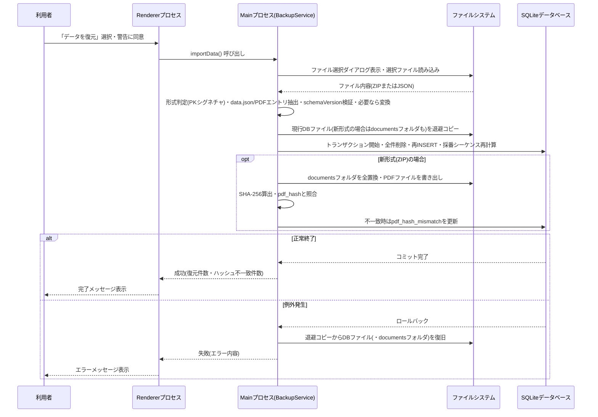
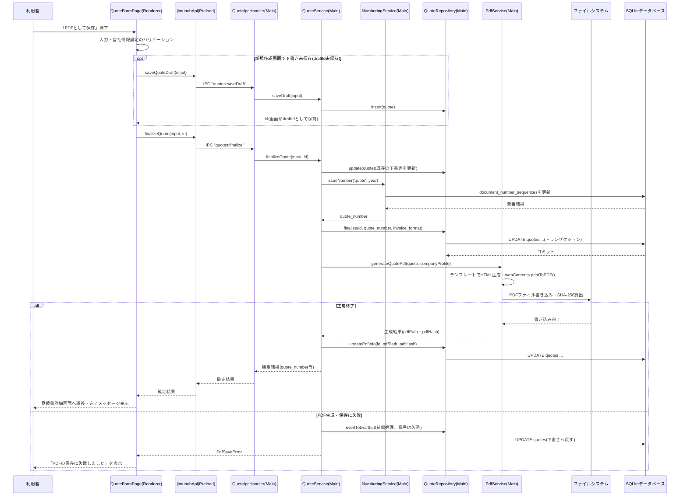
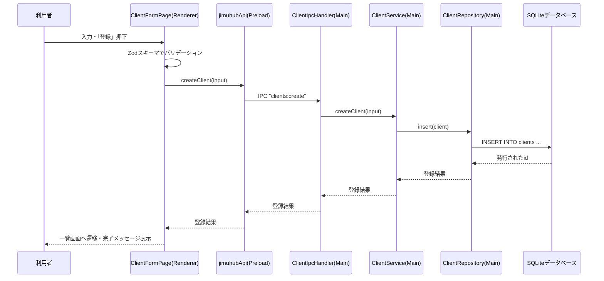
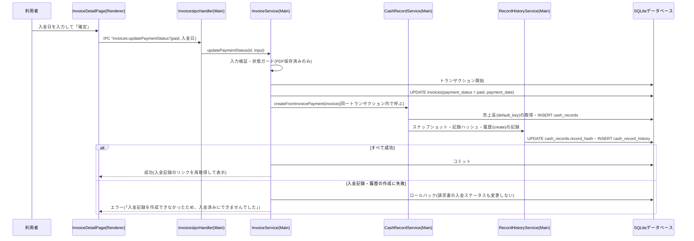
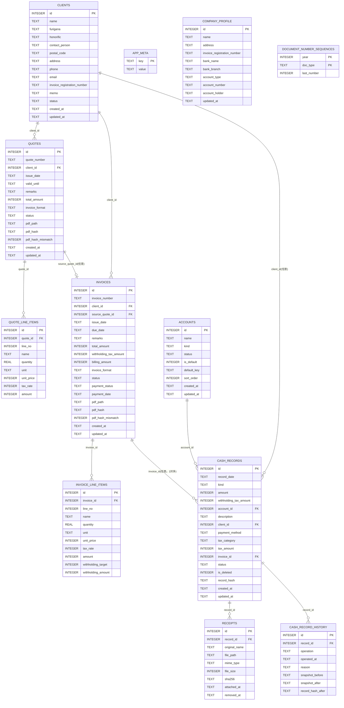

# 詳細設計書

## 1. 文書情報

- 作成日: 2026-09-26(初版)/ 2026-09-28(v1.1〜v1.3改訂)/ 2026-10-02(v1.4改訂)/ 2026-10-03(v1.5・v1.6・v2.0)/ 2026-10-04(v2.1・v2.2・v2.3改訂)/ 2026-10-05(v2.4・v2.5改訂)
- 版数: v2.5
- 対象イテレーション: イテレーション2(入出金・経費の記録、取引先の利用中への復帰、下書きの削除)
- 参照元: 基本設計書.md v2.5(docs/03_architect)。v2.5は、テスト結果(★T3)・レビュー結果(R-14・R-16・R-17・R-19)の反映である(基本設計書8.1章★E19〜★E21)。v1.4〜v1.6は実装・レビュー・セキュリティチェックの結果を反映した改訂であり、実装を正として設計書を整合させている。v2.1はイテレーション2の設計である

## 2. 対象範囲

基本設計書2章〜4章で確定した内容(Electron + TypeScript + React + SQLiteの構成、アプリ基盤・取引先管理・見積書請求書関連・入出金経費関連の各画面)について、実装に落とし込める粒度まで具体化する。対象機能はF-01〜F-26(機能仕様書3章)である。イテレーション2では、F-17〜F-26を新規に追加し、F-02・F-03・F-05・F-08・F-15を更新する。案件管理・タスク管理は対象外とする。

イテレーション2の技術方針(領収書の保存・改変検知・履歴・CSV・消費税額の算出・エクスポート復元の対象。基本設計書2.3章、8.1章★E1〜★E10)は、設計フェーズ着手前にユーザーへ事前確認・ご判断を経て確定した内容であり、本書はこれを前提に具体化する。新規ライブラリは追加しない。

基本設計書2章の技術方針(イテレーション0で確定したElectron+TypeScript+Reactおよび周辺技術、イテレーション1で確定したPDF生成方式・保存先・採番書式・端数処理・電子帳簿保存法対応・DBマイグレーション方式、v1.2で確定したエクスポート/復元ファイルの形式)、4章の画面構成は、いずれも各設計フェーズ着手前にユーザーへ事前確認・ご判断を経て確定した内容である(基本設計書8.1章★A・★B1〜★B9・★C1〜★C12・★D4参照)。本書は、これらの確定内容を前提として実装粒度まで具体化する。

## 3. 画面詳細設計

### 3.0 全画面共通の動作(サイドバー遷移・離脱確認)

- **サイドバーによる遷移**: トップ画面・取引先管理・見積書請求書・入出金経費の各画面に加え、作成・編集・詳細・設定を含む全画面で、サイドバーのメニュー(トップ・取引先管理・見積書請求書・入出金経費)から各一覧・トップ画面へ移動できる。遷移処理は共通の`NavigationContext`(`goHome`・`goClients`・`goDocuments`・`goRecords`。`App.tsx`が提供)を共通レイアウト`AppShell`が参照して行い、各画面は個別の遷移先を指定した場合のみそれを優先する。
- **「準備中」メニュー押下**: 画面遷移は行わず、画面上部に「「(メニュー名)」は以降のイテレーションで実装予定です。」という案内メッセージ(警告表示)を表示する。トップ画面だけでなく全画面で同様に表示する(基本設計書4.1章)。
- **離脱確認**: 入力途中の内容が失われ得る画面(取引先登録・編集画面[3.3・3.5]、見積書作成画面[3.11]、請求書作成画面[3.13]、入出金・経費の登録・編集画面[3.16]、勘定科目管理画面[3.21]の追加フォーム・名称変更欄)では、サイドバーのメニュー押下による画面遷移の前に、確認ダイアログ「入力中の内容は保存されません。この画面を離れてよろしいですか」(`NAVIGATION_MESSAGES.confirmLeave`。OS標準の確認ダイアログ`window.confirm`)を表示する。「キャンセル」(いいえ)の場合は遷移せず、入力内容を保持する。変更の有無(dirty)は判定せず、入力内容の有無にかかわらず常に確認する。作成・編集画面内の「キャンセル」ボタン等、画面内の操作による遷移では本ダイアログは表示しない。

### 3.1 トップ画面(ダッシュボード)[F-01]

本画面に利用者が入力する項目はない。表示専用の情報(取引先の登録件数、見積書・請求書の件数、未収の請求書件数等)とメニュー導線のみで構成する。

**操作定義表**

| 操作 | 種別 | トリガー条件 | 対応する処理の節番号 |
|---|---|---|---|
| アプリ起動 | 画面初期表示 | アプリケーション起動時 | 4.1 |
| 「取引先管理」メニュー押下 | 画面遷移 | 常時活性 | 3.2 |
| 「見積書・請求書」メニュー押下 | 画面遷移 | 常時活性 | 3.10 |
| 「入出金・経費」メニュー押下 | 画面遷移 | 常時活性 | 3.15 |
| 「準備中」メニュー押下 | 案内表示 | 常時活性(以降のイテレーションで有効化予定) | - |
| 「データをエクスポート」押下 | ダイアログ表示 | 常時活性 | 3.6・4.2 |
| 「データを復元」押下 | ダイアログ表示 | 常時活性 | 3.7・4.3 |
| 「自社情報・振込先の設定」押下 | 画面遷移 | 常時活性 | 3.9・4.10 |

### 3.2 取引先一覧画面[F-05]

**入力項目定義表**

| 項目名 | UI要素 | 型・桁数 | 必須 | 初期値 | バリデーション |
|---|---|---|---|---|---|
| 検索キーワード | テキスト入力 | 文字列(上限100文字) | 任意 | 空欄 | 特になし(取引先名称に対する部分一致検索に使用) |
| 並べ替え条件 | セレクトボックス | 列挙値(フリガナ昇順/名称昇順/名称降順/登録日新しい順/登録日古い順) | 任意 | フリガナ昇順 | 列挙値以外は許容しない |
| 状態フィルタ | トグルスイッチ | 真偽値 | 任意 | OFF(利用中のみ表示) | - |

**操作定義表**

| 操作 | 種別 | トリガー条件 | 対応する処理の節番号 |
|---|---|---|---|
| 検索キーワード入力 | 一覧再取得 | 入力内容の変化時(即時反映) | 4.5 |
| 並べ替え条件変更 | 一覧再取得 | 選択変更時 | 4.5 |
| 状態フィルタ切り替え | 一覧再取得 | 切り替え時 | 4.5 |
| 「新規登録」ボタン押下 | 画面遷移 | 常時活性 | 3.3・4.4 |
| 一覧行クリック | 画面遷移 | 一覧に1件以上表示されている場合 | 3.4・4.6 |
| 「利用中に戻す」ボタン押下 | 確認ダイアログ表示(`window.confirm`「この取引先を利用中に戻します。よろしいですか」)→復帰処理実行 | 行の状態が「利用停止」の場合のみ表示(利用中の行には表示しない) | 4.25 |

### 3.3 取引先登録画面[F-04]

**入力項目定義表**

| 項目名 | UI要素 | 型・桁数 | 必須 | 初期値 | バリデーション |
|---|---|---|---|---|---|
| 取引先名称 | テキスト入力 | 文字列(1〜100文字) | 必須 | 空欄 | 前後の空白を除去した上で1文字以上100文字以内。空の場合はエラー |
| フリガナ | テキスト入力 | 文字列(0〜100文字) | 任意 | 空欄 | 100文字以内。全角カタカナ(長音符「ー」・繰り返し記号を含む)のみ許可する。入力中のひらがなは自動的に全角カタカナへ変換し、それ以外の文字(英数字・漢字等)はエラー(「フリガナは全角カタカナで入力してください(ひらがなは自動的に変換されます)」)とする。Renderer(入力時の変換)・Zodスキーマ(最終検証)で同一の判定(`shared/text/furigana.ts`)を用いる。一覧の五十音順表示に使用する |
| 敬称 | セレクトボックス | 列挙値(御中/様/(なし)) | 任意 | (なし) | 列挙値以外は許容しない |
| 担当者名 | テキスト入力 | 文字列(0〜50文字) | 任意 | 空欄 | 50文字以内 |
| 郵便番号 | テキスト入力 | 文字列(0〜8文字) | 任意 | 空欄 | 入力がある場合、半角数字とハイフンのみ許容(例: 123-4567) |
| 住所 | テキスト入力(複数行可) | 文字列(0〜200文字) | 任意 | 空欄 | 200文字以内 |
| 電話番号 | テキスト入力 | 文字列(0〜20文字) | 任意 | 空欄 | 入力がある場合、数字・ハイフン・括弧のみ許容 |
| メールアドレス | テキスト入力 | 文字列(0〜254文字) | 任意 | 空欄 | 入力がある場合のみ「◯◯@◯◯」形式の簡易チェックを行う |
| インボイス登録番号 | テキスト入力 | 文字列(0〜14文字) | 任意 | 空欄 | 入力がある場合、「T」+数字13桁の形式を推奨表示するが、入力自体は妨げない |
| メモ | テキストエリア(複数行) | 文字列(0〜2000文字) | 任意 | 空欄 | 2000文字以内 |

**操作定義表**

| 操作 | 種別 | トリガー条件 | 対応する処理の節番号 |
|---|---|---|---|
| 「登録」ボタン押下 | 登録処理実行 | 常時活性(押下時にバリデーション実施) | 4.4 |
| バリデーションエラー時 | エラー表示 | 必須項目未入力・形式不正時 | 4.4・8章 |
| 「キャンセル」ボタン押下 | 画面遷移(破棄) | 常時活性 | 3.2 |
| サイドバーのメニュー押下 | 離脱確認ダイアログ表示→画面遷移 | 常時(入力内容の有無にかかわらず確認する) | 3.0 |

### 3.4 取引先詳細画面[F-06・F-08]

本画面に利用者が入力する項目はない。表示専用の全項目(フリガナ含む)と、編集・利用停止への導線で構成する。

**操作定義表**

| 操作 | 種別 | トリガー条件 | 対応する処理の節番号 |
|---|---|---|---|
| 画面表示 | 詳細取得 | 一覧または他画面からの遷移時 | 4.6 |
| 「編集」ボタン押下 | 画面遷移 | 対象が利用停止でない場合のみ活性 | 3.5・4.7 |
| 「利用停止にする」ボタン押下 | 確認ダイアログ表示 | 対象が利用中の場合のみ活性 | 4.8 |
| 確認ダイアログ「はい」押下 | 利用停止処理実行 | 確認ダイアログ表示中 | 4.8 |
| 確認ダイアログ「いいえ」押下 | ダイアログ閉じる(処理中断) | 確認ダイアログ表示中 | - |
| 「利用中に戻す」ボタン押下 | 確認ダイアログ表示→復帰処理実行(確認の文言・動作は3.2と同じ) | 対象が利用停止の場合のみ表示(「利用停止にする」ボタンと排他) | 4.25 |
| 「一覧へ戻る」押下 | 画面遷移 | 常時活性 | 3.2 |

### 3.5 取引先編集画面[F-07]

入力項目定義表は3.3(取引先登録画面、フリガナ含む)と同一の項目・型・バリデーションを用いる(共通フォームコンポーネントとして実装する)。既存値を初期値として画面表示する点のみ異なる。

**操作定義表**

| 操作 | 種別 | トリガー条件 | 対応する処理の節番号 |
|---|---|---|---|
| 「保存」ボタン押下 | 更新処理実行 | 常時活性(押下時にバリデーション実施) | 4.7 |
| バリデーションエラー時 | エラー表示 | 必須項目未入力・形式不正時 | 4.7・8章 |
| 「キャンセル」ボタン押下 | 画面遷移(破棄) | 常時活性 | 3.4 |
| サイドバーのメニュー押下 | 離脱確認ダイアログ表示→画面遷移 | 常時(入力内容の有無にかかわらず確認する) | 3.0 |

### 3.6 データエクスポート(ダイアログ)[F-02]

本画面に利用者が入力する項目はない(保存先パスはOS標準ダイアログで指定する)。

**操作定義表**

| 操作 | 種別 | トリガー条件 | 対応する処理の節番号 |
|---|---|---|---|
| 「エクスポート実行」ボタン押下 | OS標準保存ダイアログ表示(領収書の合計容量が復元上限に近い場合は、先に警告ダイアログ「領収書の容量が大きいため、このファイルは復元できない可能性があります。続行しますか」を表示する) | 常時活性 | 4.2 |
| 進捗表示 | 処理中表示(「領収書を書き出しています(n/m)」。`data:progress`イベントで更新。実行中は「エクスポート実行」ボタンを無効化) | エクスポート処理中 | 4.2 |
| 保存先確定 | エクスポート処理実行 | 保存ダイアログでファイル名・保存先を確定した時 | 4.2 |
| 保存成功 | 完了メッセージ表示 | エクスポート処理成功時 | 4.2 |
| 保存失敗 | エラーメッセージ表示 | エクスポート処理失敗時 | 4.2・8章 |

### 3.7 データ復元(ダイアログ)[F-03]

本画面に利用者が入力する項目はない(復元対象ファイルはOS標準ダイアログで指定する)。

**操作定義表**

| 操作 | 種別 | トリガー条件 | 対応する処理の節番号 |
|---|---|---|---|
| 「ファイルを選択して復元」ボタン押下 | 警告ダイアログ表示 | 常時活性 | 4.3 |
| 警告ダイアログ「続行」押下 | OS標準ファイル選択ダイアログ表示 | 警告ダイアログ表示中 | 4.3 |
| ファイル選択確定 | 復元処理実行 | ファイル選択ダイアログで拡張子.zip(v1.2以降の新形式)または.json(v1.1以前の旧形式)のファイルを選択した時 | 4.3 |
| 進捗表示 | 処理中表示(「領収書・PDFを復元しています(n/m)」。`data:progress`イベントで更新。実行中はボタンを無効化) | 復元処理中 | 4.3 |
| 復元成功 | 完了メッセージ表示・画面再読込(完了メッセージには、PDFのハッシュ不一致件数に加え、領収書・記録のハッシュ不一致件数を含める)。成功後はダイアログ内の警告文と「キャンセル」「続行」ボタンを非表示にし、完了メッセージのみを表示する(復元済みの状態で再度実行を促さないため。ダイアログは右上の「×」で閉じる) | 復元処理成功時 | 4.3 |
| 復元失敗 | エラーメッセージ表示 | 復元処理失敗時(ファイル不正・バージョン不整合・処理例外等) | 4.3・8章 |

### 3.8 起動エラー画面[F-09]

本画面に利用者が入力する項目はない(復元対象ファイルはOS標準ダイアログで指定する)。

**操作定義表**

| 操作 | 種別 | トリガー条件 | 対応する処理の節番号 |
|---|---|---|---|
| 画面表示 | エラー表示 | アプリ起動時にデータベース接続等に失敗した場合 | 4.1・4.9 |
| 「エクスポートファイルから復元する」ボタン押下 | 警告ダイアログ表示 | 常時活性 | 4.9 |
| 警告ダイアログ「続行」押下 | OS標準ファイル選択ダイアログ表示 | 警告ダイアログ表示中 | 4.9 |
| ファイル選択確定 | 復元処理実行 | ファイル選択ダイアログで拡張子.zip(v1.2以降の新形式)または.json(v1.1以前の旧形式)のファイルを選択した時 | 4.9 |
| 復元成功 | 完了メッセージ表示・再起動導線表示 | 復元処理成功時 | 4.9 |
| 「アプリを再起動」ボタン押下 | アプリ再起動 | 復元成功後 | 4.9 |
| 復元失敗 | エラーメッセージ表示 | 復元処理失敗時 | 4.9・8章 |

### 3.9 自社情報・振込先設定画面[F-10]

**入力項目定義表**

| 項目名 | UI要素 | 型・桁数 | 必須 | 初期値 | バリデーション |
|---|---|---|---|---|---|
| 氏名・屋号 | テキスト入力 | 文字列(1〜100文字) | 必須 | 空欄 | 前後の空白を除去した上で1文字以上100文字以内 |
| 住所 | テキスト入力(複数行可) | 文字列(1〜200文字) | 必須 | 空欄 | 1文字以上200文字以内 |
| インボイス登録番号 | テキスト入力 | 文字列(0〜14文字) | 任意 | 空欄 | 入力がある場合、「T」+数字13桁の形式を推奨表示するが、入力自体は妨げない |
| 振込先銀行名 | テキスト入力 | 文字列(0〜50文字) | 任意 | 空欄 | 50文字以内 |
| 振込先支店名 | テキスト入力 | 文字列(0〜50文字) | 任意 | 空欄 | 50文字以内 |
| 口座種別 | セレクトボックス | 列挙値(普通/当座) | 任意 | 未選択 | 列挙値以外は許容しない |
| 口座番号 | テキスト入力 | 文字列(0〜10文字) | 任意 | 空欄 | 入力がある場合、半角数字のみ推奨表示するが、入力自体は妨げない |
| 口座名義 | テキスト入力 | 文字列(0〜100文字) | 任意 | 空欄 | 100文字以内 |

**操作定義表**

| 操作 | 種別 | トリガー条件 | 対応する処理の節番号 |
|---|---|---|---|
| 画面表示 | 設定取得 | メニュー押下時、または見積書・請求書作成画面からの誘導時 | 4.10 |
| 「保存」ボタン押下 | 保存処理実行 | 常時活性(押下時にバリデーション実施) | 4.10 |
| 保存成功(遷移元なし) | 完了メッセージ表示 | トップ画面等からの通常遷移の場合。同一画面に留まり「自社情報を保存しました」を表示する(繰り返し確認・修正する用途のため) | 4.10 |
| 保存成功(遷移元あり) | 遷移元へ戻る | 見積書・請求書の作成画面から誘導された場合のみ。遷移元(新規作成・編集の別を保持)へ戻り、完了メッセージを表示する | 4.10 |
| バリデーションエラー時 | エラー表示 | 氏名・屋号または住所が未入力の場合 | 4.10・8章 |

### 3.10 見積書・請求書一覧画面[F-12・F-14]

**入力項目定義表**

| 項目名 | UI要素 | 型・桁数 | 必須 | 初期値 | バリデーション |
|---|---|---|---|---|---|
| タブ | タブ切替 | 列挙値(見積書/請求書) | 必須 | 見積書 | - |
| 発行日(開始・終了) | 日付入力 | 日付 | 任意 | 空欄 | 開始・終了の両方が入力され、終了日が開始日より前の場合はエラー(「発行日の終了日は、開始日以降の日付を入力してください」。`dateRangeInvalid`) |
| 取引先 | セレクトボックス | 取引先マスタ参照 | 任意 | 未選択(すべて) | - |
| 金額(下限・上限) | 数値入力 | 整数(0以上) | 任意 | 空欄 | 下限・上限の両方が入力され、上限が下限より小さい場合はエラー(「金額の上限は、下限以上の金額を入力してください」。`amountRangeInvalid`) |
| 入金ステータス(請求書タブのみ) | セレクトボックス | 列挙値(すべて/未収/入金済み) | 任意 | すべて | 列挙値以外は許容しない |

**操作定義表**

| 操作 | 種別 | トリガー条件 | 対応する処理の節番号 |
|---|---|---|---|
| タブ切替 | 一覧再取得 | 切替時 | 4.12・4.14 |
| 検索条件入力・変更 | 一覧再取得 | 入力内容の変化時(即時反映)。発行日または金額の範囲エラーがある間は、エラー文言を画面に表示し、一覧の再取得(絞り込み)を実行せず直前の一覧表示を維持する。エラーが解消された時点で再取得する | 4.12・4.14 |
| 「見積書を新規作成」ボタン押下(見積書タブ) | 画面遷移 | 常時活性 | 3.11・4.12 |
| 「請求書を新規作成」ボタン押下(請求書タブ) | 画面遷移 | 常時活性 | 3.12・4.14 |
| 一覧行クリック | 画面遷移 | 一覧に1件以上表示されている場合 | 3.12・3.14 |
| 「削除」ボタン押下(下書きの行) | 確認ダイアログ表示(`window.confirm`「この下書きを削除します。削除すると元に戻せません。よろしいですか」)→下書き削除処理実行→一覧再取得 | 行の状態が「下書き」の場合のみ表示(PDF保存済みの行には表示しない) | 4.26 |

### 3.11 見積書作成画面[F-11・F-12]

**入力項目定義表**

| 項目名 | UI要素 | 型・桁数 | 必須 | 初期値 | バリデーション |
|---|---|---|---|---|---|
| 取引先 | セレクトボックス(利用中の取引先のみ) | 取引先マスタ参照 | 必須 | 未選択 | 未選択の場合はエラー |
| 発行日 | 日付入力 | 日付(`YYYY-MM-DD`) | 必須 | 本日 | 未入力の場合はエラー。IPC境界(Zodスキーマ)で`YYYY-MM-DD`形式かつ実在する日付であることを検証し、不正な場合は「日付は「YYYY-MM-DD」形式の正しい日付で入力してください」(`dateInvalid`)とする |
| 有効期限 | 日付入力 | 日付(`YYYY-MM-DD`) | 任意 | 空欄 | 空欄を許容し、入力がある場合は`YYYY-MM-DD`の実在日を検証する(不正時は`dateInvalid`)。発行日より前の日付は警告表示(保存は妨げない) |
| 備考 | テキストエリア | 文字列(0〜500文字) | 任意 | 空欄 | 500文字以内 |
| 明細行・品名 | テキスト入力 | 文字列(1〜100文字) | 必須(行ごと) | 空欄 | 1文字以上100文字以内 |
| 明細行・数量 | 数値入力 | 数値(小数第2位まで、0より大きい) | 必須(行ごと) | 1 | 0以下または数値以外はエラー |
| 明細行・単位 | テキスト入力 | 文字列(0〜10文字) | 任意 | 空欄 | 10文字以内 |
| 明細行・単価 | 数値入力 | 整数(0以上) | 必須(行ごと) | 0 | 負の数はエラー |
| 明細行・税率 | セレクトボックス | 列挙値(10%/8%) | 必須(行ごと) | 10% | 列挙値以外は許容しない |

**操作定義表**

| 操作 | 種別 | トリガー条件 | 対応する処理の節番号 |
|---|---|---|---|
| 「取引先を新規登録」リンク押下 | モーダル表示 | 常時活性 | 4.11 |
| 明細行「行を追加」押下 | 明細行追加 | 常時活性 | 4.12 |
| 明細行「削除」押下 | 明細行削除 | 明細行が2行以上ある場合のみ活性 | 4.12 |
| 明細行の入力変更 | 金額・税内訳・合計金額の再計算 | 入力内容の変化時 | 4.12 |
| 「下書き保存」ボタン押下 | 下書き保存処理実行 | 常時活性(押下時にバリデーション実施) | 4.12 |
| 「PDFとして保存」ボタン押下 | 確定処理実行 | 常時活性(押下時にバリデーション・自社情報設定チェックを実施) | 4.12 |
| バリデーションエラー時 | エラー表示 | 必須項目未入力時 | 4.12・8章 |
| 自社情報未設定で「PDFとして保存」押下 | エラー表示・設定画面導線表示 | 自社情報が未登録の場合 | 4.12・8章 |
| 「キャンセル」ボタン押下 | 画面遷移(破棄) | 常時活性 | 3.10・3.12 |
| サイドバーのメニュー押下 | 離脱確認ダイアログ表示→画面遷移 | 常時(入力内容の有無にかかわらず確認する。請求書作成画面[3.13]も同様) | 3.0 |

作成画面・詳細画面の税率区分ごとの内訳(小計・消費税額)は、該当する明細行がない税率区分も0円として表示する。一方、PDFでは該当する明細行がない税率区分の集計行は表示しない(4.15章・基本設計書4.15章参照)。

### 3.12 見積書詳細画面[F-12・F-13]

本画面に利用者が入力する項目はない。表示専用の全項目と、編集・PDF操作・請求書変換への導線で構成する。

**操作定義表**

| 操作 | 種別 | トリガー条件 | 対応する処理の節番号 |
|---|---|---|---|
| 画面表示 | 詳細取得 | 一覧または他画面からの遷移時 | 4.12 |
| 「編集」ボタン押下 | 画面遷移 | 状態が「下書き」の場合のみ活性 | 3.11・4.12 |
| 「PDFを開く」ボタン押下 | OS標準アプリ起動 | 状態が「PDF保存済み」の場合のみ活性。開く前に、`pdf_path`が保存先(`documents/`)配下であり、拡張子が`.pdf`であり(SEC-10)、ファイルが存在することを確認する(`PdfOpener`)。確認に失敗した場合、または`shell.openPath()`が失敗を返した場合は、「PDFファイルが見つかりません。…」(`pdfNotFound`)を画面に表示する | 4.12・7章・8章 |
| 「Finderで表示」ボタン押下 | Finder起動 | 状態が「PDF保存済み」の場合のみ活性。「PDFを開く」と同じ確認を行い、失敗時は同じ文言を表示する | 4.12・7章・8章 |
| 「請求書に変換」ボタン押下 | 変換処理実行・画面遷移 | 状態が「PDF保存済み」の場合のみ活性 | 3.14・4.13 |
| 「削除」ボタン押下 | 確認ダイアログ表示→下書き削除処理実行→見積書・請求書一覧画面(3.10)へ遷移 | 状態が「下書き」の場合のみ表示(PDF保存済みには表示しない) | 4.26 |
| 「一覧へ戻る」押下 | 画面遷移 | 常時活性 | 3.10 |

`pdf_hash_mismatch = 1`(復元時のハッシュ照合不一致。6.5章参照)の場合、画面表示時に「PDFファイルの改変が疑われます」という警告バッジを表示する。

### 3.13 請求書作成画面[F-11・F-13・F-14・F-16]

入力項目定義表は3.11(見積書作成画面)に準ずる。差分のみ記載する。

| 項目名 | UI要素 | 型・桁数 | 必須 | 初期値 | バリデーション |
|---|---|---|---|---|---|
| 支払期限(有効期限の代わり) | 日付入力 | 日付(`YYYY-MM-DD`) | 任意 | 空欄 | 空欄を許容し、入力がある場合は`YYYY-MM-DD`の実在日を検証する(不正時は`dateInvalid`)。発行日より前の日付は警告表示(保存は妨げない) |
| 明細行・源泉徴収対象 | チェックボックス | 真偽値 | 任意(行ごと) | OFF | - |

**操作定義表**

3.11の操作定義表に加え、次を追加する。

| 操作 | 種別 | トリガー条件 | 対応する処理の節番号 |
|---|---|---|---|
| 明細行「源泉徴収対象」チェック変更 | 源泉徴収税額・請求金額の再計算(行ごとの源泉徴収額は表示せず、対象行の合計に対する源泉徴収税額のみを表示する) | チェック変更時 | 4.16 |

見積書からの変換(F-13)で遷移してきた場合、取引先・明細行・備考は変換元の値で初期表示され、他の操作定義表は3.11に準ずる。

### 3.14 請求書詳細画面[F-14・F-15]

本画面に利用者が入力する項目はない(入金日はステータス変更操作の一部として入力する)。

**入力項目定義表**

| 項目名 | UI要素 | 型・桁数 | 必須 | 初期値 | バリデーション |
|---|---|---|---|---|---|
| 入金日 | 日付入力 | 日付(`YYYY-MM-DD`) | 必須(「入金済みにする」操作時のみ) | 本日 | 未入力の場合はエラー。`YYYY-MM-DD`の実在日でない場合は`dateInvalid`(IPC境界で検証) |

**操作定義表**

| 操作 | 種別 | トリガー条件 | 対応する処理の節番号 |
|---|---|---|---|
| 画面表示 | 詳細取得 | 一覧または他画面からの遷移時 | 4.14 |
| 「編集」ボタン押下 | 画面遷移 | 状態が「下書き」の場合のみ活性 | 3.13・4.14 |
| 「PDFを開く」「Finderで表示」ボタン押下 | 3.12に準ずる | 状態が「PDF保存済み」の場合のみ活性 | 4.14 |
| 「削除」ボタン押下 | 確認ダイアログ表示→下書き削除処理実行→見積書・請求書一覧画面(3.10、請求書タブ)へ遷移 | 状態が「下書き」の場合のみ表示(PDF保存済みには表示しない) | 4.26 |
| 「入金済みにする」ボタン押下 | 入金日入力欄表示 | 入金ステータスが「未収」の場合のみ活性 | 4.15 |
| 入金日確定 | 入金ステータス更新処理実行(入金記録の自動作成を同一トランザクションで行う) | 入金日入力後 | 4.15・4.21 |
| 「未収に戻す」ボタン押下 | 確認ダイアログ表示(「入金済みを取り消します。連動する入金記録は『取消済』として残ります」) | 入金ステータスが「入金済み」の場合のみ活性 | 4.15・4.21 |
| 確認ダイアログ「はい」押下 | 入金ステータス更新処理実行(入金記録の取消を同一トランザクションで行う) | 確認ダイアログ表示中 | 4.15・4.21 |
| 入金記録のリンク押下 | 画面遷移(入出金・経費の詳細画面3.17) | 紐づく入金記録(取消済を含む)がある場合のみ表示 | 3.17 |
| 「元の見積書を見る」リンク押下 | 画面遷移 | 元見積書が存在する場合のみ活性 | 3.12 |
| 「一覧へ戻る」押下 | 画面遷移 | 常時活性 | 3.10 |

`pdf_hash_mismatch = 1`(復元時のハッシュ照合不一致。6.7章参照)の場合、画面表示時に「PDFファイルの改変が疑われます」という警告バッジを表示する。

請求書詳細画面には、`invoices:get`の応答に含まれる紐づく入金記録(`linkedRecords`。取消済を含む。新しい順)を、入金日・金額・状態(有効/取消済)・詳細画面(3.17)へのリンクとして表示する。紐づく入金記録が無い場合は欄を表示しない(基本設計書4.14章)。
欄の見出しは「紐づく入金記録」とし、表の列は「入金日」「金額」「状態」「詳細」とする。金額は源泉徴収後の入金額に「+」を付けて右揃えで表示し、状態は「有効」「取消済」のバッジとする(取消済は打ち消し線付き)。「詳細」列には「入金記録を見る」のリンクを置く(デザインフェーズで確定。デザインガイド.md v2.1)。

### 3.15 入出金・経費一覧画面[F-19]

**入力項目定義表**

| 項目名 | UI要素 | 型・桁数 | 必須 | 初期値 | バリデーション |
|---|---|---|---|---|---|
| タブ | タブ切替 | 列挙値(記録一覧/集計/履歴) | 必須 | 記録一覧 | - |
| 日付(開始・終了) | 日付入力 | 日付(`YYYY-MM-DD`) | 任意 | 空欄 | 実在日であること(不正時は`dateInvalid`)。両方が入力され、終了日が開始日より前の場合はエラー(「日付の終了日は、開始日以降の日付を入力してください」。`recordDateRangeInvalid`) |
| 金額(下限・上限) | 数値入力 | 整数(0以上) | 任意 | 空欄 | 両方が入力され、上限が下限より小さい場合はエラー(「金額の上限は、下限以上の金額を入力してください」。`amountRangeInvalid`を共用) |
| 取引先 | セレクトボックス | 取引先マスタ参照(利用停止を含む) | 任意 | 未選択(すべて) | - |
| 勘定科目 | セレクトボックス | 勘定科目参照(利用停止を含む。区分でグループ表示) | 任意 | 未選択(すべて) | - |
| 種別 | セレクトボックス | 列挙値(すべて/入金/経費) | 任意 | すべて | 列挙値以外は許容しない |
| ページ | ページ送り | 整数(1以上) | 必須 | 1 | 1ページ50件(定数`RECORD_PAGE_SIZE = 50`)。検索条件の変更時は1に戻す |

検索条件は、指定したすべてを満たす記録(AND条件)を表示する。並び順は日付の降順、同日はidの降順に固定する。

**操作定義表**

| 操作 | 種別 | トリガー条件 | 対応する処理の節番号 |
|---|---|---|---|
| 画面表示 | 一覧取得 | サイドバーの「入出金・経費」押下時、またはタブ切替時 | 4.19 |
| 検索条件入力・変更 | 一覧再取得 | 入力内容の変化時(即時反映)。日付または金額の範囲エラーがある間は、エラー文言を表示し、再取得を実行せず直前の表示を維持する | 4.19 |
| 「入金を登録」「経費を登録」ボタン押下 | 画面遷移(種別を指定) | 常時活性 | 3.16・4.18 |
| 一覧行クリック | 画面遷移 | 一覧に1件以上表示されている場合 | 3.17 |
| 請求書番号リンク押下 | 画面遷移 | 請求書から自動作成された入金記録の行のみ | 3.14 |
| 「勘定科目の管理」ボタン押下 | 画面遷移 | 常時活性 | 3.21 |
| 「CSV出力」ボタン押下 | ダイアログ表示 | 常時活性 | 3.20・4.24 |
| 「集計」タブ押下 | タブ内容の切替(集計パネルを表示。画面遷移なし) | 常時活性 | 3.19 |
| 「履歴」タブ押下 | 画面切替 | 常時活性 | 3.18 |
| 「前へ」「次へ」押下 | 一覧再取得 | 前後のページがある場合のみ活性 | 4.19 |
| 該当0件時 | 案内表示 | 「該当する記録がありません」を表示する | 4.19 |

### 3.16 入出金・経費の登録・編集画面[F-18・F-22]

**入力項目定義表**

| 項目名 | UI要素 | 型・桁数 | 必須 | 初期値 | バリデーション |
|---|---|---|---|---|---|
| 種別 | ラジオボタン(登録時のみ変更可。編集時は表示のみ) | 列挙値(入金/経費) | 必須 | 遷移元のボタンで指定した種別(「入金を登録」→入金、「経費を登録」→経費) | 列挙値以外は許容しない |
| 日付 | 日付入力 | 日付(`YYYY-MM-DD`) | 必須 | 本日 | 未入力はエラー(「日付を入力してください」。`recordDateRequired`)。実在日であること(不正時は`dateInvalid`)。`2000-01-01`〜`2099-12-31`の範囲外は「日付は2000年〜2099年の範囲で入力してください」(`recordDateOutOfRange`) |
| 金額 | テキスト入力(数値) | 整数(税込。1〜9,999,999,999) | 必須 | 空欄 | 半角数字のみ(カンマ区切りで入力した場合はカンマを除去して判定する)。未入力・0以下・範囲超過・数値以外はエラー(「金額は1円以上9,999,999,999円以下の整数で入力してください」。`recordAmountInvalid`) |
| 勘定科目 | セレクトボックス | 勘定科目参照 | 必須 | 未選択 | 未選択はエラー(「勘定科目を選択してください」。`recordAccountRequired`)。選択肢は、種別に合う区分の、利用中の科目のみ(編集時は、現在選択済みの科目が利用停止でも、その科目を選択肢に含める)。区分が種別と一致しない科目、利用停止の科目(現在値を除く)はMain側で拒否する |
| 摘要・メモ | テキスト入力 | 文字列(1〜200文字) | 必須 | 空欄 | 前後の空白を除去した上で1文字以上200文字以内。未入力(空白のみを含む)はエラー(「摘要・メモを入力してください」。`recordDescriptionRequired`)。200文字超は「摘要・メモは200文字以内で入力してください」(`recordDescriptionTooLong`) |
| 取引先 | セレクトボックス | 取引先マスタ参照 | 任意 | 未選択 | 選択肢は利用中の取引先のみ(編集時は、現在値が利用停止でも選択肢に含める) |
| 支払方法 | セレクトボックス | 列挙値(`cash`現金/`transfer`振込/`credit_card`クレジットカード/`other`その他) | 任意 | 未選択 | 列挙値以外は許容しない |
| 税区分 | セレクトボックス | 列挙値(`standard_10`10%/`reduced_8`8%[軽減]/`tax_exempt`非課税/`not_applicable`対象外) | 任意 | 未選択 | 列挙値以外は許容しない |
| 消費税額 | 表示のみ | 整数 | - | 0 | 入力不可。金額・税区分の変更時に`calculateIncludedTax`(4.18章)で再計算して表示する |
| 領収書(追加) | ボタン+一覧 | ファイル(PDF・JPEG・PNG) | 任意 | なし | 1ファイル10MB(10,485,760バイト)以内、1つの記録につき有効な領収書は5件まで(保存済み+追加予定−外す予定の合計)、拡張子とマジックナンバーが形式と一致すること。違反時の文言は8章 |
| 変更理由(編集時のみ) | テキスト入力 | 文字列(0〜200文字) | 任意 | 空欄 | 200文字以内 |

エラーメッセージは、該当項目の下に赤字で表示し、入力欄の枠も赤にする(デザインガイド.md v2.1。赤はエラー・警告専用で、経費の金額表示には使わない)。種別の表示は「入金」「経費」とし、一覧・詳細・履歴・請求書詳細では種別バッジ(入金=濃グレー塗り+白文字、経費=背景グレー地+濃グレー文字)と、金額の+/−記号で区別する(色は増やさない)。

請求書から自動作成された入金記録(`invoice_id`が設定されている記録)の編集では、種別・金額・取引先・請求書は表示のみとし、日付・勘定科目・摘要・支払方法・税区分・領収書・変更理由を編集できる(基本設計書4.18章、8.1章★E11)。取消済の記録、削除済みの記録は編集画面を開けない(Main側でも拒否する)。

**操作定義表**

| 操作 | 種別 | トリガー条件 | 対応する処理の節番号 |
|---|---|---|---|
| 種別の切り替え(登録時のみ) | 選択肢の更新 | 切り替え時。勘定科目の選択肢を区分に合う科目へ切り替え、選択済みの科目をクリアする | 4.18 |
| 金額・税区分の変更 | 消費税額の再計算 | 入力内容の変化時 | 4.18 |
| 「ファイルを追加」ボタン押下 | ファイル選択ダイアログ表示(`receipts:pick`)→検証→追加予定の一覧へ追加 | 有効な領収書が5件未満の場合のみ活性 | 4.22 |
| 領収書「削除」ボタン押下 | 追加予定の領収書は一覧から外す。保存済みの領収書は削除予定とする(保存時に外す) | 領収書が一覧にある場合 | 4.22 |
| 「登録」「保存」ボタン押下 | 登録処理・更新処理実行 | 常時活性(押下時にバリデーション実施) | 4.18 |
| バリデーションエラー時 | エラー表示 | 必須項目未入力・形式不正・領収書の検証エラー時 | 4.18・8章 |
| 「キャンセル」ボタン押下 | 画面遷移(破棄) | 常時活性 | 3.15・3.17 |
| サイドバーのメニュー押下 | 離脱確認ダイアログ表示→画面遷移 | 常時(入力内容の有無にかかわらず確認する) | 3.0 |

### 3.17 入出金・経費の詳細画面[F-18・F-20・F-22]

本画面に利用者が入力する項目はない(削除時の変更理由を、削除確認ダイアログで任意入力する)。

**入力項目定義表(削除確認ダイアログ)**

| 項目名 | UI要素 | 型・桁数 | 必須 | 初期値 | バリデーション |
|---|---|---|---|---|---|
| 変更理由 | テキスト入力 | 文字列(0〜200文字) | 任意 | 空欄 | 200文字以内 |

**操作定義表**

| 操作 | 種別 | トリガー条件 | 対応する処理の節番号 |
|---|---|---|---|
| 画面表示 | 詳細取得・改変検知(記録ハッシュと領収書ファイルのSHA-256の照合) | 一覧・履歴・請求書詳細からの遷移時 | 4.19・4.22 |
| 「編集」ボタン押下 | 画面遷移 | 状態が「有効」かつ削除済みでない場合のみ表示 | 3.16・4.18 |
| 「削除」ボタン押下(`invoice_id`なし) | 確認ダイアログ表示(変更理由の任意入力)→論理削除実行→一覧へ遷移 | 状態が「有効」かつ削除済みでない場合のみ表示 | 4.18 |
| 「削除」ボタン押下(`invoice_id`あり) | 案内表示(「請求書側で入金済みを取り消すと、この入金記録は取消済になります」。`autoRecordDeleteBlocked`)。削除は行わない | 請求書から自動作成された有効な入金記録 | 4.18・8章 |
| 領収書「開く」「Finderで表示」ボタン押下 | OS標準アプリ起動・Finder起動(`ReceiptOpener`が、保存先が`documents/receipts/`配下・拡張子が許可したもの・ファイルが存在することを確認する) | 外していない領収書の行(外した領収書の行にも表示する) | 4.22・7章・8章 |
| 領収書のサムネイル押下 | アプリ内の拡大表示ダイアログを開く(`receipts:preview`。画像は拡大表示、PDFは拡大せず案内表示。詳細は下記「領収書のアプリ内拡大表示」) | 領収書の行(外した領収書を含む)。照合結果が`ok`の場合のみ内容を表示し、`mismatch`・`missing`の場合は警告のみを表示する | 4.22・7章・8章 |
| 拡大表示ダイアログの「開く(OS標準アプリ)」押下 | 「開く」ボタンと同じ処理(`receipts:open`) | 拡大表示ダイアログの表示中 | 4.22 |
| 拡大表示ダイアログの「閉じる」押下、Escキー、ダイアログ外のクリック | ダイアログを閉じる | 拡大表示ダイアログの表示中 | - |
| 請求書番号リンク押下 | 画面遷移 | `invoice_id`がある場合のみ | 3.14 |
| 「一覧へ戻る」押下 | 画面遷移 | 常時活性 | 3.15・3.18 |

記録ハッシュの不一致、領収書のハッシュ不一致、領収書ファイルの欠落は、画面表示時の照合結果(`integrity`)として警告表示する(8章)。

**領収書のサムネイル表示と拡大表示**(基本設計書8.1章★E15。モックアップ F-18_cash-detail の参考表示に対応)

- 領収書の各行(カード)に、ファイル名・形式・サイズ・「開く」「Finderで表示」ボタンと、サムネイルを表示する。サムネイルは押下できる要素とし、欄の見出しに「サムネイルをクリックすると拡大して確認できます」と案内する
- 形式ごとの扱い

| 形式 | サムネイル | 拡大表示ダイアログ |
|---|---|---|
| JPEG・PNG | 画像の縮小版(幅120px程度。Main側で`nativeImage`により縮小して生成) | 画像を、ダイアログに収まる大きさで表示する(最大幅520px程度。縦横比を保つ)。ダイアログには、ファイル名、「開く(OS標準アプリ)」「閉じる」を配置する |
| PDF | 内容は描画せず、固定の書類アイコンに「PDF」の表記を添える | PDFの内容はアプリ内で描画しない(PDFビューアの埋め込みを避け、セキュリティ方針を単純に保つため)。ダイアログには、ファイル名・形式・サイズと「PDFはアプリ内では表示できません。「開く(OS標準アプリ)」でご確認ください」の案内、「開く(OS標準アプリ)」「閉じる」を配置する |

- 画像の取得(`receipts:preview`、`receipts:thumbnail`)は、Rendererにファイルのパスを渡さず、領収書の`id`のみを指定する。Main側(`ReceiptPreviewService`)が、`ReceiptOpener`と同じ確認(保存先が`documents/receipts/`配下・拡張子が許可したもの・ファイルが存在する)を行った上でファイルを読み込み、そのバッファのSHA-256を`receipts.sha256`と照合し、一致した場合のみ、同じバッファから画像のdata URLを生成して返す(照合後に別途ファイルを読み直さない)。表示するのは、`documents/receipts/`配下の、拡張子とマジックナンバーが一致するJPEG・PNGのみである
- 改変警告時の扱い: 照合結果が`mismatch`(ハッシュ不一致)の領収書は、サムネイル・拡大表示のいずれも画像を表示しない(改変された可能性のあるファイルの内容を、検証済みのように見せないため)。サムネイルは警告アイコンに置き換え、サムネイルまたは拡大表示を押下した場合は、拡大表示ダイアログに「ファイルの改変が疑われます」の警告のみを表示する。`missing`(ファイルが見つからない)の場合も同様に、「ファイルが見つかりません」の警告のみを表示する。いずれの場合も、既存の「開く」「Finderで表示」ボタンの扱い(確認に失敗した場合のみ`receiptNotFound`を返す)は変更しない
- 外した領収書も、同じ規則でサムネイル・拡大表示ができる(履歴の確認用)

### 3.18 履歴画面[F-20]

**入力項目定義表**

| 項目名 | UI要素 | 型・桁数 | 必須 | 初期値 | バリデーション |
|---|---|---|---|---|---|
| 操作の種別 | セレクトボックス | 列挙値(すべて/登録`create`/変更`update`/削除`delete`/取消`cancel`) | 任意 | すべて | 列挙値以外は許容しない |
| 操作日(開始・終了) | 日付入力 | 日付(`YYYY-MM-DD`) | 任意 | 空欄 | 実在日であること。終了日が開始日より前の場合は`recordDateRangeInvalid` |
| ページ | ページ送り | 整数(1以上) | 必須 | 1 | 1ページ50件 |

**操作定義表**

| 操作 | 種別 | トリガー条件 | 対応する処理の節番号 |
|---|---|---|---|
| 画面表示・絞り込み条件の変更 | 履歴一覧取得(新しい順。範囲エラー中は再取得しない) | タブ切替時、条件の変更時 | 4.20 |
| 行の展開 | 変更項目ごとの変更前後の値を表示(スナップショットの差分。4.20章) | 常時活性 | 4.20 |
| 「記録を表示」押下 | 画面遷移(詳細画面3.17。削除済みは読み取り専用) | 常時活性 | 3.17 |

### 3.19 集計画面[F-23]

集計は独立した画面ではなく、入出金・経費一覧画面(3.15)の「集計」タブ内に表示するパネル(`SummaryPanel`)として実装する(基本設計書8.1章★E17。依頼者ご本人のご判断により確定)。タブの切り替えで画面遷移は行わず、パネルの表示時に集計を取得する。以下の入力項目・操作は、このパネル内のものである。

**入力項目定義表**

| 項目名 | UI要素 | 型・桁数 | 必須 | 初期値 | バリデーション |
|---|---|---|---|---|---|
| 年 | セレクトボックス | 整数(西暦4桁。記録のある年+当年) | 必須 | 当年 | 選択肢以外は許容しない |
| 月 | セレクトボックス | 列挙値(年全体/1〜12) | 必須 | 年全体 | - |

**操作定義表**

| 操作 | 種別 | トリガー条件 | 対応する処理の節番号 |
|---|---|---|---|
| 画面表示・年・月の変更 | 集計取得(`summary:get`) | タブ切替時、選択変更時 | 4.23 |
| 月別の表の行押下 | 月の選択を切り替え、集計を再取得 | 常時活性 | 4.23 |
| 該当期間に記録が無い場合 | 0円表示 | 合計・差額・各表を0円で表示する | 4.23 |

### 3.20 CSV出力ダイアログ[F-24]

**入力項目定義表**

| 項目名 | UI要素 | 型・桁数 | 必須 | 初期値 | バリデーション |
|---|---|---|---|---|---|
| 開始年月 | 年月入力(`input type="month"`) | `YYYY-MM` | 必須 | 当年1月 | 未入力・形式不正はエラー(`monthInvalid`「年月を正しく入力してください」) |
| 終了年月 | 年月入力 | `YYYY-MM` | 必須 | 当年12月 | 同上。開始年月より前の場合はエラー(「終了年月は、開始年月以降を指定してください」。`csvMonthRangeInvalid`) |

**操作定義表**

| 操作 | 種別 | トリガー条件 | 対応する処理の節番号 |
|---|---|---|---|
| 「出力」ボタン押下 | バリデーション→OS標準保存ダイアログ表示→CSV出力処理実行 | 常時活性 | 4.24 |
| 出力成功 | 完了メッセージ表示(保存先パス・出力件数) | CSV出力成功時 | 4.24 |
| 対象期間に記録が無い場合 | 案内表示(「対象期間に出力する記録がありません」。ファイルは作成しない) | 出力件数が0件の場合 | 4.24 |
| 出力失敗 | エラーメッセージ表示 | 書き込み失敗時 | 4.24・8章 |
| 「キャンセル」ボタン押下 | ダイアログを閉じる | 常時活性 | - |

### 3.21 勘定科目管理画面[F-17]

**入力項目定義表**

| 項目名 | UI要素 | 型・桁数 | 必須 | 初期値 | バリデーション |
|---|---|---|---|---|---|
| 名称(追加・変更) | テキスト入力 | 文字列(1〜30文字) | 必須 | 空欄 | 前後の空白を除去した上で1文字以上30文字以内。空欄はエラー(「科目の名称を入力してください」。`accountNameRequired`)。同じ区分に同名の科目(利用停止中を含む。自身を除く)が既にある場合はエラー(「同じ区分に同じ名称の科目があります」。`accountNameDuplicated`) |
| 区分(追加) | セレクトボックス | 列挙値(経費`expense`/収入`income`) | 必須 | 経費 | 列挙値以外は許容しない。追加後は変更できない |

**操作定義表**

| 操作 | 種別 | トリガー条件 | 対応する処理の節番号 |
|---|---|---|---|
| 画面表示 | 科目一覧取得(利用停止を含む。区分・表示順)。`default_key`のある科目(「売上高」)は、名称の横に「システム既定」バッジを表示する(デザインフェーズで確定。利用停止ボタンは表示せず、名称変更のみ可能) | 「勘定科目の管理」ボタン押下時 | 4.17 |
| 「追加」ボタン押下 | 追加処理実行 | 常時活性(押下時にバリデーション実施) | 4.17 |
| 「名称を変更」→確定 | 名称変更処理実行 | 常時活性 | 4.17 |
| 「利用停止」ボタン押下 | 確認ダイアログ表示(`window.confirm`)→利用停止処理実行 | 状態が「利用中」の場合のみ表示。システムの既定科目(`default_key`あり。「売上高」)は表示しない(押下できず案内のみ) | 4.17 |
| 「利用を再開」ボタン押下 | 利用再開処理実行 | 状態が「利用停止」の場合のみ表示 | 4.17 |
| 「削除」ボタン押下 | 確認ダイアログ表示→削除処理実行 | 初期科目でなく、記録・履歴で一度も使われていない科目のみ表示 | 4.17 |
| 「一覧へ戻る」押下 | 画面遷移 | 常時活性 | 3.15 |

## 4. 処理フロー設計

### 4.1 F-01 アプリ起動・基本画面

0. Electronのアプリ起動イベントを受けた直後(データベースの初期化より前)に、Mainプロセスが`cleanupLeftoverPdfTempFiles()`を実行し、異常終了などで残ったPDF生成用の一時HTMLを削除する(4.12章手順8。削除対象は、OSの一時フォルダ直下の専用フォルダ`jimuhub-pdf-tmp`にある、命名規則`render-<16進12桁>.html`に一致する通常ファイルのみ。それ以外のファイル・フォルダ、および専用フォルダの外には触れない。削除できないファイルがあっても起動は妨げない。SEC-11)
1. Electronのアプリ起動イベントを受け、Mainプロセスが`Database.initialize()`を実行する。データベースファイルが存在しない場合は新規作成し、6章のテーブル定義に基づきテーブルを作成する
2. `app_meta`テーブルから`schema_version`を取得する。現行バージョン(`4`)より小さい場合は`MigrationService.applyMigrations(fromVersion)`を実行し、6章の差分(`fromVersion`が`1`未満の場合は`clients.furigana`列の追加、`company_profile`・`quotes`・`quote_line_items`・`invoices`・`invoice_line_items`・`document_number_sequences`テーブルの作成〔schema_version 1→2〕、`fromVersion`が`2`未満の場合は`quotes.pdf_hash_mismatch`・`invoices.pdf_hash_mismatch`列の追加〔schema_version 2→3〕、`fromVersion`が`3`未満の場合は`accounts`・`cash_records`・`receipts`・`cash_record_history`テーブルとインデックスの作成、履歴の更新・削除を拒否するトリガーの作成、初期科目14件の登録〔schema_version 3→4。6.10〜6.13章〕)を順次適用した上で`schema_version`を`4`に更新する。ただし、`accounts`・`cash_records`・`receipts`・`cash_record_history`の4テーブル・インデックス・トリガーは、手順1の`Database.initialize()`が`CREATE TABLE IF NOT EXISTS`等の冪等なDDLで作成済みである(既存方針。コーディング規約7.1章)。そのため、`schema_version 3→4`の移行(`MigrationService`)が行うのは、初期科目14件の登録と`schema_version`の`4`への更新のみであり、この2つを1つのトランザクション内で行う(途中で失敗した場合は、科目も`schema_version`も更新されない。v2.4で実装に合わせて改訂)
3. Rendererプロセスを起動し、preload経由で`clients:list`(状態フィルタ=利用中のみ)、`quotes:list`・`invoices:list`(サマリー件数取得用)をMainへ要求する
4. トップ画面を表示し、サイドメニュー(取引先管理・見積書請求書・入出金経費は活性、案件管理・タスク期限は準備中表示)と、取得した各件数(取引先件数、見積書・請求書件数、未収の請求書件数)を表示する。「未収の請求書件数」は、状態が「PDF保存済み」(`finalized`)かつ入金ステータスが「未収」(`unpaid`)の請求書の件数と定義する(下書きは含めない)
5. 手順1〜3でエラーが発生した場合(データベースファイル破損・読み込み権限なし等)は、起動エラー画面(3.8・4.9章)を表示する

### 4.2 F-02 データエクスポート(手動バックアップ)

1. 利用者がトップ画面またはメニューから「データをエクスポート」を選択する
2. Rendererが`window.jimuhubApi.exportData()`を呼び出し、Mainプロセスが`dialog.showSaveDialog`を表示する。初期表示フォルダは「書類」、初期ファイル名は`事務HUB_backup_YYYYMMDD_HHmm.zip`とする(基本設計書8.1章★D4により、v1.2からZIP形式に変更)
3. 利用者が保存先・ファイル名を確定する
4. `BackupService.exportData(filePath, onProgress?)`が、現在のデータベース全体(`clients`・`company_profile`・`quotes`・`quote_line_items`・`invoices`・`invoice_line_items`・`accounts`・`cash_records`・`receipts`・`cash_record_history`の全レコード。削除済みの記録・取消済の記録・外した領収書・履歴をすべて含む)を読み出し、次の構造の`data.json`を生成する

   ```json
   {
     "schemaVersion": 4,
     "appVersion": "0.3.0",
     "exportedAt": "2026-09-28T12:00:00+09:00",
     "data": {
       "clients": [ { "id": 1, "name": "…", "furigana": "…", "honorific": "…", "status": "active", "createdAt": "…", "updatedAt": "…" } ],
       "companyProfile": { "id": 1, "name": "…", "address": "…", "invoiceRegistrationNumber": null, "bankName": null, "bankBranch": null, "accountType": null, "accountNumber": null, "accountHolder": null, "updatedAt": "…" },
       "quotes": [ { "id": 1, "quoteNumber": "2026-001", "clientId": 1, "issueDate": "…", "status": "finalized", "pdfPath": "…", "pdfHash": "…", "pdfHashMismatch": false, "…": "…" } ],
       "quoteLineItems": [ { "id": 1, "quoteId": 1, "lineNo": 1, "name": "…", "quantity": 1, "unitPrice": 10000, "taxRate": 10, "amount": 10000 } ],
       "invoices": [ "…quotesと同様の構造に、支払期限・源泉徴収税額・入金ステータス等を加えたもの" ],
       "invoiceLineItems": [ "…quoteLineItemsと同様の構造に、源泉徴収対象・源泉徴収税額を加えたもの" ],
       "accounts": [ { "id": 1, "name": "通信費", "kind": "expense", "status": "active", "isDefault": true, "defaultKey": null, "sortOrder": 10, "createdAt": "…", "updatedAt": "…" } ],
       "cashRecords": [ { "id": 1, "recordDate": "2026-10-04", "kind": "expense", "amount": 1100, "withholdingTaxAmount": 0, "accountId": 1, "description": "…", "clientId": null, "paymentMethod": "cash", "taxCategory": "standard_10", "taxAmount": 100, "invoiceId": null, "status": "active", "isDeleted": false, "recordHash": "…", "createdAt": "…", "updatedAt": "…" } ],
       "receipts": [ { "id": 1, "recordId": 1, "originalName": "receipt.pdf", "filePath": "documents/receipts/2026/<uuid>.pdf", "mimeType": "application/pdf", "fileSize": 120345, "sha256": "…", "attachedAt": "…", "removedAt": null } ],
       "cashRecordHistory": [ { "id": 1, "recordId": 1, "operation": "create", "operatedAt": "…", "reason": null, "snapshotBefore": null, "snapshotAfter": { "…": "…" }, "recordHashAfter": "…" } ]
     }
   }
   ```

5. `quotes`・`invoices`の各レコードのうち`pdf_path`が設定されているもの(状態が「PDF保存済み」のもの)について、`pdf_path`が指す実ファイルを`~/Library/Application Support/事務HUB/documents/`配下から列挙する。あわせて、`receipts`の全レコード(外した領収書を含む)について、`file_path`(`documents/`からの相対パス)が指す実ファイルを`documents/receipts/`配下から列挙する(実ファイルが無い領収書は、書き出し対象から除き、警告として記録する)。エクスポート前に、領収書ファイルの合計サイズ(`SUM(file_size)`)を確認し、ZIPの見込みサイズ(合計サイズ+PDFの合計サイズ)が復元上限の80%(`DEFAULT_RESTORE_LIMITS`のファイルサイズ1GiBの80%=約819MB)を超える場合は、Rendererに警告(`{ success: false, warnLargeBackup: true }`)を返し、利用者が続行を選んだ場合のみ、`exportData({ confirmLarge: true })`で再実行して書き出す(基本設計書8.1章★E12)。**見込みサイズが復元上限そのもの(`DEFAULT_RESTORE_LIMITS`のファイルサイズ1GiB=1,073,741,824バイト)を超える場合は、続行の選択肢を設けず(`confirmLarge`付きでも)、ZIPを生成せず・保存先へ何も書き込まずに中止し、`{ success: false, error: BACKUP_MESSAGES.exportTooLarge }`(8章)をRendererへ返して理由を表示する**(復元できないファイルを作らないため。基本設計書8.1章★E19)。判定は`BackupService.isTooLargeBackup()`(上限超過)・`isLargeBackup()`(80%超)が行い、`DataIpcHandler.handleExport`が、手順2の保存ダイアログの表示より前に、この順(上限超過 → 中止、上限の80%超〜上限以下 → 警告+続行可、80%以下 → そのまま実行)で判定する(見込みサイズは領収書の`SUM(file_size)`とPDFの合計サイズの和。実際のZIPは圧縮により見込みより小さくなり得るが、安全側の判定とする)
6. `AdmZip`(`adm-zip`ライブラリ。バージョン0.6.1にピン止め)を用いて、手順4の`data.json`と、手順5で列挙した各PDFファイルを1つのZIPアーカイブへまとめる。ZIP内のPDFファイルのパスは、`pdf_path`から`~/Library/Application Support/事務HUB/documents/`を除いた相対パス(例: `documents/quotes/2026/2026-001_取引先名.pdf`)をそのまま用いる。`data.json`内の`pdfPath`も、同じ`documents/`始まりの相対パスで書き出す(基本設計書8.1章★D4。0.5.xに脆弱性〔解凍時のメモリ確保等〕が報告されたため、0.6.1へ更新した)。領収書ファイルも、ZIP内では`documents/receipts/<西暦年>/<UUID>.<拡張子>`(DBの`receipts.file_path`の先頭に`documents/`を付けた形。`data.json`の`filePath`も同じ)として書き出す。ファイルを1件追加するごとに、`onProgress({ phase: 'export', current, total })`を呼び出す。処理は、`await setImmediate`による非同期化は行わず、同期処理の中でファイル1件ごとに進捗を送る方式とする(復元はbetter-sqlite3の同期トランザクション内でファイルを書き出すため。エクスポートも同じ方式にそろえる)。RendererはMainとは別のプロセスであるため、Mainの処理中も、MainからRendererへ`data:progress`イベントで送られた進捗の表示は更新される(4.3章手順も同様。大容量データでの実機の更新状況は未計測であり、テストフェーズで確認する)。v2.4で実装に合わせて改訂した。ファイル1件ごとの進捗送信が終わった後、ZIPバッファの生成(`AdmZip.toBuffer()`)と書き込みの間は件数が進まないため、その間は`onProgress({ phase: 'export', current: total, total, stage: 'packing' })`(`BackupProgress`の任意項目`stage?: 'packing'`)の通知を1回送り、Renderer(`ExportDialog`)は、`stage === 'packing'`の場合に「ファイルを整理しています…」(`BACKUP_MESSAGES.exportPacking`)を表示する(それ以外は「領収書を書き出しています(current/total)」〔`exportProgress`〕)(★T3。基本設計書8.1章★E19)。ZIP生成は同期処理のため、通知はZIP生成の呼び出し直前に送る
7. 生成したZIPファイルを指定パスへ書き込む
8. 書き込み成功時は保存先パスを含む完了メッセージを表示する。失敗時(権限不足・空き容量不足等)は8章のエラー内容に従いエラーメッセージを表示する

想定容量: PDFファイル1件あたり数十〜数百KB程度、見積書・請求書は年間で数十〜数百件規模(基本設計書7章「性能」)を想定しても、PDFだけではエクスポートファイル全体でおおむね数十MB程度に収まる見込みである。領収書(年間で数百件、1件あたり数百KB〜数MB)を含めると、年あたり数百MB規模となり得る(基本設計書8.1章★E12)。`adm-zip`はファイルをメモリ上に保持するため、書き出し中のメモリ使用量は領収書の合計サイズ程度となる(1GiB未満の想定)。

### 4.3 F-03 データ復元

1. 利用者が「データを復元」を選択し、警告ダイアログ(現在のデータがエクスポートファイルの内容で置き換わる旨)に同意する
2. Mainプロセスが`dialog.showOpenDialog`(拡張子`.zip`・`.json`でフィルタ)を表示し、利用者がファイルを選択する
3. 選択ファイルを読み込む前に、次の読み込み上限を確認する(`RestoreLimits`・`DEFAULT_RESTORE_LIMITS`。解凍爆弾・巨大ファイルによるメモリ枯渇の防止。SEC-09)。上限は、ファイル自体のサイズ1GiB、ZIPのエントリ数10万件、ZIP内の全エントリの展開後サイズ(ZIPに記録された宣言値)の合計2GiBとする(個人事業主の利用規模では上限に達しない。テストでは小さい値に差し替えられる)。ファイルサイズは読み込み前、エントリ数と展開後サイズの合計は各エントリの展開前に確認し、いずれかを超えた場合は展開せず、復元を中断する。ファイルサイズ・展開後サイズの超過は、形式不正等の解析エラーとは区別し、容量超過と分かる専用のエラー(`BACKUP_MESSAGES.importTooLarge`。8章)を返す(内部では、`BackupParseError`を継承した`BackupSizeLimitError`で区別する。エントリ数の超過は従来どおり解析エラー。★T3。基本設計書8.1章★E19)。続いて、ファイルの先頭バイトを読み取り、ZIP形式のシグネチャ(`PK`)であるかどうかでファイル形式を判定する(`BackupService.detectFormat(buffer)`)
   - **新形式(ZIP、v1.2以降のエクスポートファイル)の場合**: `AdmZip`でアーカイブを展開し、`data.json`エントリをJSONとしてパースする。あわせて`documents/`配下の各PDFエントリと、`documents/receipts/`配下の各領収書エントリ(PDF・JPEG・PNG)をメモリ上に保持する(領収書エントリは、エントリ名が`^documents/receipts/\d{4}/[0-9a-f]{8}-[0-9a-f]{4}-[0-9a-f]{4}-[0-9a-f]{4}-[0-9a-f]{12}\.(pdf|jpg|jpeg|png)$`〔大文字・小文字を区別しない〕に一致するものだけを採用し、それ以外は無視する。SEC-10と同じ考え方)
   - **旧形式(JSON単体、v1.1以前のエクスポートファイル。PDFファイルの実体を含まない)の場合**: ファイル全体をテキストとして読み込み、JSONとしてパースする。以降の手順のうちPDFファイルに関する処理(手順7)は行わない
   - いずれの場合もパース失敗時は処理を中断し、エラー表示する(8章)
4. パース結果の`schemaVersion`を検証する
   - 現在のアプリが対応する最新バージョン(`4`)より大きい場合: 「アプリのバージョンが古いため復元できません」と表示し中断する
   - 現在より小さい場合: `MigrationService.migrateExportData(data, fromVersion)`で現行バージョンの構造まで順次変換する(`schemaVersion: 1`のファイルは`furigana`・`companyProfile`・見積書請求書関連データが存在しないものとして、`schemaVersion: 2`のファイルは`pdfHashMismatch`が存在しないものとして、`schemaVersion: 3`のファイルは`accounts`を初期科目14件〔`INITIAL_ACCOUNTS`。6.10章〕とし、`cashRecords`・`receipts`・`cashRecordHistory`を空配列として扱う)
   - 一致する場合: そのまま次へ進む
5. 復元の実行前に、現在のデータベースファイルをタイムスタンプ付きで`backups/`フォルダへ退避コピーする(直近3世代のみ保持し、それより古い世代は自動削除する)。新形式(ZIP)の復元の場合は、あわせて現在の`documents/`フォルダ全体も同様にタイムスタンプ付きで退避コピーする(直近3世代のみ保持)。マイグレーション(`migrateExportData`)と退避コピーの作成はデータへの着手前の処理であり、これらが失敗した場合(容量不足・権限不足等)も例外を投げず、復元失敗の結果(「復元に失敗しました。データは復元前の状態に戻しました」)として返す
6. トランザクションを開始し、`cash_record_history`・`receipts`・`cash_records`・`accounts`・`company_profile`・`invoice_line_items`・`invoices`・`quote_line_items`・`quotes`・`clients`の順(外部キーの参照元から先に)に各テーブルの全件を削除した上で、`clients`・`company_profile`・`quotes`・`quote_line_items`・`invoices`・`invoice_line_items`・`accounts`・`cash_records`・`receipts`・`cash_record_history`の順に、JSON内の各レコードをIDを保持したままINSERTする(見積書・請求書・入出金経費の記録が取引先ID等を参照するため、IDの振り直しは行わない)。`cash_record_history`は更新・削除を拒否するトリガー(6.13章)があるため、同じトランザクションの先頭でトリガーを削除(`DROP TRIGGER IF EXISTS`)し、履歴の再投入が終わった後(コミット前)に再作成する(SQLiteのDDLはトランザクション内で巻き戻せるため、失敗時はトリガーも元に戻る)。`receipts.file_path`は、`receipts/<西暦年>/<UUID>.<許可した拡張子>`の形に一致するものだけを採用し、一致しないものは空文字として保存する(後の照合で不一致〔欠落〕扱いとなる。SEC-10と同じ考え方)。あわせて`document_number_sequences`テーブルも、復元後の`quotes`・`invoices`の最大採番値から再計算して更新する。`quotes`・`invoices`の`pdfPath`は、`documents/`始まりの相対パスで、かつ現在のデータ保存先の`documents/`配下に解決できるものだけを絶対パスへ変換して採用し、絶対パス・`..`を含むパス・配下外のパスは採用せず`NULL`とする(改ざんされたエクスポートファイルによる任意ファイルの起動を防ぐため)。ZIP内の`documents/`配下のエントリも、親ディレクトリ参照(`..`)・絶対パスを含むものは無視する(ZIPスリップ対策)。さらに、書類のPDFとして扱うのは拡張子`.pdf`(大文字・小文字を問わない)のファイルのみとし、ZIP内の`.pdf`以外のエントリは書き出さず、`pdfPath`が`.pdf`以外を指す場合も採用せず`NULL`とする(細工した復元ファイルにより、PDF以外のファイルを「PDFを開く」でOSの既定アプリに開かせないため。SEC-10)
7. 新形式(ZIP)の復元の場合、手順6のコミット前に次を行う(`BackupService.restorePdfFiles(entries)`)
   1. 現在の`~/Library/Application Support/事務HUB/documents/`フォルダ配下を全て削除する(全置換方式。孤立したPDFファイルを残さないため)
   2. 手順3で保持したPDFエントリを、それぞれZIP内の相対パスのまま`~/Library/Application Support/事務HUB/documents/`配下へ書き出す(ディレクトリが存在しない場合は作成する)
   2-2. 手順3で保持した領収書エントリを、ZIP内の相対パスのまま`documents/receipts/<西暦年>/`配下へ書き出す(手順2のPDFとあわせて、ファイル1件ごとに`onProgress({ phase: 'import', current, total })`を呼び出す)。領収書は、書き出した各ファイルのSHA-256を算出し、`receipts.sha256`と照合する(`IntegrityService.verifyAllAfterRestore()`。4.22章)。照合は、外した領収書を含む全件を対象とし、ハッシュの不一致、ハッシュが一致しても中身のマジックナンバーが拡張子の形式と一致しない場合(`validateReceiptFile`〔`ReceiptFileValidator`〕で再検証。R-17。復元用の照合では、ファイルサイズの上限〔10MB〕の検査も同じ関数に含まれる)、ZIP内に該当ファイルが無い場合(欠落)、`file_path`が空文字の場合は、いずれも不一致として件数に数える(`IntegrityService.checkRecord(id, true)`の第2引数`verifyContent = true`の場合のみマジックナンバーも検証する。詳細画面の表示時の照合〔`verifyContent`なし〕はハッシュとファイルの有無のみ)
   2-3. 全ての`cash_records`について、記録ハッシュを再計算(4.22章)し、`cash_records.record_hash`と一致しない記録、および最新の履歴の`record_hash_after`と`record_hash`が一致しない記録を、不一致として件数に数える。不一致があっても復元は中断しない(データベースには不一致フラグを保存せず、詳細画面の表示時に再度照合する。基本設計書2.3章★E3)
   3. 書き出した各PDFファイルのSHA-256ハッシュを算出し、復元した`quotes.pdf_hash`・`invoices.pdf_hash`と照合する。ハッシュが一致しない場合、またはZIP内に該当のPDFが存在せず書き出されなかった場合(欠落)は、いずれも不一致として当該レコードの`pdf_hash_mismatch`列を`1`に更新する(6.5・6.7章参照。改ざん・欠落の双方を検知するため)。なお、`pdf_hash`が未記録(空)の書類、および`pdfPath`が採用されず解決できない書類は照合の対象外とする。復元処理自体は中断せず、当該書類への個別警告表示に留める(基本設計書8.1章★D5にて確定)
   4. 旧形式(JSON単体)の復元の場合は、本手順(7)を行わず`documents/`フォルダには一切手を加えない(この場合、データベースの入出金・経費の記録・領収書は空になり、既存の`documents/receipts/`配下のファイルは参照されないまま残る。基本設計書4.7章)
   5. スキーマバージョン1〜3の新形式(ZIP)の復元では、`documents/`フォルダの全置換により`documents/receipts/`配下も削除される(復元前の自動退避〔手順5〕にのみ残る)
8. トランザクションが正常終了した場合はコミットし、復元件数(新形式の場合はPDFのハッシュ不一致件数、領収書のハッシュ不一致・欠落件数、記録ハッシュの不一致件数を含む)を含む完了メッセージを表示し、一覧等の表示を最新化する(`data:import`の応答に`receiptHashMismatchCount`・`recordHashMismatchCount`を追加する。7章)
9. 手順6〜7で例外が発生した場合はトランザクションをロールバックし、手順5で作成した退避コピー(データベースファイル、新形式の場合は`documents/`フォルダも)から復旧する。「復元に失敗しました。データは復元前の状態に戻しました」と表示する(8章)
10. 旧形式(JSON単体)を復元した場合など、復元後に状態が「PDF保存済み」の見積書・請求書の`pdf_path`が指すファイルが存在しない(または`pdf_path`がNULL・`documents/`配下でない)場合は、詳細画面で「PDFを開く」「Finderで表示」を押下した時点で`PdfOpener`が存在・保存先配下・拡張子`.pdf`を確認し、「PDFファイルが見つかりません」という案内を画面に表示する(7章・8章)

**シーケンス図(F-03の全体像)**



### 4.4 F-04 取引先の登録

1. 一覧画面で「新規登録」ボタンを押下し、取引先登録画面を表示する(敬称の初期値は「(なし)」、その他は空欄)
2. 利用者が各項目(フリガナ含む)を入力する
3. 「登録」ボタン押下時、Renderer側でZodスキーマによるバリデーションを実施する
4. バリデーションNGの場合、該当項目にエラーメッセージを表示し処理を中断する(8章)
5. バリデーションOKの場合、`window.jimuhubApi.createClient(input)`を呼び出す
6. Mainプロセスの`ClientService.createClient(input)`が、`ClientRepository.insert()`を通じて`clients`テーブルへINSERTする(`status`は`active`、`created_at`・`updated_at`は現在日時)
7. 発行された取引先IDを含む登録結果をRendererへ返却する
8. 一覧画面へ遷移し、登録した取引先を反映した一覧を表示するとともに、完了メッセージを表示する

### 4.5 F-05 取引先の一覧表示

1. 一覧画面の表示時、または検索キーワード・並べ替え条件・状態フィルタの変更時に、`window.jimuhubApi.listClients(filter)`を呼び出す(`filter`は`keyword`・`sort`・`statusFilter`を含む)
2. `ClientRepository.findAll(filter)`が、次の条件でSQLを実行する
   - `name`に`keyword`を含むレコードのみ抽出(部分一致)
   - `statusFilter`が「利用中のみ」の場合は`status = 'active'`を追加
   - `sort`が`furigana_asc`(既定)の場合、`furigana`が`NULL`または空文字のレコードを末尾にまとめた上で`furigana ASC`で並べ替える(SQLでは`ORDER BY (furigana IS NULL OR furigana = '') ASC, furigana ASC`のように、フリガナ有無を優先キーとした2段階の`ORDER BY`で実現する)
   - `sort`がその他の場合は`ORDER BY name ASC/DESC`または`ORDER BY created_at DESC/ASC`を指定する
3. 取得結果を一覧テーブルへ反映する。0件の場合は「該当する取引先がありません」と案内文言を表示する
4. 「利用停止」の取引先は、状態フィルタが「すべて表示」の場合のみ行を表示し、状態バッジ・グレー表示で区別する

### 4.6 F-06 取引先の参照(詳細表示)

1. 一覧の行クリックまたは他画面からの遷移時、`window.jimuhubApi.getClient(id)`を呼び出す
2. `ClientRepository.findById(id)`でレコードを取得する。該当レコードが存在しない場合はエラー表示する(8章)
3. 取得した全項目(フリガナ含む)を詳細画面へ表示する。状態が「利用停止」の場合はその旨のバッジを表示する

### 4.7 F-07 取引先の更新

1. 詳細画面の「編集」ボタン押下で編集画面を表示する(現在値を初期表示)
2. 利用者が項目を修正し、「保存」ボタンを押下する。Renderer側で3.3と同一のZodスキーマによるバリデーションを実施する
3. バリデーションNGの場合は該当項目にエラーメッセージを表示し中断する(8章)
4. バリデーションOKの場合、`window.jimuhubApi.updateClient(id, input)`を呼び出す
5. `ClientService.updateClient(id, input)`が`ClientRepository.update()`を通じてUPDATEを実行する。`updated_at`を現在日時に更新し、`id`は変更しない
6. 詳細画面へ戻り、更新内容を反映して表示するとともに、完了メッセージを表示する

### 4.8 F-08 取引先の削除(利用停止)

1. 詳細画面の「利用停止にする」ボタン押下で、確認ダイアログ(「本当に利用停止にしますか」)を表示する
2. 「はい」選択時、`window.jimuhubApi.deactivateClient(id)`を呼び出す
3. `ClientService.deactivateClient(id)`が`ClientRepository.updateStatus(id, 'inactive')`を実行し、`status`を`inactive`、`updated_at`を現在日時に更新する
4. 一覧・詳細画面の表示を最新化し、状態バッジを反映する(既定の状態フィルタでは一覧から非表示になる)
5. 「いいえ」選択時は何も処理を行わず、ダイアログを閉じる
6. 利用停止にした取引先に紐づく既存の見積書・請求書データ・保存済みPDFの内容には影響しない。以降、見積書・請求書作成画面(4.12・4.13)の取引先選択欄には、当該取引先は表示されなくなる(取引先選択欄は`clients:list`を状態フィルタ=利用中のみで呼び出すため)

### 4.9 F-09 起動エラー画面からのデータ復元

1. 4.1章の手順5でエラーが発生した場合、Rendererは起動エラー画面(`StartupErrorPage`)を表示する
2. データベースを開けない場合、Mainプロセスは通常のIPCハンドラ(取引先・見積書・請求書等)を登録せず、復元専用の経路として`StartupRecoveryService`を`data:import`・`data:export`チャンネルのハンドラとして登録する。`data:export`は起動エラー画面では行えないため常に失敗結果(「保存に失敗しました。…」)を返す
3. 利用者が「エクスポートファイルから復元する」ボタンを押下すると、`StartupRecoveryService.importData(filePath)`が次を行う
   1. 破損したデータベースファイル一式(本体・`-wal`・`-shm`)を削除せず、`backups/`フォルダへ`corrupt_data_<タイムスタンプ>.sqlite`(・`-wal`・`-shm`付き)の名前で退避する(世代管理は行わず、自動削除もしない)。退避に失敗した場合は元の位置へ戻し、復元失敗の結果を返す
   2. 新しいデータベースを初期化(`Database.initialize()`)し、4.3章のF-03と同一の`BackupService.importData()`処理を実行する(新形式・旧形式いずれのエクスポートファイルにも対応する。手順2〜7は4.3章に準ずる)
   3. 復元が失敗した場合、または途中で例外が発生した場合は、退避した元のデータベースファイルを元の場所へ戻し(新しく作成したデータベースは上書きされる)、再度ファイルを選び直せる状態を維持する
4. 復元処理が成功した場合、「復元が完了しました。アプリを再起動してください」と表示し、「アプリを再起動」ボタンを表示する
5. 「アプリを再起動」ボタン押下時、Mainプロセスが`app.relaunch()`・`app.exit(0)`を呼び出し、アプリケーションを再起動する(新しいデータベースでの通常起動となる)
6. 復元処理が失敗した場合(`importData()`が失敗結果を返した場合、およびRendererへ例外が届いた場合のいずれも)、「復元に失敗しました。データは復元前の状態に戻しました」等のエラーメッセージを起動エラー画面上に表示し、再度ファイルを選び直せる状態を維持する(Renderer側は`toErrorMessage`で文言を取り出す。8章参照)

### 4.10 F-10 自社情報・振込先の設定

1. 自社情報・振込先設定画面の表示時、`window.jimuhubApi.getCompanyProfile()`を呼び出し、既存設定があれば初期表示する(未設定の場合は全項目空欄)
2. 利用者が各項目を入力し、「保存」ボタンを押下する。Renderer側でZodスキーマにより氏名・屋号、住所の必須チェックを行う
3. バリデーションNGの場合、該当項目にエラーメッセージを表示し中断する(8章)
4. バリデーションOKの場合、`window.jimuhubApi.saveCompanyProfile(input)`を呼び出す
5. `CompanyService.saveProfile(input)`が`CompanyProfileRepository.upsert(profile)`を通じて`company_profile`テーブル(`id`固定=1)へ`INSERT ... ON CONFLICT(id) DO UPDATE`を実行する
6. 保存結果を返却し、完了メッセージ「自社情報を保存しました」を表示する。トップ画面等からの通常遷移の場合は、一覧等へ遷移せず同じ画面に留まる。見積書・請求書の作成画面から誘導された場合(遷移元情報`returnTo`を保持している場合)のみ、遷移元へ戻る

### 4.11 F-11 取引先の簡易登録

1. 見積書・請求書作成画面で「取引先を新規登録」リンクを押下し、簡易登録モーダルを表示する(入力項目は取引先名称のみ)
2. 「登録」ボタン押下時、F-04(4.4章)と同一の`createClient()`処理を、取引先名称のみを指定して呼び出す(他項目は未指定のままDBの`NULL`/既定値で登録される)
3. 登録成功後、モーダルを閉じ、作成画面の取引先選択欄に当該取引先を選択済みの状態で反映する
4. 必須項目(取引先名称)未入力時はF-04に準じエラー表示し登録を行わない
5. 簡易登録された取引先は、他の取引先と区別する表示は設けず、以降は取引先管理画面(F-07)から通常の取引先と同様に内容を補完・修正できる(要件定義書10.2章R-5)

### 4.12 F-12 見積書の作成・PDF保存

1. 見積書作成画面の表示時、取引先選択欄には`clients:list`(状態フィルタ=利用中のみ)の結果を表示する。新規作成の場合は発行日の初期値を本日とする
2. 利用者が取引先・発行日・明細行(品名・数量・単位・単価・税率)等を入力する。明細行の変更のたびに、Renderer側で共有関数(`shared/calculations/tax-calculation.ts`。Main側の確定処理も同一の関数を参照し、計算結果を一致させる。5章参照)により、次を再計算して画面表示する
   - 行金額 = `quantity × unit_price`(円未満切り捨て)。数量は小数第2位までのため、浮動小数点誤差を避けて数量を100倍した整数で計算する(`Math.round(quantity × 100) × unit_price`を100で割り、円未満を切り捨てる)
   - 税率区分(10%/8%)ごとの小計 = 当該税率の行金額の合計
   - 税率区分ごとの消費税額 = `floor(小計 × 税率)`(区分ごとに1回のみ計算。要件定義書10.2章R-7、基本設計書2.2章)
   - 合計金額 = 全行の小計合計 + 消費税額合計
3. 「下書き保存」ボタン押下時、Renderer側でZodスキーマにより取引先必須・発行日必須・明細行1行以上・各行の品名必須を検証する。NGの場合は該当項目にエラー表示し中断する
4. バリデーションOKの場合、`window.jimuhubApi.saveQuoteDraft({ id?, ...input })`を呼び出す。`QuoteService.saveDraft(input, id?)`が、`id`未指定なら`QuoteRepository.insert()`で新規INSERT、指定ありなら`QuoteRepository.update()`でUPDATEを行う(`quotes`テーブルと`quote_line_items`テーブルをトランザクション内で更新。`quote_number`は`NULL`のまま、`status`は`draft`)。Service層でも入力をZodスキーマで再検証し(日付項目は`YYYY-MM-DD`の実在日であること)、更新対象が存在しない場合は「対象の見積書が見つかりません」、PDF保存済み(`finalized`)の場合は「PDF保存済みの見積書は編集できません」とするエラーを返す(画面外のIPC経路からの不正な状態遷移の防御)。保存に失敗した場合(取引先の保存直前の削除・無効化によるDBエラー等)は、Renderer側で「下書きの保存に失敗しました」(`draftSaveFailure`)を表示する(8章)
5. 保存後、見積書詳細画面へ遷移する
6. 「PDFとして保存」ボタン押下時、手順3と同じバリデーションに加え、`window.jimuhubApi.getCompanyProfile()`の結果が未設定(レコードなし)の場合はエラーメッセージ「自社情報が未設定です。先に自社情報を設定してください」を表示し中断する(自社情報・振込先設定画面4.10への導線を表示)
7. バリデーションOKの場合、新規作成画面ではRenderer側で、まず手順4の`saveQuoteDraft`(id未指定)を呼び出して下書きを保存しidを確保し(画面はこのidを`draftId`として保持する)、続けて`window.jimuhubApi.finalizeQuote({ id, ...input })`を呼び出す(2回のIPC。編集画面では既存のidで`finalizeQuote`のみを呼び出す)。確定(PDF保存)に失敗しても`draftId`を保持するため、再試行時は新たな下書きを作らず、同じ下書きを確定する(未採番の下書きの重複を防ぐ)。`QuoteService.finalizeQuote(input, id?)`は次の処理をトランザクション内で行う(Service層自体はid未指定の呼び出しにも対応し、その場合は下書きのINSERTから行う)
   1. `id`指定の場合は入力内容で下書きをUPDATEする(状態がPDF保存済みの場合はエラー)
   2. `NumberingService.issueNumber('quote', issueDateの西暦年)`を呼び出し、`DocumentNumberSequenceRepository.nextNumber('quote', year)`により`document_number_sequences`テーブルの該当年・種別の`last_number`をインクリメントし、`` `${year}-${String(next).padStart(3, '0')}` ``形式の書類番号を発番する(基本設計書2.2章★C4)
   3. 自社の`company_profile.invoice_registration_number`の設定有無により`invoice_format`(`qualified`/`classified`)を決定する
   4. `quotes`テーブルの`quote_number`・`invoice_format`・`status`(`finalized`)・税額等の最終計算値を更新する
8. トランザクションのコミット後、`PdfService.generateQuotePdf(quote, companyProfile)`を呼び出す。HTML/CSSはRendererのReact画面コンポーネントではなく、Main側のPDF専用テンプレート(`src/main/services/pdf/`配下の文字列テンプレート。見積書は`buildQuotePdfHtml()`、請求書は`buildInvoicePdfHtml()`、共通のスタイル・書式・税率別集計行の組み立ては同フォルダ内の`pdf-styles`・`format`・`tax-summary`)で組み立てる。利用者入力値・日付はすべてHTMLエスケープする。`PdfService`は、このHTML(書類の内容を含む)を、OSの一時フォルダ直下の専用フォルダ`jimuhub-pdf-tmp`(利用者本人のみアクセス可。権限700)に`render-<16進12桁>.html`の名前で一時ファイルとして書き出し(作成から削除までを`try/finally`で囲み、途中で例外が起きても、PDF生成の成否にかかわらず必ず削除する。異常終了で残った分は4.1章手順0で起動時に削除する。SEC-11)、非表示の`BrowserWindow`(`sandbox: true`・`contextIsolation: true`)で読み込み、`webContents.printToPDF()`でPDFバッファを取得する(基本設計書2.2章★C1)。書類番号・取引先名・ページ番号(`n / 全ページ数`)の繰り返し表示は、ChromiumがCSSの`@page`マージンボックスに対応していないため、本文ではなく`printToPDF`の`footerTemplate`(フッター。ゴシック体を明示指定)で全ページに表示する(基本設計書4.15章参照)。PDF上の税率区分ごとの集計行(対象額・消費税額)は、該当する明細行が1件もない税率区分は表示しない
9. 生成したPDFバッファを`~/Library/Application Support/事務HUB/documents/quotes/<西暦年>/<quote_number>_<取引先名称>.pdf`へ書き込む。書き込んだファイルのSHA-256ハッシュを算出し、`quotes.pdf_path`・`quotes.pdf_hash`を更新する(基本設計書2.2章★C3・★C7)
10. 手順8〜9で例外が発生した場合は、手順7のトランザクションが既にコミット済みのため、SQLのロールバックではなく補償処理として`QuoteRepository.revertToDraft(id)`を呼び出し、書類番号・記載形式を未設定(`NULL`)に戻して状態を`draft`(下書き)へ戻した上で、「PDFの保存に失敗しました」とエラー表示する(8章)。`document_number_sequences`の`last_number`は巻き戻さないため、発番済みの書類番号は欠番となる(再度確定すると次の番号が採番される。インボイス制度は書類番号の連番を要件としない)。確定に失敗した書類は、手順7で保存した下書きとして残る(新規作成画面では画面が`draftId`を保持しているため、「PDFとして保存」の再実行は同じ下書きを確定し、一覧上に重複した下書きを増やさない)。なお、補償処理の前にアプリが終了した場合など、「確定済みだが`pdf_path`がない」書類が残り得る点は今後の課題とする(レビュー結果報告書 参考R-04)
11. 正常終了時は見積書詳細画面へ遷移し、完了メッセージ・「Finderで表示」導線を表示する

**シーケンス図(F-12 PDFとして保存の全体像)**



### 4.13 F-13 見積書から請求書への変換

1. 見積書詳細画面(状態=PDF保存済み)で「請求書に変換」ボタンを押下すると、`window.jimuhubApi.convertQuoteToInvoice(quoteId)`を呼び出す
2. `InvoiceService.convertFromQuote(quoteId)`が、対象見積書と明細行を取得する。対象が存在しない場合は「対象の見積書が見つかりません」、状態が「PDF保存済み」でない場合は「PDF保存済みの見積書のみ請求書に変換できます」とするエラーを返す(画面のボタン活性制御に加えたService層のガード)。続いて、`invoices`テーブルへ新規INSERTする(`client_id`・`remarks`・明細行の品名/数量/単位/単価/税率をそのままコピーし、`source_quote_id`に変換元の見積書IDを設定、`issue_date`は本日、`due_date`は空欄、`status`は`draft`、明細行の`withholding_target`は既定で`false`)
3. 取引先が変換時点で利用停止状態であっても、変換処理自体は制限しない(見積書時点のデータをそのまま引き継ぐ)
4. 同一の見積書から複数回変換した場合も、その都度新しい請求書を作成する(重複作成を許容する)
5. 作成した請求書の詳細画面(3.14)へ遷移する。以降の編集・源泉徴収指定・PDF保存はF-14(4.14章)に従う

### 4.14 F-14 請求書の作成・PDF保存

1. 4.12章の見積書と同様の流れで、取引先・発行日・支払期限(任意)・明細行を入力する。明細行には「源泉徴収対象」チェックボックスがあり、チェックされた行の金額(税抜)の合計に対して、4.16章のロジックにより源泉徴収税額を計算する(行ごとの源泉徴収税額は算出しない)
2. 消費税額の計算(税率区分ごとに1回、円未満切り捨て)は4.12章手順2に準ずる。あわせて源泉徴収税額(対象行合計に対する1回の段階計算結果)を算出し、請求金額(合計金額−源泉徴収税額)を画面表示する。Main側の確定・下書き保存時も、Rendererから渡された金額は信用せず、明細行から同一の共有関数で再計算した値を保存する
3. 「下書き保存」「PDFとして保存」ボタンの処理は4.12章手順2〜11に準ずる(Service層のガード・補償処理・欠番の扱いに加え、新規作成画面で「PDFとして保存」時に先に下書きを保存してidを確保し`draftId`を保持する動作〔`saveInvoiceDraft`→`finalizeInvoice`の2回のIPC〕も同じ)。ただし`QuoteService`の代わりに`InvoiceService`、`quotes`/`quote_line_items`テーブルの代わりに`invoices`/`invoice_line_items`テーブルを用い、PDF保存先フォルダは`~/Library/Application Support/事務HUB/documents/invoices/<西暦年>/`を使用し、`NumberingService.issueNumber('invoice', year)`で請求書用の連番系列から発番する
4. 見積書からの変換(F-13)で作成された請求書の場合、初期表示は変換時点の内容とし、以降は本フローに従い通常どおり編集・PDF保存できる

### 4.15 F-15 請求書の入金ステータス管理

1. 請求書詳細画面で「入金済みにする」ボタンを押下すると、入金日入力欄(初期値は本日)を表示する
2. 入金日を確定し「確定」を押下すると、`window.jimuhubApi.updateInvoicePaymentStatus(id, { paymentStatus: 'paid', paymentDate })`を呼び出す
3. `InvoiceService.updatePaymentStatus(id, input)`が、入力をZodスキーマで検証した上で(入金済みの場合は入金日が必須で`YYYY-MM-DD`の実在日)、対象が存在しない場合は「対象の請求書が見つかりません」、状態が「PDF保存済み」でない場合は「PDF保存済みの請求書のみ入金ステータスを変更できます」とするエラーを返す(Service層のガード)。すでに入金ステータスが`paid`の請求書に再度`paymentStatus: 'paid'`が指定された場合は、データを変更せず、専用のエラー(`INVOICE_MESSAGES.alreadyPaid`「この請求書はすでに入金済みです」。8章。`InvoiceService.updatePaymentStatus`が、対象の存在と「PDF保存済み」の確認の後、トランザクションの前に`throw`する)を返す(R-14。画面は「未収」のときだけ「入金済みにする」を出すため、通常の操作では到達しない。基本設計書8.1章★E20)。問題なければ、`Database.transaction`内で、`InvoiceRepository.updatePaymentStatus()`を通じて`payment_status`を`paid`、`payment_date`を指定日、`updated_at`を現在日時に更新し、続けて`CashRecordService.createFromInvoicePayment(invoice, tx)`で入金記録を自動作成する(4.21章)。入金記録の作成(履歴の記録を含む)に失敗した場合は、トランザクション全体をロールバックし、請求書の入金ステータスも変更しない(F-21。「入金記録を作成できなかったため、入金済みにできませんでした」を表示する)
4. 「未収に戻す」ボタン押下時は確認ダイアログの「はい」選択後、`updateInvoicePaymentStatus(id, { paymentStatus: 'unpaid', paymentDate: null })`を呼び出し、`Database.transaction`内で、`payment_status`を`unpaid`、`payment_date`を`NULL`に更新し、続けて`CashRecordService.cancelByInvoice(invoiceId)`(同一トランザクション内で呼ぶ)で連動する有効な入金記録を「取消済」にする(4.21章)。失敗時は全体をロールバックする
5. 更新後、請求書詳細画面・一覧画面の表示を最新化する(請求書詳細は、`linkedRecords`も再取得する)

### 4.16 F-16 源泉徴収税額の計算

1. 明細行ごとに「源泉徴収対象」が指定されている行(`withholding_target = 1`)の金額(税抜。4.12章手順2の行金額)を合計し、その合計額(`amount`)を引数に`calculateInvoiceWithholdingTax(lines)`→`calculateWithholdingTax(amount)`(共有関数。`shared/calculations/tax-calculation.ts`)を1回だけ呼び出す。100万円の基準は1回の支払単位に対するものであるため、行ごとではなく対象行の合計に対して段階計算を1回適用する(実装を正とした変更。例: 対象行が80万円と80万円の場合、合計160万円に対して計算し、源泉徴収税額は224,620円)
2. 計算式(要件定義書10.2章R-11、基本設計書2.2章★C6により円未満切り捨て)

   ```text
   amount <= 1,000,000 の場合: floor(amount × 0.1021)
   amount >  1,000,000 の場合: floor(1,000,000 × 0.1021 + (amount - 1,000,000) × 0.2042)
   ```

3. 計算結果を`invoices.withholding_tax_amount`に格納する。行単位の源泉徴収額は算出・表示せず、`invoice_line_items.withholding_amount`列は常に`0`で保持する(未使用列。スキーマ変更を避けるため残置し、将来のスキーマ変更時の削除を検討する。エクスポート/復元・変換には影響しない)
4. 請求金額(`billing_amount`)は`total_amount - withholding_tax_amount`として算出し、請求書画面・PDFへ反映する

### 4.17 F-17 勘定科目の設定

`AccountService`が次の処理を行う。いずれも入力をZodスキーマ(`accountInputSchema`: `name`は前後の空白を除去して1〜30文字、`kind`は`expense`|`income`)で検証し、IPC境界(Main)でも再検証する。

1. **初期科目**: 4.1章のマイグレーション(schema_version 3→4)で、次の14件を`accounts`へ登録する(`is_default = 1`)。表示順(`sort_order`)は区分ごとに10刻みで付ける。「売上高」のみ`default_key = 'sales_revenue'`を設定する(請求書の入金記録の自動作成で参照するため。4.21章)
   - 経費(`expense`): 通信費・旅費交通費・消耗品費・接待交際費・外注費・会議費・地代家賃・水道光熱費・広告宣伝費・租税公課・支払手数料・雑費(この順)
   - 収入(`income`): 売上高・雑収入(この順)
2. **一覧**: `accounts:list`(`kind`・`includeInactive`)。`ORDER BY CASE kind WHEN 'expense' THEN 0 ELSE 1 END, sort_order, id`(経費→収入の順)。各行に「削除可否」(`deletable`: `is_default = 0`かつ`isUsed(id) = false`)を付けて返す
3. **追加**(`accounts:create`): 名称を前後の空白で整えた上で、同じ`kind`に同名(利用停止を含む)の科目が既にあれば`accountNameDuplicated`を返す。`INSERT INTO accounts (name, kind, status, is_default, sort_order, ...)`(`status = 'active'`、`is_default = 0`、`sort_order`は同じ区分の最大値+10)
4. **名称変更**(`accounts:rename`): 入力検証・重複確認(自身を除く)を行い、`name`と`updated_at`を更新する。初期科目の名称も変更できる。記録は科目のIDで参照するため、過去の記録・集計・CSVの表示には変更後の名称が反映される。履歴のスナップショットには変更時点の`accountName`が残るため、履歴の表示は変更前のままとなる
5. **利用停止**(`accounts:deactivate`): `default_key`が設定された科目(売上高)は`accountDeactivateBlocked`(「「売上高」は請求書の入金記録で使うため、利用停止にできません」)を返す。それ以外は`status`を`inactive`にする。利用停止の科目は、記録の登録・編集の選択肢(4.18章)に表示せず、既存の記録の表示・集計・CSVは変更しない
6. **利用再開**(`accounts:reactivate`): `status`を`active`に戻す
7. **削除**(`accounts:delete`): `is_default = 1`、または`isUsed(id)`(`EXISTS (SELECT 1 FROM cash_records WHERE account_id = ?)`。削除済み・取消済の記録も含む)が真の場合は`accountInUse`(「利用済みの科目は削除できません。利用停止にしてください」)を返す。それ以外は`DELETE FROM accounts WHERE id = ?`を実行する(履歴・記録から参照されていないことを確認済みのため、外部キー制約には違反しない)

### 4.18 F-18 入金・経費の記録(入力・編集・削除)

`CashRecordService`が、登録・更新・削除を、次のとおり1回のトランザクション(`Database.transaction`)で、記録・領収書・履歴・記録ハッシュを同時に更新する。履歴の記録に失敗した場合は、記録の変更も行わない(F-20)。

**共通処理**

- 入力検証: Zodスキーマ`cashRecordInputSchema`(3.16章の入力項目定義表)。`amount`は整数、`taxCategory`・`paymentMethod`は列挙値。IPC境界(Main)で必ず再検証する
- 消費税額の算出(共有関数`calculateIncludedTax(amount, taxCategory)`。`shared/calculations/included-tax.ts`。基本設計書2.3章★E6)
  - `standard_10`: `Math.floor((amount * 10) / 110)`、`reduced_8`: `Math.floor((amount * 8) / 108)`
  - `tax_exempt`・`not_applicable`・未選択(`null`): `0`
  - 税込額は最大9,999,999,999円のため、`amount * 10`は`Number.MAX_SAFE_INTEGER`の範囲に収まる。請求書の税計算(`calculateTaxBreakdown`。税抜小計に対して税率区分ごとに1回、`Math.floor`)と端数処理は同じ切り捨てである
- 記録ハッシュ・スナップショット: 4.22章・4.20章に従い、更新のたびに再計算する

**登録**(`records:create`)

1. Rendererが`window.jimuhubApi.createRecord(input)`を呼び出す(`input`は項目と、領収書の識別子の配列`receiptTokens`を含む)
2. `CashRecordService.createRecord(input)`が、入力を検証し、次を確認する。いずれも違反時は8章のエラーを返す
   - 勘定科目が存在し、区分(`accounts.kind`)が種別(`kind`)と一致し、`status = 'active'`であること
   - 取引先を指定した場合、存在し、`status = 'active'`であること
   - 領収書の識別子が有効(`ReceiptStagingStore`に存在)で、件数が5件以内であること
   - 領収書の識別子(`receiptTokens`)に重複がないこと(R-19)。同じ`token`が複数含まれる場合は、同じファイルが二重に保存されるのを防ぐため`RECEIPT_MESSAGES.tokenDuplicated`(8章)を返す。Zodスキーマ(`cash-record.schema.ts`の`receiptTokens`)の`refine`(`new Set(tokens).size === tokens.length`)で、IPC境界の入力検証として行う(更新の`addReceiptTokens`も同じ)
3. 領収書の保存(4.22章「領収書の保存」)を、トランザクションの前に行う(ファイルのコピーとSHA-256の算出。失敗時はコピー済みのファイルを削除して中断する)
4. トランザクション内で次を行う。例外が発生した場合は全体をロールバックし、手順3でコピーしたファイルを削除する
   1. `taxAmount = calculateIncludedTax(amount, taxCategory)`を算出し、`CashRecordRepository.insert()`で`cash_records`へINSERTする(`status = 'active'`、`is_deleted = 0`、`withholding_tax_amount = 0`、`invoice_id = NULL`、`record_hash`は仮に空文字)
   2. `ReceiptRepository.insert()`で領収書の行をINSERTする
   3. スナップショット(4.20章)を作り、記録ハッシュ(4.22章)を算出して`cash_records.record_hash`を更新する
   4. `CashRecordHistoryRepository.insert()`で、履歴(`operation = 'create'`、`snapshot_before = NULL`、`snapshot_after`、`record_hash_after`、`reason = NULL`)をINSERTする
5. 作成した記録のIDを返し、Rendererは詳細画面(3.17)へ遷移する

**更新**(`records:update`)

1. Rendererが`window.jimuhubApi.updateRecord({ id, ...input, reason, addReceiptTokens, removeReceiptIds })`を呼び出す
2. `CashRecordService.updateRecord()`が、入力を検証し、対象の記録を取得する。存在しない、または削除済み(`is_deleted = 1`)の場合は`recordNotFound`、状態が取消済(`status = 'cancelled'`)の場合は`recordNotEditable`を返す
3. 請求書から自動作成された記録(`invoice_id`あり)の場合、入力の`kind`・`amount`・`clientId`が、保存済みの値と異なれば`autoRecordFieldLocked`を返す(画面でも表示のみとしているが、Main側でも拒否する)。`withholding_tax_amount`・`invoice_id`は、入力にかかわらず変更しない
4. 勘定科目(区分が種別と一致すること。利用停止の科目は、現在選択済みの科目と同じ場合のみ許可)、取引先(利用停止の取引先は、現在の取引先と同じ場合のみ許可)を確認する。`removeReceiptIds`は、この記録の、外していない領収書のみを指定できる。更新後の有効な領収書の件数(現在の件数−外す件数+追加件数)が5件を超える場合は`receiptCountExceeded`を返す
5. 領収書の追加分を保存する(4.22章「領収書の保存」)
6. トランザクション内で、更新前のスナップショットを作り、`cash_records`をUPDATEする(`tax_amount`の再計算、`updated_at`の更新)。外す領収書は`receipts.removed_at`に現在日時を設定し、追加分をINSERTする。更新後のスナップショットを作り、変更前後のスナップショットが同一(`updated_at`を除く)の場合は、何も変更せず「変更はありません」を返す(履歴は作成しない。ロールバックして追加分のファイルも削除する)。変更がある場合は、記録ハッシュを再計算して更新し、履歴(`operation = 'update'`、`reason`)をINSERTする
7. 更新後の記録を返し、Rendererは詳細画面(3.17)へ遷移する

**削除**(`records:delete`)

1. Rendererが、確認ダイアログ(3.17。変更理由は任意)の確定後、`window.jimuhubApi.deleteRecord({ id, reason })`を呼び出す
2. `CashRecordService.deleteRecord()`が、対象の記録を取得する。存在しない、または削除済みの場合は`recordNotFound`を返す。`invoice_id`が設定されている記録は、`autoRecordDeleteBlocked`(「請求書側で入金済みを取り消すと、この入金記録は取消済になります」)を返し、削除しない(要件定義書R-30)
3. トランザクション内で、削除前のスナップショットを作り、`is_deleted`を`1`、`updated_at`を現在日時に更新する(論理削除)。更新後のスナップショットから記録ハッシュを再計算して更新し、履歴(`operation = 'delete'`、`reason`)をINSERTする。領収書の行とファイルは削除しない(基本設計書8.1章★E13)
4. 削除後、一覧画面(3.15)へ遷移する。削除した記録は、一覧・集計・CSVには出ない(`is_deleted = 1`を条件から除外する。4.19・4.23・4.24章)

### 4.19 F-19 入金・経費の一覧・検索

1. 画面表示時・検索条件の変更時に、`window.jimuhubApi.listRecords(filter)`を呼び出す。`filter`は`dateFrom`・`dateTo`・`amountMin`・`amountMax`・`clientId`・`accountId`・`kind`・`page`を含む。IPC境界のZodスキーマで検証し、日付範囲・金額範囲の逆転は、Rendererで防ぐ(3.15章)とともに、Mainでも`recordDateRangeInvalid`・`amountRangeInvalid`として拒否する
2. `CashRecordRepository.search(filter)`が、次のSQLを実行する(指定された条件のみ`WHERE`に加え、すべてをANDで結ぶ)

   ```sql
   SELECT r.id, r.record_date, r.kind, r.amount, r.status, r.invoice_id,
          a.name AS account_name, c.name AS client_name, i.invoice_number, r.description,
          (SELECT COUNT(*) FROM receipts x WHERE x.record_id = r.id AND x.removed_at IS NULL) AS receipt_count
   FROM cash_records r
   JOIN accounts a ON a.id = r.account_id
   LEFT JOIN clients c ON c.id = r.client_id
   LEFT JOIN invoices i ON i.id = r.invoice_id
   WHERE r.is_deleted = 0
     AND r.record_date >= :dateFrom AND r.record_date <= :dateTo
     AND r.amount >= :amountMin AND r.amount <= :amountMax
     AND r.client_id = :clientId AND r.account_id = :accountId AND r.kind = :kind
   ORDER BY r.record_date DESC, r.id DESC
   LIMIT 50 OFFSET :offset  -- offset = (page - 1) * 50
   ```

   同じ`WHERE`条件で、該当件数(`SELECT COUNT(*)`)も取得する。取消済の入金記録(`status = 'cancelled'`)も一覧に含める(「取消済」のバッジ表示。要件定義書R-30)。削除済みの記録(`is_deleted = 1`)は含めない
3. `{ items, totalCount, page, pageSize }`を返し、画面は件数・ページ送り・0件時の案内文言(「該当する記録がありません」)を表示する
4. 検索条件のうち、`date`・`amount`・`client_id`・`account_id`・`kind`の列には、検索用のインデックスを設ける(6.11章)

### 4.20 F-20 記録の履歴

**スナップショット(`RecordSnapshot`)**

履歴の`snapshot_before`・`snapshot_after`は、次の構造のJSONとする(キーの順序は固定)。

```ts
interface RecordSnapshot {
  recordDate: string            // YYYY-MM-DD
  kind: 'income' | 'expense'
  amount: number
  withholdingTaxAmount: number
  accountId: number
  accountName: string           // その時点の科目名
  description: string
  clientId: number | null
  clientName: string | null     // その時点の取引先名
  paymentMethod: 'cash' | 'transfer' | 'credit_card' | 'other' | null
  taxCategory: 'standard_10' | 'reduced_8' | 'tax_exempt' | 'not_applicable' | null
  taxAmount: number
  invoiceId: number | null
  invoiceNumber: string | null  // その時点の請求書番号
  status: 'active' | 'cancelled'
  isDeleted: boolean
  receipts: { id: number; originalName: string; sha256: string; removed: boolean }[]  // idの昇順。外した領収書を含む
}
```

**履歴の記録**

1. `RecordHistoryService.record({ recordId, operation, reason, before, after })`が、`CashRecordHistoryRepository.insert()`で履歴の行をINSERTする。`operation`は`create`・`update`・`delete`・`cancel`のいずれか。`record_hash_after`には、操作後の記録ハッシュを入れる
2. 履歴の記録は、4.18章・4.21章のトランザクション内で行う。履歴のINSERTに失敗した場合は、記録の変更もロールバックする(F-20。「履歴を記録できなかったため、変更できませんでした」を表示する)
3. 履歴のテーブルには、更新・削除を拒否するトリガーがある(6.13章)。アプリのコードからも、履歴の更新・削除を行うメソッドは設けない(`CashRecordHistoryRepository`は`insert`・`findBy...`のみ)

**履歴の表示**

1. 詳細画面(3.17)は、`records:get`の応答に、その記録の履歴(`id`の降順)を含める。履歴画面(3.18)は、`recordHistory:list`(`operation`・`dateFrom`・`dateTo`・`page`)で、全記録の履歴を新しい順(`ORDER BY operated_at DESC, id DESC`、1ページ50件)に取得する。操作日の範囲は、`operated_at`(UTCのISO8601形式で保存)をローカル日付(`date(operated_at, 'localtime')`)へ変換した日付で絞り込む(UTCの日付のままでは、日本時間で日付がずれるため。v2.4で実装に合わせて改訂)
2. 各履歴の「変更した項目ごとの変更前後の値」は、`HistoryDiffer.diff(before, after)`が、2つのスナップショットを項目ごとに比較して求める(`create`は、変更前が`null`のため、すべての項目を「変更前なし→変更後」として表示する)。項目名(表示ラベル)は次のとおり
   - `recordDate`=日付、`kind`=種別、`amount`=金額、`withholdingTaxAmount`=源泉徴収税額、`accountName`=勘定科目、`description`=摘要・メモ、`clientName`=取引先、`paymentMethod`=支払方法、`taxCategory`=税区分、`taxAmount`=消費税額、`invoiceNumber`=請求書番号、`status`=状態(有効/取消済)、`isDeleted`=削除(あり/なし)、`receipts`=領収書(追加したファイル名・外したファイル名を列挙)
   - 表示用に、列挙値は日本語(入金/経費、現金/振込/クレジットカード/その他、10%/8%[軽減]/非課税/対象外、有効/取消済)へ、金額は3桁区切りの円表記へ変換する
3. 削除済みの記録も、履歴画面の「記録を表示」から、詳細画面(3.17)で読み取り専用(「削除済み」のバッジ、編集・削除ボタンなし)で確認できる(`records:get`は、削除済みの記録も返す)

### 4.21 F-21 請求書「入金済み」からの入金記録の自動作成・取消

4.15章のトランザクション内で、`CashRecordService`の次のメソッドを呼び出す(`InvoiceService`が`Database.transaction`を開始し、その中で呼び出す)。トランザクションのオブジェクト(`tx`)を引数で受け渡すことはしない。better-sqlite3は同期のトランザクションを接続単位で扱うため、呼び出し元の`Database.transaction`の中で呼べば、同一トランザクションになる(`CashRecordService`・`RecordHistoryService`・`IntegrityService`も同様。v2.4で実装に合わせて改訂)。

**入金記録の自動作成**(`createFromInvoicePayment(invoice)`)

1. 勘定科目は、`accounts`から`default_key = 'sales_revenue'`の科目(初期科目「売上高」。名称を変更していても参照できる。利用停止にはできない。4.17章)を取得する。存在しない場合は例外とする(トランザクション全体がロールバックされる)
2. 次の内容で`cash_records`へINSERTする
   - `record_date` = 請求書の入金日(`payment_date`)、`kind` = `income`、`amount` = 請求書の請求金額(`billing_amount`。源泉徴収後の実入金額。要件定義書R-28)、`withholding_tax_amount` = 請求書の源泉徴収税額(`withholding_tax_amount`)
   - `account_id` = 手順1の科目、`client_id` = 請求書の取引先、`invoice_id` = 請求書のid
   - `description` = `` `請求書 ${invoice_number} の入金` ``(摘要は必須のため自動で設定する。後から編集できる)
   - `payment_method = NULL`、`tax_category = NULL`、`tax_amount = 0`(1つの請求書に税率10%・8%が混在し得るため、税区分は未選択とする。基本設計書8.1章★E11)
   - `status = 'active'`、`is_deleted = 0`
3. スナップショット・記録ハッシュ(4.22章)・履歴(`operation = 'create'`、`reason = NULL`)を、4.18章の登録と同様に記録する
4. 入金日の後からの修正(4.18章の更新)は、請求書側の入金日には反映しない(要件定義書R-28)
5. 請求書1件につき有効(`status = 'active'`かつ`is_deleted = 0`)な入金記録は、1件までとする(全額入金のみ。R-22)。既に有効な記録がある請求書へ作成しようとした場合は、例外とする(通常は、請求書の入金ステータスが「未収」のときだけ作成するため発生しない)

**入金記録の取消**(`cancelByInvoice(invoiceId)`)

1. `invoice_id = :invoiceId AND status = 'active' AND is_deleted = 0`の入金記録を取得する(通常は0件または1件)
2. 該当する記録ごとに、変更前のスナップショットを作り、`status`を`cancelled`、`updated_at`を現在日時に更新する。記録ハッシュを再計算して更新し、履歴(`operation = 'cancel'`、`reason = '請求書の入金済みを取り消しました'`)をINSERTする。記録は削除せず、一覧には「取消済」として残る。集計(4.23章)からは除外し、CSV(4.24章)には状態「取消済」で出力する(R-18)
3. 該当する記録が0件の場合(イテレーション1で入金済みにした請求書等。基本設計書8.1章★E14。入金記録は自動作成していない)は、何もせず処理を続ける(請求書の入金ステータスの変更は行う)
4. 取消後に、再度「入金済み」にした場合は、取消済の記録を残したまま、新しい入金記録を`createFromInvoicePayment`で作成する(R-29)

**請求書詳細の紐づく入金記録**

`InvoiceService.getInvoice(id)`は、`CashRecordRepository.findByInvoiceId(id)`の結果(削除済みを除く。取消済を含む。`id`の降順)を、`linkedRecords: { id, recordDate, amount, status }[]`として応答に含める(3.14章)。

### 4.22 F-22 領収書の添付と改変検知

**定数・設定値**(`shared/constants/receipt.ts`の`RECEIPT_LIMITS`)

```ts
export const RECEIPT_LIMITS = {
  maxFileBytes: 10 * 1024 * 1024, // 10MB
  maxPerRecord: 5,
  allowedExtensions: ['pdf', 'jpg', 'jpeg', 'png'],
} as const
```

**領収書の検証**(`ReceiptFileValidator.validate(buffer, fileName)`)

1. ファイル名の拡張子(小文字化)が`allowedExtensions`のいずれかであること。そうでない場合は`receiptTypeInvalid`
2. `buffer.length`が1以上`maxFileBytes`以下であること。超過は`receiptTooLarge`、0バイトは`receiptTypeInvalid`
3. 先頭バイトが形式と一致すること(マジックナンバー)
   - PDF: 先頭5バイトが`%PDF-`(`25 50 44 46 2D`)
   - JPEG: 先頭3バイトが`FF D8 FF`
   - PNG: 先頭8バイトが`89 50 4E 47 0D 0A 1A 0A`
   - 拡張子(`jpg`・`jpeg`はJPEG)と検出した形式が一致しない場合は`receiptTypeInvalid`
4. 検証に通った場合、`{ mimeType: 'application/pdf' | 'image/jpeg' | 'image/png', extension: 'pdf' | 'jpg' | 'png' }`を返す(`jpeg`は`jpg`へ正規化する)

**ファイルの選択**(`receipts:pick`。登録・編集画面の「ファイルを追加」)

1. Main(`ReceiptsIpcHandler`)が`dialog.showOpenDialog`(複数選択可、フィルタは`pdf`・`jpg`・`jpeg`・`png`)を表示する。Rendererはファイルのパスを指定しない
2. 選択された各ファイルを読み込み(`fs.readFileSync`)、上記の検証を行う。通ったものは、`ReceiptStagingStore`に`token`(`crypto.randomUUID()`)と、パス・ファイル名・サイズを登録し、Rendererへ`{ token, fileName, fileSize }[]`を返す。検証に通らなかったファイルは、`{ fileName, error }`として返し、画面にエラーメッセージを表示する(他のファイルは追加できる)
3. `ReceiptStagingStore`はメモリ上のMapで、トークンは保存の確定時または30分経過で破棄する。アプリ終了時にも破棄する。画面側は、有効な領収書(保存済み+追加予定−外す予定)が5件を超える選択を許可しない(超える場合は`receiptCountExceeded`)

**領収書の保存**(`ReceiptService.storeFromTokens(tokens)`。4.18章の登録手順3・更新手順5)

1. 各トークンのファイルを、保存の直前にもう一度読み込み(`fs.readFileSync`)、同じ検証を行う(選択後にファイルが差し替えられた場合に備える)
2. 保存先を`documents/receipts/<西暦年>/<UUID>.<拡張子>`とする(`<西暦年>`は保存時の年、`<UUID>`は`crypto.randomUUID()`。利用者が入力したファイル名は、保存先のパスに使わない)。ディレクトリが無い場合は作成する(権限700)
3. `fs.writeFileSync(path, buffer, { flag: 'wx' })`で書き込み、`crypto.createHash('sha256').update(buffer).digest('hex')`でSHA-256を算出する
4. `{ originalName, filePath(documents/からの相対パス: receipts/<年>/<UUID>.<拡張子>), mimeType, fileSize, sha256 }`を返し、4.18章のトランザクション内で`receipts`へINSERTする(`attached_at`は現在日時)。トランザクションが失敗した場合は、書き込んだファイルを削除する
5. 領収書を記録から外した場合(4.18章の更新)は、`receipts.removed_at`を設定するだけで、ファイルは削除しない

**領収書のアプリ内表示**(`receipts:thumbnail`・`receipts:preview`。3.17章。基本設計書8.1章★E15)

`ReceiptPreviewService`(`services/receipts/receipt-preview.ts`)が、次の手順で行う。

1. `receipts`の行を`id`で取得する(外した領収書を含む)。存在しない場合は`{ success: false, state: 'missing' }`を返す
2. `receipt.file_path`を`documents/`の絶対パスへ解決し、解決後のパスが`documents/receipts/`配下であること、拡張子が`allowedExtensions`のいずれかであること、ファイルが存在することを確認する(`ReceiptOpener`と同じ確認。共通の関数`resolveReceiptPath`を使う)。確認に失敗した場合は`state: 'missing'`を返す
3. `fs.readFileSync`でバッファに読み込み、`crypto.createHash('sha256')`で算出した値を`receipts.sha256`と照合する。不一致の場合は`state: 'mismatch'`を返し、画像は返さない
4. 一致した場合、形式で分岐する
   - JPEG・PNG: マジックナンバーが拡張子と一致することを再確認し(`ReceiptFileValidator`の判定を流用)、同じバッファから画像を生成する。`receipts:thumbnail`は`nativeImage.createFromBuffer(buffer).resize({ width: 120 })`の`toDataURL()`、`receipts:preview`は`mimeType`と、`data:<mimeType>;base64,...`形式のdata URL(元のバッファをそのままBase64化。最大10MBのため、IPCで返せる大きさに収まる)を返す。画像として読み込めないバッファ(`nativeImage`が空画像を返す場合)は`state: 'unreadable'`を返す
   - PDF: 内容は返さず、`{ success: true, state: 'ok', kind: 'pdf' }`のみを返す(アプリ内では描画しない)
5. 結果は、`{ success: true, state: 'ok', kind: 'image', mimeType, dataUrl }`、`{ success: true, state: 'ok', kind: 'pdf' }`、または`{ success: false, state: 'mismatch' | 'missing' | 'unreadable' }`のいずれかとする(例外にはしない)。Rendererは、`state`に応じて、画像・PDFアイコンと案内・警告アイコンと警告文を表示する(3.17章)
6. ファイルのパス・ハッシュ値は、応答に含めない。Rendererは、画像を``として表示するのみで、`file://`のURLを組み立てない(`webSecurity`・コンテキスト分離等の既存のセキュリティ設定は変更しない。`img-src`にdata URLが必要な場合のみ、既存のContent Security Policyの設定に`img-src data:`を限定して追加する)

**記録ハッシュの算出**(`RecordHashService.compute(record, receipts)`。`services/integrity/record-hash.ts`)

```ts
const canonical = JSON.stringify([
  1, // RECORD_HASH_VERSION
  record.id, record.recordDate, record.kind, record.amount, record.withholdingTaxAmount,
  record.accountId, record.description, record.clientId, record.paymentMethod,
  record.taxCategory, record.taxAmount, record.invoiceId, record.status, record.isDeleted ? 1 : 0,
  receipts.slice().sort((a, b) => a.id - b.id).map((r) => [r.id, r.sha256, r.removedAt ? 1 : 0]),
])
const hash = crypto.createHash('sha256').update(canonical, 'utf8').digest('hex')
```

- 欠損値は`null`で表す。`updated_at`・`created_at`・`record_hash`自体は、入力に含めない
- 記録の保存・変更・削除・取消のたびに再計算して`cash_records.record_hash`を更新し、同じ値を履歴の`record_hash_after`に残す

**改変検知の照合**(`IntegrityService`)

1. 詳細画面の表示時(`records:get`): `IntegrityService.checkRecord(recordId)`が次を行い、`integrity`として応答に含める
   - 記録ハッシュ: `RecordHashService.compute()`で再計算した値が、`cash_records.record_hash`と一致するか(`recordHashOk`)。あわせて、最新の履歴の`record_hash_after`が`record_hash`と一致するか(`historyHashOk`)
   - 領収書(外した領収書を含む全件): `receipts.file_path`が指すファイルを、`documents/receipts/`配下であることを確認した上で読み込み、SHA-256を算出して`receipts.sha256`と照合する。結果は`ok`・`mismatch`(ハッシュ不一致)・`missing`(ファイルが無い、保存先が不正)のいずれか
2. 復元時(4.3章手順7の2-2・2-3): `IntegrityService.verifyAllAfterRestore()`が、全件に同じ照合を行い、件数を返す(復元は中断しない)
3. 画面の表示(3.17・8章): `recordHashOk = false`または`historyHashOk = false`の場合は「この記録の改変が疑われます」、領収書が`mismatch`の場合は「ファイルの改変が疑われます」、`missing`の場合は「ファイルが見つかりません」を、該当箇所に警告表示する
4. 一覧表示時・起動時の照合は行わない(基本設計書2.3章★E3)

**領収書を開く**(`receipts:open`・`receipts:showInFolder`): `ReceiptOpener`が、`receipts.file_path`を`documents/`の絶対パスへ解決し、解決後のパスが`documents/receipts/`配下であること、拡張子が`allowedExtensions`のいずれかであること、ファイルが存在することを確認してから、`shell.openPath()`・`shell.showItemInFolder()`を呼び出す。

**開く前の改変の照合と警告**(R-16。`ReceiptOpener.open(filePath, sha256)`のみ。「Finderで表示」は対象外):

1. `receipts:open`のIPCハンドラが、領収書の`id`から`receipts`の行を取得し、`file_path`と`sha256`を`ReceiptOpener.open()`へ渡す(Rendererからパス・ハッシュ値は受け取らない)
2. 保存先・拡張子・存在の確認(上記)に失敗した場合は、警告を出さず`receiptNotFound`の失敗を返す
3. `ReceiptOpener.isIntact()`が、ファイルを読み込み、(a)`sha256`が`null`でなく、算出したSHA-256と一致すること、(b)`validateReceiptFile(buffer, path)`(4.22章「領収書の検証」。拡張子・サイズ・マジックナンバー)に通ること、の両方を確認する。読み込み・検証で例外が発生した場合も「不一致」として扱う
4. 不一致の場合、警告ダイアログ(`dialog.showMessageBox`。`type: 'warning'`、ボタンは「続行」「中止」、既定は「中止」〔`defaultId: 1`・`cancelId: 1`〕、メッセージは`RECEIPT_MESSAGES.openMismatchConfirm`「このファイルは、保存時から変更されているか、領収書として読み取れない可能性があります(改変が疑われます)。それでも開きますか?」)を表示する。確認の関数は`ConfirmOpen`型としてコンストラクタに注入し、テストで差し替えられるようにする
5. 「続行」の場合は`shell.openPath()`で開く。「中止」の場合は何もせず、`{ success: true }`を返す(利用者の意思による正常な操作であり、エラー文言は表示しない)。照合に通った場合は、警告なしで開く
6. 照合に通らなくても、利用者が続行を選べば開ける(ファイルの閲覧を妨げず、改変の可能性を知らせた上で利用者が判断できるようにするため。詳細画面の警告表示〔記録・領収書の改変の警告〕とは別に、「開く」操作の直前にも確認する)

なお、確認に失敗した場合、または`shell.openPath()`が失敗を返した場合は、`{ success: false, error: 「領収書ファイルが見つかりません。…」 }`を返す(`pdfNotFound`と同様。例外にはしない)

### 4.23 F-23 集計

1. 集計画面の表示時・年月の変更時に、`window.jimuhubApi.getSummary({ year, month })`を呼び出す(`month`は`null`=年全体、または1〜12)。年は2000〜2099の整数、月は1〜12の整数または`null`をZodスキーマで検証する
2. `SummaryService.getSummary(year, month)`が、`SummaryRepository`を通じて、次の3つの集計を行う。いずれも対象は`status = 'active' AND is_deleted = 0`(取消済・削除済を除く。要件定義書R-18・R-30)で、期間の基準は`record_date`(R-31。暦年は1月〜12月)

   ```sql
   -- (a) 月別(指定した年の1〜12月)
   SELECT substr(record_date, 1, 7) AS ym,
          SUM(CASE WHEN kind = 'income'  THEN amount ELSE 0 END) AS income_total,
          SUM(CASE WHEN kind = 'expense' THEN amount ELSE 0 END) AS expense_total
   FROM cash_records
   WHERE status = 'active' AND is_deleted = 0 AND record_date >= :yearStart AND record_date <= :yearEnd
   GROUP BY ym;
   -- (b) 年別(記録のある全年)
   SELECT substr(record_date, 1, 4) AS y, (同上のSUM) FROM cash_records WHERE status = 'active' AND is_deleted = 0 GROUP BY y;
   -- (c) 勘定科目別の経費合計(指定した期間。monthがnullなら年全体)
   SELECT a.id, a.name, SUM(r.amount) AS total FROM cash_records r JOIN accounts a ON a.id = r.account_id
   WHERE r.status = 'active' AND r.is_deleted = 0 AND r.kind = 'expense' AND r.record_date >= :from AND r.record_date <= :to
   GROUP BY a.id ORDER BY a.sort_order, a.id;
   ```

3. 月別は、1〜12月を0円で補った12件にし、年の合計を加える。差額は、入金合計−経費合計(負の値を許容する)とする。指定した期間の合計は、(a)から取り出す(`month`がnullの場合は年の合計)
4. 年の選択肢は、(b)の年と当年の和集合(昇順)を返す
5. 金額は、請求書から自動作成された入金記録の場合も、`amount`(源泉徴収後の実入金額)をそのまま合計する。消費税額は集計に用いない(基本設計書2.3章★E6)
6. 対象期間に記録が無い場合は、すべて0円で返す(画面は0円を表示する)

### 4.24 F-24 CSV出力

1. CSV出力ダイアログ(3.20)で「出力」を押下すると、Rendererが入力(`fromMonth`・`toMonth`。`YYYY-MM`)をZodスキーマ(`csvExportInputSchema`。実在する年月であること、`fromMonth <= toMonth`)で検証する。NGの場合は、エラーメッセージを表示し中断する
2. Rendererが`window.jimuhubApi.exportCsv({ fromMonth, toMonth })`を呼び出す。Main(`ReportsIpcHandler`)がMainで再度検証し、`CsvExportService.countTargets()`で件数を数える(0件の場合は、保存ダイアログを開かず、`{ success: false, reason: 'empty' }`を返し、画面に「対象期間に出力する記録がありません」を表示する)
3. `dialog.showSaveDialog`を表示する。初期ファイル名は`事務HUB_入出金経費_<fromMonth>_<toMonth>.csv`(例: `事務HUB_入出金経費_2026-01_2026-12.csv`)、初期フォルダは「書類」とする
4. `CsvExportService.export(fromMonth, toMonth, filePath)`が、`CashRecordRepository.findForCsv(fromDate, toExclusive)`で、次の条件の記録を取得する
   - `is_deleted = 0 AND record_date >= :fromDate AND record_date < :toExclusive`(`fromDate`=`<fromMonth>-01`、`toExclusive`=`toMonth`の翌月の1日。取消済の入金記録を含む。削除済みは含めない)。`ORDER BY record_date ASC, id ASC`
   - 勘定科目名・取引先名・請求書番号は`JOIN`で、領収書ファイル名は、外していない領収書の`original_name`を`id`の昇順で取得する
5. 次の列・書式でCSVの文字列を組み立てる(基本設計書2.3章★E5。要件定義書R-23)

   | 列順 | ヘッダー | 内容・書式 |
   |---|---|---|
   | 1 | 日付 | `record_date`(`YYYY-MM-DD`) |
   | 2 | 種別 | `入金`/`経費` |
   | 3 | 取引先 | 取引先名(未指定は空欄) |
   | 4 | 金額 | 税込の円(整数。区切り文字なし)。請求書から自動作成した入金記録は源泉徴収後の入金額 |
   | 5 | 勘定科目 | 現在の科目名 |
   | 6 | 摘要 | `description` |
   | 7 | 税区分 | `10%`/`8%(軽減)`/`非課税`/`対象外`/空欄(未選択) |
   | 8 | 消費税額 | `tax_amount`(整数) |
   | 9 | 領収書ファイル名 | 外していない領収書の元のファイル名を、`; `(半角セミコロン+半角スペース)で連結。無ければ空欄 |
   | 10 | 請求書番号 | 請求書から自動作成した入金記録のみ(それ以外は空欄) |
   | 11 | 状態 | `有効`/`取消済` |

   - 登録・更新日時、源泉徴収税額は、出力しない(要件定義書R-23の項目に含まれないため)
   - 先頭にBOM(``)、1行目にヘッダー行、各行の区切りはCRLF(`\r\n`)、最終行の末尾にもCRLFを付ける。文字コードはUTF-8
   - 項目の区切りはカンマ。項目に、カンマ・二重引用符・改行(CR・LF)が含まれる場合は、項目全体を二重引用符で囲み、項目内の二重引用符は2つ重ねる(`escapeCsvField`。`shared/csv/csv-writer.ts`)
   - 文字列の項目(取引先・勘定科目・摘要・領収書ファイル名・請求書番号)が、`=`・`+`・`-`・`@`・タブ・CRのいずれかで始まる場合は、先頭に`'`を付ける(`neutralizeFormula`。表計算ソフトで式として解釈されることを防ぐ)。日付・金額・消費税額には適用しない
6. `fs.writeFileSync(filePath, content, 'utf8')`で書き込む(BOMは文字列の先頭に含める)。成功時は`{ success: true, filePath, count }`を返し、画面に保存先と件数を表示する。失敗時(権限不足・空き容量不足等)は`csvWriteFailure`を返し、画面に表示する(再試行できる)
7. 消費税額は、記録に保存された値(登録・更新時に4.18章の方式で算出)をそのまま出力する(CSV出力時に再計算しない)

### 4.25 F-25 取引先の「利用中」への復帰(★N1)

1. 取引先一覧(3.2。利用停止の行)または詳細画面(3.4。利用停止の場合)で「利用中に戻す」ボタンを押下し、確認ダイアログ「この取引先を利用中に戻します。よろしいですか」を表示する(`CLIENT_MESSAGES.confirmReactivate`。`window.confirm`)
2. 「はい」選択時、`window.jimuhubApi.reactivateClient(id)`を呼び出す。「いいえ」の場合は何も変更しない
3. `ClientService.reactivateClient(id)`が、対象の取引先を取得する。存在しない場合は「指定された取引先が見つかりません」、既に`active`の場合は「既に「利用中」の取引先です」を返す(画面は利用中の取引先に対して操作を表示しないが、IPC経路からの呼び出しに備えたService層のガード)。問題なければ、`ClientRepository.updateStatus(id, 'active')`を実行し、`status`を`active`、`updated_at`を現在日時に更新する(取引先ID・登録内容は変更しない)
4. 一覧・詳細画面の表示を最新化する(状態バッジの消去、「編集」「利用停止にする」の活性化)。見積書・請求書・入出金経費の取引先選択欄は、画面表示の都度`clients:list`(状態フィルタ=利用中のみ)を呼び出して取得するため、戻した時点でただちに選択肢へ復帰する(4.8章手順6と同じ仕組み)

### 4.26 F-26 下書きの見積書・請求書の削除(★N2)

1. 見積書・請求書の一覧(3.10。下書きの行)、または詳細画面(3.12・3.14。下書きの場合)で「削除」ボタンを押下し、確認ダイアログ「この下書きを削除します。削除すると元に戻せません。よろしいですか」を表示する(`DOCUMENT_MESSAGES.confirmDeleteDraft`。`window.confirm`)。PDF保存済みの書類には、ボタンを表示しない
2. 「削除する」選択時、`window.jimuhubApi.deleteQuoteDraft(id)`または`deleteInvoiceDraft(id)`を呼び出す。「キャンセル」の場合は何も削除しない
3. `QuoteService.deleteDraft(id)`・`InvoiceService.deleteDraft(id)`が、対象の書類を取得し、次を確認する。いずれも、画面外のIPC経路からの呼び出しに備えたService層のガードである
   - 存在しない場合は「対象の見積書(請求書)が見つかりません」
   - 状態が`finalized`(PDF保存済み)の場合は「PDF保存済みの見積書(請求書)は削除できません」を返し、削除しない(電子帳簿保存法対応のため従来の方針を維持。要件定義書R-27)
   - 見積書の場合、この見積書を元にした請求書が存在する場合(`invoices.source_quote_id`)は「この見積書から作成された請求書があるため削除できません」を返す(通常、下書きの見積書は請求書へ変換できないため発生しない。外部キーのエラーを防ぐ)
   - 請求書の場合、紐づく入金記録(`cash_records.invoice_id`)が存在する場合は、削除できない(通常、下書きの請求書は入金済みにできないため発生しない)
4. 問題なければ、`Database.transaction`内で、`QuoteRepository.delete(id)`・`InvoiceRepository.delete(id)`を実行し、`quotes`・`invoices`の行を完全に削除する(明細行は`ON DELETE CASCADE`で削除される)。復元はできない(ゴミ箱機能は設けない)
5. 下書きには書類番号が付いておらず(`quote_number`・`invoice_number`が`NULL`)、`document_number_sequences`は変更しない。削除後、一覧画面(3.10)の表示を最新化する(詳細画面からの場合は、一覧画面へ遷移する)

## 5. クラス設計

ローカル専用の小規模アプリではあるが、以降のイテレーションでの機能追加(テーブル・画面の追加)を見据え、Presentation・IPC・Application Service・Repository・Infrastructureの5層に分離する構成をイテレーション0から継続する。

| 責務レイヤ | クラス/モジュール名 | 責務 | 主なメソッド | 関連処理フロー |
|---|---|---|---|---|
| Presentation(Renderer) | `TopPage` | トップ画面の表示・各機能への導線 | `render()` | 4.1 |
| Presentation(Renderer) | `ClientListPage` | 取引先一覧の表示、検索・並べ替え(フリガナ昇順既定)・フィルタのUI制御 | `render()`, `handleSearch()`, `handleSortChange()`, `handleStatusFilterChange()` | 4.5 |
| Presentation(Renderer) | `ClientFormPage` | 取引先の新規登録・編集共通フォーム(フリガナ含む) | `render()`, `validate()`, `handleSubmit()` | 4.4, 4.7 |
| Presentation(Renderer) | `ClientDetailPage` | 取引先詳細の表示、編集・利用停止への導線 | `render()`, `handleDeactivate()` | 4.6, 4.8 |
| Presentation(Renderer) | `ExportDialog` | エクスポート操作のUIと結果表示 | `handleExport()` | 4.2 |
| Presentation(Renderer) | `ImportDialog` | 復元操作の確認・ファイル選択・結果表示 | `handleImport()` | 4.3 |
| Presentation(Renderer) | `StartupErrorPage` | 起動エラー画面の表示、復元導線、再起動操作 | `render()`, `handleRestore()`, `handleRelaunch()` | 4.9 |
| Presentation(Renderer) | `CompanyProfilePage` | 自社情報・振込先の表示・編集 | `render()`, `validate()`, `handleSubmit()` | 4.10 |
| Presentation(Renderer) | `DocumentListPage` | 見積書・請求書一覧(タブ切替・検索絞り込み) | `render()`, `handleTabChange()`, `handleSearch()` | 4.12, 4.14 |
| Presentation(Renderer) | `QuoteFormPage` | 見積書の新規作成・編集フォーム(取引先選択、明細行入力、税計算表示、簡易登録導線) | `render()`, `recalculate()`, `handleSaveDraft()`, `handleFinalize()` | 4.11, 4.12 |
| Presentation(Renderer) | `QuoteDetailPage` | 見積書詳細の表示、請求書への変換導線 | `render()`, `handleConvertToInvoice()` | 4.12, 4.13 |
| Presentation(Renderer) | `InvoiceFormPage` | 請求書の新規作成・編集フォーム(源泉徴収対象指定を含む) | `render()`, `recalculate()`, `handleSaveDraft()`, `handleFinalize()` | 4.11, 4.14, 4.16 |
| Presentation(Renderer) | `InvoiceDetailPage` | 請求書詳細の表示、入金ステータス変更 | `render()`, `handleUpdatePaymentStatus()` | 4.14, 4.15 |
| Presentation(Renderer) | `toErrorMessage`(`renderer/utils/error-message.ts`) | IPC経由で届いた例外から、Electronが付与する接頭辞(`Error invoking remote method '<チャンネル名>':`)と例外クラス名(`XxxError:`)を除去し、利用者向けの文言だけを取り出す共通処理。取り出せない場合は画面ごとの既定文言(`fallback`)を表示する | `toErrorMessage(error, fallback)` | 8章 |
| IPC(Preload) | `jimuhubApi`(`preload.ts`) | contextBridgeでRendererに安全なAPIのみを公開する | `listClients()`, `getClient()`, `createClient()`, `updateClient()`, `deactivateClient()`, `exportData()`, `importData()`, `getCompanyProfile()`, `saveCompanyProfile()`, `listQuotes()`, `getQuote()`, `saveQuoteDraft()`, `finalizeQuote()`, `convertQuoteToInvoice()`, `openQuotePdf()`, `showQuotePdfInFolder()`, `listInvoices()`, `getInvoice()`, `saveInvoiceDraft()`, `finalizeInvoice()`, `updateInvoicePaymentStatus()`, `openInvoicePdf()`, `showInvoicePdfInFolder()`, `reactivateClient()`, `deleteQuoteDraft()`, `deleteInvoiceDraft()`, `listAccounts()`, `createAccount()`, `renameAccount()`, `deactivateAccount()`, `reactivateAccount()`, `deleteAccount()`, `listRecords()`, `getRecord()`, `createRecord()`, `updateRecord()`, `deleteRecord()`, `listRecordHistory()`, `pickReceipts()`, `openReceipt()`, `showReceiptInFolder()`, `getSummary()`, `exportCsv()`, `onDataProgress(callback)` | 全機能共通 |
| IPC(Main) | `ClientIpcHandler` | `clients:*`チャンネルを受信し`ClientService`を呼び出す | `registerHandlers()` | 4.4〜4.8 |
| IPC(Main) | `DataIpcHandler` | `data:export`・`data:import`チャンネルを受信し`BackupService`(データベースを開けない起動時は`StartupRecoveryService`)を呼び出す | `registerHandlers()` | 4.2, 4.3, 4.9 |
| IPC(Main) | `CompanyIpcHandler` | `company:*`チャンネルを受信し`CompanyService`を呼び出す | `registerHandlers()` | 4.10 |
| IPC(Main) | `QuotesIpcHandler` | `quotes:*`チャンネルを受信し`QuoteService`・`InvoiceService`(`quotes:convertToInvoice`のみ。`convertFromQuote()`を呼ぶ)・`PdfOpener`を呼び出す | `registerHandlers()` | 4.12, 4.13 |
| IPC(Main) | `InvoicesIpcHandler` | `invoices:*`チャンネルを受信し`InvoiceService`・`PdfOpener`を呼び出す | `registerHandlers()` | 4.14〜4.16 |
| IPC(Main) | `PdfOpener`(`pdf-opener.ts`) | 保存済みPDFを開く・Finderで表示する。`pdf_path`が`documents/`配下であり、拡張子が`.pdf`で、ファイルが存在する場合のみOSへ渡す(復元ファイルによる任意パス・PDF以外のファイルの起動の防止。SEC-10)。失敗時は`pdfNotFound`の文言を返す | `open(pdfPath)`, `showInFolder(pdfPath)` | 4.3, 4.12, 4.14 |
| Application Service(Main) | `ClientService` | 取引先に関する業務ロジック(サーバー側バリデーション含む) | `listClients(filter)`, `getClient(id)`, `createClient(input)`, `updateClient(id, input)`, `deactivateClient(id)`, `reactivateClient(id)` | 4.4〜4.8, 4.11, 4.25 |
| Application Service(Main) | `BackupService` | エクスポート・復元(ZIP形式・旧JSON形式の双方)の一連の処理を統括する。復元ファイルの読み込み上限(`RestoreLimits`。SEC-09)の確認と、PDFとして扱うファイルを拡張子`.pdf`のみとする判定(`hasPdfExtension`。SEC-10)も担う。v2.1で、入出金・経費・勘定科目・履歴・領収書(テーブル定義`backup-tables.ts`に4テーブルを追加)と領収書ファイル(`documents/receipts/`。エントリ名の形式を厳格に判定)を対象に加え、進捗通知(`onProgress`)、復元後の照合(`IntegrityService.verifyAllAfterRestore`)を行う | `exportData(filePath, onProgress?)`, `importData(filePath, onProgress?)`, `detectFormat(buffer)`, `restorePdfFiles(entries, quotes, invoices)`, `restoreReceiptFiles(entries, receipts)` | 4.2, 4.3, 4.9 |
| Application Service(Main) | `StartupRecoveryService` | データベースを開けない状態(起動エラー画面)からの復元を担う。破損DBを削除せず`backups/corrupt_data_*`へ退避し、新しいDBで`BackupService.importData()`を実行する。失敗時は退避したDBを元に戻す。エクスポートは常に失敗結果を返す | `importData(filePath)`, `exportData()` | 4.9 |
| Application Service(Main) | `MigrationService` | データベース・エクスポートデータのスキーマバージョン差異を吸収する(v2.1: schema_version 3→4で、初期科目14件の登録と`schema_version`の更新を1トランザクションで行う。新規4テーブル・インデックス・履歴のトリガーは`Database.initialize()`が作成済み。v2.4で改訂。スキーマバージョン3以前のエクスポートデータは、`accounts`を初期科目、他の新規テーブルを空として扱う) | `applyMigrations(fromVersion)`, `migrateExportData(data, fromVersion)` | 4.1, 4.3 |
| Application Service(Main) | `CompanyService` | 自社情報・振込先の取得・保存 | `getProfile()`, `saveProfile(input)` | 4.10 |
| Application Service(Main) | `QuoteService` | 見積書の一覧・取得・下書き保存・確定(採番・PDF生成。PDF生成失敗時は下書きへ戻す補償処理)・請求書への変換。入力の再検証と状態遷移のガード(PDF保存済みは編集不可 等)をService層でも行う | `listQuotes(filter)`, `getQuote(id)`, `saveDraft(input, id?)`, `finalizeQuote(input, id?)`, `deleteDraft(id)` | 4.12, 4.13, 4.26 |
| Application Service(Main) | `InvoiceService` | 請求書の一覧・取得・下書き保存・確定(採番・PDF生成。補償処理を含む)・見積書からの変換・入金ステータス変更。入力の再検証と状態遷移のガード(PDF保存済み請求書のみ入金ステータス変更可、PDF保存済み見積書のみ変換可 等)をService層でも行う | `listInvoices(filter)`, `getInvoice(id)`, `saveDraft(input, id?)`, `finalizeInvoice(input, id?)`, `convertFromQuote(quoteId)`, `updatePaymentStatus(id, input)`(入金記録の自動作成・取消を同一トランザクションで`CashRecordService`へ依頼する), `deleteDraft(id)` | 4.13〜4.16, 4.21, 4.26 |
| Shared(Renderer/Main共通) | `tax-calculation`(`shared/calculations/tax-calculation.ts`。関数群) | 消費税額(税率区分ごと)・源泉徴収税額の計算ロジック。画面の即時再計算とMainの確定処理が同一実装を参照し、計算結果を一致させる。クラスではなく関数のモジュールとして実装する | `calculateLineAmount(quantity, unitPrice)`, `calculateTaxBreakdown(lines)`, `calculateInvoiceWithholdingTax(lines)`, `calculateWithholdingTax(amount)` | 4.12, 4.14, 4.16 |
| Shared(Renderer/Main共通) | `furigana`(`shared/text/furigana.ts`)・`date.schema`(`shared/schemas/date.schema.ts`) | フリガナの全角カタカナ判定・ひらがな変換、日付(`YYYY-MM-DD`の実在日)のZod検証。Renderer・Mainで同一の定義を用いる | `convertHiraganaToKatakana(value)`, `isValidFurigana(value)`, `isValidIsoDate(value)`, `requiredIsoDate(message)`, `optionalIsoDate` | 4.4, 4.7, 4.12, 4.14, 4.15 |
| Application Service(Main) | `NumberingService` | 見積書・請求書番号の採番(暦年ごと・種別ごとの連番管理) | `issueNumber(docType, year)` | 4.12, 4.14 |
| Infrastructure(Main) | `temp-files`(`services/pdf/temp-files.ts`) | PDF生成用の一時HTMLの専用フォルダ(`$TMPDIR/jimuhub-pdf-tmp`。権限700)の作成・一時ファイルのパス生成と、異常終了で残った一時ファイルの起動時削除(命名規則に一致する通常ファイルのみ。SEC-11) | `newPdfTempFilePath()`, `cleanupLeftoverPdfTempFiles()` | 4.1, 4.12 |
| Application Service(Main) | `PdfService` | 見積書・請求書のPDF生成(`printToPDF`)・保存・ハッシュ算出。一時HTMLは`try/finally`で必ず削除する。HTMLはMain側の文字列テンプレート(`services/pdf/quote-pdf-template.ts`の`buildQuotePdfHtml`、`invoice-pdf-template.ts`の`buildInvoicePdfHtml`)で組み立てる(Rendererの画面コンポーネントは用いない) | `generateQuotePdf(quote, companyProfile)`, `generateInvoicePdf(invoice, companyProfile)` | 4.12, 4.14 |
| Repository(Main) | `ClientRepository` | `clients`テーブルへのCRUDアクセス(フリガナ含む) | `findAll(filter)`, `findById(id)`, `insert(client)`, `update(client)`, `updateStatus(id, status)` | 4.4〜4.8, 4.11 |
| Repository(Main) | `AppMetaRepository` | `app_meta`テーブル(`schema_version`等)へのアクセス | `get(key)`, `set(key, value)` | 4.1, 4.3 |
| Repository(Main) | `CompanyProfileRepository` | `company_profile`テーブル(単一レコード)へのアクセス | `get()`, `upsert(profile)` | 4.10 |
| Repository(Main) | `QuoteRepository` | `quotes`・`quote_line_items`テーブルへのアクセス(集約単位でトランザクション更新) | `findAll(filter)`, `findById(id)`, `insert(quote)`, `update(quote)`, `finalize(id, number, format)`, `updatePdfInfo(id, pdfPath, pdfHash)`, `revertToDraft(id)` | 4.12, 4.13 |
| Repository(Main) | `InvoiceRepository` | `invoices`・`invoice_line_items`テーブルへのアクセス(集約単位でトランザクション更新) | `findAll(filter)`, `findById(id)`, `insert(invoice)`, `update(invoice)`, `finalize(id, number, format)`, `updatePdfInfo(id, pdfPath, pdfHash)`, `revertToDraft(id)`, `updatePaymentStatus(id, status, date)` | 4.13〜4.16 |
| Repository(Main) | `DocumentNumberSequenceRepository` | `document_number_sequences`テーブルへのアクセス(採番のインクリメント) | `nextNumber(docType, year)` | 4.12, 4.14 |
| Infrastructure(Main) | `Database`(`db.ts`) | SQLite接続初期化、テーブル作成・ALTER、トランザクション管理 | `initialize()`, `transaction(fn)` | 4.1, 4.3 |
| Domain Model | `Client`, `CompanyProfile`, `Quote`, `QuoteLineItem`, `Invoice`, `InvoiceLineItem`(型定義) | 各データの型(`Client`はフリガナ項目を含む) | (メソッドなし、型のみ) | 全機能共通 |
| Presentation(Renderer) | `CashRecordListPage` | 入出金・経費一覧の表示、検索条件・ページ送りのUI制御、タブ(記録一覧/集計/履歴)とボタン(登録・勘定科目・CSV出力)の配置 | `render()`, `handleSearch()`, `handlePageChange()` | 4.19 |
| Presentation(Renderer) | `CashRecordFormPage` | 入出金・経費の登録・編集フォーム(種別・科目の連動、消費税額の即時表示、領収書の追加・削除予定の管理) | `render()`, `recalculateTax()`, `handleAddReceipts()`, `handleSubmit()` | 4.18, 4.22 |
| Presentation(Renderer) | `CashRecordDetailPage` | 記録・領収書・履歴の表示、改変検知の警告表示、編集・削除・領収書を開く操作、領収書のサムネイル表示と拡大表示ダイアログ(`ReceiptPreviewDialog`)の呼び出し | `render()`, `handleDelete()`, `handleOpenReceipt()`, `handleOpenPreview()` | 4.18, 4.20, 4.22 |
| Presentation(Renderer) | `RecordHistoryPage` | 全記録の履歴一覧(絞り込み・変更項目の展開) | `render()`, `handleFilterChange()` | 4.20 |
| Presentation(Renderer) | `SummaryPanel`(`renderer/src/components/SummaryPanel.tsx`) | 年・月の選択と、月別・年別・科目別の集計表示(入出金・経費一覧画面の「集計」タブ内のパネルとして表示する) | `render()`, `handlePeriodChange()` | 4.23 |
| Presentation(Renderer) | `CsvExportDialog` | CSV出力の期間入力・保存・結果表示 | `handleExport()` | 4.24 |
| Presentation(Renderer) | `AccountListPage` | 勘定科目の一覧・追加・名称変更・利用停止/再開・削除 | `render()`, `handleCreate()`, `handleRename()`, `handleToggleStatus()`, `handleDelete()` | 4.17 |
| Presentation(Renderer) | `ReceiptAttachmentField`(コンポーネント) | 領収書の追加予定・保存済み・削除予定の一覧と、件数上限の制御 | `render()` | 4.22 |
| IPC(Main) | `AccountsIpcHandler` | `accounts:*`チャンネルを受信し`AccountService`を呼び出す | `registerHandlers()` | 4.17 |
| IPC(Main) | `RecordsIpcHandler` | `records:*`・`recordHistory:list`チャンネルを受信し`CashRecordService`・`RecordHistoryService`・`IntegrityService`を呼び出す | `registerHandlers()` | 4.18〜4.20 |
| IPC(Main) | `ReceiptsIpcHandler` | `receipts:*`チャンネルを受信し、ファイル選択ダイアログ(`receipts:pick`。`ReceiptStagingStore`への登録)と`ReceiptOpener`を呼び出す | `registerHandlers()` | 4.22 |
| IPC(Main) | `ReportsIpcHandler` | `summary:get`・`csv:export`チャンネルを受信し`SummaryService`・`CsvExportService`を呼び出す(CSVの保存ダイアログを開く) | `registerHandlers()` | 4.23, 4.24 |
| IPC(Main) | `ReceiptOpener`(`receipt-opener.ts`) | 保存済みの領収書を開く・Finderで表示する。ファイルが`documents/receipts/`配下であり、拡張子が許可したもので、存在する場合のみOSへ渡す(`PdfOpener`と同じ考え方。SEC-10)。失敗時は`receiptNotFound`の文言を返す。開く前に、SHA-256とマジックナンバーを照合し、不一致の場合は警告ダイアログ(続行/中止。既定は中止)で確認する(R-16。確認関数`ConfirmOpen`を注入) | `open(filePath, sha256)`, `showInFolder(filePath)` | 4.22 |
| Application Service(Main) | `AccountService` | 勘定科目の一覧・追加・名称変更・利用停止・再開・削除。重複・利用済み・既定科目のガードをService層で行う | `listAccounts(filter)`, `createAccount(input)`, `renameAccount(id, name)`, `deactivateAccount(id)`, `reactivateAccount(id)`, `deleteAccount(id)` | 4.17 |
| Application Service(Main) | `CashRecordService` | 入出金・経費の登録・更新・削除(論理削除)、一覧・詳細取得。請求書の入金記録の自動作成・取消(`InvoiceService`から同一トランザクションで呼ばれる)。履歴・記録ハッシュ・領収書の更新を同一トランザクションで行う | `createRecord(input)`, `updateRecord(id, input)`, `deleteRecord(id, reason)`, `listRecords(filter)`, `getRecord(id)`, `createFromInvoicePayment(invoice)`, `cancelByInvoice(invoiceId)` | 4.18, 4.19, 4.21 |
| Application Service(Main) | `ReceiptService` | 領収書の検証(`ReceiptFileValidator`)・コピー保存・SHA-256算出・保存失敗時のファイル削除。選択済みのファイルの識別子(`ReceiptStagingStore`)の管理 | `pickAndStage(paths)`, `storeFromTokens(tokens)`, `discard(files)` | 4.22 |
| Application Service(Main) | `RecordHistoryService` | 履歴の記録(スナップショットの作成を含む)・履歴一覧の取得・変更項目の差分(`HistoryDiffer`)の算出 | `record(entry)`, `buildSnapshot(record, receipts)`, `listHistory(filter)`, `diff(before, after)` | 4.20 |
| Application Service(Main) | `ReceiptPreviewService`(`receipt-preview.ts`) | 領収書のサムネイル・拡大表示用の画像の生成。保存先・拡張子・存在の確認、SHA-256の照合を行い、一致した場合のみ同じバッファから画像のdata URLを返す(PDFは描画せず種別のみ返す。不一致・欠落は画像を返さない) | `getThumbnail(id)`, `getPreview(id)` | 4.22 |
| Application Service(Main) | `IntegrityService` | 記録ハッシュ・領収書ファイルのSHA-256の照合(詳細表示時・復元時)。記録ハッシュの算出(`RecordHashService.compute`)も担う | `checkRecord(recordId)`, `verifyAllAfterRestore()`, `computeRecordHash(record, receipts)` | 4.3, 4.22 |
| Application Service(Main) | `SummaryService` | 月別・年別・勘定科目別の集計 | `getSummary(year, month)` | 4.23 |
| Application Service(Main) | `CsvExportService` | 指定期間の記録をCSVへ書き出す(件数確認・行の組み立て・書き込み) | `countTargets(fromMonth, toMonth)`, `export(fromMonth, toMonth, filePath)` | 4.24 |
| Shared(Renderer/Main共通) | `included-tax`(`shared/calculations/included-tax.ts`。関数) | 税込額からの消費税額の逆算(`calculateIncludedTax`)。画面の即時表示とMainの保存処理が同一実装を参照する | `calculateIncludedTax(amount, taxCategory)` | 4.18 |
| Shared(Renderer/Main共通) | `csv-writer`(`shared/csv/csv-writer.ts`。関数群) | CSVの項目の引用符処理・式として解釈される文字の無害化・行の連結 | `escapeCsvField(value)`, `neutralizeFormula(value)`, `buildCsv(header, rows)` | 4.24 |
| Shared(Renderer/Main共通) | `receipt.ts`(`shared/constants/receipt.ts`)・`cash-record.schema`(`shared/schemas/cash-record.schema.ts`)・`account.schema` | 領収書の上限値、入出金・経費・勘定科目・CSV出力・集計の入力のZodスキーマと列挙値 | `RECEIPT_LIMITS`, `cashRecordInputSchema`, `accountInputSchema`, `csvExportInputSchema` | 4.17〜4.24 |
| Infrastructure(Main) | `ReceiptFileValidator`(`services/receipts/receipt-file-validator.ts`)・`RecordHashService`(`services/integrity/record-hash.ts`) | 領収書の拡張子・マジックナンバー・容量の検証、記録ハッシュの算出(純粋関数) | `validate(buffer, fileName)`, `compute(record, receipts)` | 4.22 |
| Repository(Main) | `AccountRepository` | `accounts`テーブルへのアクセス | `findAll(filter)`, `findById(id)`, `findDefaultByKey(key)`, `insert(account)`, `update(account)`, `delete(id)`, `isUsed(id)` | 4.17, 4.21 |
| Repository(Main) | `CashRecordRepository` | `cash_records`テーブルへのアクセス(検索・CSV用取得・請求書ごとの取得を含む) | `search(filter)`, `findById(id)`, `findByInvoiceId(invoiceId)`, `findForCsv(fromDate, toExclusive)`, `insert(record)`, `update(record)` | 4.18〜4.21, 4.24 |
| Repository(Main) | `ReceiptRepository` | `receipts`テーブルへのアクセス | `findByRecordId(recordId)`, `insert(receipt)`, `markRemoved(id, removedAt)` | 4.18, 4.22 |
| Repository(Main) | `CashRecordHistoryRepository` | `cash_record_history`テーブルへのアクセス(追記と参照のみ。更新・削除メソッドは設けない) | `insert(entry)`, `findByRecordId(recordId)`, `search(filter)`, `findLatestByRecordId(recordId)` | 4.20 |
| Repository(Main) | `SummaryRepository` | 集計用のSQL(月別・年別・科目別)の実行 | `monthly(year)`, `yearly()`, `expenseByAccount(from, to)` | 4.23 |
| Domain Model | `Account`, `CashRecord`, `Receipt`, `CashRecordHistoryEntry`, `RecordSnapshot`(型定義) | イテレーション2のデータの型 | (メソッドなし、型のみ) | 4.17〜4.24 |

**シーケンス図(取引先登録処理を例とした基本パターン、F-04〜F-08・F-11共通)**



見積書・請求書のPDF確定保存処理(F-12・F-14)のシーケンス図は4.12章に掲載する。

**シーケンス図(F-15・F-21 請求書の「入金済み」と入金記録の自動作成)**



「未収に戻す」(取消)も同じ構造で、`createFromInvoicePayment`の代わりに`cancelByInvoice`を呼び出し、入金記録を「取消済」にして履歴(`cancel`)を残す(4.21章)。

## 6. データベース詳細設計

採用DB製品はSQLite(基本設計書2.1章)。テーブル定義は次のとおりとし、`better-sqlite3`経由でMainプロセスからのみアクセスする(Rendererから直接アクセスしない)。イテレーション1(v1.1)では`schema_version`を`1`から`2`へ更新し、既存インストールに対しては`clients`テーブルへの`ALTER TABLE`と、新規テーブルの`CREATE TABLE IF NOT EXISTS`を適用した。イテレーション1(v1.2)では、エクスポート/復元へのPDFファイル実体の同梱(基本設計書8.1章★D4)に伴い、復元時のハッシュ照合結果を保持するため`schema_version`を`2`から`3`へ更新し、`quotes`・`invoices`テーブルへ`pdf_hash_mismatch`列を追加する(4.1章参照)。イテレーション2(v2.1)では、入出金・経費の記録・領収書・履歴・勘定科目を扱うため、`schema_version`を`3`から`4`へ更新し、`accounts`・`cash_records`・`receipts`・`cash_record_history`の4テーブルと関連するインデックス・トリガーを追加する(6.10〜6.13章。既存のテーブルへの列の追加・変更はない)。

### 6.1 clients(取引先マスタ)

```sql
CREATE TABLE IF NOT EXISTS clients (
  id INTEGER PRIMARY KEY AUTOINCREMENT,
  name TEXT NOT NULL,
  furigana TEXT,
  honorific TEXT NOT NULL DEFAULT '(なし)' CHECK (honorific IN ('御中', '様', '(なし)')),
  contact_person TEXT,
  postal_code TEXT,
  address TEXT,
  phone TEXT,
  email TEXT,
  invoice_registration_number TEXT,
  memo TEXT,
  status TEXT NOT NULL DEFAULT 'active' CHECK (status IN ('active', 'inactive')),
  created_at TEXT NOT NULL DEFAULT (strftime('%Y-%m-%dT%H:%M:%fZ', 'now')),
  updated_at TEXT NOT NULL DEFAULT (strftime('%Y-%m-%dT%H:%M:%fZ', 'now'))
);

-- 既存インストール(schema_version=1)に対する追加分
-- ALTER TABLE clients ADD COLUMN furigana TEXT;

CREATE INDEX IF NOT EXISTS idx_clients_name ON clients (name);
CREATE INDEX IF NOT EXISTS idx_clients_furigana ON clients (furigana);
CREATE INDEX IF NOT EXISTS idx_clients_status ON clients (status);
```

| カラム名 | 対応する項目(機能仕様書5章) | 型 | 備考 |
|---|---|---|---|
| id | 取引先ID | INTEGER(自動採番) | 主キー。見積書・請求書テーブルからの外部キー参照先 |
| name | 取引先名称 | TEXT | NOT NULL。アプリ層で1〜100文字の制約を課す |
| furigana | フリガナ | TEXT | NULL許容。アプリ層で0〜100文字・全角カタカナのみ(ひらがなは保存前に自動変換)の制約を課す(3.3章)。一覧の五十音順表示に使用(要件定義書10.2章R-16) |
| honorific | 敬称 | TEXT | CHECK制約で列挙値を強制 |
| contact_person | 担当者名 | TEXT | アプリ層で0〜50文字の制約を課す |
| postal_code | 郵便番号 | TEXT | アプリ層で形式チェック |
| address | 住所 | TEXT | アプリ層で0〜200文字の制約を課す |
| phone | 電話番号 | TEXT | アプリ層で形式チェック |
| email | メールアドレス | TEXT | アプリ層で簡易形式チェック |
| invoice_registration_number | 取引先のインボイス登録番号 | TEXT | アプリ層で形式チェック(強制はしない) |
| memo | メモ | TEXT | アプリ層で0〜2000文字の制約を課す |
| status | 状態(利用中/利用停止) | TEXT | `active`/`inactive`。CHECK制約あり |
| created_at | 登録日時 | TEXT(ISO8601形式) | |
| updated_at | 更新日時 | TEXT(ISO8601形式) | |

### 6.2 app_meta(アプリ内部管理情報)

```sql
CREATE TABLE IF NOT EXISTS app_meta (
  key TEXT PRIMARY KEY,
  value TEXT NOT NULL
);
```

| キー(key)例 | 用途 |
|---|---|
| `schema_version` | データベース・エクスポートファイルのスキーマバージョン管理(イテレーション1ではv1.1時点で`2`、v1.2時点で`3`、イテレーション2(v2.1)で`4`。4.1・4.3章の処理で使用) |

### 6.3 company_profile(自社情報・振込先)

```sql
CREATE TABLE IF NOT EXISTS company_profile (
  id INTEGER PRIMARY KEY CHECK (id = 1),
  name TEXT NOT NULL,
  address TEXT NOT NULL,
  invoice_registration_number TEXT,
  bank_name TEXT,
  bank_branch TEXT,
  account_type TEXT CHECK (account_type IN ('普通', '当座')),
  account_number TEXT,
  account_holder TEXT,
  updated_at TEXT NOT NULL DEFAULT (strftime('%Y-%m-%dT%H:%M:%fZ', 'now'))
);
```

| カラム名 | 対応する項目(機能仕様書5.2章) | 型 | 備考 |
|---|---|---|---|
| id | (管理項目) | INTEGER | 常に`1`固定。CHECK制約により複数レコードの作成を防ぐ(単一レコードテーブル) |
| name | 氏名・屋号 | TEXT | NOT NULL。アプリ層で1〜100文字の制約を課す |
| address | 住所 | TEXT | NOT NULL。アプリ層で1〜200文字の制約を課す |
| invoice_registration_number | インボイス登録番号 | TEXT | 入力有無により見積書・請求書の記載形式を自動切替 |
| bank_name | 振込先銀行名 | TEXT | アプリ層で0〜50文字の制約を課す |
| bank_branch | 振込先支店名 | TEXT | アプリ層で0〜50文字の制約を課す |
| account_type | 口座種別 | TEXT | `普通`/`当座`。CHECK制約あり |
| account_number | 口座番号 | TEXT | アプリ層で0〜10文字の制約を課す |
| account_holder | 口座名義 | TEXT | アプリ層で0〜100文字の制約を課す |
| updated_at | 更新日時 | TEXT(ISO8601形式) | |

### 6.4 document_number_sequences(見積書・請求書番号の採番管理)

```sql
CREATE TABLE IF NOT EXISTS document_number_sequences (
  year INTEGER NOT NULL,
  doc_type TEXT NOT NULL CHECK (doc_type IN ('quote', 'invoice')),
  last_number INTEGER NOT NULL DEFAULT 0,
  PRIMARY KEY (year, doc_type)
);
```

| カラム名 | 意味 | 型 | 備考 |
|---|---|---|---|
| year | 採番対象の西暦年(発行日基準) | INTEGER | 暦年(1月)でリセットするため、年ごとに行を持つ |
| doc_type | 書類種別 | TEXT | `quote`/`invoice`。見積書・請求書で別系列とする |
| last_number | 直近に発番した連番 | INTEGER | `NumberingService.issueNumber()`がインクリメントして払い出す |

### 6.5 quotes(見積書)

```sql
CREATE TABLE IF NOT EXISTS quotes (
  id INTEGER PRIMARY KEY AUTOINCREMENT,
  quote_number TEXT UNIQUE,
  client_id INTEGER NOT NULL REFERENCES clients (id),
  issue_date TEXT NOT NULL,
  valid_until TEXT,
  remarks TEXT,
  subtotal_10 INTEGER NOT NULL DEFAULT 0,
  tax_amount_10 INTEGER NOT NULL DEFAULT 0,
  subtotal_8 INTEGER NOT NULL DEFAULT 0,
  tax_amount_8 INTEGER NOT NULL DEFAULT 0,
  total_amount INTEGER NOT NULL DEFAULT 0,
  invoice_format TEXT CHECK (invoice_format IN ('qualified', 'classified')),
  status TEXT NOT NULL DEFAULT 'draft' CHECK (status IN ('draft', 'finalized')),
  pdf_path TEXT,
  pdf_hash TEXT,
  pdf_hash_mismatch INTEGER NOT NULL DEFAULT 0 CHECK (pdf_hash_mismatch IN (0, 1)),
  created_at TEXT NOT NULL DEFAULT (strftime('%Y-%m-%dT%H:%M:%fZ', 'now')),
  updated_at TEXT NOT NULL DEFAULT (strftime('%Y-%m-%dT%H:%M:%fZ', 'now'))
);

-- 既存インストール(schema_version=2)に対する追加分
-- ALTER TABLE quotes ADD COLUMN pdf_hash_mismatch INTEGER NOT NULL DEFAULT 0;

CREATE INDEX IF NOT EXISTS idx_quotes_client ON quotes (client_id);
CREATE INDEX IF NOT EXISTS idx_quotes_issue_date ON quotes (issue_date);
CREATE INDEX IF NOT EXISTS idx_quotes_status ON quotes (status);
```

| カラム名 | 対応する項目(機能仕様書5.3章) | 型 | 備考 |
|---|---|---|---|
| id | 見積書ID | INTEGER(自動採番) | 主キー |
| quote_number | 見積書番号 | TEXT | `finalize`時に発番(例: `2026-001`)。`NULL`は下書き未確定を表す。UNIQUE制約あり |
| client_id | 取引先 | INTEGER | `clients.id`への外部キー |
| issue_date | 発行日 | TEXT(ISO8601日付) | NOT NULL |
| valid_until | 有効期限 | TEXT(ISO8601日付) | NULL許容 |
| remarks | 備考 | TEXT | アプリ層で0〜500文字の制約を課す |
| subtotal_10 / tax_amount_10 | 標準税率(10%)対象の小計・消費税額 | INTEGER | 円未満切り捨てで算出(基本設計書2.2章) |
| subtotal_8 / tax_amount_8 | 軽減税率(8%)対象の小計・消費税額 | INTEGER | 同上 |
| total_amount | 合計金額 | INTEGER | 税込合計 |
| invoice_format | 記載形式 | TEXT | `qualified`(適格請求書等保存方式)/`classified`(区分記載請求書等)。`finalize`時点の自社設定で決定 |
| status | 状態 | TEXT | `draft`(未保存)/`finalized`(PDF保存済み)。`finalized`は編集不可(要件定義書10.2章R-14) |
| pdf_path | PDFファイルの保存先パス | TEXT | `finalize`後に設定 |
| pdf_hash | PDFファイルのSHA-256ハッシュ値 | TEXT | 改変検知用(要件定義書10.3章★12) |
| pdf_hash_mismatch | ハッシュ照合不一致フラグ | INTEGER | `0`(一致/未照合)/`1`(不一致)。エクスポート・復元(v1.2)時のハッシュ再照合結果を保持する(基本設計書8.1章★D4・★D5) |
| created_at / updated_at | 登録日時・更新日時 | TEXT(ISO8601形式) | |

### 6.6 quote_line_items(見積書明細行)

```sql
CREATE TABLE IF NOT EXISTS quote_line_items (
  id INTEGER PRIMARY KEY AUTOINCREMENT,
  quote_id INTEGER NOT NULL REFERENCES quotes (id) ON DELETE CASCADE,
  line_no INTEGER NOT NULL,
  name TEXT NOT NULL,
  quantity REAL NOT NULL DEFAULT 1,
  unit TEXT,
  unit_price INTEGER NOT NULL DEFAULT 0,
  tax_rate INTEGER NOT NULL CHECK (tax_rate IN (10, 8)),
  amount INTEGER NOT NULL DEFAULT 0
);

CREATE INDEX IF NOT EXISTS idx_quote_line_items_quote ON quote_line_items (quote_id);
```

| カラム名 | 対応する項目(機能仕様書5.5章) | 型 | 備考 |
|---|---|---|---|
| id | (管理項目) | INTEGER(自動採番) | 主キー |
| quote_id | 紐づく見積書 | INTEGER | `quotes.id`への外部キー。`ON DELETE CASCADE` |
| line_no | 表示順 | INTEGER | 1始まりの連番 |
| name | 品名 | TEXT | NOT NULL。アプリ層で1〜100文字の制約を課す |
| quantity | 数量 | REAL | アプリ層で0より大きい値、小数第2位までの制約を課す |
| unit | 単位 | TEXT | アプリ層で0〜10文字の制約を課す |
| unit_price | 単価 | INTEGER | アプリ層で0以上の制約を課す |
| tax_rate | 税率 | INTEGER | `10`または`8`。CHECK制約あり |
| amount | 金額 | INTEGER | `quantity × unit_price`を円未満切り捨てで算出(自動計算) |

### 6.7 invoices(請求書)

```sql
CREATE TABLE IF NOT EXISTS invoices (
  id INTEGER PRIMARY KEY AUTOINCREMENT,
  invoice_number TEXT UNIQUE,
  client_id INTEGER NOT NULL REFERENCES clients (id),
  source_quote_id INTEGER REFERENCES quotes (id),
  issue_date TEXT NOT NULL,
  due_date TEXT,
  remarks TEXT,
  subtotal_10 INTEGER NOT NULL DEFAULT 0,
  tax_amount_10 INTEGER NOT NULL DEFAULT 0,
  subtotal_8 INTEGER NOT NULL DEFAULT 0,
  tax_amount_8 INTEGER NOT NULL DEFAULT 0,
  total_amount INTEGER NOT NULL DEFAULT 0,
  withholding_tax_amount INTEGER NOT NULL DEFAULT 0,
  billing_amount INTEGER NOT NULL DEFAULT 0,
  invoice_format TEXT CHECK (invoice_format IN ('qualified', 'classified')),
  status TEXT NOT NULL DEFAULT 'draft' CHECK (status IN ('draft', 'finalized')),
  payment_status TEXT NOT NULL DEFAULT 'unpaid' CHECK (payment_status IN ('unpaid', 'paid')),
  payment_date TEXT,
  pdf_path TEXT,
  pdf_hash TEXT,
  pdf_hash_mismatch INTEGER NOT NULL DEFAULT 0 CHECK (pdf_hash_mismatch IN (0, 1)),
  created_at TEXT NOT NULL DEFAULT (strftime('%Y-%m-%dT%H:%M:%fZ', 'now')),
  updated_at TEXT NOT NULL DEFAULT (strftime('%Y-%m-%dT%H:%M:%fZ', 'now'))
);

-- 既存インストール(schema_version=2)に対する追加分
-- ALTER TABLE invoices ADD COLUMN pdf_hash_mismatch INTEGER NOT NULL DEFAULT 0;

CREATE INDEX IF NOT EXISTS idx_invoices_client ON invoices (client_id);
CREATE INDEX IF NOT EXISTS idx_invoices_issue_date ON invoices (issue_date);
CREATE INDEX IF NOT EXISTS idx_invoices_status ON invoices (status);
CREATE INDEX IF NOT EXISTS idx_invoices_payment_status ON invoices (payment_status);
```

| カラム名 | 対応する項目(機能仕様書5.4章) | 型 | 備考 |
|---|---|---|---|
| id | 請求書ID | INTEGER(自動採番) | 主キー |
| invoice_number | 請求書番号 | TEXT | `finalize`時に発番(見積書とは別系列)。UNIQUE制約あり |
| client_id | 取引先 | INTEGER | `clients.id`への外部キー |
| source_quote_id | 元見積書 | INTEGER | `quotes.id`への外部キー。変換時のみ設定(要件定義書10.2章R-13) |
| issue_date | 発行日 | TEXT(ISO8601日付) | NOT NULL |
| due_date | 支払期限 | TEXT(ISO8601日付) | NULL許容 |
| remarks | 備考 | TEXT | アプリ層で0〜500文字の制約を課す |
| subtotal_10 / tax_amount_10 / subtotal_8 / tax_amount_8 / total_amount | 消費税内訳・合計金額 | INTEGER | 6.5章`quotes`と同様 |
| withholding_tax_amount | 源泉徴収税額 | INTEGER | 源泉徴収対象の明細行の金額(税抜)の合計に対して、段階計算を1回適用した結果(F-16。4.16章) |
| billing_amount | 請求金額 | INTEGER | `total_amount - withholding_tax_amount` |
| invoice_format | 記載形式 | TEXT | 6.5章`quotes`と同様 |
| status | 状態 | TEXT | `draft`/`finalized` |
| payment_status | 入金ステータス | TEXT | `unpaid`(未収)/`paid`(入金済み) |
| payment_date | 入金日 | TEXT(ISO8601日付) | `payment_status = 'paid'`のときのみ設定 |
| pdf_path / pdf_hash / pdf_hash_mismatch | PDFファイルの保存先パス・ハッシュ値・ハッシュ照合不一致フラグ | TEXT / TEXT / INTEGER | 6.5章`quotes`と同様 |
| created_at / updated_at | 登録日時・更新日時 | TEXT(ISO8601形式) | |

### 6.8 invoice_line_items(請求書明細行)

```sql
CREATE TABLE IF NOT EXISTS invoice_line_items (
  id INTEGER PRIMARY KEY AUTOINCREMENT,
  invoice_id INTEGER NOT NULL REFERENCES invoices (id) ON DELETE CASCADE,
  line_no INTEGER NOT NULL,
  name TEXT NOT NULL,
  quantity REAL NOT NULL DEFAULT 1,
  unit TEXT,
  unit_price INTEGER NOT NULL DEFAULT 0,
  tax_rate INTEGER NOT NULL CHECK (tax_rate IN (10, 8)),
  amount INTEGER NOT NULL DEFAULT 0,
  withholding_target INTEGER NOT NULL DEFAULT 0 CHECK (withholding_target IN (0, 1)),
  withholding_amount INTEGER NOT NULL DEFAULT 0
);

CREATE INDEX IF NOT EXISTS idx_invoice_line_items_invoice ON invoice_line_items (invoice_id);
```

| カラム名 | 対応する項目(機能仕様書5.5章) | 型 | 備考 |
|---|---|---|---|
| id〜tax_rate、amount | 6.6章`quote_line_items`と同様 | - | - |
| withholding_target | 源泉徴収対象 | INTEGER | `0`(対象外)/`1`(対象)の真偽値 |
| withholding_amount | (未使用列) | INTEGER | 常に`0`を保持する。源泉徴収税額は行単位ではなく、対象行の合計に対して請求書単位で算出するため(4.16章)。スキーマ変更を避けて残置しており、将来のスキーマ変更時の削除を検討する |

### 6.9 物理ER図



`app_meta`・`company_profile`・`document_number_sequences`は他テーブルと直接の外部キー関係を持たない独立テーブルである。案件・タスク等、以降のイテレーションで追加されるテーブルは、いずれも`clients.id`を外部キーとして参照する想定である。`cash_records.invoice_id`は、将来の分割入金に備え、UNIQUE制約を設けない(1つの請求書に複数の入金記録を紐づけられる。現在は、請求書1件につき有効な入金記録は1件までとし、4.21章でアプリ側が制御する)。

### 6.10 accounts(勘定科目)

```sql
CREATE TABLE IF NOT EXISTS accounts (
  id INTEGER PRIMARY KEY AUTOINCREMENT,
  name TEXT NOT NULL,
  kind TEXT NOT NULL CHECK (kind IN ('income', 'expense')),
  status TEXT NOT NULL DEFAULT 'active' CHECK (status IN ('active', 'inactive')),
  is_default INTEGER NOT NULL DEFAULT 0 CHECK (is_default IN (0, 1)),
  default_key TEXT UNIQUE,
  sort_order INTEGER NOT NULL DEFAULT 0,
  created_at TEXT NOT NULL DEFAULT (strftime('%Y-%m-%dT%H:%M:%fZ', 'now')),
  updated_at TEXT NOT NULL DEFAULT (strftime('%Y-%m-%dT%H:%M:%fZ', 'now')),
  UNIQUE (kind, name)
);
```

| カラム名 | 対応する項目(機能仕様書5.6章) | 型 | 備考 |
|---|---|---|---|
| id | 勘定科目ID | INTEGER(自動採番) | 主キー。記録・履歴から参照される |
| name | 名称 | TEXT | NOT NULL。アプリ層で1〜30文字の制約を課す。同じ`kind`内でUNIQUE(利用停止を含む) |
| kind | 区分(経費/収入) | TEXT | `expense`/`income`。CHECK制約あり。追加後は変更しない |
| status | 状態 | TEXT | `active`/`inactive` |
| is_default | 初期登録か否か | INTEGER | `1`=初期科目14件(削除不可)、`0`=利用者が追加した科目 |
| default_key | (システム参照用キー) | TEXT | 請求書の入金記録の自動作成で参照する科目に付ける。「売上高」のみ`'sales_revenue'`。NULL許容・UNIQUE。`default_key`のある科目は利用停止にできない |
| sort_order | 表示順 | INTEGER | 区分ごとに10刻み |
| created_at / updated_at | 登録日時・更新日時 | TEXT(ISO8601形式) | |

初期データ(`INITIAL_ACCOUNTS`。マイグレーションで`INSERT`する。`status = 'active'`、`is_default = 1`)

| 区分 | 名称(表示順の順) |
|---|---|
| `expense` | 通信費(10)、旅費交通費(20)、消耗品費(30)、接待交際費(40)、外注費(50)、会議費(60)、地代家賃(70)、水道光熱費(80)、広告宣伝費(90)、租税公課(100)、支払手数料(110)、雑費(120) |
| `income` | 売上高(10。`default_key = 'sales_revenue'`)、雑収入(20) |

### 6.11 cash_records(入出金・経費の記録)

```sql
CREATE TABLE IF NOT EXISTS cash_records (
  id INTEGER PRIMARY KEY AUTOINCREMENT,
  record_date TEXT NOT NULL,
  kind TEXT NOT NULL CHECK (kind IN ('income', 'expense')),
  amount INTEGER NOT NULL CHECK (amount >= 0),
  withholding_tax_amount INTEGER NOT NULL DEFAULT 0 CHECK (withholding_tax_amount >= 0),
  account_id INTEGER NOT NULL REFERENCES accounts (id),
  description TEXT NOT NULL,
  client_id INTEGER REFERENCES clients (id),
  payment_method TEXT CHECK (payment_method IN ('cash', 'transfer', 'credit_card', 'other')),
  tax_category TEXT CHECK (tax_category IN ('standard_10', 'reduced_8', 'tax_exempt', 'not_applicable')),
  tax_amount INTEGER NOT NULL DEFAULT 0 CHECK (tax_amount >= 0),
  invoice_id INTEGER REFERENCES invoices (id),
  status TEXT NOT NULL DEFAULT 'active' CHECK (status IN ('active', 'cancelled')),
  is_deleted INTEGER NOT NULL DEFAULT 0 CHECK (is_deleted IN (0, 1)),
  record_hash TEXT NOT NULL DEFAULT '',
  created_at TEXT NOT NULL DEFAULT (strftime('%Y-%m-%dT%H:%M:%fZ', 'now')),
  updated_at TEXT NOT NULL DEFAULT (strftime('%Y-%m-%dT%H:%M:%fZ', 'now'))
);

CREATE INDEX IF NOT EXISTS idx_cash_records_date ON cash_records (is_deleted, record_date);
CREATE INDEX IF NOT EXISTS idx_cash_records_amount ON cash_records (amount);
CREATE INDEX IF NOT EXISTS idx_cash_records_client ON cash_records (client_id);
CREATE INDEX IF NOT EXISTS idx_cash_records_account ON cash_records (account_id);
CREATE INDEX IF NOT EXISTS idx_cash_records_kind ON cash_records (kind);
CREATE INDEX IF NOT EXISTS idx_cash_records_invoice ON cash_records (invoice_id);
```

| カラム名 | 対応する項目(機能仕様書5.7章) | 型 | 備考 |
|---|---|---|---|
| id | 記録ID | INTEGER(自動採番) | 主キー |
| record_date | 日付 | TEXT(ISO8601日付) | NOT NULL。入金日・支払日。集計・CSV期間の基準(R-31) |
| kind | 種別 | TEXT | `income`/`expense` |
| amount | 金額 | INTEGER | 税込の円。DBは0以上を許可し(請求金額が0円の請求書の自動作成に備える)、アプリ層で手入力は1〜9,999,999,999とする |
| withholding_tax_amount | 源泉徴収税額 | INTEGER | 請求書から自動作成した記録のみ併記。その他は`0` |
| account_id | 勘定科目 | INTEGER | `accounts.id`への外部キー |
| description | 摘要・メモ | TEXT | NOT NULL。アプリ層で1〜200文字の制約を課す |
| client_id | 取引先 | INTEGER | `clients.id`への外部キー。NULL許容 |
| payment_method | 支払方法 | TEXT | `cash`/`transfer`/`credit_card`/`other`。NULL許容 |
| tax_category | 税区分 | TEXT | `standard_10`/`reduced_8`/`tax_exempt`/`not_applicable`。NULL許容(未選択) |
| tax_amount | 消費税額 | INTEGER | 登録・更新時に`calculateIncludedTax`で算出した値(4.18章)。CSVに出力する値 |
| invoice_id | 請求書 | INTEGER | `invoices.id`への外部キー。請求書の入金済みから自動作成した記録のみ。UNIQUEではない(R-22) |
| status | 状態 | TEXT | `active`/`cancelled`。`cancelled`は入金記録のみ |
| is_deleted | 削除済みか否か | INTEGER | `1`=論理削除。一覧・集計・CSVの条件に`is_deleted = 0`を必ず含める |
| record_hash | 記録ハッシュ | TEXT | 4.22章の方式で算出したSHA-256(16進数64桁)。保存・変更のたびに更新する |
| created_at / updated_at | 登録日時・更新日時 | TEXT(ISO8601形式) | CSVには出力しない |

### 6.12 receipts(領収書ファイル)

```sql
CREATE TABLE IF NOT EXISTS receipts (
  id INTEGER PRIMARY KEY AUTOINCREMENT,
  record_id INTEGER NOT NULL REFERENCES cash_records (id),
  original_name TEXT NOT NULL,
  file_path TEXT NOT NULL,
  mime_type TEXT NOT NULL CHECK (mime_type IN ('application/pdf', 'image/jpeg', 'image/png')),
  file_size INTEGER NOT NULL CHECK (file_size > 0),
  sha256 TEXT NOT NULL,
  attached_at TEXT NOT NULL DEFAULT (strftime('%Y-%m-%dT%H:%M:%fZ', 'now')),
  removed_at TEXT
);

CREATE INDEX IF NOT EXISTS idx_receipts_record ON receipts (record_id, removed_at);
```

| カラム名 | 対応する項目(機能仕様書5.9章) | 型 | 備考 |
|---|---|---|---|
| id | 領収書ID | INTEGER(自動採番) | 主キー |
| record_id | 対象の記録 | INTEGER | `cash_records.id`への外部キー。1つの記録に複数(有効な領収書は5件まで) |
| original_name | ファイル名 | TEXT | 添付時の元のファイル名。CSVに出力する。保存先のパスには使わない |
| file_path | 保存先 | TEXT | `documents/`からの相対パス(`receipts/<西暦年>/<UUID>.<拡張子>`)。実際の保存先は、アプリのデータフォルダの`documents/`配下 |
| mime_type | ファイル形式 | TEXT | `application/pdf`/`image/jpeg`/`image/png`。CHECK制約あり |
| file_size | サイズ | INTEGER | バイト数 |
| sha256 | 改変検知用の情報 | TEXT | 添付時に算出したSHA-256(16進数64桁) |
| attached_at | 添付日時 | TEXT(ISO8601形式) | |
| removed_at | 外した日時 | TEXT(ISO8601形式) | NULL=有効。値あり=記録から外した領収書(ファイルは残す。基本設計書8.1章★E13) |

### 6.13 cash_record_history(記録の履歴)

```sql
CREATE TABLE IF NOT EXISTS cash_record_history (
  id INTEGER PRIMARY KEY AUTOINCREMENT,
  record_id INTEGER NOT NULL REFERENCES cash_records (id),
  operation TEXT NOT NULL CHECK (operation IN ('create', 'update', 'delete', 'cancel')),
  operated_at TEXT NOT NULL DEFAULT (strftime('%Y-%m-%dT%H:%M:%fZ', 'now')),
  reason TEXT,
  snapshot_before TEXT,
  snapshot_after TEXT NOT NULL,
  record_hash_after TEXT NOT NULL
);

CREATE INDEX IF NOT EXISTS idx_cash_record_history_record ON cash_record_history (record_id, id);
CREATE INDEX IF NOT EXISTS idx_cash_record_history_operated ON cash_record_history (operated_at);

CREATE TRIGGER IF NOT EXISTS trg_cash_record_history_no_update
BEFORE UPDATE ON cash_record_history
BEGIN
  SELECT RAISE(ABORT, '履歴は変更できません');
END;

CREATE TRIGGER IF NOT EXISTS trg_cash_record_history_no_delete
BEFORE DELETE ON cash_record_history
BEGIN
  SELECT RAISE(ABORT, '履歴は削除できません');
END;
```

| カラム名 | 対応する項目(機能仕様書5.8章) | 型 | 備考 |
|---|---|---|---|
| id | 履歴ID | INTEGER(自動採番) | 主キー |
| record_id | 対象の記録 | INTEGER | `cash_records.id`への外部キー |
| operation | 操作の種類 | TEXT | `create`(登録)/`update`(変更。領収書の追加・外すを含む)/`delete`(削除)/`cancel`(取消)。CHECK制約あり |
| operated_at | 変更日時 | TEXT(ISO8601形式) | |
| reason | 変更理由 | TEXT | 利用者が入力した理由(任意)。取消は固定文言 |
| snapshot_before | 変更前の値 | TEXT(JSON) | 4.20章の`RecordSnapshot`。`create`は`NULL` |
| snapshot_after | 変更後の値 | TEXT(JSON) | 同上 |
| record_hash_after | 操作後の記録ハッシュ | TEXT | その時点の`cash_records.record_hash`と同じ値。整合の照合に使う(4.22章) |

履歴は追記のみで、上記のトリガーにより、アプリのコードからもUPDATE・DELETEできない。データ復元(4.3章手順6)では、同じトランザクション内でトリガーを一時的に削除し、履歴の再投入後に再作成する。


## 7. API/インターフェース設計

事務HUBは外部公開APIを持たない(基本設計書6章)。Renderer-Main間のIPC(Electronの`ipcRenderer.invoke` / `ipcMain.handle`)が唯一のインターフェースであり、Preloadスクリプトが`window.jimuhubApi`として公開する。

| チャンネル名 | 方向 | リクエスト | レスポンス | 概要 | 関連機能 |
|---|---|---|---|---|---|
| `clients:list` | invoke | `{ keyword?: string; sort?: 'furigana_asc' \| 'name_asc' \| 'name_desc' \| 'created_desc' \| 'created_asc'; statusFilter?: 'active' \| 'all' }` | `Client[]`(`furigana`含む) | 取引先一覧の取得 | F-05 |
| `clients:get` | invoke | `{ id: number }` | `Client` | 取引先詳細の取得 | F-06 |
| `clients:create` | invoke | `ClientInput`(`furigana`含む) | `{ id: number }` | 取引先の新規登録(簡易登録F-11もこのチャンネルを流用) | F-04, F-11 |
| `clients:update` | invoke | `{ id: number } & ClientInput` | `{ success: true }` | 取引先の更新 | F-07 |
| `clients:deactivate` | invoke | `{ id: number }` | `{ success: true }` | 取引先の利用停止 | F-08 |
| `data:export` | invoke | `{ filePath: string }` | `{ success: boolean; warnLargeBackup?: boolean; error?: string }` | データエクスポート(ZIP形式、DBデータ+PDFファイル)の実行。引数は`{ confirmLarge?: boolean }`(任意。`preload`の`exportData(options?)`)で、`{ filePath }`ではなくMain側が保存先を決める(保存ダイアログ)。見込みサイズが復元上限の80%超〜上限以下は`warnLargeBackup: true`(続行確認後に`confirmLarge: true`で再実行)、上限超過は`confirmLarge`にかかわらず`error`(`exportTooLarge`の文言。書き出さない)を返す(v2.5。4.2章手順5) | F-02 |
| `data:import` | invoke | `{ filePath: string }` | `{ success: boolean; importedCount?: number; pdfHashMismatchCount?: number; receiptHashMismatchCount?: number; recordHashMismatchCount?: number; error?: string }` | データ復元の実行(ZIP形式・旧JSON形式の双方、起動エラー画面からの実行を含む)。v2.1で、領収書のハッシュ不一致・欠落件数と、記録ハッシュの不一致件数を追加。v2.5で、領収書の不一致件数にマジックナンバーの不一致を含める(R-17)。読み込み上限(ファイル・展開後サイズ)の超過時は、`error`に容量超過の専用文言を返す(4.3章手順3) | F-03, F-09 |
| `company:get` | invoke | なし | `CompanyProfile \| null` | 自社情報・振込先の取得 | F-10 |
| `company:save` | invoke | `CompanyProfileInput` | `{ success: true }` | 自社情報・振込先の保存 | F-10 |
| `quotes:list` | invoke | `{ keyword?: string; clientId?: number; dateFrom?: string; dateTo?: string; amountMin?: number; amountMax?: number; status?: 'draft' \| 'finalized' \| 'all' }` | `QuoteSummary[]` | 見積書一覧の取得(検索・絞り込み含む) | F-12 |
| `quotes:get` | invoke | `{ id: number }` | `Quote`(明細行含む) | 見積書詳細の取得 | F-12 |
| `quotes:saveDraft` | invoke | `{ id?: number } & QuoteInput` | `{ id: number }` | 見積書の下書き保存 | F-12 |
| `quotes:finalize` | invoke | `{ id?: number } & QuoteInput` | `{ id: number; quoteNumber: string; pdfPath: string }` | 見積書番号の確定採番・PDF生成・保存 | F-12 |
| `quotes:convertToInvoice` | invoke | `{ quoteId: number }` | `{ invoiceId: number }` | 見積書から請求書への変換 | F-13 |
| `quotes:openPdf` | invoke | `{ id: number }` | `OpenPdfResult` | 保存済みPDFをOS既定アプリで開く(存在・保存先配下・拡張子`.pdf`の確認を含む) | F-12 |
| `quotes:showPdfInFolder` | invoke | `{ id: number }` | `OpenPdfResult` | 保存済みPDFをFinderで表示(同上) | F-12 |
| `invoices:list` | invoke | `{ keyword?: string; clientId?: number; dateFrom?: string; dateTo?: string; amountMin?: number; amountMax?: number; status?: 'draft' \| 'finalized' \| 'all'; paymentStatus?: 'unpaid' \| 'paid' \| 'all' }` | `InvoiceSummary[]` | 請求書一覧の取得(検索・絞り込み含む) | F-14 |
| `invoices:get` | invoke | `{ id: number }` | `Invoice`(明細行含む。v2.1で、紐づく入金記録`linkedRecords: { id: number; recordDate: string; amount: number; status: 'active' \| 'cancelled' }[]`を追加) | 請求書詳細の取得 | F-14, F-21 |
| `invoices:saveDraft` | invoke | `{ id?: number } & InvoiceInput` | `{ id: number }` | 請求書の下書き保存 | F-14 |
| `invoices:finalize` | invoke | `{ id?: number } & InvoiceInput` | `{ id: number; invoiceNumber: string; pdfPath: string }` | 請求書番号の確定採番・PDF生成・保存(源泉徴収税額の計算を含む) | F-14, F-16 |
| `invoices:updatePaymentStatus` | invoke | `{ id: number; paymentStatus: 'unpaid' \| 'paid'; paymentDate?: string \| null }` | `{ success: true }` | 入金ステータス・入金日の更新 | F-15 |
| `invoices:openPdf` | invoke | `{ id: number }` | `OpenPdfResult` | 保存済みPDFをOS既定アプリで開く(存在・保存先配下・拡張子`.pdf`の確認を含む) | F-14 |
| `invoices:showPdfInFolder` | invoke | `{ id: number }` | `OpenPdfResult` | 保存済みPDFをFinderで表示(同上) | F-14 |
| `clients:reactivate` | invoke | `{ id: number }` | `{ success: true }` | 利用停止の取引先を利用中へ戻す(既に利用中の場合・存在しない場合はエラー) | F-25 |
| `quotes:deleteDraft` | invoke | `{ id: number }` | `{ success: true }` | 下書きの見積書を完全に削除する(PDF保存済み・請求書の元になっている場合はエラー) | F-26 |
| `invoices:deleteDraft` | invoke | `{ id: number }` | `{ success: true }` | 下書きの請求書を完全に削除する(PDF保存済み・入金記録がある場合はエラー) | F-26 |
| `accounts:list` | invoke | `{ kind?: 'income' \| 'expense'; includeInactive?: boolean }` | `AccountView[]`(`deletable`を含む) | 勘定科目の一覧の取得 | F-17 |
| `accounts:create` | invoke | `{ name: string; kind: 'income' \| 'expense' }` | `{ id: number }` | 勘定科目の追加 | F-17 |
| `accounts:rename` | invoke | `{ id: number; name: string }` | `{ success: true }` | 勘定科目の名称変更 | F-17 |
| `accounts:deactivate` | invoke | `{ id: number }` | `{ success: true }` | 勘定科目の利用停止(`default_key`のある科目はエラー) | F-17 |
| `accounts:reactivate` | invoke | `{ id: number }` | `{ success: true }` | 勘定科目の利用再開 | F-17 |
| `accounts:delete` | invoke | `{ id: number }` | `{ success: true }` | 勘定科目の削除(初期科目・利用済みの科目はエラー) | F-17 |
| `records:list` | invoke | `{ dateFrom?: string; dateTo?: string; amountMin?: number; amountMax?: number; clientId?: number; accountId?: number; kind?: 'income' \| 'expense'; page?: number }` | `{ items: CashRecordSummary[]; totalCount: number; page: number; pageSize: number }` | 入出金・経費の一覧の取得(検索・ページ。削除済みを除く) | F-19 |
| `records:get` | invoke | `{ id: number }` | `CashRecordDetail`(領収書・履歴・`integrity`〔`recordHashOk`・`historyHashOk`・領収書ごとの`ok`/`mismatch`/`missing`〕を含む。削除済みも返す) | 記録の詳細の取得と改変検知の照合 | F-18, F-20, F-22 |
| `records:create` | invoke | `CashRecordInput & { receiptTokens: string[] }` | `{ id: number }` | 記録の登録(領収書の保存・履歴の記録を含む) | F-18, F-20, F-22 |
| `records:update` | invoke | `{ id: number; reason?: string; addReceiptTokens: string[]; removeReceiptIds: number[] } & CashRecordInput` | `{ id: number; changed: boolean }` | 記録の更新(変更が無い場合は`changed: false`で履歴を作らない) | F-18, F-20, F-22 |
| `records:delete` | invoke | `{ id: number; reason?: string }` | `{ success: true }` | 記録の論理削除(請求書から自動作成した記録はエラー) | F-18, F-20 |
| `recordHistory:list` | invoke | `{ operation?: 'create' \| 'update' \| 'delete' \| 'cancel'; dateFrom?: string; dateTo?: string; page?: number }` | `{ items: HistoryListItem[]; totalCount: number; page: number; pageSize: number }` | 全記録の履歴の取得(新しい順。変更項目の差分を含む) | F-20 |
| `receipts:pick` | invoke | なし | `{ files: { token: string; fileName: string; fileSize: number }[]; errors: { fileName: string; error: string }[] }` | Mainがファイル選択ダイアログを開き、検証に通ったファイルの識別子を返す | F-22 |
| `receipts:open` | invoke | `{ id: number }` | `OpenPdfResult`と同じ形式(`OpenFileResult`) | 保存済みの領収書をOS既定アプリで開く(保存先・拡張子・存在の確認を含む) | F-22 |
| `receipts:showInFolder` | invoke | `{ id: number }` | `OpenFileResult` | 領収書をFinderで表示(同上) | F-22 |
| `receipts:thumbnail` | invoke | `{ id: number }` | `ReceiptPreviewResult`(`{ success: true; state: 'ok'; kind: 'image'; mimeType: 'image/jpeg' \| 'image/png'; dataUrl: string } \| { success: true; state: 'ok'; kind: 'pdf' } \| { success: false; state: 'mismatch' \| 'missing' \| 'unreadable' }`) | 領収書のサムネイル(幅120px程度の縮小画像)の取得。ハッシュ照合に通った場合のみ画像を返す(v2.3追加) | F-22 |
| `receipts:preview` | invoke | `{ id: number }` | `ReceiptPreviewResult`(`kind: 'image'`の`dataUrl`は元画像) | 領収書のアプリ内拡大表示用データの取得(同上。PDFは種別のみ返す。v2.3追加) | F-22 |
| `summary:get` | invoke | `{ year: number; month: number \| null }` | `{ years: number[]; period: { income: number; expense: number; balance: number }; monthly: { month: number; income: number; expense: number; balance: number }[]; yearTotal: {…}; yearly: { year: number; income: number; expense: number; balance: number }[]; expenseByAccount: { accountId: number; accountName: string; total: number }[] }` | 月別・年別・科目別の集計の取得 | F-23 |
| `csv:export` | invoke | `{ fromMonth: string; toMonth: string }` | `{ success: true; filePath: string; count: number } \| { success: false; reason: 'empty' \| 'canceled' \| 'error'; error?: string }` | 期間を指定したCSV出力(0件の場合は`empty`。保存ダイアログのキャンセルは`canceled`) | F-24 |
| `data:progress` | send(Main→Renderer) | `{ phase: 'export' \| 'import'; current: number; total: number }` | - | エクスポート・復元中の処理済みファイル件数の通知(preloadの`onDataProgress(callback)`で購読し、購読解除関数を返す) | F-02, F-03 |

IPCの引数の形は、既存の取引先・書類のチャンネルと同様に、識別子のみを渡すものは位置引数とする(`clients:get`・`accounts:deactivate`・`accounts:reactivate`・`accounts:delete`・`records:get`・`receipts:*`は`(id)`、`accounts:rename`は`(id, name)`、`clients:update`は`(id, input)`)。上表の`{ id: number; … }`の表記は、引数の意味を示すものであり、実際の呼び出しでは位置引数となるチャンネルがある。入力は、いずれもMain側の境界でZodスキーマにより検証する。`records:update`・`records:delete`は、`id`を含む1つの入力オブジェクトを渡す(v2.4で実装に合わせて改訂)。

開発・E2Eテスト用の環境変数として、`JIMUHUB_E2E_EXPORT_PATH`・`JIMUHUB_E2E_IMPORT_PATH`(エクスポート・復元のファイル)、`JIMUHUB_E2E_RECEIPT_PATHS`(領収書のファイル選択)、`JIMUHUB_E2E_CSV_PATH`(CSVの保存先)を用意する。PlaywrightからOSのネイティブなファイルダイアログを操作できないためであり、いずれも配布版(パッケージ済みのアプリ)では無視する(SEC-01と同じ方針。v2.4で領収書・CSV用を追記)。

`ClientInput`・`CompanyProfileInput`・`QuoteInput`・`InvoiceInput`の各型は、3章の入力項目定義表の各項目に対応するZodスキーマから導出する。`QuoteInput`/`InvoiceInput`は明細行の配列(`lineItems: LineItemInput[]`)を含む。日付項目(発行日・有効期限・支払期限・入金日)は、IPC境界(Zodスキーマ)で`YYYY-MM-DD`形式の実在日であることを検証する(有効期限・支払期限は空文字を許容)。

`CashRecordInput`は、3.16章の入力項目定義表の項目(`kind`・`recordDate`・`amount`・`accountId`・`description`・`clientId`・`paymentMethod`・`taxCategory`)に対応するZodスキーマ(`cashRecordInputSchema`)から導出する。`records:create`・`records:update`の`receiptTokens`・`addReceiptTokens`は、`receipts:pick`が返した識別子(Mainのメモリ上の`ReceiptStagingStore`に登録されたもの)で、ファイルのパスはRendererから渡さない。日付項目(`recordDate`・`dateFrom`・`dateTo`)は`YYYY-MM-DD`の実在日、`fromMonth`・`toMonth`は`YYYY-MM`の実在年月であることをIPC境界(Zodスキーマ)で検証する。

`OpenPdfResult`型は`{ success: true } | { success: false; error: string }`とする(`OpenFileResult`も同じ形式で、失敗時の文言は領収書用の`receiptNotFound`)。PDFファイルが存在しない・保存先(`documents/`)配下でない・OSがファイルを開けなかった場合は、例外ではなく`{ success: false, error: 「PDFファイルが見つかりません。…」 }`を返し、Rendererが画面に表示する。

## 8. エラーハンドリング設計

| 発生条件 | 判定タイミング | 表示内容 |
|---|---|---|
| データベース接続失敗(ファイル破損・読み込み権限なし等) | アプリ起動時(4.1章手順1〜3) | 起動エラー画面に「データを読み込めませんでした。ファイルが破損している可能性があります。エクスポートファイルからの復元をお試しください」と表示する |
| 必須項目未入力(取引先名称) | 登録・更新画面でのバリデーション時(4.4章手順3、4.7章手順2) | 該当項目の下に「取引先名称を入力してください」と表示し、登録・更新処理を行わない |
| メールアドレス形式不正 | 登録・更新画面でのバリデーション時(入力がある場合のみ) | 「メールアドレスの形式が正しくありません」と表示する |
| 郵便番号・電話番号の形式不正 | 登録・更新画面でのバリデーション時(入力がある場合のみ) | 該当項目の下に形式の案内文言(例:「半角数字とハイフンで入力してください」)を表示する |
| エクスポートの見込みサイズが復元上限(1GiB)を超える(`BACKUP_MESSAGES.exportTooLarge`) | エクスポート実行時、保存ダイアログの表示前(4.2章手順5) | ZIPを生成せず中止し、「領収書・PDFの容量が復元できる上限(1GB)を超えるため、エクスポートを中止しました。復元できないファイルになってしまうため、書き出していません」と表示する(基本設計書8.1章★E19) |
| 復元ファイルの容量が読み込み上限を超える(`BACKUP_MESSAGES.importTooLarge`。ファイル1GiB超、または展開後の宣言サイズ合計2GiB超。`BackupSizeLimitError`) | 復元ファイル読み込み時(4.3章手順3) | 「ファイルの容量が復元できる上限(1GB)を超えているため、読み込めませんでした」と表示し、展開せず、復元前の状態を維持する。形式不正の文言とは区別する |
| エクスポートファイルの書き込み失敗(権限不足・空き容量不足等) | エクスポート実行時(4.2章手順7) | 「保存に失敗しました。保存先の空き容量・書き込み権限をご確認ください」と表示する |
| 復元ファイルの解析失敗(ZIP破損、`data.json`エントリ欠落、JSON解析失敗、読み込み上限〔ファイル1GiB・エントリ10万件・展開後宣言サイズ合計2GiB〕の超過等) | 復元ファイル読み込み時(4.3章手順3) | 「選択されたファイルを読み込めませんでした。正しいエクスポートファイルかご確認ください」と表示する |
| 復元ファイルのschemaVersionが対応範囲より新しい | 復元前の検証時(4.3章手順4) | 「このファイルは新しいバージョンの事務HUBで作成されたため復元できません。アプリを更新してください」と表示する |
| 復元処理中の例外(トランザクション失敗)、または復元前の退避コピー作成・マイグレーションの失敗 | 復元実行中(4.3章手順5〜9) | 「復元に失敗しました。データは復元前の状態に戻しました」と表示し、退避コピー(新形式の場合はdocumentsフォルダを含む)からの自動復旧を行う |
| 復元したPDFファイルのSHA-256ハッシュが、データベース上の記録値と一致しない、またはZIP内に該当のPDFが存在しない(新形式のみ) | PDFファイル書き出し後の照合時(4.3章手順7-3) | 復元処理自体は中断せず、当該の見積書・請求書の`pdf_hash_mismatch`を`1`に更新する。完了メッセージに不一致件数を含めて表示し、対象の詳細画面(3.12・3.14)に「PDFファイルの改変が疑われます」という警告バッジを表示する(基本設計書8.1章★D5にて確定方針) |
| 詳細画面表示時に対象取引先が存在しない | 詳細取得時(4.6章手順2) | 「指定された取引先が見つかりません」と表示し、一覧画面へ戻る導線を表示する |
| 利用停止済みの取引先に対する編集操作 | 詳細画面表示時 | 「編集」ボタンを非活性にし、利用停止バッジを表示することで操作自体を抑止する(エラーメッセージは表示しない) |
| 起動エラー画面での復元処理が失敗(ファイル不正・処理例外・退避コピー作成失敗等) | 起動エラー画面での復元実行時(4.9章手順3・6) | 4.3章と同様のエラーメッセージを起動エラー画面上に表示し、再度ファイルを選び直せる状態を維持する。`importData()`が失敗結果を返す場合だけでなく、Rendererへ例外が届いた場合も、`toErrorMessage`で取り出した文言(取り出せなければ「復元に失敗しました。データは復元前の状態に戻しました」)を表示する |
| 自社情報の必須項目(氏名・屋号、住所)未入力 | 自社情報・振込先設定画面でのバリデーション時(4.10章手順3) | 該当項目の下にエラーメッセージを表示し、保存を行わない |
| 見積書・請求書の必須項目未入力(取引先・発行日・明細行・品名) | 下書き保存/PDFとして保存操作時のバリデーション(4.12・4.14章) | 該当項目の下にエラーメッセージを表示し、処理を行わない |
| 自社情報未設定のまま見積書・請求書のPDF保存を実行 | 「PDFとして保存」操作時(4.12章手順6) | 「自社情報が未設定です。先に自社情報を設定してください」と表示し、自社情報・振込先設定画面への導線を表示する |
| 下書き保存の失敗(取引先の保存直前の削除・無効化によるDBエラー等) | 「下書き保存」操作時(4.12章手順4) | 「下書きの保存に失敗しました」と表示する(Mainの例外に画面向け文言が含まれる場合はその文言を優先する) |
| PDF生成・書き込み失敗(権限不足・空き容量不足等) | PDFとして保存の実行中(4.12章手順8〜9) | 「PDFの保存に失敗しました」と表示し、採番・ステータス変更を補償処理で下書きへ戻す(SQLのロールバックではない。発番済みの書類番号は欠番となる。4.12章手順10) |
| 見積書番号・請求書番号の採番時の例外(想定外) | 確定処理のトランザクション内(4.12章手順7) | トランザクション内の処理は全体が巻き戻る(欠番は生じない)。表示文言として「番号の採番に失敗しました。もう一度お試しください」(`numberingFailure`)を定義しているが、現状の実装では専用の文言への変換は行わず、例外メッセージが`toErrorMessage`を経て表示される(入力日付は事前に検証されるため通常は到達しない。レビュー結果報告書 参考R-08) |
| 日付項目(発行日・有効期限・支払期限・入金日)が`YYYY-MM-DD`の実在日でない | IPC境界のZod検証時(4.12・4.14・4.15章。3.11・3.13・3.14章) | 「日付は「YYYY-MM-DD」形式の正しい日付で入力してください」(`dateInvalid`)と表示し、保存・確定・更新を行わない |
| 一覧画面の検索条件で、発行日の終了日が開始日より前、または金額の上限が下限より小さい | 見積書・請求書一覧画面での検索条件入力時(3.10章) | 「発行日の終了日は、開始日以降の日付を入力してください」(`dateRangeInvalid`)、「金額の上限は、下限以上の金額を入力してください」(`amountRangeInvalid`)を表示し、エラーが解消されるまで絞り込み(一覧の再取得)を実行しない |
| 「準備中」のサイドバーメニューを押下 | 全画面(3.0章) | エラーではなく案内として、「「(メニュー名)」は以降のイテレーションで実装予定です。」を警告表示し、画面遷移は行わない |
| 見積書詳細画面で「請求書に変換」実行時に対象見積書が存在しない | 変換処理時(4.13章手順1〜2) | 「対象の見積書が見つかりません」と表示し、一覧画面へ戻る導線を表示する |
| 「PDF保存済み」でない見積書の請求書への変換、「PDF保存済み」でない請求書の入金ステータス変更、PDF保存済みの見積書・請求書の編集(画面外のIPC経路) | Service層のガード(4.12・4.13・4.15章) | 「PDF保存済みの見積書のみ請求書に変換できます」「PDF保存済みの請求書のみ入金ステータスを変更できます」「PDF保存済みの見積書(請求書)は編集できません」を返し、処理を行わない |
| すでに入金済みの請求書へ再度「入金済み」を指定(`INVOICE_MESSAGES.alreadyPaid`。R-14) | 入金ステータス変更時(4.15章手順3。画面外の経路のみ) | 「この請求書はすでに入金済みです」と表示し、請求書・入金記録は変更しない(従来の汎用文言「入金記録を作成できなかったため…」は使わない) |
| 入金日未入力のまま「入金済みにする」を確定 | 入金ステータス変更時(4.15章手順2) | 「入金日を入力してください」と表示し、処理を行わない |
| 「PDFを開く」「Finderで表示」の実行時にPDFファイルが見つからない(旧形式の復元後、ZIP内のPDF欠落、手動削除、`pdf_path`が`documents/`配下でない、拡張子が`.pdf`でない、OSが開けなかった場合等) | 見積書・請求書詳細画面での操作時(4.3章手順10。`PdfOpener`) | `OpenPdfResult`の失敗として「PDFファイルが見つかりません。データは復元されていますが、PDFファイルは別途お手元のバックアップからご用意ください」を返し、画面に表示する |
| 勘定科目の名称が空欄、または同じ区分に同名の科目がある(`accountNameRequired`・`accountNameDuplicated`) | 勘定科目の追加・名称変更時(4.17章手順3・4) | 「科目の名称を入力してください」「同じ区分に同じ名称の科目があります」と表示し、追加・変更を行わない |
| 「売上高」(`default_key`のある科目)の利用停止(`accountDeactivateBlocked`) | 勘定科目の利用停止時(4.17章手順5) | 「「売上高」は請求書の入金記録で使うため、利用停止にできません」と表示する |
| 利用済み・初期科目の削除(`accountInUse`) | 勘定科目の削除時(4.17章手順7) | 「利用済みの科目は削除できません。利用停止にしてください」と表示し、削除を行わない |
| 入出金・経費の必須項目未入力・形式不正(日付、金額〔`recordAmountInvalid`〕、勘定科目、摘要)、日付が範囲外(`recordDateOutOfRange`) | 登録・更新画面でのバリデーション時(4.18章) | 該当項目の下にエラーメッセージを表示し、登録・更新を行わない |
| 勘定科目が種別と一致しない、または利用停止の科目・取引先を新たに選択した | 登録・更新時のMainでの検証(4.18章手順2・4) | 「勘定科目が種別と一致しません」「利用停止中の勘定科目・取引先は選択できません」と表示し、処理を行わない |
| 領収書の形式が対応外、拡張子とファイルの内容が一致しない、0バイト(`receiptTypeInvalid`) | ファイルの選択時・保存の直前(4.22章) | 「領収書として添付できるのは、PDF・JPEG・PNGのファイルです」と表示し、そのファイルは追加しない(他のファイルは追加できる) |
| 領収書が10MBを超える(`receiptTooLarge`) | 同上 | 「領収書は1ファイル10MBまでです」と表示し、そのファイルは追加しない |
| 領収書の件数が5件を超える(`receiptCountExceeded`) | ファイルの追加時(3.16章)・更新時のMain(4.18章手順4) | 「領収書は1つの記録につき5件までです」と表示し、追加しない |
| 領収書の識別子(token)が重複して指定された(`RECEIPT_MESSAGES.tokenDuplicated`。R-19) | 登録・更新時、IPC境界のZod検証(4.18章手順2) | 「同じ領収書が重複して指定されています」と表示し、保存を行わない |
| 領収書を開く際、SHA-256または中身(マジックナンバー)が保存時と一致しない(R-16) | 詳細画面の「開く」操作時(4.22章「開く前の改変の照合と警告」) | エラーとはせず、警告ダイアログ「このファイルは、保存時から変更されているか、領収書として読み取れない可能性があります(改変が疑われます)。それでも開きますか?」(「続行」「中止」。既定は「中止」)を表示する。「続行」で開き、「中止」では何もしない |
| 領収書の選択後に識別子が無効になった(30分経過・アプリ再起動等。`receiptTokenInvalid`) | 登録・更新時(4.18章手順2・4.22章) | 「選択したファイルが無効になりました。もう一度ファイルを選択してください」と表示し、保存を行わない |
| 領収書ファイルの保存に失敗(権限不足・空き容量不足等。`receiptStoreFailure`) | 領収書の保存時(4.22章「領収書の保存」) | 「領収書の保存に失敗しました。保存先の空き容量・書き込み権限をご確認ください」と表示し、コピー済みのファイルを削除して、記録は保存しない |
| 履歴の記録に失敗(`historyWriteFailure`) | 登録・更新・削除・取消のトランザクション内(4.18章・4.20章・4.21章) | 「履歴を記録できなかったため、変更できませんでした」と表示し、記録の変更をロールバックする(請求書の入金済み・取消の場合は、請求書の変更も行わない) |
| 記録が存在しない・削除済み(`recordNotFound`)、取消済の記録の編集(`recordNotEditable`)、自動作成した入金記録の種別・金額・取引先の変更(`autoRecordFieldLocked`) | 詳細取得・更新・削除時のService層(4.18章) | 「対象の記録が見つかりません」「取消済の記録は編集できません」「請求書から作成された入金記録の種別・金額・取引先は変更できません」と表示し、処理を行わない |
| 請求書から自動作成した入金記録の削除(`autoRecordDeleteBlocked`) | 削除操作時(3.17章・4.18章) | 「請求書側で入金済みを取り消すと、この入金記録は取消済になります」と案内し、削除しない |
| 記録ハッシュ・履歴のハッシュが一致しない | 記録の詳細画面の表示時・復元時(4.22章) | 詳細画面に「この記録の改変が疑われます」の警告を表示する。復元時は処理を中断せず、完了メッセージに件数を含める |
| 領収書のハッシュが一致しない、ファイルが無い | 記録の詳細画面の表示時・復元時(4.22章) | 該当の領収書の行に「ファイルの改変が疑われます」「ファイルが見つかりません」の警告を表示する。復元時は処理を中断せず、完了メッセージに件数を含める |
| 領収書を開く・Finderで表示する際にファイルが見つからない(保存先が`documents/receipts/`配下でない、拡張子が許可したものでない、OSが開けなかった場合等。`receiptNotFound`) | 詳細画面での操作時(`ReceiptOpener`) | `OpenFileResult`の失敗として「領収書ファイルが見つかりません。データは復元されていますが、領収書ファイルは別途お手元のバックアップからご用意ください」を返し、画面に表示する |
| 領収書のサムネイル・拡大表示で、ハッシュが一致しない(`mismatch`)・ファイルが無い、または保存先・拡張子の確認に失敗した(`missing`)・画像として読み込めない(`unreadable`) | 詳細画面でのサムネイル取得時・拡大表示の押下時(3.17章・4.22章「領収書のアプリ内表示」) | 画像は表示せず、サムネイルを警告アイコンに置き換える。拡大表示ダイアログには、`mismatch`は「ファイルの改変が疑われます」、`missing`は「ファイルが見つかりません」、`unreadable`は「画像を表示できません。「開く」でご確認ください」の警告のみを表示する(例外にはしない) |
| 入出金・経費の必須項目の未入力(`recordDateRequired`・`recordAccountRequired`・`recordDescriptionRequired`)、摘要・メモが200文字超(`recordDescriptionTooLong`) | 登録・更新画面でのバリデーション時(3.16章・4.18章) | 該当項目の下に、「日付を入力してください」「勘定科目を選択してください」「摘要・メモを入力してください」「摘要・メモは200文字以内で入力してください」を表示し、登録・更新を行わない |
| 履歴・一覧の検索条件で、日付の終了日が開始日より前(`recordDateRangeInvalid`) | 入出金・経費一覧・履歴画面での入力時(3.15・3.18章) | 「日付の終了日は、開始日以降の日付を入力してください」を表示し、エラーが解消されるまで絞り込みを実行しない(金額範囲は`amountRangeInvalid`を共用) |
| CSV出力の年月が不正(`monthInvalid`)、終了年月が開始年月より前(`csvMonthRangeInvalid`) | CSV出力ダイアログの入力時(4.24章手順1) | 「年月を正しく入力してください」「終了年月は、開始年月以降を指定してください」と表示し、出力を行わない |
| CSV出力の対象期間に記録が無い | 出力処理時(4.24章手順2) | 「対象期間に出力する記録がありません」と表示し、ファイルは作成しない |
| CSVの書き込み失敗(権限不足・空き容量不足等。`csvWriteFailure`) | CSVの書き込み時(4.24章手順6) | 「CSVファイルの保存に失敗しました。保存先の空き容量・書き込み権限をご確認ください」と表示し、再試行できる状態にする |
| 請求書の入金済み・取消に伴う入金記録の作成・取消に失敗 | 入金ステータスの変更時のトランザクション内(4.15章・4.21章) | 「入金記録を作成できなかったため、入金済みにできませんでした」「入金記録を取消できなかったため、未収に戻せませんでした」と表示し、請求書の変更をロールバックする |
| 取引先の復帰で、対象が存在しない・既に利用中 | 利用中に戻す操作時のService層(4.25章手順3) | 「指定された取引先が見つかりません」「既に「利用中」の取引先です」と表示し、処理を行わない |
| 下書き以外の書類の削除、元の見積書として使われている見積書の削除(画面外のIPC経路) | 下書き削除時のService層(4.26章手順3) | 「PDF保存済みの見積書(請求書)は削除できません」「この見積書から作成された請求書があるため削除できません」と表示し、削除しない |
| エクスポートファイルの見込みサイズが復元の上限に近い | エクスポート実行前(4.2章手順5) | 「領収書の容量が大きいため、このファイルは復元できない可能性があります。続行しますか」(`warnLargeBackup`)と確認を表示し、「続行」の場合のみ書き出す |
| 復元ファイルの領収書エントリのパスが不正(形式に一致しない)、または`receipts.file_path`が形式に一致しない | 復元時(4.3章手順3・6) | 該当のエントリは書き出さず、パスは採用しない(不一致〔欠落〕の件数に数える)。復元処理自体は中断しない |

**エラー文言の表示方針**: Mainで投げた例外は、Electronにより`Error invoking remote method '<チャンネル名>': <例外クラス名>: <文言>`の形でRendererへ届く。各画面は`toErrorMessage(error, fallback)`(5章)で接頭辞と例外クラス名を除去し、文言のみを表示する(取り出せない場合は画面ごとの既定文言を表示する)。

## 9. 要確認事項・未解決事項

イテレーション2(v2.3)の詳細設計固有の新たな要確認事項はない。v2.3では、デザインフェーズで確定した事項(領収書のアプリ内拡大表示=基本設計書8.1章★E15、入力エラーメッセージの文言、種別表示、請求書詳細の「紐づく入金記録」欄、勘定科目管理の「システム既定」バッジ)を反映した。基本設計書8.2章★17(デザイン方向性)は、デザインフェーズで確定済みとして解消した。設計案として確認していた事項(自動作成の入金記録の編集範囲と税区分、復元の読み込み上限と領収書の容量、領収書を外したときのファイルの扱い、既存の入金済み請求書の入金記録)は、依頼者ご本人により設計案のとおり確定し、基本設計書8.1章★E11〜★E14に移した(本書の4.2章・4.3章・4.18章・4.21章・4.22章の記述が、その確定内容である)。要件定義書★16は、基本設計書8.1章★E1〜★E7により解消済みである。
イテレーション1までの事項: 本イテレーションで新たに発生した詳細設計固有の要確認事項はなかった。レビュー結果報告書.md v1.2の改善提案(参考R-01〜R-11。確定処理の障害時の整合チェック〔R-04〕、未使用の`withholding_amount`列の削除〔R-06〕、採番失敗文言の未使用〔R-08〕等)は、通過条件に含まれない将来の改善候補であり、本書の未確定事項ではない。★D4(エクスポートファイルにPDFファイルの実体を含めるか)・★D5(復元時のハッシュ不一致時の運用方針)は、いずれも解消済みである(基本設計書8.1章参照)。基本設計書8.2章の残課題(★13: アプリアイコンのデザイン、★14: SEC-04〜SEC-06等の対応要否・着手時期)を参照のこと。

## 10. 変更履歴

| 版数 | 日付 | イテレーション | 内容 |
|---|---|---|---|
| v0.0 | 2026-09-26 | イテレーション0 | 初版作成。基本設計書 v0.0に基づき、画面詳細設計(入力項目定義表・操作定義表)、処理フロー設計、クラス設計、データベース詳細設計、API/インターフェース設計、エラーハンドリング設計を整理した。 |
| v0.1 | 2026-09-26 | イテレーション0 | 基本設計書 v0.1(要確認事項★A確定)を反映し、参照元欄をv0.1に更新した。★Aは配布・パッケージング方針(電子署名を行わない未署名配布)に関する事項であり、本書の画面・処理フロー・クラス・DB・API・エラーハンドリングの各設計内容に影響はないため、本文の記述変更は無し。 |
| v0.2 | 2026-09-26 | イテレーション0 | 基本設計書 v0.2(設計フェーズ着手前のユーザー事前確認★B1〜★B9確定)を反映し、参照元欄をv0.2に更新した。2章に、確定済みの技術方針・画面構成・遷移方式・復元方式・バックアップ形式・データ保存場所が、いずれも事前確認済みである旨を追記した。本書3章〜8章の画面詳細設計・処理フロー設計・クラス設計・データベース詳細設計・API設計・エラーハンドリング設計は、確認前の内容と一致していたため、本文の記述変更は無し。 |
| v1.0 | 2026-09-27 | イテレーション0 | イテレーション0の総括(イテレーション総括.md v1.0)で完了と判定されたため、v1.0とし次イテレーションの起点とした。本文の変更はない。 |
| v1.1 | 2026-09-28 | イテレーション1 | 基本設計書.md v1.1に基づき改訂。対象範囲(2章)をF-01〜F-16に拡大した。3章画面詳細設計に起動エラー画面(3.8)・自社情報振込先設定画面(3.9)・見積書請求書一覧画面(3.10)・見積書作成画面(3.11)・見積書詳細画面(3.12)・請求書作成画面(3.13)・請求書詳細画面(3.14)を新規追加し、3.2〜3.3・3.5の取引先関連画面にフリガナ項目を追加した。4章処理フロー設計にF-09〜F-16(4.9〜4.16)を新規追加し、4.1(起動時のスキーマバージョン更新・見積書請求書件数取得)・4.2〜4.3(見積書請求書を含むエクスポート/復元、PDF実体を対象外とする扱い)・4.5(フリガナ五十音順・未入力の末尾表示)・4.8(取引先利用停止と見積書請求書の関係)を更新した。5章クラス設計に新規Presentation/IPC/Application Service/Repositoryクラス(StartupErrorPage、CompanyProfilePage、DocumentListPage、QuoteFormPage、QuoteDetailPage、InvoiceFormPage、InvoiceDetailPage、CompanyIpcHandler、QuoteIpcHandler、InvoiceIpcHandler、CompanyService、QuoteService、InvoiceService、TaxCalculationService、NumberingService、PdfService、CompanyProfileRepository、QuoteRepository、InvoiceRepository、DocumentNumberSequenceRepository等)を追加し、F-12のPDF確定保存処理のシーケンス図を追加した。6章データベース詳細設計にclientsテーブルへのfuriganaカラム追加、company_profile・document_number_sequences・quotes・quote_line_items・invoices・invoice_line_itemsテーブルの定義、物理ER図の更新を行った。7章API設計・8章エラーハンドリング設計に見積書・請求書関連のIPCチャンネル・エラーケースを追加した。9章要確認事項を基本設計書8.2章(★D4を含む)への参照に更新した。 |
| v1.2 | 2026-09-28 | イテレーション1 | 基本設計書.md v1.2(★D4確定: エクスポートにPDFファイル本体を含める)に基づき改訂。2章・3章(3.7・3.8)の記述をZIP形式(新形式)・JSON単体(旧形式)の両対応に更新した。4.1章の起動時マイグレーションをschema_version 2→3(quotes・invoices.pdf_hash_mismatch列の追加)に更新した。4.2章(エクスポート)をZIPアーカイブ生成(adm-zip、data.json+PDFファイル群)の処理内容・想定容量の記載に更新した。4.3章(復元)をZIP/JSON形式判定、新形式でのdocumentsフォルダ全置換・PDF書き出し・SHA-256再照合・pdf_hash_mismatch更新、旧形式との後方互換(PDF復元なし)を反映した処理内容に更新し、シーケンス図も合わせて更新した。4.9章の参照節番号を更新した。5章クラス設計のBackupServiceにdetectFormat・restorePdfFilesを追加した。6章データベース詳細設計にquotes・invoicesテーブルへのpdf_hash_mismatch列追加(ALTER TABLE含む)、物理ER図の更新を行った。7章API設計のdata:import応答にpdfHashMismatchCountを追加した。8章エラーハンドリング設計にZIP破損・ハッシュ不一致等のエラーケースを追加し、既存行の参照節番号を更新した。9章要確認事項を、★D4解消・新規残課題★D5(基本設計書8.2章)への参照に更新した。 |
| v1.3 | 2026-09-28 | イテレーション1 | 基本設計書.md v1.3(★D5確定: 復元は中断せず不一致の書類に個別警告を表示する。adm-zip採用も承認済みとして明記)に基づき改訂。4.3章手順7-3、6.5章のpdf_hash_mismatch説明、8章エラーハンドリング設計の該当行の記述を「暫定運用・恒久方針は未確定」から「確定方針」の表現に更新した。9章要確認事項を、★D4・★D5がいずれも解消済みである旨に更新した。 |
| v1.4 | 2026-10-02 | イテレーション1 | 実装・レビュー(レビュー結果報告書.md v1.2、README.md v1.2の6.2節差異No.5〜15)の結果を受け、実装を正として改訂した。(1)差異の反映: フリガナを全角カタカナ限定+ひらがな自動変換とした(3.3章・6.1章)、自社情報の保存後は遷移元がある場合のみ戻る(3.9章・4.10章)、PDFテンプレートをMain側の文字列テンプレートとした(4.12章手順8・5章)、書類番号・ページ番号の繰り返し表示を`footerTemplate`とした(4.12章手順8)、PDFの明細なし税率の集計行を非表示とし画面は0円で表示する(3.11章・4.12章手順8)、源泉徴収を対象行合計への段階計算1回とし行単位列`withholding_amount`は常に0とした(3.13章・4.14章・4.16章・6.8章)、PDF確定失敗時は下書きへ戻す補償処理とし欠番が生じ得る(4.12章手順10・8章)、Service層の状態遷移ガード(4.12章手順4・4.13章・4.15章・5章)、未収件数の定義(4.1章手順4)、ZIP内PDF欠落を不一致扱いとし`pdf_hash`未記録の書類は照合対象外(4.3章手順7-3・8章)、起動エラー画面の復元経路`StartupRecoveryService`と破損DBの退避`corrupt_data_*`(4.9章・5章)。(2)レビュー指摘修正に伴う追加事項: 下書き保存失敗の文言(4.12章手順4・8章)、`OpenPdfResult`の失敗ケースと`PdfOpener`(3.12章・4.3章手順10・5章・7章・8章)、復元時の`pdfPath`は`documents/`配下の相対パスのみ採用(4.3章手順6)、日付項目のIPC境界での実在日検証と`dateInvalid`(3.11章・3.13章・3.14章・7章・8章)、`toErrorMessage`による接頭辞除去(5章・8章の表示方針)、`adm-zip` 0.6.1へのピン止め(4.2章手順6)。(3)行金額の整数演算(4.12章手順2)、復元前の退避コピー作成失敗を結果として返す(4.3章手順5)、クラス設計(5章)を実装の構成(`QuotesIpcHandler`・`InvoicesIpcHandler`、共有関数モジュール`tax-calculation`等)に合わせた。9章を更新した。 |
| v1.5 | 2026-10-03 | イテレーション1 | 実装・テスト結果(レビュー結果報告書.md v1.3の4.1章G〜J)を受け、実装を正として改訂した。(G)一覧画面の範囲エラー文言2件(`dateRangeInvalid`・`amountRangeInvalid`)と、エラー中は絞り込みを実行しない動作(3.10章・8章)。(H)全画面共通の動作として3.0章を新設し、サイドバーによる全画面からの遷移(`NavigationContext`)、「準備中」メニュー押下時の案内表示、離脱確認ダイアログ(`confirmLeave`。変更有無を判定せず常に確認。対象は取引先登録・編集画面、見積書・請求書作成画面)を追記した(3.3・3.5・3.11・3.13章の操作定義表、8章)。(I)新規作成画面での「PDFとして保存」を、先に下書きを保存してidを確保し(`draftId`保持)、続けて確定する2回のIPCとし、失敗時も同じ下書きを再試行で確定する動作に更新した(4.12章手順7・10、4.14章手順3、シーケンス図)。(J)復元成功後にダイアログの警告文と「キャンセル」「続行」を非表示にする動作(3.7章)。 |
| v1.6 | 2026-10-03 | イテレーション1 | セキュリティチェック(セキュリティチェック結果報告書.md v1.3)の是正を反映した。(SEC-09)復元ファイルの読み込み上限(ファイル1GiB・ZIPのエントリ10万件・展開後の宣言サイズ合計2GiB。超過時は解析エラーとして展開せず中断)を4.3章手順3・8章・5章に追記した。(SEC-10)書類のPDFとして扱うのは拡張子`.pdf`のみとし、復元時のZIPエントリの書き出し・`pdfPath`の採用、「PDFを開く」「Finderで表示」(`PdfOpener`)に適用する旨を4.3章手順6・3.12章・5章・7章・8章に追記した。(SEC-11)PDF生成用の一時HTMLを専用フォルダ`jimuhub-pdf-tmp`(権限700)に置き、`try/finally`で必ず削除し、起動時に残存分を掃除する動作を4.1章手順0・4.12章手順8・5章に追記した。(SEC-12)Electronを44.5.1へ更新した旨は基本設計書2.1章に記載した(本書の設計内容に変更はない)。 |
| v2.0 | 2026-10-03 | イテレーション1 | イテレーション1完了(総括で完了判定)に伴いv2.0へ引き上げ。本文の変更なし。 |
| v2.1 | 2026-10-04 | イテレーション2 | 基本設計書.md v2.1(F-17〜F-26。事前確認★E1〜★E10)に基づき改訂。2章: 対象範囲をF-01〜F-26に拡大した。3章: 3.0・3.1・3.2・3.4・3.6・3.7・3.10・3.12・3.14を更新(入出金経費メニュー、利用中に戻す、進捗表示、下書きの削除、請求書詳細の入金記録)し、3.15〜3.21(入出金・経費の一覧、登録・編集、詳細、履歴、集計、CSV出力ダイアログ、勘定科目管理)を新規追加した。4章: 4.1(schema_version 4)・4.2(エクスポートの対象追加、進捗、容量警告)・4.3(スキーマ4、領収書の復元、照合、トリガーの扱い)・4.15(入金記録との同一トランザクション)を更新し、4.17〜4.26(F-17〜F-26。勘定科目、記録の登録・更新・削除、一覧・検索、履歴、入金記録の自動作成・取消、領収書の検証・保存・改変検知〔記録ハッシュの算出式を含む〕、集計、CSV出力、取引先の復帰、下書きの削除)を新規追加した。5章: 新規クラス(Presentation・IPC・Service・Repository・Shared・Infrastructure)を追加し、既存クラスのメソッドを更新した。6章: `accounts`・`cash_records`・`receipts`・`cash_record_history`(6.10〜6.13)とER図を追加し、schema_versionを4とした。7章: 新規IPCチャンネルと応答の追加項目を追記した。8章: 新規エラーケースを追記した。9章: 基本設計書の★23〜★26を参照とした。 |
| v2.2 | 2026-10-04 | イテレーション2 | 基本設計書.md v2.2(★23〜★26の確定。8.1章★E11〜★E14へ移動)に基づき、参照元の版数と、3.16章・4.2章・4.18章・4.21章・6.12章・9章の「8.2章★23〜★26」の参照先を「8.1章★E11〜★E14」へ更新した。設計内容の変更はない。 |
| v2.3 | 2026-10-04 | イテレーション2 | デザインフェーズの確定事項(デザインガイド.md v2.1。基本設計書.md v2.3の★E15〜★E16)を反映した。(1)領収書のアプリ内拡大表示を追加した(3.17章の操作定義表と表示規則、4.22章「領収書のアプリ内表示」、5章`ReceiptPreviewService`・`handleOpenPreview`、7章`receipts:thumbnail`・`receipts:preview`、8章。JPEG・PNGは照合に通った場合のみ画像を表示し、PDFはアプリ内で描画せずOS標準アプリへ案内、改変・欠落時は警告のみ)。(2)登録・編集画面の入力エラー文言(日付・勘定科目・摘要・メモ)を3.16章・8章に追記した。(3)種別表示(入金/経費、バッジと+/−記号)、請求書詳細の「紐づく入金記録」欄の表示(3.14章)、勘定科目管理の「システム既定」バッジ(3.21章)を補記した。9章の★17参照を、解消済みの記述へ更新した。 |
| v2.4 | 2026-10-05 | イテレーション2 | レビュー結果(README 6.3節の差異No.18〜26の振り分け)に基づき、実装を正として改訂した(基本設計書.md v2.4の★E17・★E18)。(1)集計を独立画面ではなく入出金・経費一覧の「集計」タブ内パネル(`SummaryPanel`)とした(3.15章の操作定義、3.19章、5章。差異No.21。依頼者ご本人のご判断で確定)。(2)`tx`引数による受け渡しをやめ、呼び出し元の`Database.transaction`内で呼ぶ方式に改めた(4.15章・4.21章・4.22章、5章、シーケンス図。差異No.18)。(3)IPCの引数の形を位置引数に合わせ、E2E用環境変数を追記した(7章。差異No.19・25)。(4)履歴の操作日の絞り込みをローカル日付で判定する旨を記載した(4.20章。差異No.22)。(5)schema_version 3→4の移行の範囲(初期科目の登録と版数更新のみ。テーブル作成は`Database.initialize()`)を記載した(4.1章、5章。差異No.23)。(6)エクスポート・復元の進捗通知を、同期処理内でファイル1件ごとに送る方式に改めた(4.2章。差異No.24)。差異No.20(`window.confirm`)は設計書どおりのため、No.26(入金記録連携の任意依存)は実装側を設計に合わせて修正するため、改訂していない。 |
| v2.5 | 2026-10-05 | イテレーション2 | テスト結果(テスト結果報告書.md ★T3)・レビュー結果(レビュー結果報告書.md v2.2のR-14・R-16・R-17・R-19・R-21)を反映した(基本設計書.md v2.5の★E19〜★E21)。(1)エクスポートの見込みサイズが復元上限(1GiB)を超える場合は書き出さず中止し(`exportTooLarge`)、80%超〜上限以下は従来どおり警告+続行可とした。ZIP生成中の進捗表示(`stage: 'packing'`・`exportPacking`)、復元時の容量超過の専用エラー(`importTooLarge`)を追加した(4.2章手順5・6、4.3章手順3、7章、8章)。(2)すでに入金済みの請求書への再度の入金済み指定の専用エラー`INVOICE_MESSAGES.alreadyPaid`を追加した(4.15章手順3、8章)。(3)領収書を開く前のSHA-256・マジックナンバー照合と、不一致時の警告ダイアログ(続行/中止。既定は中止。R-16)、復元後の照合でのマジックナンバー再検証(R-17)、領収書tokenの重複指定の拒否(`RECEIPT_MESSAGES.tokenDuplicated`。R-19)を、4.3章手順7-2-2、4.18章手順2、4.22章、5章、8章に追記した。いずれも実装(`app/src`)に合わせて記述している。 |
