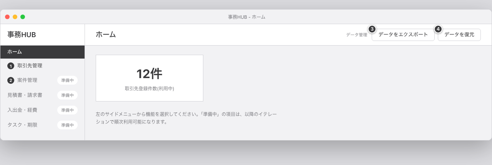
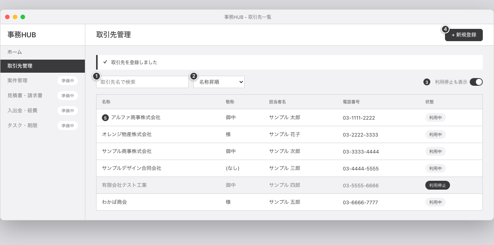
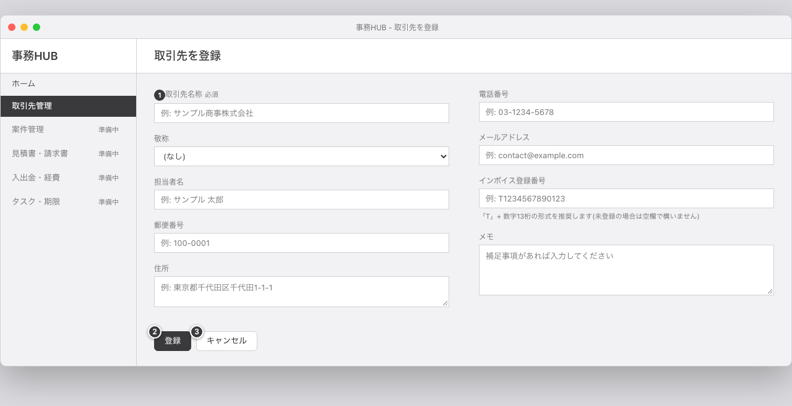
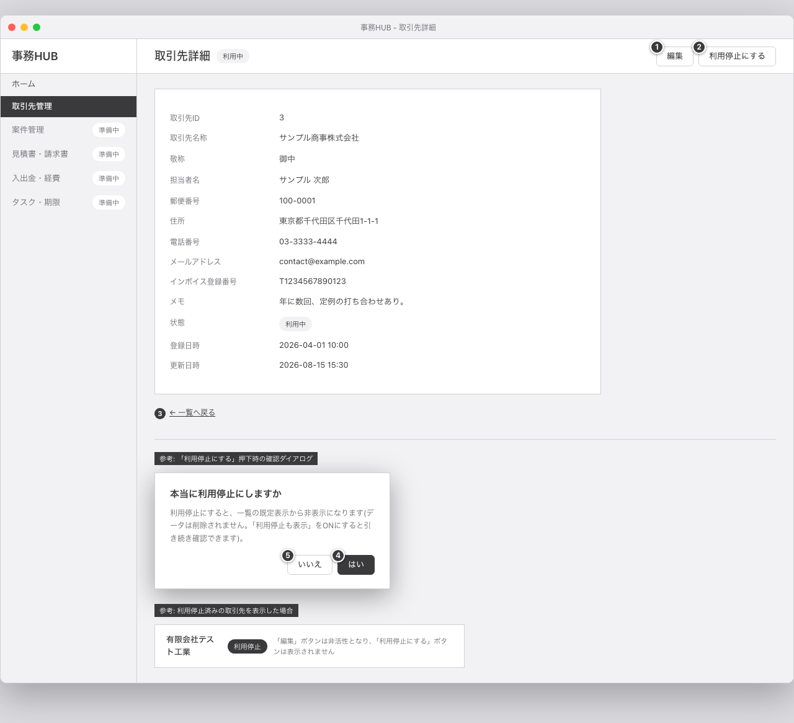
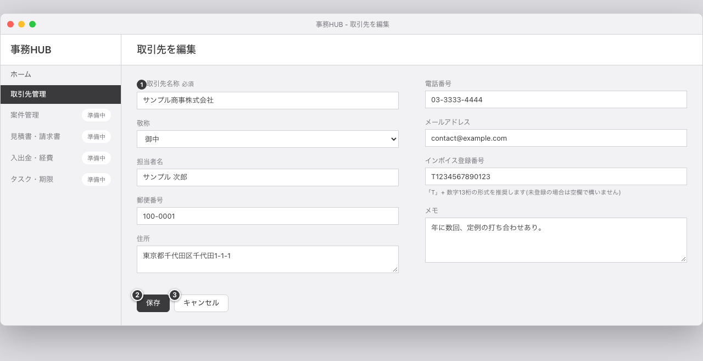
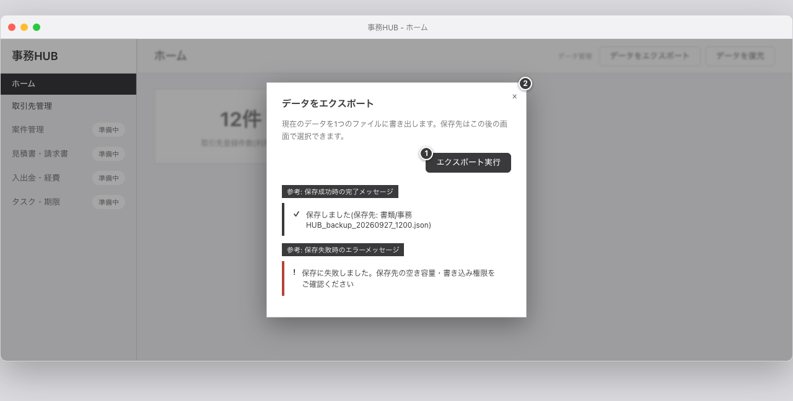
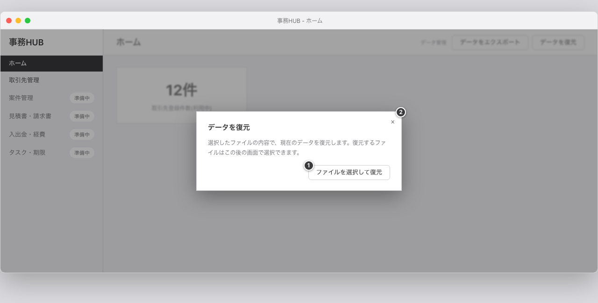
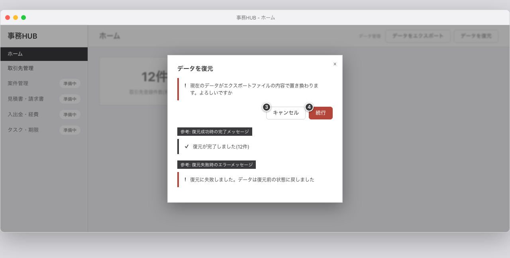

# 操作マニュアル

## 1. 文書情報

- 作成日: 2026-09-27
- 版数: v1.0
- 対象イテレーション: イテレーション0(プロジェクト方針・基盤構築)
- 参照元: 基本設計書.md v1.0(4章 画面設計)、詳細設計書.md v1.0、デザインガイド.md v1.0、`docs/04_design/mockups/`配下の注釈付き画像
- 想定読者: 専門的なIT知識をお持ちでない、事務HUBの利用者ご本人

## 2. インストールと初回起動

### 2.1 .dmgファイルを開く

1. お渡しした`事務HUB-0.1.0-universal.dmg`をダブルクリックします。
2. しばらくすると、ウィンドウが開き、事務HUBのアイコンと「Applications」フォルダへのショートカットが表示されます。

### 2.2 Applicationsフォルダへコピーする

1. 事務HUBのアイコンを、同じウィンドウ内の「Applications」フォルダのアイコンへドラッグ&ドロップします。
2. これでMac本体に事務HUBがインストールされます。開いたウィンドウは閉じてかまいません(元の`.dmg`ファイルは、あとで消してしまってもインストール済みのアプリには影響しません)。

### 2.3 初回起動時の確認(Gatekeeperの警告)

事務HUBは、Apple社の審査(コード署名)を受けていない配布形式のため、初めて起動するときにmacOSから警告が表示されます。これは事務HUB固有の問題ではなく、未審査のアプリすべてに共通する、macOSの安全確認の仕組みです。次の手順で開いてください(実機で確認済みの手順です)。

1. Launchpadや「アプリケーション」フォルダから事務HUBを開こうとすると、警告画面が表示されます。いったん警告を閉じます。
2. 画面左上のAppleメニューから「システム設定」を開き、「プライバシーとセキュリティ」を選びます。
3. 画面を下の方へスクロールすると「"事務HUB"は開発元を確認できないため、使用がブロックされました。」といった表示があります。その横の「このまま開く」ボタンを押します。
4. Macのログインパスワードの入力を求められるので、入力します。
5. 確認画面がもう一度表示されるので、再度「このまま開く」を押すと、事務HUBが起動します。

**ご注意**: 一部のmacOS解説記事にある「アイコンを右クリックして『開く』を選ぶ」という方法は、最近のmacOSのバージョンでは使えません。上記の「システム設定」からの手順をご利用ください。

2回目以降の起動では、この確認は不要です。通常どおりLaunchpad等からダブルクリックで起動できます。

## 3. 各画面の操作

### 3.1 ホーム画面(F-01)

事務HUBを起動すると、最初に表示される画面です。

| 番号 | 操作対象 | 操作すると起こること | 遷移先 |
|---|---|---|---|
| ① | 取引先管理メニュー | 取引先の一覧画面を開きます | 取引先一覧画面(3.2) |
| ② | 準備中のメニュー(案件管理・見積書請求書・入出金経費・タスク期限) | 「以降のイテレーションで実装予定です」という案内が表示されます。画面は変わりません | なし |
| ③ | データをエクスポート | データの書き出し(バックアップ)のダイアログを開きます | エクスポート画面(3.6) |
| ④ | データを復元 | データの復元のダイアログを開きます | 復元画面(3.7) |

### 3.2 取引先一覧画面(F-05)

登録済みの取引先を検索・並べ替えて確認できる画面です。

| 番号 | 操作対象 | 操作すると起こること | 遷移先 |
|---|---|---|---|
| ① | 取引先名で検索 | 入力した文字を名称に含む取引先だけに、一覧をすぐに絞り込みます | なし |
| ② | 並べ替え(名称昇順・名称降順・登録日新しい順・登録日古い順) | 選んだ条件で一覧を並べ替えます | なし |
| ③ | 利用停止も表示 | オンにすると、利用停止にした取引先も一覧に表示します(初期状態ではオンです) | なし |
| ④ | 新規登録 | 取引先を新しく登録する画面を開きます | 取引先登録画面(3.3) |
| ⑤ | 一覧の行 | クリックすると、その取引先の詳細画面を開きます | 取引先詳細画面(3.4) |

### 3.3 取引先を登録する画面(F-04)

| 番号 | 操作対象 | 操作すると起こること | 遷移先 |
|---|---|---|---|
| ① | 入力欄(取引先名称ほか) | 各項目を入力します。必須項目は「取引先名称」だけです。他の項目は空欄のままでも登録できます | なし |
| ② | 登録 | 入力内容を確認し、問題がなければ登録して一覧画面へ戻ります | 取引先一覧画面(3.2) |
| ③ | キャンセル | 入力内容を保存せずに一覧画面へ戻ります | 取引先一覧画面(3.2) |

必須項目(取引先名称)が空欄のまま「登録」を押すと、その項目にエラーメッセージが表示され、登録は行われません。

### 3.4 取引先詳細画面(F-06・F-08)

登録済みの取引先の内容をすべて確認できる画面です。

| 番号 | 操作対象 | 操作すると起こること | 遷移先 |
|---|---|---|---|
| ① | 編集 | この取引先の内容を編集する画面を開きます(利用停止中の取引先では押せません) | 取引先編集画面(3.5) |
| ② | 利用停止にする | 確認のメッセージ(「本当に利用停止にしますか」)を表示します(利用中の取引先のときだけ表示されるボタンです) | なし(確認メッセージの表示のみ) |
| ③ | 一覧へ戻る | 取引先一覧画面へ戻ります | 取引先一覧画面(3.2) |
| ④ | はい(確認メッセージ内) | この取引先を利用停止にします。データそのものは削除されません | なし(同じ画面のまま、表示が更新されます) |
| ⑤ | いいえ(確認メッセージ内) | 何も行わず、確認メッセージを閉じます | なし |

**利用停止について**: 「利用停止」は、データを完全に削除するものではありません。一覧の初期表示からは外れますが、一覧の「利用停止も表示」をオンにすればいつでも確認できます。誤って利用停止にしてしまっても、データが失われることはありません(元に戻す操作は今回未実装のため、必要な場合は編集画面から状態以外の内容を確認・修正いただけます)。

### 3.5 取引先を編集する画面(F-07)

| 番号 | 操作対象 | 操作すると起こること | 遷移先 |
|---|---|---|---|
| ① | 入力欄 | 登録済みの内容があらかじめ入力された状態で表示されます。必要な箇所を書き換えます | なし |
| ② | 保存 | 変更内容を確認し、問題がなければ更新して詳細画面へ戻ります | 取引先詳細画面(3.4) |
| ③ | キャンセル | 変更内容を保存せずに詳細画面へ戻ります | 取引先詳細画面(3.4) |

### 3.6 データをエクスポートする(F-02)

現在のすべてのデータを1つのファイル(バックアップ)に書き出す機能です。

| 番号 | 操作対象 | 操作すると起こること |
|---|---|---|
| ① | エクスポート実行 | Macの標準の保存先選択ダイアログが開きます。初期フォルダは「書類」、初期のファイル名は`事務HUB_backup_日付_時刻.json`です。保存先を選んで保存すると、その時点の全データが1つのJSONファイルに書き出されます |
| ② | 閉じる(×) | 何も行わず、ダイアログを閉じます |

保存が終わると「保存しました(保存先: 〇〇)」という完了メッセージが表示されます。保存先の空き容量が足りない等で失敗した場合は、エラーメッセージが表示されます。

### 3.7 データを復元する(F-03)

エクスポートしたファイルの内容で、現在のデータをすべて置き換える機能です。**現在のデータは復元前の内容に戻せなくなりますので、操作前に内容をよくご確認ください。**

| 番号 | 操作対象 | 操作すると起こること |
|---|---|---|
| ① | ファイルを選択して復元 | この時点ではデータは変わりません。警告の表示に切り替わります(下の画像) |
| ② | 閉じる(×) | 何も行わず、ダイアログを閉じます |

| 番号 | 操作対象 | 操作すると起こること |
|---|---|---|
| ③ | キャンセル | 復元を行わず、1段階目の画面に戻ります |
| ④ | 続行(赤いボタン) | Macの標準のファイル選択ダイアログが開きます。`.json`ファイルのみ選択できます。ファイルを選ぶと、その内容で現在のデータをすべて置き換えます。**この操作は元に戻せません** |

復元が終わると「復元が完了しました(〇件)」という完了メッセージが表示され、一覧などの表示が最新化されます。ファイルの形式が不正、または対応していないバージョンのファイルの場合は、エラーメッセージが表示され、データは復元前の状態のまま変わりません。

## 4. バックアップと復元の考え方

- 事務HUBは自動でバックアップを取る機能はありません。3.6章の「データをエクスポート」を、ご自身のタイミングで定期的に行っていただくことをおすすめします。
- 復元操作(3.7章)を行うと、現在のデータは自動的に退避コピーとして保存されます(直近3世代まで保持され、それより古いものは自動的に削除されます)。ただし、この退避コピーは事務HUBの操作画面から直接取り出すことはできません。万一の際は、開発担当者にご相談ください。
- 確実にデータを守るためには、エクスポートしたファイルを、Mac本体とは別の場所(外部ストレージ等)にも保管していただくことをおすすめします。

## 5. データの取り扱いにあたっての注意

事務HUBで扱う取引先データ(氏名・住所・電話番号・メールアドレス等)は、今回は暗号化されていません。安全にお使いいただくため、次の点にご注意ください。

1. **Macのログインパスワードの設定と、FileVault(ディスクの暗号化)の有効化をおすすめします。** 「システム設定」の「プライバシーとセキュリティ」からFileVaultを有効にできます。これにより、Mac本体を紛失・盗難された場合でも、データが読み取られにくくなります。
2. **エクスポートしたファイル(バックアップ)の保管場所にご注意ください。** ファイルには取引先の個人情報がそのまま含まれます。クラウドの共有フォルダやメール添付での送信は避け、外部ストレージに保管する場合は施錠できる場所に保管してください。不要になったファイルは削除してください。
3. **復元操作を行うと、直近3世代の退避コピーがデータの保存フォルダ内に自動的に残ります。** これらも取引先の個人情報を含みますので、上記1のFileVault等でパソコン全体を保護していただくことが安全につながります。
4. **Macを譲渡・廃棄されるときは、データの保存フォルダとエクスポートファイルを削除してください。** 保存フォルダの場所は`~/Library/Application Support/事務HUB/`です(あるいは、Mac自体を初期化していただく方法もあります)。

## 6. 困ったときは

### 6.1 起動しようとすると、エラーの画面が表示される

データベースファイルが壊れている場合に表示される画面です。**現在のバージョンでは、この画面からそのまま復元操作を行うことができません。**お手数をおかけしますが、次の手順で対処してください。

1. 事務HUBを終了します。
2. Finderのメニューから「移動」→「フォルダへ移動」を選び、`~/Library/Application Support/事務HUB/` と入力してフォルダを開きます。
3. フォルダの中にある`data.sqlite`と、同じ名前で始まる`data.sqlite-wal`・`data.sqlite-shm`(ある場合)を、まとめてデスクトップなど別の場所へ移動します(消さずに、念のため退避してください)。
4. 事務HUBを再度起動します。新しいデータベースファイルが作られ、通常どおり起動します(データは空の状態から始まります)。
5. お手元にエクスポートファイル(バックアップ)がある場合は、3.7章の手順で「データを復元」を行ってください。登録していた取引先データが元に戻ります。

バックアップを取っていない場合、破損したデータベースファイル(手順3で退避したもの)から直接データを取り出すことは、現在のバージョンではできません。ご不明な点は開発担当者までご連絡ください。

なお、この対処が必要になる状況を減らすため、3.6章の「データをエクスポート」をこまめに行っていただくことを強くおすすめします。

### 6.2 うまく起動しない・その他の不具合

上記以外の症状でお困りの場合は、症状が起きたときの操作手順と、可能であれば画面のスクリーンショットを添えて、開発担当者までご連絡ください。

## 7. 変更履歴

| 版数 | 日付 | 内容 |
|---|---|---|
| v0.0 | 2026-09-27 | 初版作成。インストール・初回起動(Gatekeeperの許可手順)、F-01〜F-07の各画面の操作、バックアップと復元の考え方、データの取り扱いにあたっての注意(4項目)、起動エラー時の対処手順を整理した。 |
| v1.0 | 2026-09-27 | イテレーション0の総括(イテレーション総括.md v1.0)で完了と判定されたため、v1.0とし次イテレーションの起点とした。本文の変更はない。 |
