# 操作マニュアル

## 1. 文書情報

- 作成日: 2026-09-27(初版)/ 2026-10-03(v1.1改訂)
- 版数: v2.0
- 対象イテレーション: イテレーション1(見積書・請求書作成)。対象アプリの版数は0.2.0です
- 参照元: 基本設計書.md v2.0(4章 画面設計)、詳細設計書.md v2.0、デザインガイド.md v2.0、セキュリティチェック結果報告書.md v2.0(9章)、`docs/09_deploy/images/`の注釈付き画像
- 想定読者: 専門的なIT知識をお持ちでない、事務HUBの利用者ご本人

## 2. インストールと初回起動

### 2.1 更新の前に(すでに事務HUB 0.1.0をお使いの場合)

1. 現在の事務HUBを開き、トップ画面の「データをエクスポート」から、データを書き出して保存します(3.12章)。0.1.0で書き出したファイル(JSON形式)は、新しい版でも復元できます。
2. 事務HUBを終了します(メニューバーの「事務HUB」→「事務HUBを終了」)。

新しい版を初めて起動すると、データの形式が自動的に新しい版へ移行されます。移行中の操作は必要ありません。

### 2.2 .dmgファイルを開く

1. お渡しした`事務HUB-0.2.0-universal.dmg`をダブルクリックします。
2. しばらくすると、ウィンドウが開き、事務HUBのアイコンと「Applications」フォルダへのショートカットが表示されます。

(任意)お渡しした`.dmg`が途中で差し替えられていないかは、納品書.md 6.1章のSHA-256の値と照らして確認できます。

### 2.3 Applicationsフォルダへコピーする

1. 事務HUBのアイコンを、同じウィンドウ内の「Applications」フォルダのアイコンへドラッグ&ドロップします。
2. すでに事務HUB 0.1.0が入っている場合は、「置き換える」を選びます。データは、アプリとは別の場所に保存されているため、置き換えても消えません。
3. これで事務HUBがインストールされます。開いたウィンドウは閉じてかまいません(元の`.dmg`ファイルは、あとで消してもインストール済みのアプリには影響しません)。

### 2.4 初回起動時の確認(Gatekeeperの警告)

事務HUBは、Apple社の審査(コード署名)を受けていない配布形式のため、初めて起動するときにmacOSから警告が表示されます。これは事務HUB固有の問題ではなく、未審査のアプリすべてに共通する、macOSの安全確認の仕組みです。新しい版に置き換えた場合も、あらためて表示されることがあります。次の手順で開いてください。

1. Launchpadや「アプリケーション」フォルダから事務HUBを開こうとすると、警告画面が表示されます。いったん警告を閉じます。
2. 画面左上のAppleメニューから「システム設定」を開き、「プライバシーとセキュリティ」を選びます。
3. 画面を下の方へスクロールすると「"事務HUB"は開発元を確認できないため、使用がブロックされました。」といった表示があります。その横の「このまま開く」ボタンを押します。
4. Macのログインパスワードの入力を求められるので、入力します。
5. 確認画面がもう一度表示されるので、再度「このまま開く」を押すと、事務HUBが起動します。

**ご注意**: 一部のmacOS解説記事にある「アイコンを右クリックして『開く』を選ぶ」という方法は、最近のmacOSのバージョンでは使えません。上記の「システム設定」からの手順をご利用ください。

2回目以降の起動では、この確認は不要です。通常どおりLaunchpad等からダブルクリックで起動できます。

## 3. 各画面の操作

初めてお使いになるときは、3.6章(自社情報・振込先の設定)を先に行っていただくと、見積書・請求書をスムーズに作成できます。画面の左側にあるサイドメニューから、各画面へ移動できます。

### 3.1 ホーム画面(F-01)

事務HUBを起動すると、最初に表示される画面です。

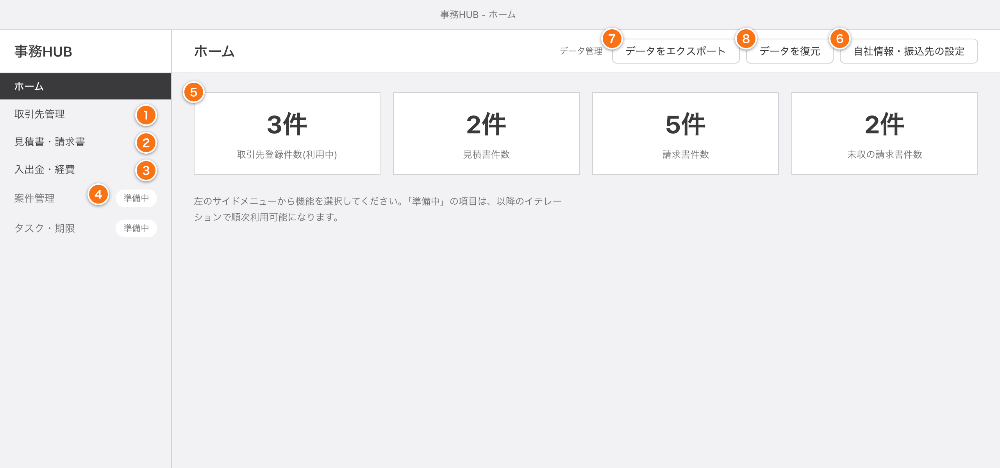

| 番号 | 操作対象 | 操作すると起こること | 遷移先 |
|---|---|---|---|
| ① | 取引先管理メニュー | 取引先の一覧画面を開きます | 取引先一覧画面(3.2) |
| ② | 見積書・請求書メニュー | 見積書・請求書の一覧画面を開きます | 見積書・請求書一覧画面(3.7) |
| ③ | 準備中のメニュー(案件管理・入出金経費・タスク期限) | 「以降のイテレーションで実装予定です」という案内が表示されます。画面は変わりません | なし |
| ④ | 件数カード(取引先・見積書・請求書・未収の請求書) | 現在の件数を表示します(未収の請求書は、PDF保存済みで未入金の請求書の数です。下書きは含みません) | なし |
| ⑤ | 自社情報・振込先の設定 | 見積書・請求書に載せる自社情報を設定する画面を開きます | 自社情報・振込先設定画面(3.6) |
| ⑥ | データをエクスポート | データの書き出し(バックアップ)のダイアログを開きます | エクスポート画面(3.12) |
| ⑦ | データを復元 | データの復元のダイアログを開きます | 復元画面(3.13) |

### 3.2 取引先一覧画面(F-05)

登録済みの取引先を検索・並べ替えして確認できる画面です。

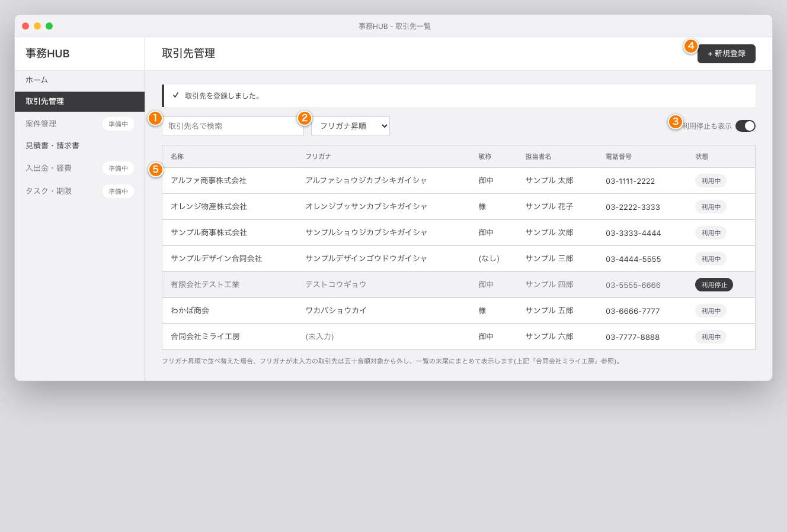

| 番号 | 操作対象 | 操作すると起こること | 遷移先 |
|---|---|---|---|
| ① | 取引先名で検索 | 入力した文字を名称に含む取引先だけに、一覧をすぐに絞り込みます | なし |
| ② | 並べ替え(フリガナ順・名称昇順・名称降順・登録日新しい順・登録日古い順) | 選んだ条件で一覧を並べ替えます。フリガナ順では、フリガナ未入力の取引先が末尾になります | なし |
| ③ | 利用停止も表示 | オンにすると、利用停止にした取引先も一覧に表示します | なし |
| ④ | 新規登録 | 取引先を新しく登録する画面を開きます | 取引先登録画面(3.3) |
| ⑤ | 一覧の行 | クリックすると、その取引先の詳細画面を開きます | 取引先詳細画面(3.4) |

### 3.3 取引先を登録する画面(F-04)

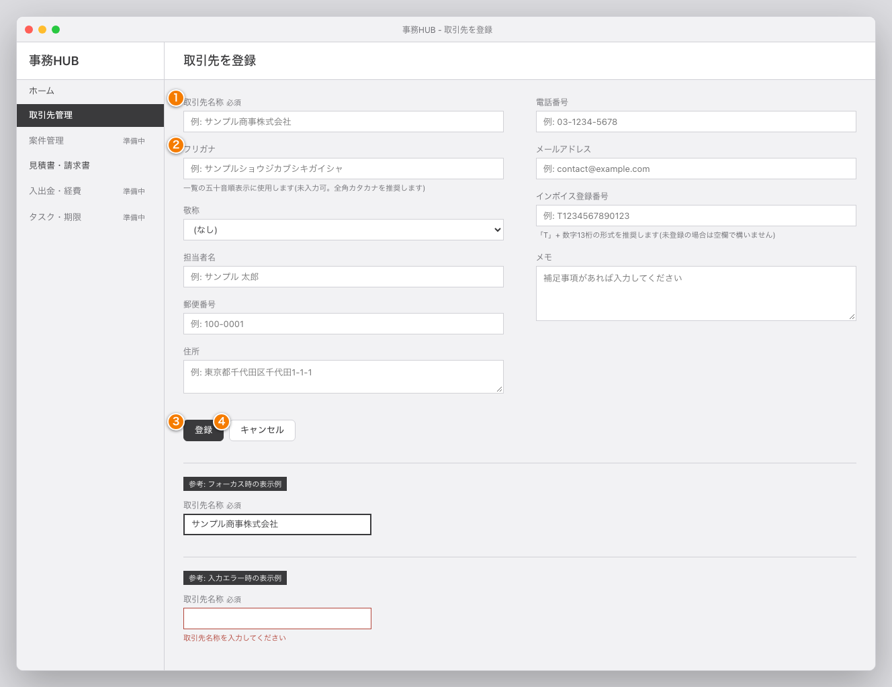

| 番号 | 操作対象 | 操作すると起こること | 遷移先 |
|---|---|---|---|
| ① | 入力欄(取引先名称ほか) | 各項目を入力します。必須項目は「取引先名称」だけです。他の項目は空欄のままでも登録できます | なし |
| ② | フリガナ | 五十音順の並べ替えに使います。全角カタカナで入力します(ひらがなで入力しても、自動でカタカナに変わります) | なし |
| ③ | 登録 | 入力内容を確認し、問題がなければ登録して一覧画面へ戻ります | 取引先一覧画面(3.2) |
| ④ | キャンセル | 入力内容を保存せずに一覧画面へ戻ります | 取引先一覧画面(3.2) |

必須項目(取引先名称)が空欄のまま「登録」を押すと、その項目にエラーメッセージが表示され、登録は行われません。入力の途中でサイドメニューを押して他の画面へ移ろうとすると、「入力中の内容は保存されません。この画面を離れてよろしいですか」という確認が表示されます(「キャンセル」で入力画面に残れます)。

### 3.4 取引先詳細画面(F-06・F-08)

登録済みの取引先の内容をすべて確認できる画面です。

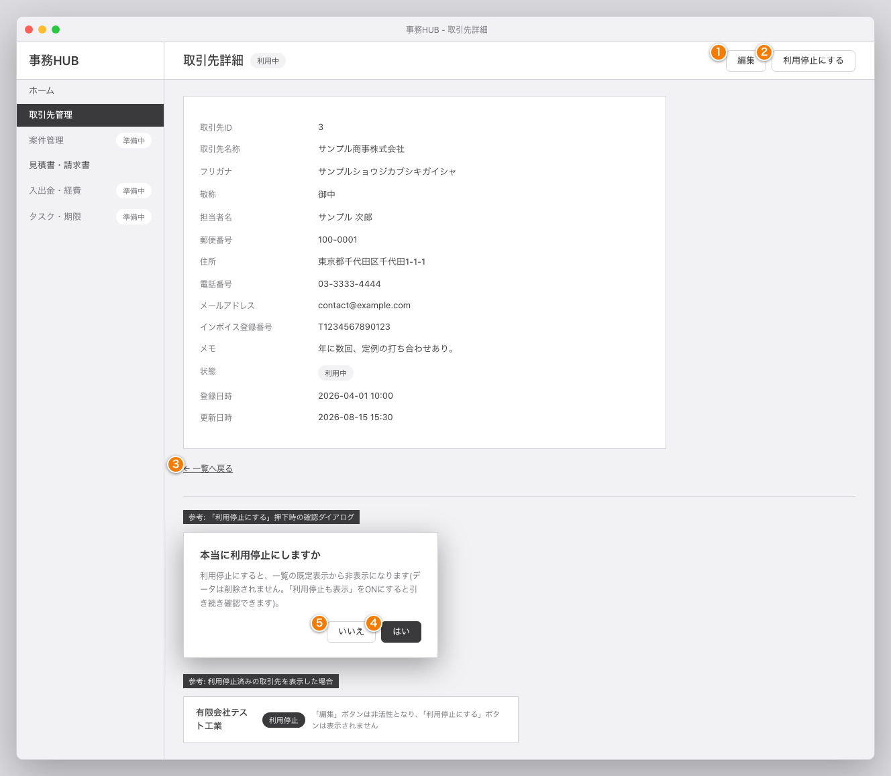

| 番号 | 操作対象 | 操作すると起こること | 遷移先 |
|---|---|---|---|
| ① | 編集 | この取引先の内容を編集する画面を開きます(利用停止中の取引先では押せません) | 取引先編集画面(3.5) |
| ② | 利用停止にする | 確認のメッセージ(「本当に利用停止にしますか」)を表示します(利用中の取引先のときだけ表示されるボタンです) | なし(確認メッセージの表示のみ) |
| ③ | 一覧へ戻る | 取引先一覧画面へ戻ります | 取引先一覧画面(3.2) |
| ④ | はい(確認メッセージ内) | この取引先を利用停止にします。データそのものは削除されません | なし(同じ画面のまま、表示が更新されます) |
| ⑤ | いいえ(確認メッセージ内) | 何も行わず、確認メッセージを閉じます | なし |

**利用停止について**: 「利用停止」は、データを完全に削除するものではありません。一覧の初期表示からは外れますが、「利用停止も表示」をオンにすればいつでも確認できます。利用停止にした取引先でも、すでに作成した見積書・請求書は残ります。

### 3.5 取引先を編集する画面(F-07)

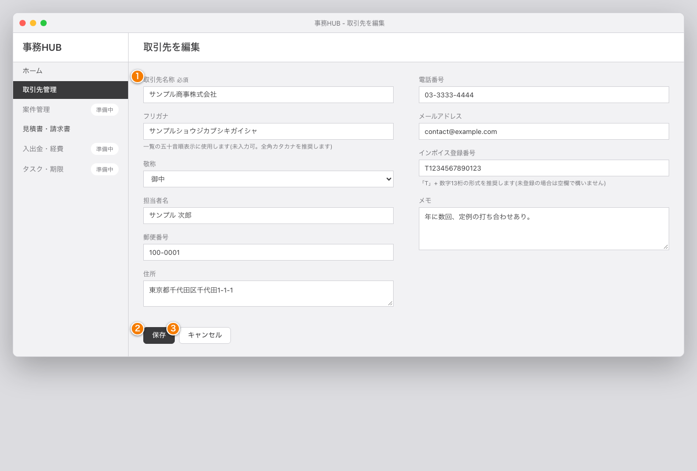

| 番号 | 操作対象 | 操作すると起こること | 遷移先 |
|---|---|---|---|
| ① | 入力欄 | 登録済みの内容があらかじめ入力された状態で表示されます。必要な箇所を書き換えます | なし |
| ② | 保存 | 変更内容を確認し、問題がなければ更新して詳細画面へ戻ります | 取引先詳細画面(3.4) |
| ③ | キャンセル | 変更内容を保存せずに詳細画面へ戻ります | 取引先詳細画面(3.4) |

### 3.6 自社情報・振込先を設定する画面(F-10)

見積書・請求書に載せる、ご自身の情報を登録する画面です。**自社情報が未設定の間は、見積書・請求書のPDF保存はできません。**

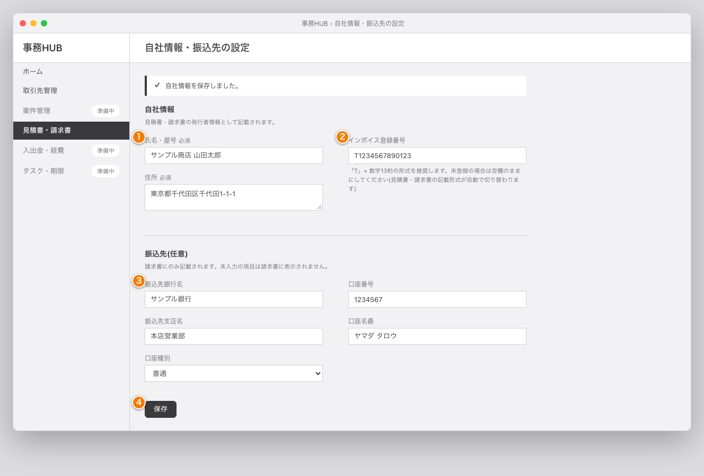

| 番号 | 操作対象 | 操作すると起こること | 遷移先 |
|---|---|---|---|
| ① | 氏名・屋号、住所 | 必須の項目です。見積書・請求書の差出人として記載されます | なし |
| ② | インボイス登録番号 | 任意です。入力すると「適格請求書」の形式で、入力しない場合は「区分記載請求書」の形式でPDFが作られます(自動で切り替わります) | なし |
| ③ | 振込先(銀行名・支店名・口座種別・口座番号・口座名義) | 任意です。入力した内容は請求書のPDFに記載されます。未入力の項目は記載されません | なし |
| ④ | 保存 | 入力内容を確認し、問題がなければ保存して、同じ画面に完了メッセージを表示します。見積書・請求書の作成画面から移ってきた場合は、保存後に元の作成画面へ戻ります | なし(作成画面から移ってきた場合は元の画面) |

氏名・屋号または住所が空欄のまま「保存」を押すと、エラーメッセージが表示され、保存は行われません。

### 3.7 見積書・請求書の一覧画面(F-12・F-14)

作成した見積書・請求書を探したり、新しく作成したりする画面です。

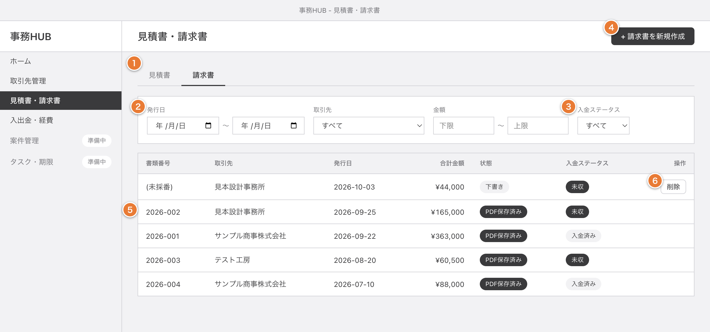

| 番号 | 操作対象 | 操作すると起こること | 遷移先 |
|---|---|---|---|
| ① | 見積書・請求書のタブ | 表示する書類の種類を切り替えます | なし |
| ② | 検索条件(発行日・取引先・金額の範囲) | 条件に合う書類だけに絞り込みます。発行日の終了日が開始日より前、または金額の上限が下限より小さいとエラーが表示され、条件を直すまで絞り込みは行われません | なし |
| ③ | 入金ステータス(請求書のタブのみ。すべて・未収・入金済み) | 請求書を入金ステータスで絞り込みます | なし |
| ④ | 新規作成(「見積書を新規作成」または「請求書を新規作成」) | 作成画面を開きます | 見積書作成画面(3.8)/請求書作成画面(3.10) |
| ⑤ | 一覧の行 | クリックすると詳細画面を開きます | 見積書詳細画面(3.9)/請求書詳細画面(3.11) |

条件に合う書類がないときは、「該当する見積書(請求書)がありません」と表示されます。

### 3.8 見積書を作成する画面(F-11・F-12)

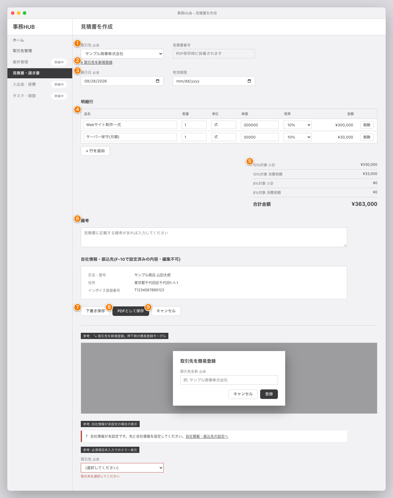

| 番号 | 操作対象 | 操作すると起こること | 遷移先 |
|---|---|---|---|
| ① | 取引先の選択 | 利用中の取引先から選びます | なし |
| ② | 「+ 取引先を新規登録」リンク | 小さな登録画面が開き、取引先名称(必須)を入力して登録すると、その取引先が選ばれた状態になります。取引先一覧にも追加されます | なし(同じ画面で入力を続けられます) |
| ③ | 発行日・有効期限 | 発行日は必須(初期値は本日)、有効期限は任意です。「2026-10-03」のように、実在する日付を入力します | なし |
| ④ | 明細行(品名・数量・単位・単価・税率) | 品名は必須です。税率は10%と8%から選びます。金額は自動で計算されます。「行を追加」で行が増え、「削除」で行がなくなります(1行は必ず残ります) | なし |
| ⑤ | 小計・消費税・合計 | 税率ごとの小計と消費税額、合計金額が自動で表示されます | なし |
| ⑥ | 備考 | 任意です。自由に記入できます | なし |
| ⑦ | 下書き保存 | 内容を確認し、問題がなければ下書きとして保存します。番号は、まだ付きません | 見積書詳細画面(3.9) |
| ⑧ | PDFとして保存 | 見積書番号(例: 2026-001)が付き、PDFが作られます。**保存したあとは、内容を変更できません。** 自社情報が未設定の場合は、設定画面への案内が表示されます | 見積書詳細画面(3.9) |
| ⑨ | キャンセル | 保存せずに一覧画面へ戻ります | 見積書・請求書一覧画面(3.7) |

- PDFの保存に失敗した場合は、内容は下書きとして残ります。もう一度「PDFとして保存」を押してください。失敗した回の番号は欠番になることがあります(番号が飛んでも問題ありません)。
- 作成中にサイドメニューを押すと、確認のメッセージが表示されます。

### 3.9 見積書の詳細画面(F-12・F-13)

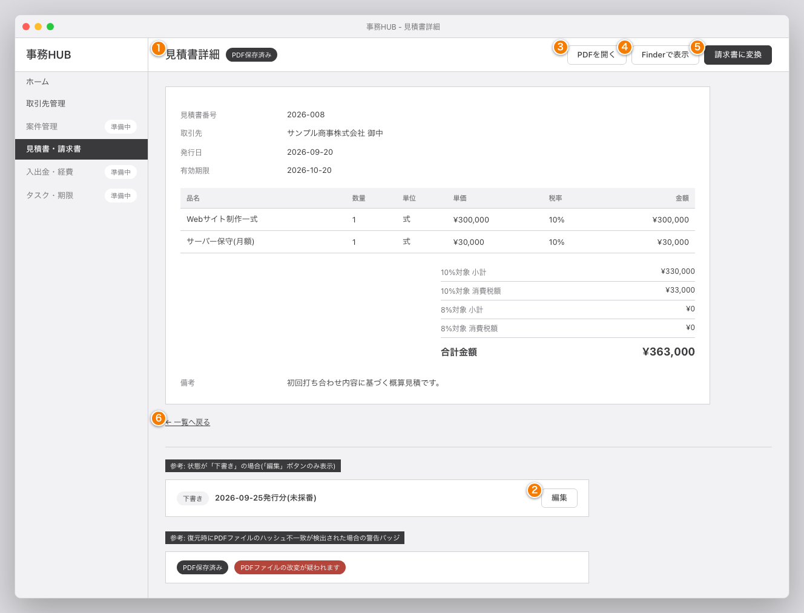

| 番号 | 操作対象 | 操作すると起こること | 遷移先 |
|---|---|---|---|
| ① | 状態の表示(下書き/PDF保存済み)と見積書番号 | 現在の状態と、確定した番号を確認できます | なし |
| ② | 編集(下書きのときのみ) | 見積書作成画面を、編集の状態で開きます | 見積書作成画面(3.8) |
| ③ | PDFを開く(PDF保存済みのみ) | Macの標準のアプリでPDFを開きます。ファイルが見つからないときは、その旨が表示されます | なし |
| ④ | Finderで表示(PDF保存済みのみ) | PDFが保存されている場所をFinderで開き、そのPDFが選ばれた状態で表示します(下記参照) | なし |
| ⑤ | 請求書に変換(PDF保存済みのみ) | 見積書の取引先・明細・備考を引き継いだ請求書の下書きを作ります。何度でも変換できます | 請求書詳細画面(3.11) |
| ⑥ | 一覧へ戻る | 一覧画面へ戻ります | 見積書・請求書一覧画面(3.7) |

**PDFの保存場所**: PDFは、次のフォルダに自動で保存されます。
- 見積書: `~/Library/Application Support/事務HUB/documents/quotes/<西暦年>/`
- 請求書: `~/Library/Application Support/事務HUB/documents/invoices/<西暦年>/`

Finderでは、通常「ライブラリ」フォルダが表示されないため、ご自身で探すのは難しいことがあります。「Finderで表示」を押すと、該当のPDFが選ばれた状態でFinderが開きますので、こちらをご利用ください。PDFのファイルを、Finderで移動したり削除したりしないでください(5章・7.2章)。

「PDFファイルの改変が疑われます」という警告が表示された場合は、データの復元時に、PDFが保存時と異なる、または見つからなかったことを示します。5章もご覧ください。

### 3.10 請求書を作成する画面(F-14・F-16)

基本の操作は見積書作成画面(3.8)と同じです。違いは次のとおりです。

**請求書の作り方は2通りあります。**

| | 見積書から「請求書に変換」 | 請求書を「新規作成」 |
|---|---|---|
| 取引先・明細行・備考 | 見積書の内容が引き継がれます | 空の状態から入力します |
| 発行日 | 本日の日付になります | 本日の日付(初期値)です |
| 支払期限 | 空欄です。必要に応じて入力します | 空欄です(任意) |
| 源泉徴収 | 引き継がれません。必要な行に、あとから「源泉徴収対象」のチェックを入れます | 必要な行にチェックを入れます |
| 元の見積書との関係 | 元の見積書へのリンクが残り、請求書と見積書を行き来できます | リンクはありません |

見積書からの変換は、何度でも行えます。変換して作られた請求書は、まず下書きの状態で表示されますので、内容を確認・修正してから「PDFとして保存」を押してください。

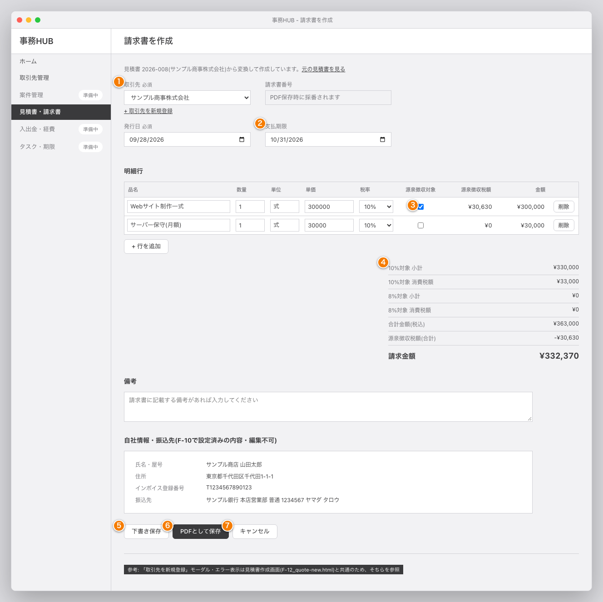

| 番号 | 操作対象 | 操作すると起こること | 遷移先 |
|---|---|---|---|
| ① | 取引先の選択・発行日 | 見積書作成画面と同じです。見積書から変換してきた場合は、取引先・明細・備考があらかじめ入っていて、元の見積書へのリンクが表示されます | なし |
| ② | 支払期限 | 任意です。実在する日付を入力します | なし |
| ③ | 明細行の「源泉徴収対象」チェック | チェックを入れた行の金額(税抜)の合計に対して、源泉徴収税額が自動で計算されます | なし |
| ④ | 小計・消費税・源泉徴収税額・請求金額 | 合計金額から源泉徴収税額を引いた「請求金額」が自動で表示されます | なし |
| ⑤ | 下書き保存 | 下書きとして保存します | 請求書詳細画面(3.11) |
| ⑥ | PDFとして保存 | 請求書番号が付き、PDFが作られます(自社情報の振込先が記載されます)。**保存したあとは、内容を変更できません。** | 請求書詳細画面(3.11) |
| ⑦ | キャンセル | 保存せずに一覧画面へ戻ります | 見積書・請求書一覧画面(3.7) |

### 3.11 請求書の詳細画面(F-14・F-15)

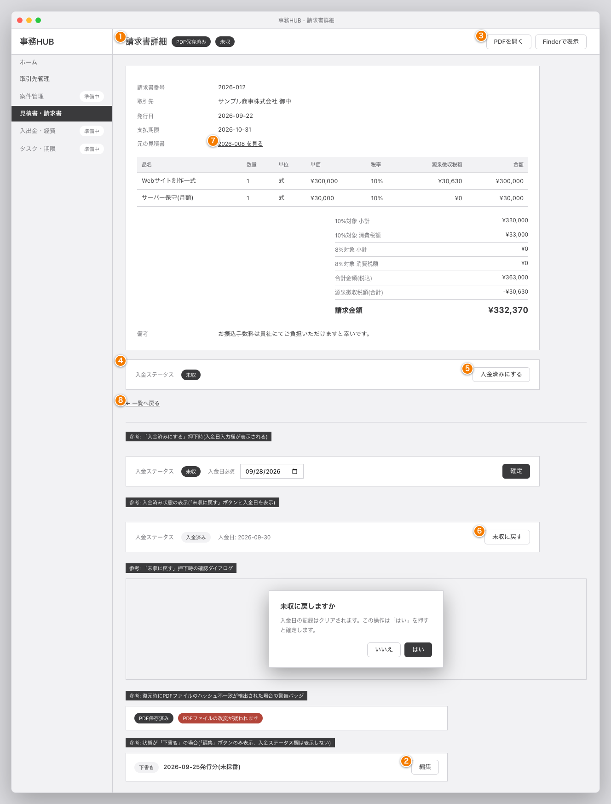

| 番号 | 操作対象 | 操作すると起こること | 遷移先 |
|---|---|---|---|
| ① | 状態の表示と請求書番号 | 下書き/PDF保存済み、および確定した番号を確認できます | なし |
| ② | 編集(下書きのときのみ) | 請求書作成画面を、編集の状態で開きます | 請求書作成画面(3.10) |
| ③ | PDFを開く/Finderで表示(PDF保存済みのみ) | 見積書の詳細画面(3.9)と同じです | なし |
| ④ | 入金ステータス(未収/入金済み) | 現在の状況を確認できます | なし |
| ⑤ | 入金済みにする(PDF保存済みで未収のとき) | 入金日を入力する欄が表示され、確定すると「入金済み」になります。入金日は必須で、実在する日付を入力します | なし(同じ画面) |
| ⑥ | 未収に戻す(入金済みのとき) | 確認のメッセージのあと、「はい」で「未収」に戻ります(入金日は消えます) | なし(同じ画面) |
| ⑦ | 元の見積書を見る(見積書から変換した場合のみ) | 元の見積書の詳細画面を開きます | 見積書詳細画面(3.9) |
| ⑧ | 一覧へ戻る | 請求書のタブが選ばれた一覧画面へ戻ります | 見積書・請求書一覧画面(3.7) |

### 3.12 データをエクスポートする(F-02)

現在のすべてのデータ(取引先・自社情報・見積書・請求書)と、保存済みの見積書・請求書のPDFを、1つのZIPファイル(バックアップ)に書き出す機能です。

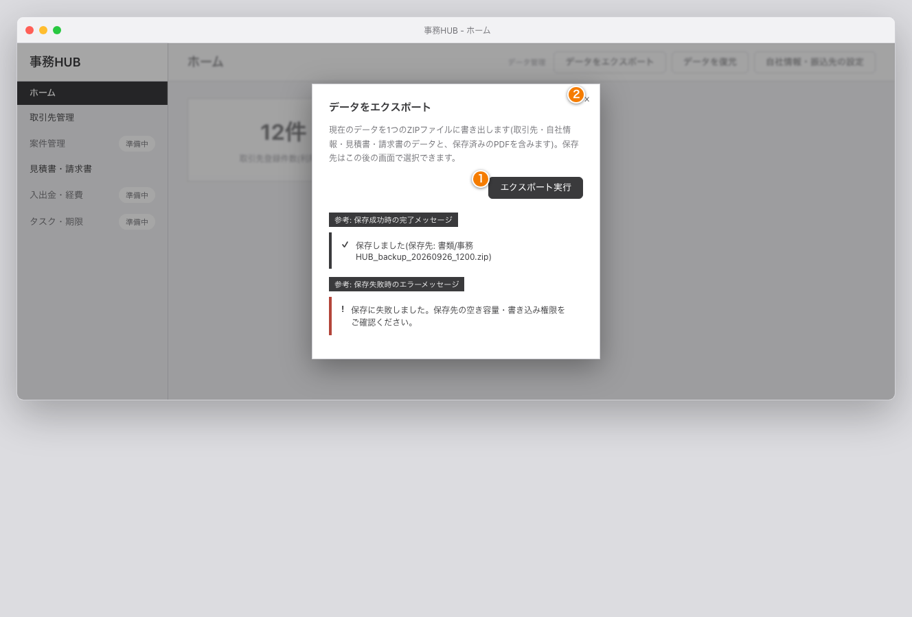

| 番号 | 操作対象 | 操作すると起こること |
|---|---|---|
| ① | エクスポート実行 | Macの標準の保存先選択ダイアログが開きます。初期フォルダは「書類」、初期のファイル名は`事務HUB_backup_日付_時刻.zip`です。保存先を選んで保存すると、その時点の全データが1つのZIPファイルに書き出されます |
| ② | 閉じる(×) | 何も行わず、ダイアログを閉じます |

保存が終わると「保存しました(保存先: 〇〇)」という完了メッセージが表示されます。保存先の空き容量が足りない等で失敗した場合は、エラーメッセージが表示されます。**ZIPファイルは解凍せず、そのまま保管してください。**

### 3.13 データを復元する(F-03)

エクスポートしたファイルの内容で、現在のデータをすべて置き換える機能です。**現在のデータは復元前の内容に戻せなくなりますので、操作前に内容をよくご確認ください。** 新しい形式(ZIP)に加え、事務HUB 0.1.0で書き出した古い形式(JSON)も復元できます。古い形式にはPDFが含まれないため、復元後は、過去のPDFを開く操作で「見つかりません」という案内が表示されます。

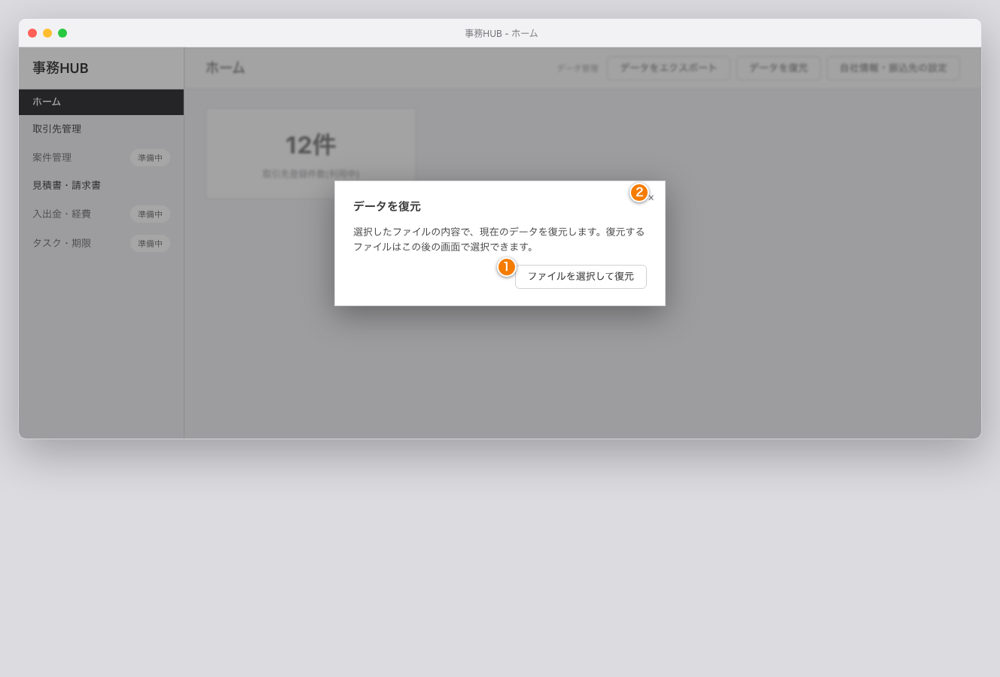

| 番号 | 操作対象 | 操作すると起こること |
|---|---|---|
| ① | ファイルを選択して復元 | この時点ではデータは変わりません。警告の表示に切り替わります(下の画像) |
| ② | 閉じる(×) | 何も行わず、ダイアログを閉じます |

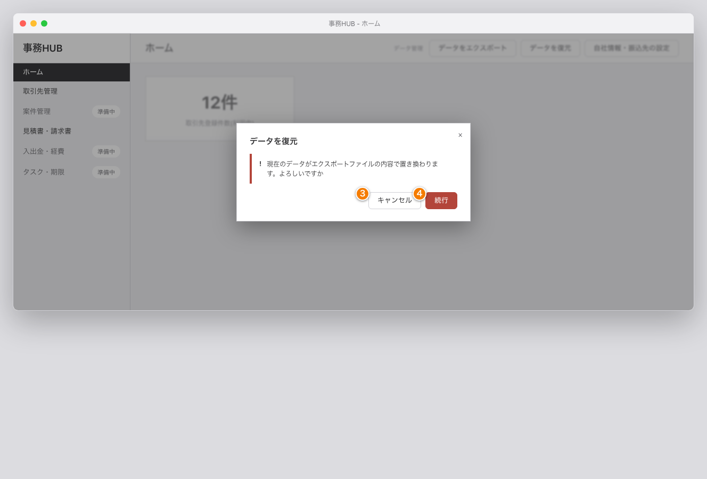

| 番号 | 操作対象 | 操作すると起こること |
|---|---|---|
| ③ | キャンセル | 復元を行わず、1段階目の画面に戻ります |
| ④ | 続行(赤いボタン) | Macの標準のファイル選択ダイアログが開きます。`.zip`と`.json`のファイルを選択できます。ファイルを選ぶと、その内容で現在のデータをすべて置き換えます。**この操作は元に戻せません** |

復元が終わると「復元が完了しました(〇件)」という完了メッセージが表示され、警告文とボタンは消えます。ファイルの形式が不正、または対応していないバージョンのファイルの場合は、エラーメッセージが表示され、データは復元前の状態のまま変わりません。復元したPDFが保存時の内容と一致しない書類には、詳細画面に警告が表示されます。

### 3.14 起動エラー画面(F-09)

データの保存ファイルが壊れているなどで、事務HUBが起動できないときに表示される画面です。

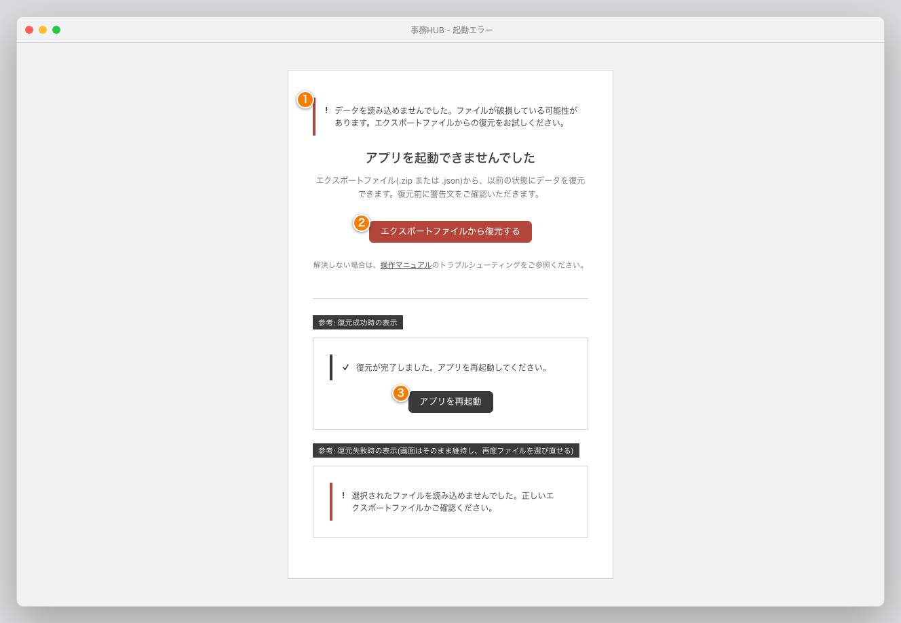

| 番号 | 操作対象 | 操作すると起こること |
|---|---|---|
| ① | エラーの説明(「データを読み込めませんでした」) | 起動できなかったことをお知らせします |
| ② | エクスポートファイルから復元する | 3.13章と同じ復元の操作です。お手元のバックアップ(ZIPまたはJSON)を選ぶと、破損したデータは別の場所に退避されたうえで、新しいデータとして復元されます。失敗した場合は元の状態に戻り、ファイルを選び直せます |
| ③ | アプリを再起動 | 復元が成功したあとに表示されます。押すと事務HUBが自動で再起動します |

## 4. バックアップと復元の考え方

- 事務HUBは自動でバックアップを取る機能はありません。3.12章の「データをエクスポート」を、ご自身のタイミングで定期的に行っていただくことをおすすめします。特に、見積書・請求書を作成・PDF保存したあとや、アプリを新しい版にする前に行ってください。
- 復元操作(3.13章)を行うと、現在のデータ(PDFを含む)は自動的に退避コピーとして保存されます(それぞれ直近3世代まで保持され、それより古いものは自動的に削除されます)。ただし、この退避コピーは事務HUBの操作画面から直接取り出すことはできません。万一の際は、開発担当者にご相談ください。
- 確実にデータを守るためには、エクスポートしたファイルを、Mac本体とは別の場所(外部ストレージ等)にも保管していただくことをおすすめします。

## 5. データの取り扱いにあたっての注意

事務HUBで扱うデータ(取引先の氏名・住所・連絡先、自社情報、振込先口座、見積書・請求書のPDF)は、暗号化されていません。安全にお使いいただくため、次の点にご注意ください。

1. **Macのログインパスワードの設定と、FileVault(ディスクの暗号化)の有効化をおすすめします。** 「システム設定」の「プライバシーとセキュリティ」からFileVaultを有効にできます。これにより、Mac本体を紛失・盗難された場合でも、取引先の情報や自社情報・振込先口座が読み取られにくくなります。
2. **エクスポートファイル(ZIP)には、取引先の個人情報・自社情報・振込先口座・見積書と請求書のPDFが、すべて暗号化されずに含まれます。** 保存先は「書類」フォルダなど、ご自身だけが使う場所を選んでください。
3. **エクスポートファイルを、共有フォルダ、共有設定のあるクラウドストレージ、メールの添付、チャットで送らないでください。** USBメモリ等の外部ストレージに保管する場合は、施錠できる場所で保管し、不要になった古いファイルは削除してください。
4. **Macを譲渡・廃棄されるときは、データの保存フォルダ(`~/Library/Application Support/事務HUB/`)とエクスポートファイルを削除するか、Macを初期化してください。**
5. **データの保存フォルダには、見積書・請求書のPDF(`documents/`)と、復元前の退避コピー(`backups/`。データベースとPDFをそれぞれ最大3世代)も保存されます。** これらも個人情報などを含みますので、上記1のFileVault等でMac全体を保護していただくことが安全につながります。
6. **ご自身以外の方から受け取ったエクスポートファイルは、復元しないでください。** 復元すると、現在のデータがすべて置き換わります。
7. **見積書・請求書のPDFを取引先へ送るときは、宛先を確認してから送ってください。** PDFには自社情報(請求書の場合は振込先口座も)が記載されています。

## 6. 現在の制限事項(次回以降の対応予定)

現在のバージョン(0.2.0)では、次の操作はできません。いずれも次回のアップデートで対応する予定です。

- **利用停止にした取引先を、「利用中」に戻すこと。** 利用停止にしても、データは残っていますので、一覧の「利用停止も表示」で確認できます。誤って利用停止にしないよう、確認のメッセージをよくご覧ください。
- **見積書・請求書(下書きを含む)の削除。** 下書きの削除は次回対応する予定です。なお、PDF保存済みの書類は、電子帳簿保存法の考え方に沿って、削除できない仕様を維持する予定です。不要な下書きは、そのまま残しておいてください(番号は付いていないため、書類番号には影響しません)。

## 7. 困ったときは

### 7.1 起動しようとすると、エラーの画面が表示される

データベースファイルが壊れている場合に表示される画面です。この画面から、そのまま復元できます(3.14章)。

1. お手元のエクスポートファイル(ZIPまたはJSON)を用意します。
2. 画面の「エクスポートファイルから復元する」を押し、案内に従ってファイルを選びます(3.13章と同じ手順です)。
3. 復元が完了したら、表示される「アプリを再起動」を押します。

バックアップ(エクスポートファイル)がない場合は、壊れたデータを画面から取り出すことはできません。その場合は、開発担当者にご相談ください(破損したデータは、復元の操作の際にも削除されず、別の場所に退避されます)。

この対処が必要になる状況に備えて、3.12章の「データをエクスポート」をこまめに行っていただくことを強くおすすめします。

### 7.2 PDFが開けない・「PDFファイルが見つかりません」と表示される

- 古い形式(JSON)のエクスポートファイルから復元した場合は、PDFのファイルは復元されないため、この案内が表示されます。見積書・請求書のデータそのものは復元されています。
- 保存したPDFを、Finderで直接移動・削除した場合も同様です。

### 7.3 うまく起動しない・その他の不具合

上記以外の症状でお困りの場合は、症状が起きたときの操作手順と、可能であれば画面のスクリーンショットを添えて、開発担当者までご連絡ください。

## 8. 変更履歴

| 版数 | 日付 | 内容 |
|---|---|---|
| v0.0 | 2026-09-27 | 初版作成。インストール・初回起動(Gatekeeperの許可手順)、F-01〜F-07の各画面の操作、バックアップと復元の考え方、データの取り扱いにあたっての注意(4項目)、起動エラー時の対処手順を整理した。 |
| v1.0 | 2026-09-27 | イテレーション0の総括(イテレーション総括.md v1.0)で完了と判定されたため、v1.0とし次イテレーションの起点とした。本文の変更はない。 |
| v1.1 | 2026-10-03 | イテレーション1の内容へ改訂。0.1.0からの更新手順(事前のエクスポート)を追加し、F-09〜F-16(起動エラー画面からの復元、自社情報・振込先、見積書・請求書の作成・詳細・一覧、入金管理、源泉徴収)の操作説明と、フリガナ・ZIP形式への変更を反映した。データの取り扱いの注意を7項目に拡充した(セキュリティチェック結果報告書.md v1.3 9章)。注釈付き画像(`docs/09_deploy/images/`の15枚)を掲載した。「Finderで表示」の保存場所、「請求書に変換」と新規作成の違い、現在の制限事項(6章)を追加した。 |
| v2.0 | 2026-10-03 | イテレーション1完了(総括で完了判定)に伴いv2.0へ引き上げ。1章の参照元の版数を最新版(v2.0)に合わせた。本文のその他の変更なし。 |
